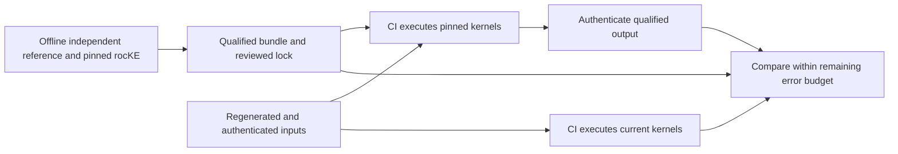

<!--
Copyright (c) Advanced Micro Devices, Inc., or its affiliates.
SPDX-License-Identifier: MIT
-->

# GPU CI with pinned rocKE reference kernels

This is the methodology and extension guide. See the [SDPA](sdpa-test-reference.md)
and [convolution](conv-test-reference.md) guides for commands and bundle status,
and [GPU attention coverage](gpu-attention-test-coverage.md)
for exact shapes, source-test mappings, and missing coverage.

As of 2026-10-05, SDPA has eight published gfx942 configurations.
Convolution has twelve qualified gfx942 forward cases with a published DVC
bundle, enrolled for default installation. Both operations share
tensor-free artifact handling, worker transport, and installation infrastructure.
SDPA DVC delivery and architecture-specific packaging have been exercised in CI.
Additional architectures, convolution gradients, KDA, and GDN remain future work.

Offline qualification compares a pinned rocKE implementation with an independent
reference. Ordinary CI executes its precompiled kernels to generate answers,
then compares current rocKE against those answers using the remaining accuracy
budget. CI neither downloads tensor answers nor qualifies its own baseline.
Both operations use float64 NumPy references offline. Convolution qualification
can additionally cross-check CPU Torch when explicitly requested. Reference CI
uses an environment without Torch; shared worker launchers block its import.



## 1. Preserve the original accuracy contract

For one qualified input case and one required output/metric pair, let:

- `R` be the independent reference result used offline.
- `O` be the result generated by pinned rocKE in CI.
- `N` be the result generated by current rocKE in CI.
- `T` be the original test's tolerance in its specified norm.
- `B` be a qualified upper bound on the old version's error, `norm(O - R)`.
- `D` be a conservative evaluation of `norm(N - O)` in CI.
- `M > 0` be reserved numerical and engineering headroom.

Use the same norm, coordinates, masks, and normalization in both comparisons.
The triangle inequality gives:

```text
norm(N - R) <= norm(N - O) + norm(O - R) <= D + B
```

Set the online comparison limit `C` so that:

```text
C <= T - B - M
accept only when D <= C
therefore norm(N - R) <= T - M < T
```

Qualification and CI must reject non-finite bounds or distances, negative
budgets, and profiles without usable headroom. Each required output and each
required norm has its own inequality. A small error in one output cannot
compensate for an excessive error in another.

For example, the existing gfx942 dense-attention test uses an absolute maximum
error limit of `0.02` for fp16. An **illustrative allocation, not a measured
qualification result**, would be:

| Quantity | Allocation |
| --- | ---: |
| Original accuracy limit `T` | 0.020 |
| Qualified old-to-reference upper bound `B` | 0.002 |
| Reserved margin `M` | 0.001 |
| Maximum new-to-old distance `C` | 0.017 |
| Maximum accepted new-to-reference error | 0.019 |

The budget stays strictly below `0.020`. The actual bound must come from
qualification. Do not assume a particular fraction of the tolerance is
available, or increase the original tolerance when an old kernel lacks enough
accuracy headroom.

The claim is accuracy relative to the independent reference `R`, matching the
original test contract. A further claim about an exact mathematical result
would also require a bound on the independent reference's approximation error.

## 2. Make the live old result eligible to carry that bound

A pinned source revision identifies an implementation, but does not by itself
prove that a later execution produces the output qualified offline. Compiler
changes, argument packing, runtime changes, and nondeterministic execution can
affect that result.

For the initial deterministic cases, use this checkable protocol:

1. Generate the exact input case and initial state offline.
2. Execute the pinned rocKE kernel and the independent reference.
3. Establish a conservative old-to-reference bound for every required metric.
4. Record digests of the input case and the pinned kernel's defined output
   bytes, together with the bounds and metric metadata.
5. In CI, load the stored exact inputs (or reproduce and authenticate their
   exact bits) and execute the pinned kernel on the GPU.
6. Require matching input and old-output digests before using its error bound.
7. Compare the current output with that same authenticated old-output snapshot.

The old kernel still generates the answers in every CI run. Its digest checks
that those answers are the ones qualified offline. This avoids distributing
full precomputed answer tensors for deterministic cases. Digest-based identity
uses the normal cryptographic integrity assumption; it is not a proof that an
implementation is correct on arbitrary inputs.

Bind all of the following into a versioned case identity:

| Field group | Required contents |
| --- | --- |
| Operation | Logical problem, scalar arguments, variant, and original test/subcase IDs |
| Inputs | Exact values or a pinned generator, generator version, seeds, and input digests |
| Tensor contract | Dtypes, shapes, layouts, strides, offsets, aliasing, and canonical byte order |
| Initial state | Mutable buffers, state pools, workspaces that require initialization, and relevant RNG state |
| Old implementation | Source revision, engine backend, compiled artifact hashes, ABI/runner version, and target features |
| Independent reference | Implementation/version, algorithm, precision, and relevant numerical settings |
| Numerical contract | Every norm, original tolerance, fixed scale/mask, qualified bound, comparison limit, and margin |
| Qualified result | Joint output digest and, where useful for diagnostics, per-output digests |
| Provenance | Qualification command, environment, device target, and validation report |

A seed alone is insufficient: different generators or library versions may
produce different input bits. For cases that cannot be regenerated portably,
distribute the exact input data. The baseline output can still be generated
live.

Canonical output identity covers all defined observable elements and their
metadata. Exclude uninitialized allocation padding or positions explicitly
undefined by the operator contract. Do not let a candidate-dependent mask
hide an error. Validate any output mask that is itself observable. Preserve
signed-zero or other representation requirements wherever the contract makes
them significant.

An unexpected old-output digest is a **reference qualification failure**. It
must not silently acquire the previous result's bound, become an ordinary
skip, or cause the comparison tolerance to grow.

For nondeterministic old kernels, prefer an accurate deterministic old
configuration for reference generation. A finite set of independently
qualified output digests is also valid, with bounds attached to each digest
or conservative bounds covering the entire qualified set. An unknown output
still needs qualification. If neither approach is practical, an explicit
comparison to a stored qualified anchor can bound replay drift, adding that
drift to the budget. A maximum observed across a few offline repetitions alone
does not bound every future execution.

## 3. Carry the existing metrics across faithfully

Several current tests use different error definitions. The implementation must
preserve each contract instead of replacing everything with a generic
`allclose` call.

| Existing check | Online/offline contract |
| --- | --- |
| Maximum absolute error | Use the same maximum norm over the same logical output elements |
| Maximum error divided by reference magnitude | Save the denominator computed from `R`; use that fixed denominator for both distances |
| Elementwise absolute plus relative tolerance, where used | Save fixed positive scales derived from `R`, and use a weighted maximum norm |
| L2 or RMS error, where used | Preserve the vector, scaling, and aggregation; square roots are required before applying the triangle inequality to squared-error measures |
| Bitwise equality | Retain exact equality; do not replace it with a positive tolerance |
| State preservation or indexing constraints | Retain the structural or exact checks alongside numerical comparisons |

For a relative maximum norm with a saved positive scale `S`:

```text
d(U, V) = max(abs(U - V)) / S
```

`S` is fixed by the qualified reference case. For example, the forward
convolution test uses `max(max(abs(R)), 1.0)`. KDA checks use separate reference
scales, including a separate strictly lower-triangular region. Those choices
must remain intact.

For an elementwise absolute/relative contract, a valid fixed metric is:

```text
s[i] = atol + rtol * abs(R[i])
d(U, V) = max_i(abs(U[i] - V[i]) / s[i])
```

Use these same saved scales in qualification and CI. Coordinates with zero
allowed error need exact checks; adding a new positive floor would change the
contract. Elementwise scales may require an array as large as an output,
whereas the existing scalar-normalized maximum norms need only scalar scale
metadata.

Do not substitute `abs(O)` for `abs(R)` in the online denominator and simply
add relative tolerances. That changes the metric. For example, ordinary
elementwise bounds of `a_c + r_c*abs(O)` and `a_b + r_b*abs(R)` combine to:

```text
abs(N - R) <= a_c + (1 + r_c)*a_b + (r_c + r_b + r_c*r_b)*abs(R)
```

The fixed-scale design avoids this extra conversion.

Evaluate errors after converting the actual produced values to sufficient
precision; never subtract in fp16 or bf16. Make the upper-bound calculation
conservative using a justified rounding-error bound or outward rounding for
the implemented operations. Round budget limits conservatively as well. One
`nextafter` after a long reduction is not, by itself, a validated upper bound.
Keep explicit checks for unexpected NaNs, infinity signs, wrong dtypes, wrong
shapes, and invalid state. Report every required metric's observed distance,
qualified bound, permitted distance, and total upper bound.

## 4. Package old rocKE as a small reference generator

The implemented SDPA bundle contains precompiled kernels from the qualified
old revision, their launch signatures and configuration metadata, and a
pinned host runner. Record the old source and compiler identities for
reproduction. Precompilation preserves the exact code objects qualified
offline and avoids rebuilding the old compiler stack in every CI job.

The bundle needs only the old kernels required by the enrolled cases. Reuse a
code object across qualified runtime shapes when its ABI supports that, while
keeping input and output qualification records per case. Compile additional
variants offline when the case catalog grows.

Run the old generator and the current implementation in separate worker
processes with distinct import paths and caches. The old runner must not
accidentally import current `rocke`, `kernels`, `builders`, or `dispatch`, or
reuse a current compilation-cache entry. Verify bundle contents against the
committed lock. Record actual imported paths, backend, target, and code-object
identities in test diagnostics.

Each worker receives the same canonical input case and gets independent
device buffers. Synchronize before reading outputs. Keep an immutable host
snapshot of the old result for both its digest and the distance calculation.
Reset mutable state and RNG before each independent execution or repetition.
Do not average results or choose the most favorable repetition to obtain a
pass.

Use rocKE's existing `DeviceMem`, `Runtime` copies, argument packing, and
`KernelLauncher` for Torch-free execution. The pointer packer already accepts
`DeviceMem` and raw device pointers. Keep library-specific adapters in the
library layer; shared utilities should be extracted only when a second concrete consumer
justifies them. Do not introduce a platform dependency
on library kernels.

Select the current engine backend explicitly. The existing gfx942 dense
attention entry uses the Python backend, so that is a faithful pilot. Report
that scope. Add explicit C++/provider execution coverage as its runner is
available; a Python GPU result alone does not establish provider dispatch or
Torch-integration behavior.

## 5. Current implementation and storage boundaries

Operation-specific implementations live under `library/tests/sdpa_reference/`
and `library/tests/conv_reference/`, with shared support in `reference_common/`:

| Component | Responsibility |
|---|---|
| `contract.py` | Operation-specific cases, inputs, NumPy reference, and numerical policy |
| `architectures/registry.json` | Supported qualification cohorts; currently gfx942 for each operation |
| `architectures/gfx942/` | Case cohort, production dispatch/launch adapter, exported-kernel metadata, and trusted lock once published |
| `worker.py` | Operation-specific HIP execution and replay |
| `../reference_common/session.py` / `runner.py` | Isolated baseline/current processes and worker reuse |
| `cli.py` | Snapshot, qualification, and verification commands |
| `../reference_common/artifact.py` | Common archive command with explicit operation |
| `../reference_common/numeric.py` / `source.py` | Storage, digests, conservative budgets, and committed snapshots |
| `paths.py` | Relocatable source and installed bundle lookup |
| `../reference_common/published_bundles.json` | Published operation/architecture pairs installed by default; currently SDPA/gfx942 and convolution/gfx942 |
| Provider CMake and category YAML | Staging, test registration, and normal provider CI selection |

Workers are reused across cases to reduce process startup and runtime setup.
Baseline and current workers remain separate; every repetition retains input,
output-identity, launch, and numerical checks. Reuse is not extra input coverage.

Storage is split by operation and architecture:

```text
Source DVC assets:
  library/tests/reference_bundles/sdpa/gfx942.tar.gz.dvc
  library/tests/reference_bundles/sdpa/gfx942.tar.gz       # ignored materialization
Trusted source lock:
  library/tests/sdpa_reference/architectures/gfx942/baseline_lock.json
Installed generic harness:
  bin/hip_kernel_provider/tests/library/tests/
Installed architecture payload:
  bin/hip_kernel_provider/engines/test_arch_content/rocke/sdpa/gfx942/
```

The repository's `storage` remote is `s3://therock-dvc/rocm-libraries`.
The bucket name does not make this a separate TheRock-owned DVC project.
TheRock source preparation fetches this repository's pointers; provider CMake
validates and extracts them. The existing artifact descriptor captures
`**/engines/test_arch_content/**`, and architecture splitting produces the
matching test artifact. Do not place references in release `engines/arch_content`
or leave architecture-specific code objects in the generic test tree.

One archive per operation/architecture keeps qualification and updates independent.
The gfx942 archive currently contains 1,900,516 compressed bytes; most extracted
bytes are the frozen Python runtime, not the eight code objects. Additional cases
usually add kernels and manifest records, but runtime/runner changes and new
operation/architecture archives can add overhead too. Do not assume all future
growth is kernel payload or introduce cross-bundle deduplication prematurely.

## 6. Extend coverage deliberately

### Add another SDPA architecture

The layout is ready for another target; enrollment is not just a directory rename.
For gfx950 or gfx1151:

1. Identify an actual supported production kernel and a small source-test cohort.
   Confirm the target, dtype, mask, layout, launch ABI, and independent oracle.
   Hardware availability or a similar architecture name does not establish kernel
   support. Retain a mapping from each qualified case to its original test.
2. Implement `architectures/<arch>/` with `NAME`, `FAMILIES`, `CASES`, `CASE_BY_ID`,
   `prepare`, `launch`, and `exported_kernel`, following the gfx942 adapter.
   Inspect worker and case-model assumptions before reuse: the current model is
   dense, equal-length SDPA. Unequal lengths, paging, or new output contracts need
   explicit model, schema, and runner support.
3. Add the target to `registry.json` and create its independently reviewed
   `baseline_lock.json` through qualification. Qualification requires enrollment,
   so add qualification support first. The architecture registry alone does not
   enable default installation; `reference_common/published_bundles.json` controls
   publication enrollment.
4. Qualify on the actual target in the intended ROCm/container environment. Verify
   every case against the independent reference, authenticate repeated baseline
   outputs, and run current-kernel verification and negative controls. Bounds and
   output digests from gfx942 cannot be transferred to another architecture.
5. Pack and publish `reference_bundles/sdpa/<arch>.tar.gz` through DVC. Review the
   pointer, lock, adapter, case mapping, and evidence together, then add the target
   to the operation in `reference_common/published_bundles.json`. Every published
   pair is installed when `ROCKE_INSTALL_TEST_GPU_REFERENCES` is ON;
   TheRock splits the payloads by target. Use
   `ROCKE_TEST_SDPA_REFERENCE_INSTALL_SOURCE_<arch>` to install an extracted
   local bundle instead of staging that architecture's standard archive.
6. Validate source and installed tests, then download and assemble the actual
   generic plus target-specific CI artifacts. Check bundle hashes, absence from
   release payloads, relocatable discovery, and required tests on that target.
   Review category selection and worker availability before claiming a new CI
   lane. New hardware lanes may need infrastructure coordination even though the
   gfx942 implementation needs no new workflow.

Each installed operation/architecture gets a separate CTest entry and explicit
pytest architecture selection. Nonmatching GPU lanes return CTest's configured
skip code before looking up an absent architecture artifact. The matching lane
must fail on missing hardware, bundles, or invalid qualification.

Keep the existing provider categories. Do not add `ex_gpu_<arch>` labels only to
reference suites: the provider runner uses a matching label as an inclusion
filter, which would omit unrelated tests. Architecture-specific CTest names and
the reference lane gate provide isolation without changing global selection.

### Add convolution or another operation

The operation-specific paths are `reference_bundles/conv/<arch>.tar.gz.dvc` and installed
`engines/test_arch_content/rocke/conv/<arch>/`. These are a layout convention,
now used by the [forward-convolution infrastructure](conv-test-reference.md).
That harness has a published bounded gfx942 forward cohort. Further convolution coverage still needs:

1. **An explicit cohort.** Map forward, backward-data, and backward-weight tests
   separately. Record dimensions, groups, strides, padding, dilation, layouts,
   dtype, pipeline, and dispatch choice. Begin with a bounded cohort supported by
   the target; do not label it complete convolution coverage.
2. **The original numerical contract.** Select an independent oracle for each
   direction and preserve the existing metric and tolerance. For example, the
   current forward test normalizes maximum absolute error by
   `max(max(abs(R)), 1.0)`; retain that reference-derived denominator in both
   qualification and CI. Do not copy SDPA's absolute tolerances into convolution.
3. **Tensor-free reproducible inputs.** Define versioned generation and dtype
   rounding, then authenticate exact bytes. A seed alone is insufficient. New
   seeds/distributions require their own qualification records. If an operation's
   metric needs per-element scales, design deterministic regeneration or explicitly
   account for that metadata instead of assuming a scalar certificate suffices.
4. **Execution and replay adapters.** Invoke production dispatch for current code,
   export the exact baseline code objects and ABI, initialize workspaces, and check
   all required outputs. Multi-kernel operations need ordered replay and complete
   observable-state checks; the existing single-kernel SDPA worker is not a generic
   convolution runner.
5. **Dedicated tests and enrollment.** Add the operation's contract, host checks,
   GPU numerical and negative checks, lock, DVC pointer, CMake installation, and
   provider category selection. Reuse `reference_common` for archives, worker
   transport, numeric utilities,
   and source snapshots; preserve library-to-platform dependency direction.
6. **Independent qualification and artifact validation.** Apply the same promotion
   and packaging checks as SDPA, with operation-specific failure injections such
   as wrong padding, wrong strides, incorrect groups, or unwritten gradients.

Exact equality, dispatch/cache reuse, guard regions, indexing, and untouched state
must remain explicit checks. A small numerical distance cannot replace them.
For recurrent KDA/GDN or other multistage operations, qualify complete executions
from identical initial state and compare every required observable. Stagewise
bounds do not automatically compose when candidate stages change later inputs.

## 7. Prove that the gate catches the failures it is intended to catch

Validation should include:

- Hand-calculated numerical examples showing that budget addition remains
  strictly below every original tolerance, including boundary-rounding cases
  and relative-norm denominator counterexamples.
- Failure on corrupt case data, altered metric scales/masks, wrong artifacts,
  stale input digests, unexpected old-output digests, NaNs, wrong dtypes, and
  wrong output shapes.
- Real GPU execution with Torch absent: both old and current launch, their
  outputs are synchronized and copied back, and the certified comparison
  passes on the enrolled cases.
- An intentional result perturbation beyond the remaining budget causing the
  comparison to fail, plus wrong-mask and state-clobber examples where
  applicable. A skipped launch or no-op cannot count as a successful case.
- The same installed test command running locally and through
  hip-kernel-provider CI, preserving existing test selection and exposing
  required-case failures in CTest's exit status.
- Repeated current-kernel executions for cases sensitive to nondeterminism,
  applying the complete criterion to every tested execution. Report that
  repeated testing is empirical evidence, not a bound on unobserved runs.

Report at least: expected enrolled cases, cases launched by old and current,
cases successfully compared, comparison failures, qualification failures,
and cases explicitly outside the architecture/tier scope. Track
`successfully compared / expected enrolled cases` for GPU coverage. Do not
use the aggregate host-test pass fraction to imply GPU coverage.

## 8. Maintain the reference without accumulating error

Every replacement old version must be qualified directly against the
independent reference. Comparing a new baseline only against its predecessor
and granting it a fresh tolerance would accumulate numerical error across
promotions.

Keep baseline generation and promotion outside ordinary pytest execution.
Update the pinned artifact, case identities, error bounds, and qualification
report together through normal review. The candidate CI run must not
regenerate its own reference lock or silently bless unknown output digests.

A changed input, generator, metric, mask, output contract, or new case needs
qualification for that identity. A changed runtime must reproduce a qualified
old-output digest for the enrolled case before inheriting its bound. Fresh
random cases compared only with old rocKE may be useful differential tests,
but do not inherit an accuracy certificate from previously sampled inputs.

Agreement with the old result is a sufficient accuracy check when the stated
bounds hold. A disagreement can still be an improvement: a current result
closer to the independent reference can fall outside the smaller allowed
region around old rocKE. Diagnose such failures with the independent
reference offline; do not automatically loosen the gate or call every
difference a regression.

## 9. Validation evidence and practical reproduction

The current baseline, archive identity, numerical measurements, and CI results are
recorded in the [SDPA guide](sdpa-test-reference.md#validation-evidence) and
[convolution guide](conv-test-reference.md#validation-evidence). The
[coverage map](gpu-attention-test-coverage.md) distinguishes declared shapes from
executed tests and retains the gaps in older Torch-dependent suites.

GPU qualification and audit work used Enroot under Slurm. Request the intended GPU,
CPU/memory limits, and enough time for compilation and qualification. Keep site
account names, hostnames, and image paths in local job configuration, outside the
portable documentation. Record container identity in the qualification report.

Do not assume a compute node can read the login checkout. The successful transfer
procedure streamed a tar archive over `srun` standard input and extracted it in
node-local container storage. Use a verified shared filesystem when available;
the container image itself must also be accessible through the site's container
mechanism. Stage the baseline snapshot and current sources separately, and retain
reports before releasing the allocation.

Use the container's resolved COMGR and matching LLVM flavor; a host's compiler
override can be wrong inside the container. Record Python, NumPy, compiler,
backend, target, source, and payload identities. The manifest captures the code
and numerical provenance; retain the container identity and execution logs with
the reviewed qualification evidence as well.

Follow the guide's snapshot, qualification, verification, packing, and publication
commands. Reproduce the installed CTest command and the real provider category
selection. A successful host-only test run cannot establish GPU qualification.

## Source anchors

- [Current gfx942 tests and original tolerances](../library/tests/test_attention_dense_gfx942_numeric.py)
- [Architecture adapter](../library/tests/sdpa_reference/architectures/gfx942/__init__.py)
- [SDPA numerical contract](../library/tests/sdpa_reference/contract.py)
- [Convolution forward reference and normalization](../library/tests/test_conv_fwd_correctness.py)
- [Installed CTest registration](../platform/CMakeLists.txt)
- [Provider test categories](../../ROCKE_ENGINE_test_categories_external.yaml)
- [TheRock artifact descriptor](https://github.com/ROCm/TheRock/blob/7440cb8578f4daae0d85a428fadd6645dc5464a0/ml-libs/artifact-hipkernelprovider.toml)
- [Existing rocKE testing strategy](../TESTING.md)
