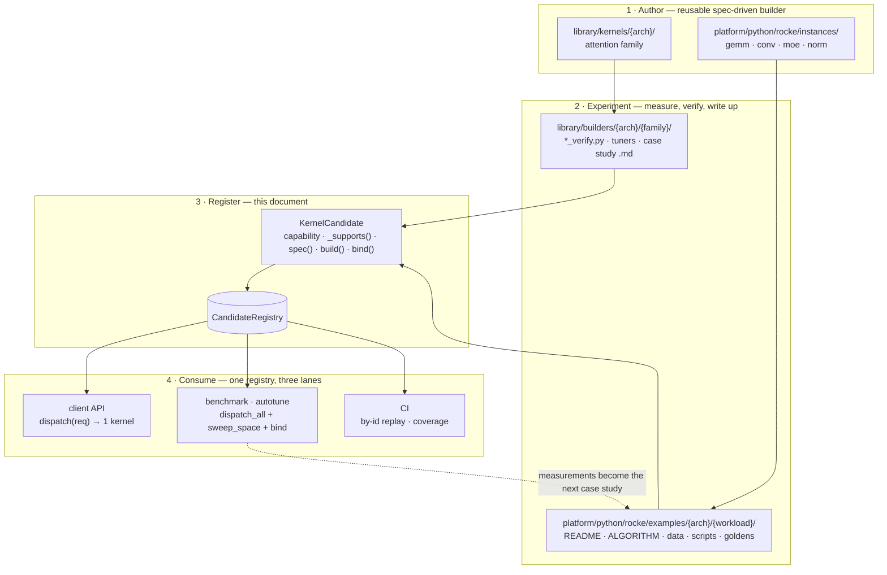

# Kernel Family Registration and Dispatch Architecture

Status: design proposal. Describes the target model for registering kernel
families per architecture and routing a problem to one kernel — or to a ranked
list of kernels — through a declared, testable filtering pipeline.

Companion documents: `README.md` (current dispatcher usage),
`library/dispatch/AGENTS.md` (attention-family specifics).

---

## 1. Goals

1. A kernel is registered once, declaring the architectures, dtypes, shape
  ranges, and specializations it was built for.
2. A problem is routed to a kernel by filtering functions the kernel itself
  owns. Adding a kernel never edits another kernel.
3. Dispatch returns either the single best kernel or every eligible kernel, from
  the same registry and the same filters. Autotuning is the list form of the
   same query, not a parallel mechanism. A benchmark harness can build, launch,
   and verify every kernel the registry offers without per-family code.
4. A selected kernel has a stable identifier, and that identifier resolves back
  to the kernel. Selection is reproducible offline for a target architecture
   that is not the host.
5. The spec a dispatcher produces is the spec a builder consumes. There is one
  selection stack per operator, not two.
6. Registry coverage is queryable without a request: `for_arch` and `coverage()`
  answer "what runs on X?" from declared data, never by probing.
7. Selection is explainable: every candidate's accept/reject reason is
  recoverable from the result, so routing decisions are auditable.
8. Selection and build changes preserve the Python/C++ byte-identity contract;
  dispatch is a new caller of the shared builders, never a third lowering path.


## 2. Why this needs to change

The current registry (`core.py`) already does the hard part well: support
predicates compose, ranking is pluggable, and rejection reasons accumulate into
a readable error. Five gaps block the goals above.

**Capabilities are code, not data.** `KernelCandidate` carries six callables and
no description of what the kernel supports. Architecture gating lives inside
closures as `if req.arch != "gfx942": return False, ...`. Consequently "which
kernels exist for gfx1250?" cannot be answered without synthesizing a request
per candidate and probing it, and the registry cannot be serialized, diffed
across releases, or rendered into documentation.

**Nothing gates on architecture for attention.** GEMM and conv at least gate
coarsely, through `arch_family_supported` (see `README.md`, "Declared coverage
and the arch gate", for what replaced it).
Attention has no equivalent. It touches `ArchTarget` only to validate
that the arch string parses, and `supports_native_unified_attention` is entirely
architecture-blind — it checks `head_size`, `block_size`, and `dtype` and
nothing else. Dispatching one fp16 shape across the registered arches gives the
same answer for every one of them:

```
arch             family  wave   dispatch_attention(...) ->
gfx90a           cdna      64    attention_unified_2d
gfx942           cdna      64    attention_unified_2d
gfx950           cdna      64    attention_unified_2d
gfx1250          cdna      32    attention_unified_2d
gfx1201          rdna      32    attention_unified_2d
```

Wave64 MFMA and wave32 WMMA targets receive the same candidate. That single
answer is not itself wrong — `unified_2d` names a *path*, and `attention_unified`
picks the concrete backend downstream from the running device, so gfx1250 does
get a WMMA kernel and RDNA gets the arch-neutral scalar one. What is wrong is
that dispatch cannot see any of it. It cannot say which arches attention covers,
cannot prefer an arch-specialized kernel over the generic path, and cannot be
asked the question at all without a device attached.

The cost is concrete: the dedicated gfx1250 kernel — `build_wmma_attention_fwd`,
with an `is_valid_spec` that checks for the 16x16x32 WMMA atom and the matching
wave size — is registered nowhere. It is a better kernel than the generic path
on its target and dispatch has no way to choose it, because choosing requires
comparing declared coverage and there is none to compare.

Copying GEMM's family gate would not close this, and would do harm elsewhere:
`arch_specs.json` records gfx1250 as `family="cdna"` with `wave_size=32`, so a
`cdna` gate admits a wave32 target to genuinely wave64 MFMA kernels. That is a
live bug in the conv family, which gated on `arch_family` until section 12's
phase 3. Family is not a proxy for wave size, which is why section 5.1 gates on
an explicit list of gfx targets instead.

**Selection depends on the host, not the request.** The arch-specialized
candidates gate on `req.arch`, but the cohort heuristics they call resolve the
architecture from the running device via `_resolve_attention_arch()`. The same
gfx942 request therefore selects different kernels depending on what machine
dispatch runs on:

```
host-resolved arch = gfx942    -> attention_gfx942_dense_pipe
host-resolved arch = gfx950    -> attention_unified_2d
host-resolved arch = None      -> attention_unified_2d     (no GPU; defaults to gfx950)
```

Selection is not reproducible for a target that is not the host, which rules out
AOT compilation, cross-arch CI, and any offline tuning record that is keyed by
architecture.

**Identifiers are write-only.** `CandidateRegistry` exposes `register`,
`candidates`, `supported`, `select`, `extend`. There is no `get(name)` and no
way to resolve a `KernelId`. Names are already unique (`register` enforces it),
so the index exists but is not exposed.

`cache_key` **conflates the problem with the kernel.** It concatenates
`request_hash` and `spec_hash`, so two problems that produce a byte-identical
spec get different keys and therefore different compile-cache entries. This is
why attention grew its own separate cache keyed on a problem tuple.

## 3. Workflow: how a kernel reaches a client

Section 2 said where things break; this section states the model they break
against. It is written as target state throughout — how each stage is meant to
work once this document is implemented, not a survey of what runs today.

A kernel is authored, measured, registered, and then consumed. Registration is
the third stage and the subject of this document: it is where a measured kernel
becomes a declared, selectable candidate, and it is what makes the fourth stage
a query rather than a hand-maintained list.




### 3.1 Author

Two trees, split by layer, holding the same kind of artifact:

- `library/kernels/<arch>/` — the attention family, e.g.
`gfx1250/wmma_attention_fwd.py` and `gfx942/attention_tiled_2d.py`.
- `platform/python/rocke/instances/` — the core families. `common/` holds
arch-portable builders that take `arch` as a parameter (`gemm_universal.py`,
`conv_implicit_gemm.py`, `fused_moe.py`, `layernorm2d.py`), and
`instances/<arch>/` holds the specializations that could not stay portable
(`gfx950/deep_fused_conv_pool.py`).

Whichever tree it lands in, the artifact has the same shape, and that is what
makes registration mechanical later: a frozen spec dataclass with a
`kernel_name()`, a `build_*(spec, arch)` that emits the kernel, and a validity
predicate (`supports_*` or `is_valid_spec`). `platform/AGENTS.md` requires this
shape — "new kernels must become reusable spec-driven builders under
`instances/`, not one-off scripts."

### 3.2 Experiment and report

Mirrored trees, holding evidence rather than kernels:

- `library/builders/<arch>/<family>/` — the harnesses that build, launch,
verify, and tune a kernel, kept next to their write-up.
`library/builders/gfx1250/attention/` holds `wmma_attention_fwd_verify.py`,
`tiled_2d_verify.py`, `gfx1250_mha_optimization_case_study.md`, and
`gfx1250_universal_attention_plan.md`.
- `platform/python/rocke/examples/<arch>/<workload>/` — workload case studies,
each a `README.md`, `ALGORITHM.md`, `data/`, and `scripts/`. These are
executable, not just prose: `run_all.py --bless` captures goldens into
`_goldens/` and `--check` asserts against them, so a case study doubles as a
repeatability gate. `examples/REGISTRY.md` indexes the curated subset.

What this stage produces is exactly what registration needs as input: which knob
values are numerically correct, which are fast, and on what hardware. A
capability that claims a shape range in section 5.1 is claiming something this
stage measured.

### 3.3 Register — the promotion gate

The knobs that survived experimentation are frozen into `Capability` data, the
conditions under which they held become the residual `_supports()` predicate,
and the winning
configuration becomes `spec()`. `build()` and `bind()` point back at the same
builder and harness the experiment used, so the benchmark path and the
production path exercise the same code rather than two drifting copies.

This is a gate, not a formality. Again from `platform/AGENTS.md`: "reusable
kernels must be wired into registry/test/byte-identity coverage before they are
considered complete; workload-only benchmark scripts should not be wired into
production dispatch by default." A passing experiment does not register a
kernel, and a workload-specific script is not meant to become a dispatch target.

It is also the stage section 2 found leaking, and the leak is worth naming
against the model just described: `library/kernels/gfx1250/wmma_attention_fwd.py`
clears stages 1 and 2 — a finished spec-driven builder, a
`wmma_attention_fwd_verify.py` harness, and a written-up case study — and still
reaches no client, because `ATTENTION_REGISTRY` holds six candidates and not one
of them is gfx1250. A kernel that stops at stage 2 is reachable only by running
its verify script by hand. Section 9.1 shows the registration that closes it.

### 3.4 Consume

One registry, three consumers, no parallel selection stacks (goal 3):

- **Client API / production** — `dispatch_*(req)` returns a single kernel. No
shipped ABI calls through this today: the C++ client API (`rocke/library/api/`,
`rocke_client`) was removed by
[#9800](https://github.com/ROCm/rocm-libraries/pull/9800), and its intended
replacement is the hipDNN Universal Kernel Descriptor connector
([RFC 0017 / #9533](https://github.com/ROCm/rocm-libraries/pull/9533)). The UKD
connector is the planned consumer of this lane, which is why single-kernel
selection has to stay reproducible from a request alone.
- **Benchmark and autotune** — `dispatch_*_all(req)` returns every eligible
kernel, `sweep_space(req)` expands each into its knob variants, and `bind()`
makes them launchable by one generic harness (section 7.5).
- **CI** — by-identifier replay and coverage queries (sections 7.3 and 7.4)
assert that what was registered is still selectable and still byte-identical.

The loop closes at the second lane: a sweep produces measurements that land back
in stage 2 as a case study, which in turn revises a heuristic or a priority band
in stage 3.

## 4. Vocabulary


| Term           | Meaning                                                                                                                                               |
| -------------- | ----------------------------------------------------------------------------------------------------------------------------------------------------- |
| **Family**     | One operator surface with a shared request type and registry: `attention_unified`, `gemm_fp16_rcr`, `conv_implicit_gemm`.                             |
| **Candidate**  | One registered kernel implementation. The unit of registration and selection.                                                                         |
| **Request**    | The normalized problem, architecture included. Frozen, hashable, JSON-serializable. Exposes `normalized()` for hashing and `dims()` for shape gating. |
| **Dimension**  | A gateable problem *scalar*, not a tensor axis: any named integer a family exposes through `dims()`, stored or derived (e.g. `total_q`, `gqa_ratio`). Families range from two (`norm`) to fourteen (`conv`). |
| **Capability** | Declarative data describing what a candidate accepts: arches, dtypes, per-dimension ranges, cross-dimension relations, features.                      |
| **Predicate**  | The residual `_supports()` callable for constraints not expressible as data.                                                                           |
| **Spec**       | The knobs handed to a builder. Must be the builder's actual input type.                                                                               |
| **Binding**    | Allocation, argument packing, and reference check for one (request, spec) pair. What makes a selected kernel runnable.                                |
| **KernelId**   | Stable identity of a selected (candidate, spec) pair. Resolvable back to the candidate.                                                               |


The critical invariant: **the spec type a candidate produces is the argument
type its builder accepts.** A candidate whose `select_spec` returns something no
builder consumes is a routing label, not a kernel registration.

---


## 5. Registration model


### 5.1 Declarative capability

Capability is data. It answers coverage questions without executing a request
and serves as a cheap prefilter before predicates run.

**Dimensionality is per-family, so nothing here may assume a fixed shape tuple.**
The families registered today span two to fourteen gateable integer quantities:


| Family      | Dimensions                                                                  |
| ----------- | --------------------------------------------------------------------------- |
| `norm`      | `rows`, `cols`                                                              |
| `gemm`      | `M`, `N`, `K`                                                               |
| `moe`       | `num_tokens`, `hidden`, `intermediate`, `num_experts`, `top_k`              |
| `attention` | `batch`, `nhead_q`, `nhead_k`, `seqlen_q`, `seqlen_k`, `hdim_q`, `hdim_v`   |
| `conv`      | `N`, `C`, `K`, `Hi`, `Wi`, `Y`, `X`, `G`, and the stride/pad/dilation pairs |


Constraints are therefore keyed by dimension *name*, never by position, and each
family declares its own vocabulary.

**What** `normalized()` **contributes.** It is the other half of the request
surface, and it predates `dims()`. It canonicalizes the case-variant and
free-text fields — `dtype` through `normalize_dtype`, `layout` upper-cased,
`algorithm` and `spec_id` stripped and lower-cased — and returns the frozen
request as a plain JSON-serializable dict. Two consequences matter here. It is
what `request_hash` is taken over (`stable_json_hash(req.normalized())`, keys
sorted), so two spellings of the same problem hash alike and index one tuning
record rather than two. And it is what `Capability.check` reads for arch, dtype,
and layout, so a request written `dtype="FP16"` gates identically to `"fp16"`
instead of falling out of the prefilter on spelling. `dims()` is the integer
half of the same idea: `normalized()` canonicalizes *identity*, `dims()` exposes
what may be *gated on*.

**The** `dims()` **contract.** Requests expose their dimensions as a flat mapping,
alongside the existing `normalized()`:

```python
class OperatorRequest:
    def normalized(self) -> dict: ...

    def dims(self) -> Mapping[str, int]:
        """Every gateable integer quantity, derived ones included."""
        return {}
```

Attention returns its seven stored dimensions, the paged-KV modulus, and the
derived quantities its kernels actually branch on:

```python
def dims(self) -> Mapping[str, int]:
    return {
        "batch": self.batch,
        "nhead_q": self.nhead_q,
        "nhead_k": self.nhead_k,
        "seqlen_q": self.seqlen_q,
        "seqlen_k": self.seqlen_k,
        "hdim_q": self.hdim_q,
        "hdim_v": self.hdim_v,
        "kv_block_size": self.kv_block_size,
        "total_q": self.batch * self.seqlen_q,   # flattened query rows
        "gqa_ratio": self.nhead_q // self.nhead_k,
    }
```

Three things follow. Derived dimensions become declarable: `total_q` is already
what `_problem()` computes and what a prefill-versus-decode gate keys on, yet it
is not an attribute and so cannot be reached by `getattr`. Conv can expose `Ho`,
`Wo`, and the implicit-GEMM `M`/`N`/`K` the same way, which is what its kernels
tile over rather than the stored `Hi`/`Wi`. Second, product and ratio bounds need
no special constraint type — they are ordinary dimensions once `dims()` can
compute them. Third, a dimension a family does not provide yields a rejection
naming the available keys, instead of an `AttributeError` escaping a prefilter.

```python
@dataclass(frozen=True)
class ShapeRange:
    """One bound, applied to a dimension or broadcast across a set of them.

    ``dims`` is a single name or a set of names that share the bound. Conv's
    paired dimensions — (Hi, Wi), (Y, X), (stride_h, stride_w) — are the
    common case for the set form.
    """
    dims: str | frozenset[str]
    min: int | None = None
    max: int | None = None
    multiple_of: int | None = None
    allowed: tuple[int, ...] | None = None  # exact enumeration wins over min/max

    def names(self) -> tuple[str, ...]:
        """Sorted: a set is unordered, and messages must be reproducible."""
        if isinstance(self.dims, str):
            return (self.dims,)
        return tuple(sorted(self.dims))

    def check(self, dims: Mapping[str, int]) -> tuple[bool, str]:
        for name in self.names():
            if name not in dims:
                return False, f"dim {name!r} not provided (have {sorted(dims)})"
            v = int(dims[name])
            if self.allowed is not None and v not in self.allowed:
                return False, f"{name}={v} not in {self.allowed}"
            if self.min is not None and v < self.min:
                return False, f"{name}={v} < min {self.min}"
            if self.max is not None and v > self.max:
                return False, f"{name}={v} > max {self.max}"
            if self.multiple_of and v % self.multiple_of:
                return False, f"{name}={v} not a multiple of {self.multiple_of}"
        return True, "ok"


@dataclass(frozen=True)
class DimRelation:
    """A constraint between two dimensions, or a dimension and a literal."""
    lhs: str
    op: str            # "==" "!=" "<" "<=" ">" ">=" "multiple_of"
    rhs: str | int

    def check(self, dims: Mapping[str, int]) -> tuple[bool, str]:
        for key in (self.lhs, self.rhs):
            if isinstance(key, str) and key not in dims:
                return False, f"dim {key!r} not provided (have {sorted(dims)})"
        a = int(dims[self.lhs])
        b = int(dims[self.rhs]) if isinstance(self.rhs, str) else int(self.rhs)
        ok = {
            "==": a == b, "!=": a != b,
            "<": a < b, "<=": a <= b, ">": a > b, ">=": a >= b,
            "multiple_of": b != 0 and a % b == 0,
        }[self.op]
        return (True, "ok") if ok else (False, f"{self.lhs}={a} {self.op} {self.rhs}={b} violated")


@dataclass(frozen=True)
class Capability:
    """What a candidate was built for.

    Empty tuple == unconstrained, with one exception: ``arches`` is mandatory
    and non-empty, enforced in ``register()``. It fails closed, so a candidate
    that somehow reaches ``check()`` with no arches matches nothing.
    """
    arches: tuple[str, ...] = ()          # exact gfx targets; the only arch gate
    dtypes: tuple[str, ...] = ()
    layouts: tuple[str, ...] = ()
    shapes: tuple[ShapeRange, ...] = ()      # per-dimension bounds
    relations: tuple[DimRelation, ...] = ()  # cross-dimension invariants
    supports_features: frozenset[str] = frozenset()  # optional features it CAN do
    requires_features: frozenset[str] = frozenset()  # features it MUST have

    def dim_names(self) -> frozenset[str]:
        """Every dimension this capability refers to, for registration checks."""
        names = {n for rng in self.shapes for n in rng.names()}
        for rel in self.relations:
            names.add(rel.lhs)
            if isinstance(rel.rhs, str):
                names.add(rel.rhs)
        return frozenset(names)

    def check(self, req) -> tuple[bool, str]:
        if req.arch not in self.arches:
            return False, f"arch {req.arch!r} not in {self.arches}"
        if self.dtypes and req.dtype.lower() not in self.dtypes:
            return False, f"dtype {req.dtype!r} not in {self.dtypes}"
        if self.layouts and getattr(req, "layout", "").upper() not in self.layouts:
            return False, f"layout not in {self.layouts}"
        dims = req.dims()
        for constraint in self.shapes + self.relations:
            ok, why = constraint.check(dims)
            if not ok:
                return False, why
        missing = self.requires_features - request_features(req)
        if missing:
            return False, f"requires features {sorted(missing)}"
        unsupported = request_features(req) - self.supports_features
        if unsupported:
            return False, f"cannot serve features {sorted(unsupported)}"
        return True, "ok"
```

`request_features(req)` normalizes optional behaviors into a set — for attention
`{"causal", "sliding_window", "sinks", "softcap", "alibi", "paged_kv", "gqa"}`.
Modelling these as a set rather than booleans means a candidate declares the
features it can serve, and any feature the request needs but the candidate did
not declare is an automatic rejection. This is the failure mode that a
hand-written predicate forgets: a new feature silently routes to a kernel that
ignores it. With `supports_features`, forgetting is a rejection, not a wrong
answer.

**One bound, many dimensions.** High-dimensional families constrain their
dimensions in groups, not individually. A 1x1 stride-1 conv fast path is seven
constraints over four natural pairs, and the set form states it as four:

```python
shapes=(
    ShapeRange(frozenset({"Y", "X"}), allowed=(1,)),               # 1x1 filter
    ShapeRange(frozenset({"stride_h", "stride_w"}), allowed=(1,)),
    ShapeRange(frozenset({"pad_h", "pad_w"}), allowed=(0,)),
    ShapeRange(frozenset({"Hi", "Wi"}), min=1, max=4096),
    ShapeRange("C", multiple_of=8),                                # singleton
)
```

The scalar bound broadcasts over every name in the set. A plain string is the
singleton case, so `ShapeRange("hdim_q", min=32)` is unchanged. Because a set
has no order, `names()` sorts before use — rejection strings and coverage
manifests feed golden-asserted tests, and those cannot depend on set iteration
order.

What the set form deliberately does *not* do is pair with same-length `min` and
`max` tuples. Parallel arrays would reintroduce positional coupling, which is
precisely the property that keying constraints by name removed: adding a
dimension means editing every tuple in lockstep, and transposing two entries
applies a bound to the wrong dimension silently, because both are integers.
Sparsity makes it worse — a candidate typically constrains two or three of
conv's fourteen dimensions, so most slots would be `None` padding. `allowed`
does not vectorize legibly either, arriving as
`allowed=((64, 128, 256), None, (16, 32, 64))`. And a set cannot be indexed at
all, so the pairing would force an ordered sequence back on the author. The
case that motivates parallel tuples — several dimensions needing *different*
bounds — is already covered, by several entries in the `shapes` tuple.

**Relations carry what a per-dimension bound cannot.** Attention already
hand-codes two of these in `_request_errors` — `hdim_q == hdim_v`, and
`nhead_q % nhead_k == 0` for GQA grouping — as imperative checks inside a
validation function, where no coverage query can see them. As data they read:

```python
relations=(
    DimRelation("hdim_q", "==", "hdim_v"),
    DimRelation("nhead_q", "multiple_of", "nhead_k"),
    DimRelation("seqlen_k", ">=", "seqlen_q"),
)
```

Keeping these as data rather than as a `Callable` field is deliberate. A
callable would be quicker to write and would immediately reintroduce the
capabilities-are-code problem from section 2: it could not be serialized into a
coverage manifest, diffed across releases, or rendered into documentation. The
fixed operator set is small because it only has to cover what kernels actually
assert about shape.

**Capability stays a conservative superset.** It is a prefilter, not a complete
description, so a constraint no relation can express simply stays in
`_supports()` — that is what the residual predicate is for. The rule is
directional and is enforced by the capability/predicate agreement test in
section 10: capability may accept problems the predicate later rejects, never
the reverse. That is what lets the coverage manifest be generated from data
while remaining honest.

**Architecture gating is mandatory, and it is an explicit list of gfx targets.**
Every candidate names the architectures it was built and tuned for. There is no
family-level shorthand — see below for why. Enforce it at registration:

```python
def register(self, candidate):
    cap = candidate.capability
    if not cap.arches:
        raise ValueError(
            f"{candidate.name!r} declares no arch coverage; set "
            "arches=(...) (see ARCHITECTURE.md 5.1)"
        )
    unknown_arch = set(cap.arches) - set(known_arches())
    if unknown_arch:
        raise ValueError(
            f"{candidate.name!r} declares unknown arches {sorted(unknown_arch)}"
        )
    unknown = cap.dim_names() - self.dim_vocabulary
    if unknown:
        raise ValueError(
            f"{candidate.name!r} constrains unknown dims {sorted(unknown)}; "
            f"{self.family} provides {sorted(self.dim_vocabulary)}"
        )
    ...
```

The first two checks make the cross-architecture misroute above impossible to
reintroduce. The third closes the one hazard that named dimensions introduce:
because a constraint refers to a dimension by string, a typo such as `hdim_k`
would otherwise sit dormant until some request reached that candidate. The
registry takes its `dim_vocabulary` from the family's request type, so a
misspelled dimension fails at import time instead.

**Why there is no** `arch_families` **field.** A CDNA/RDNA shorthand looks like it
would spare generic kernels from listing every target, but it is the wrong gate
and it is redundant. Wrong, because family does not imply wave size: in
`arch_specs.json`, gfx1250 is `family="cdna"` with `wave_size=32`, so
`arch_families=("cdna",)` would happily admit a wave32 target into the wave64
MFMA kernels — the exact misroute in section 2, reintroduced by the mechanism
meant to prevent it. Redundant, because family is already derivable from the
arch name through `ArchTarget.from_gfx(arch).family`, so storing it in the
capability creates a second source of truth for something the arch string
already determines.

The apparent cost is that a generic kernel must list its arches, and adding an
architecture means editing that list. That is the intended behavior. A new
target should not silently inherit every generic kernel before anyone has run it
there; declaring `arches` states what a kernel was *built and tuned for*, which
is a stronger and more useful claim than what the hardware could theoretically
execute. Section 8.1 makes extending the list a step in the add-an-architecture
checklist, so the decision is deliberate rather than implicit.

Where a kernel genuinely depends on a hardware property rather than on an arch
identity, the honest expression is a check on that property. Wave size is the
common case, and since it is derivable from the arch, it becomes an invariant
over the declared list rather than a capability field — see section 10.

### 5.2 The candidate

```python
@dataclass(frozen=True)
class KernelCandidate:
    # --- identity ---
    name: str            # unique within the registry; the stable handle
    family: str
    algorithm: str       # selectable via request.algorithm
    spec_id: str         # selectable via request.spec_id
    abi_version: str
    priority: int

    # --- declared coverage (NEW) ---
    capability: Capability

    # --- behavior ---
    _supports: Callable[[Request], tuple[bool, str]]  # residual predicate
    # admits(req) = capability.check(req) and then _supports(req); the complete
    # verdict, and the one callers should use. See section 6.
    select_spec: Callable[[Request], Spec]            # -> the BUILDER's spec type
    build: Callable[[Spec, str], KernelDef]           # NEW: (spec, arch) -> IR
    grid: Callable[[Spec, Request], tuple[int, int, int]]
    block: Callable[[Spec], tuple[int, int, int]]
    signature: Callable[[Spec], Sequence[dict]]
    sweep_space: Callable[[Request], Sequence[Spec]]  # tuning variants

    # --- execution (see 7.5) ---
    bind: Callable[[DispatchResult, bool], ProblemBinding] | None = None
    bind_torch: Callable[..., ProblemBinding] | None = None   # optional
```

Three changes from today. `capability` makes coverage introspectable. `build`
closes the loop from dispatch to codegen for every family rather than for GEMM
alone, which is what lets `DispatchResult` be executable instead of advisory.
`bind` closes the remaining gap between "I have a compiled kernel" and "I can
launch and verify it", so one benchmark harness can sweep every registered
kernel — see section 7.5.

**A capability restates coverage; it never redefines it.** Declaring coverage
as data is the point of `Capability`, but there are two ways to obtain the
data, and only one is safe. The numbers that describe *what a kernel can run* —
its head sizes, its tile multiples, its dtypes — belong to the kernel, and the
dispatcher must import them. Transcribing them into the capability produces a
gate that agrees on the day it is written and then fails asymmetrically:

| drift | consequence |
|---|---|
| kernel *loses* coverage | harmless — the capability admits, the residual predicate rejects, one redundant gate |
| kernel *gains* coverage | silent — the prefilter turns down a shape the kernel now runs, and the new coverage is simply unreachable with nothing reporting it |

The second is the dangerous one precisely because nothing fails. So
`attention_unified` exports `UNIFIED_HEAD_SIZES` / `UNIFIED_BLOCK_SIZES` /
`UNIFIED_DTYPES` and its own predicate consumes them, the gfx1250 WMMA kernel
exports `WMMA_K` / `BLOCK_M` / `DTYPES`, and the candidates import both sets.
Tests assert *identity* rather than equality — a copy compares equal today —
and sweep shapes past the declared sets to confirm the prefilter never rejects
what the backend accepts.

This does not make every literal in a capability suspect. `dtypes=("fp16",)`
on the fp16 GEMM family, or `hdim_q allowed=(256,)` on the D256 cohort, are the
candidate's own *routing scope*: statements about which problems this candidate
wants, not about what the kernel can compile. Those are dispatch's to own. The
test is whether the kernel would still be correct if the number changed — if
yes it is scope, if no it is kernel metadata and must be imported.

**`build` is required everywhere; `bind` is a per-family ratchet.** Both are
enforced the same way, at import time, by `CandidateRegistry(...,
require_build=True, require_binding=True)`. They are separate flags because
they became reachable at different times, and the difference is instructive.

`build` needs only a spec and a builder, which every family already had — the
work was not writing builders but routing to the right one, since `moe` carries
two spec types and `norm` two more. All five platform families require it, and
there is no exempt set: a spec with no builder is not a kernel anyone can use.
`build` is what makes `result.build()` meaningful, so the per-family
`build_kernel(result)` helpers now delegate to it rather than re-deriving the
call. The check that matters is not that a callable was assigned but that
`select_spec`'s output is what the builder accepts — a TypeError surfacing at
compile time, far from the registration that caused it — so the test actually
dispatches and builds one request per family.

`bind` is the ratchet. GEMM fp16 and bf16 have it on today.

It is not global, because `capability` and `bind` are different kinds of thing.
(Nor is it global for the reason `build` is: `build` bottoms out in code that
already exists, `bind` does not.)
A capability is a *declaration*: every candidate can make one, it costs nothing
but honesty, and refusing to declare only hides you from `for_arch`. A binding
is *behavior* — host allocation, argument packing, a numeric reference — and a
candidate can truthfully say "I support gfx950 fp16 NHWC" long before anyone has
written the reference for it. Mandating it everywhere today would de-register 41
of the 50 registered candidates rather than cause 41 bindings to be written.

The concrete blockers, which are also the backfill order:

| family | candidates | blocker |
|---|---|---|
| `gemm_fp16_rcr`, `gemm_bf16_rcr` | 9 | none — required |
| `conv_implicit_gemm` | 3 | `signature` is empty, so there is nothing to pack |
| `norm2d` | 30 | same |
| `moe_fused_mega` | 2 | same, plus `grid` is `(0, 0, 0)` (runtime `num_m_blocks`) |
| attention (library) | 6 | geometry deferred by design; needs phase 6 |

So the sequence is: declare the args signature, then write the binding, then
flip `require_binding`. A family that has flipped it cannot silently regress,
which is the property worth having — the risk is not the 41 known gaps, it is
the 42nd arriving unnoticed. `coverage()` reports `requires_build` /
`requires_binding` per family and `buildable` / `bindable` per candidate so the
remaining gap is queryable rather than discovered at call time, and an
invariant test pins the exempt set so a family leaving it is a deliberate edit.

Where a candidate genuinely has no binding, `bound()` raises
`NotImplementedError` naming it, so the gap reads as a known limit rather than a
crash.

### 5.3 Priority bands

`priority` is currently a hand-assigned integer with no scheme. Fix the bands so
new kernels slot in without renumbering:


| Band  | Meaning                                                                  |
| ----- | ------------------------------------------------------------------------ |
| 0–9   | Opt-in only. Never matches under `algorithm="auto"`.                     |
| 10–29 | Arch+shape specialized fast paths (`gfx942_dense_pipe`, `gfx1250_wmma`). |
| 30–49 | Arch-specialized, shape-general.                                         |
| 50–69 | Multi-arch generic (`unified_2d`, `unified_3d`).                         |
| 70+   | Portable fallback.                                                       |


Ties break on `name`, so a rename reorders selection. Within a band, keep
priorities distinct.

---


## 6. Filtering pipeline

Five ordered stages. Each is cheaper than the next, and each records why it
rejected.

```
request
  │
  ├─ 1. request validity      family-level; malformed request -> hard error
  ├─ 2. selector match        explicit algorithm / spec_id pinning
  ├─ 3. capability prefilter  DATA: arch, dtype, shape ranges, features
  ├─ 4. residual predicate    CODE: cohort heuristics, cross-field constraints
  └─ 5. spec validation       build the spec, run the builder's is_valid_spec
          │
          ▼
   eligible candidates -> ranker -> one, or the whole ranked list
```

Stage 1 is a property of the family and is evaluated once per request, not once
per candidate. A malformed request (`hdim_q != hdim_v`, non-positive dims,
unknown arch) is an error, distinct from "no kernel matched".

Stages 2–5 are per candidate. The split between 3 and 4 is the important one:
anything expressible as data belongs in `Capability` so it is introspectable;
only genuine logic (measured cohort thresholds, relationships between fields)
belongs in the predicate.

Stages 3 and 4 together are `candidate.admits(request)`, and that — not
`_supports()` — is what every caller should ask. The distinction matters as soon
as rule 1 of section 6.2 is followed: a predicate that no longer re-checks arch
is not a complete gate on its own, so a caller holding a bare candidate outside
the registry would silently lose the arch gate. Keeping the combined verdict on
the candidate rather than on the registry means a benchmark script or a test can
filter candidates correctly without reaching for the registry it came from.

Stage 5 catches the case where a request passes every filter but produces a spec
the builder rejects. Running the builder's own validator here means dispatch
cannot hand back a spec that fails at build time.

### 6.1 The trace

Selection must be explainable. Every stage records its verdict:

```python
@dataclass(frozen=True)
class FilterTrace:
    candidate: str
    stage: str      # "selector" | "capability" | "predicate" | "spec" | "accepted"
    ok: bool
    reason: str

@dataclass(frozen=True)
class DispatchResult:
    request: Request
    candidate: KernelCandidate
    spec: Any
    kernel_id: KernelId
    grid: tuple[int, int, int]
    block: tuple[int, int, int]
    signature: tuple[dict, ...]
    trace: tuple[FilterTrace, ...]   # every candidate considered, accepted or not
    explanation: tuple[str, ...]
```

Keeping the full trace on success — not only on failure — is what makes
"why did this shape pick that kernel?" answerable in a benchmark log.

### 6.2 Writing a `_supports()` predicate

Rules:

1. **Do not re-check what** `Capability` **declares.** Arch, dtype, and shape bounds
  are stage 3. Duplicating them there means they can disagree.
2. **Return a specific reason.** The string lands in the aggregated error and in
  the trace. `"not eligible"` is useless; `"seqlen_k=192 below the 256 tile  floor for block_n=64"` is not.
3. **Be pure and host-independent.** No device probes. Selection for `gfx1250`
  must be reproducible from a `gfx950` host, otherwise AOT compilation and
   cross-arch testing are impossible. This is the single largest constraint the
   current attention stack violates: `_tiled_spec_from_problem` calls
   `_resolve_attention_arch()`, which reads the running device — the cause of
   the host-dependent gfx942 selection shown in section 2.
4. **Share cohort predicates with the builder.** When a heuristic decides both
  eligibility and geometry, it must have one definition imported by both, so
   selection and codegen cannot drift.
5. **Cheap checks first.** The predicate runs for every candidate on every
  dispatch.

### 6.3 The two layers on one request

Rule 1 is easier to trust after watching it work. The fp16 RCR GEMM candidates
split their gate exactly as stages 3 and 4 prescribe — arch, dtype, and layout
as data; everything needing a constructed spec in the predicate:

```python
capability=Capability(arches=arches, dtypes=("fp16",), layouts=("RCR",)),
_supports=support,  # selector, then gemm_config_supported, then shape tiling
```

Dispatching `M=16, N=512, K=512` on `gfx950` exercises both layers at once, and
the `capability:` prefix `admits` adds is what tells them apart:

```
candidate                            capability.check                     _supports()
universal_gemm_fp16_cdna_cshuffle    pass                                 reject: M=16 not divisible by tile_m=128
universal_gemm_fp16_rdna_wmma        REJECT: arch 'gfx950' not in (...)   reject: M=16 not divisible by tile_m=64
universal_gemm_fp16_cdna_mem         pass                                 reject: M=16 not divisible by tile_m=64
universal_gemm_fp16_rdna_wmma_small  REJECT: arch 'gfx950' not in (...)   reject: M=16 not divisible by tile_m=32
```

The RDNA rows repay a second look. Their predicate rejects on divisibility and
never mentions arch, because rule 1 removed that check once capability owned it.
Hand the same candidate a shape that *does* tile evenly and the predicate alone
answers:

```
universal_gemm_fp16_rdna_wmma, M=N=K=512, arch=gfx950   # declared: gfx11-generic, gfx1151, gfx1201
  _supports(req)   -> (True, 'ok')
  capability.check -> (False, "arch 'gfx950' not in ('gfx11-generic', 'gfx1151', 'gfx1201')")
  admits(req)      -> (False, "capability: arch 'gfx950' not in (...)")
```

An RDNA-only WMMA kernel accepting a CDNA target is rule 1 working as intended,
not a bug in the predicate — and it is the concrete reason section 6 insists
callers ask `admits`. It is also why backfilling capability had to move every
direct `candidate._supports(...)` call site in the same change.

Ordering is load-bearing in the other direction too. The gfx1250 WMMA attention
predicate constructs a spec, and `WmmaAttentionFwdSpec` raises from
`__post_init__` on a bad dtype or head size. It can only do that safely because
the prefilter has already cleared those fields — a predicate that ran first
would turn an unsupported request into a traceback instead of a verdict.

---


## 7. Dispatch modes

All four modes read the same registry and run the same filter pipeline.

### 7.1 One kernel — production

```python
result = dispatch_attention(req)
kernel = result.candidate.build(result.spec, req.arch)
```

Filters, ranks, returns the winner. Raises `ValueError` listing every
candidate's rejection reason when nothing matches.

### 7.2 A list of kernels — autotuning and benchmarking

```python
for result in dispatch_attention_all(req):
    kernel = result.candidate.build(result.spec, req.arch)
    ...time it...
```

Same filters, no ranking collapse: returns one `DispatchResult` per eligible
candidate in ranked order. This is the correct primitive for a sweep lane —
every entry is independently buildable and launchable, so timing them compares
real kernels rather than re-timing one kernel under several names.

For within-candidate tuning, expand `sweep_space`:

```python
def dispatch_attention_sweep(req):
    for cand in ATTENTION_REGISTRY.supported(req):
        for spec in cand.sweep_space(req):     # e.g. num_warps x waves_per_eu
            yield cand, spec
```

Two axes, deliberately separate: `dispatch_all` varies the kernel,
`sweep_space` varies the knobs within one kernel. Section 7.5 completes the
picture with the launch side — how a harness turns these candidates into timed,
verified measurements.

### 7.3 By identifier — replay and pinning

```python
result = dispatch_attention_by_id(req, "attention_gfx1250_wmma")
result = ATTENTION_REGISTRY.resolve(kernel_id)
```

Requires the registry additions:

```python
def get(self, name: str) -> KernelCandidate:
    try:
        return self._candidates[name]
    except KeyError:
        raise ValueError(
            f"unknown candidate {name!r}; registered: {sorted(self._candidates)}"
        ) from None

def resolve(self, kernel_id: KernelId) -> KernelCandidate:
    cand = self.get(kernel_id.candidate)
    if cand.abi_version != kernel_id.abi_version:
        raise ValueError(
            f"ABI mismatch for {kernel_id.candidate!r}: id has "
            f"{kernel_id.abi_version}, registry has {cand.abi_version}"
        )
    return cand
```

The ABI check is what makes a persisted tuning result safe to replay: a cached
`KernelId` from an older build fails loudly instead of silently binding to a
changed kernel.

### 7.4 Coverage query — no request needed

```python
ATTENTION_REGISTRY.for_arch("gfx1250")   # -> candidates declaring gfx1250
ATTENTION_REGISTRY.coverage()            # -> serializable manifest
```

Pure `Capability` reads. This is what a declarative capability buys, and it is
how you answer "what do we support on gfx1250 today?" in CI rather than by
reading source.

### 7.5 Benchmark integration: building and running a sweep

A benchmark harness needs four things per candidate: the kernel binary, the
launch geometry, the packed arguments, and a correctness reference. The design
so far supplies the first two. This section adds the third and fourth, so a
bench script can sweep every registered kernel without per-family code.

**The build half already has a working precedent.** `benchmark/gemm/fp16_rcr_sweep.py`
runs exactly this pipeline today:

```python
result = dispatch_gemm_fp16(req)
artifact = compile_kernel(build_kernel(result), arch=req.arch)
```

Moving `build` onto the candidate (section 5.2) generalizes it: `dispatch_*_all`
plus `build` means "compile every registered kernel for this problem" costs a
bench script one loop.

**The launch half is what was missing.** `run_manifest.py` already provides an
operator-agnostic runner — `_launch_timed`, the perf/TFLOPs/GB-s computation, and
the verification plumbing are all generic. But it selected the per-problem
adapter through a hardcoded string dispatch on the manifest `kind`:

```python
if kind == "gemm_fp16":            ... run_gemm_manifest_problem(manifest, shape, verify)
elif kind == "gemm_iu8":           ...
elif kind == "batched_gemm_fp16":  ...
elif kind == "conv":               ...
elif kind == "matmul_nbits":       ...
elif kind == "simple_op":          ...
else: raise ValueError(f"unsupported manifest kind {kind!r}")
```

Every branch is a hand-written `run_*_manifest_problem(manifest, shape, verify)`
returning `(make_args, grid, block, flop, bytes_xfer, check)`. The chain is the
reason the set of runnable families was closed: `instances/common/manifest_runner/`
holds adapters only for gemm, conv, matmul_nbits, and simple_ops, and a family
that lives in `library/` — attention, MoE — could not add one without editing a
function in the shipped platform wheel. Phase 4 replaced the chain with
`register_manifest_runner(kind, builder)`, which lets the adapter live beside the
code that knows the buffer layout. The `attention_unified` kind is still
unserved, but now for a reason that is about attention rather than about the
runner (see phase 4).

`signature()` **cannot close this gap.** It returns argument *descriptors* —
`{"name": "A", "type": "ptr<f16, global>", "size_bytes": 8}` — which fix the ABI
layout but carry no meaning. Compare what a real attention launch requires:

```python
packed = struct.pack("<QQQQfiiiiiiiiii", qd, kd, vd, od, scale_log2,
                     Sq, Sk, stride_q_token, stride_q_head,
                     stride_k_token, stride_k_head, ...)
```

Four device pointers, a scale, and ten length/stride integers whose values are
derived from the request's layout. No generic packer produces that from a
descriptor list, because nothing tells it that argument eight is `stride_q_head`
or how to compute it.

#### The binding hook

The adapter concept already exists; it is just keyed by a string and living
outside the registry. Put it on the candidate and the `kind` dispatch collapses
into a registry lookup. `ProblemBinding` deliberately mirrors what
`run_*_manifest_problem` already returns:

```python
@dataclass(frozen=True)
class ProblemBinding:
    """Everything a launcher needs to run one dispatched kernel once."""
    grid: tuple[int, int, int]
    block: tuple[int, int, int]
    # (rt) -> (packed_args, device_ptrs_to_free)
    make_args: Callable[[Runtime], tuple[bytes, tuple[int, ...]]]
    # (rt, ptrs) -> (max_abs_diff, bad_count, total)
    check: Callable[[Runtime, tuple[int, ...]], tuple[float, int, int]]
    flop: float
    bytes_moved: float


# on KernelCandidate, alongside build:
bind: Callable[[DispatchResult, bool], ProblemBinding] | None = None
```

Two details differ from how this was first sketched, both learned from
implementing it.

**The binding carries geometry, and takes a** `DispatchResult` **rather than a
(request, spec) pair.** The original sketch omitted grid and block on the
grounds that the candidate already supplies them — but then every caller has to
re-pair a binding with the geometry from somewhere else, and the legacy manifest
adapters show where that leads: `run_gemm_manifest_problem` re-derives the grid
from `block_m` / `block_n` / `grid_order`, which is the candidate's `grid`
arithmetic written a second time and free to drift. Since a `DispatchResult`
already holds the request, the spec, *and* the geometry the dispatcher computed,
binding from the result makes the launch recipe whole and gives it exactly one
source for geometry. `dispatch_gemm_fp16(req).bind(verify=True)` is the call.

**The callables take the runtime as a parameter rather than closing over one.**
That is what keeps `dispatch/` free of a HIP import and lets a binding be built
and asserted on a machine with no GPU, which is where most of its tests run. It
is also, not coincidentally, the shape the existing adapters already use.

A family-agnostic sweep is then the whole harness:

```python
def sweep(req, *, warmup=5, iters=100):
    rt = Runtime()
    for result in dispatch_attention_all(req):          # every eligible kernel
        cand, spec = result.candidate, result.spec
        for tuned in cand.sweep_space(req):             # knobs within the kernel
            art = compile_kernel(cand.build(tuned, req.arch), arch=req.arch)
            mod = rt.load_module(art.hsaco)
            fn = mod.get_function(art.kernel_name)

            b = cand.bind(req, tuned)
            args, ptrs = b.make_args(rt)
            ms = time_launches(
                lambda: rt.launch(fn, cand.grid(tuned, req), cand.block(tuned), args),
                warmup=warmup, iters=iters,
            )
            max_abs, bad, total = b.check(rt, ptrs) if b.check else (0.0, 0, 0)

            yield SweepRow(
                kernel_id=result.kernel_id,
                compile_key=result.kernel_id.compile_key,
                ms=ms,
                tflops=b.flop / 1e9 / ms,
                gbps=b.bytes_moved / 1e6 / ms,
                max_abs_diff=max_abs,
                ok=(bad == 0),
            )
            for p in ptrs:
                rt.free(p)
            mod.unload()
```

Three properties worth noting. Every row is keyed by `kernel_id`, so a measured
number maps back to exactly one candidate and spec — the thing
`fp16_rcr_sweep.py` currently reconstructs by hand into CSV columns. Correctness
travels with timing, so a fast-but-wrong kernel cannot win a sweep. And because
`compile_key` is spec-derived (section 11), repeat shapes that select the same
spec hit the compile cache instead of rebuilding.

#### Substrate: numpy + HIP primary, torch second

`bind` targets the numpy + raw-HIP `Runtime` path that `run_manifest` already
uses. This is deliberate: AGENTS.md requires torch to stay optional, and the
manifest runner, the byte-identity gate, and the CPU suite all run torch-free.
Making the primary binding torch-dependent would put the benchmark harness
behind an optional dependency.

The existing attention benchmarks launch through `run_unified_attention_torch`
with torch tensors, which is a genuinely different substrate. Model it as a
second, optional binding rather than bending the first:

```python
# on KernelCandidate, optional:
bind_torch: Callable[[Request, Spec, dict], ProblemBinding] | None = None
```

where the `dict` is the caller's already-allocated tensors. A candidate that
supplies only `bind` is benchable headlessly; one that also supplies
`bind_torch` can be dropped into the existing torch harnesses without
reallocating inputs. `time_launches` is shared by both paths already —
`_launch_timed` delegates to it when torch is present and falls back to direct
HIP event timing when it is not — so timing methodology stays identical either
way.

#### Folding `run_manifest` into the registry

Once candidates carry `bind`, `run_manifest`'s `kind` chain becomes:

```python
candidate = REGISTRIES[manifest["family"]].resolve(kernel_id_from(manifest))
binding = candidate.bind(request_from(manifest), spec_from(manifest))
```

The existing `run_*_manifest_problem` functions move under their families as the
`bind` implementations — mechanical, since the return tuple is already the right
shape. Adding an operator stops requiring an edit to `run_manifest.py`, which is
the open/closed property applied to execution rather than selection.

---


## 8. Per-architecture organization

One module per architecture per family. Each owns its candidates and nothing
else — but a family earns those modules only when its *builders* diverge, not
merely when its arch coverage does.

### When a family earns a lane

Attention has lanes because its architectures are genuinely different kernels:
`kernels/gfx950/attention_dense` and `kernels/gfx1250/wmma_attention_fwd` each
carry their own spec dataclass, their own builder, and — for gfx1250 — their own
ABI version. A module per arch mirrors the kernel tree one for one.

The platform families are the opposite case. Every dispatched conv candidate
builds through one `build_implicit_gemm_conv`, every GEMM candidate through one
`build_universal_gemm`, with arch passed as an argument. The only thing that
varies per architecture is a cohort tuple (`_CDNA_MEM`, `_RDNA_WMMA`,
`_GFX1250_WMMA`). Splitting those into per-arch modules would put a tuple in
each file and separate no code, while scattering a cohort list that currently
reads at a glance.

Hence the rule: **silo when the builder differs, parameterize when only the
cohort does.** A family earns a lane the day it acquires a second builder for
the same operation.

By that test, GEMM has already earned lanes it does not yet have. Three
architectures define their own `WmmaGemmSpec` and their own `build_wmma_gemm`
under `instances/gfx1151`, `instances/gfx1201`, and `instances/gfx1250`, with no
shared base between them; dispatch reaches none of them, and routes those arches
to the portable universal builder instead. MoE has one such variant
(`instances/gfx1250/fused_moe_mega_wmma`). Deep-fused conv is mixed: the gfx950
and gfx1201 specs are thin subclasses of a shared base and stay honest as a
cohort, while gfx1151 carries an independent spec and a builder of its own and
wants a lane. Norm and implicit-GEMM conv have no arch-specific instance at all,
so a lane there would be an empty directory.

Note what the existing guards do and do not catch here. `require_build=True` and
the spec/builder agreement tests reject a candidate that cannot build; they say
nothing about a candidate that builds the *portable* kernel on an arch that has a
faster dedicated one. That is a silently suboptimal route, not a failure, and
only this rule prevents it.

### Layout

Lanes live next to the kernels they register, so a family split across the
platform and library trees gets a lane in each.

```
library/dispatch/                         # library-owned kernels
  __init__.py
  attention/
    __init__.py        # request type, registry assembly, dispatch entry points
    common.py          # shared request validation, problem adapter, features
    generic.py         # multi-arch unified_2d / unified_3d (explicit arch list)
    gfx942.py          # dense_pipe, tiled_2d/3d specializations
    gfx950.py          # d256 prefill, attention_dense, ...
    gfx1250.py         # wmma_attention_fwd, tiled_2d/3d specializations
  gemm/  conv/  moe/  norm/               # when library gains arch kernels here

platform/python/rocke/dispatch/           # platform-owned kernels
  core.py
  families/
    conv.py  moe.py  norm.py              # cohort-parameterized, no lane earned
  gemm/
    common.py  fp16_rcr.py  bf16_rcr.py   # cohort-parameterized (universal GEMM)
    gfx1151.py  gfx1201.py  gfx1250.py    # PLANNED: each instances/gfx*/wmma_gemm
```

Everything above exists today except the `gfx<NNNN>.py` lanes, which appear only
under `attention/`; the rest are where a lane goes when the rule says one is
due. A platform lane registers a
platform builder — it does not move kernels into `library/`, and library dispatch
does not reach across into `platform/instances/`.

Registration is explicit, never an import side effect:

```python
# library/dispatch/attention/gfx1250.py
def register(registry: CandidateRegistry) -> None:
    registry.register(_make_wmma_fwd_candidate())
    registry.register(_make_tiled_2d_candidate())
```

```python
# library/dispatch/attention/__init__.py
from . import generic, gfx942, gfx950, gfx1250

ATTENTION_REGISTRY = CandidateRegistry("attention_unified")
for _module in (generic, gfx942, gfx950, gfx1250):
    _module.register(ATTENTION_REGISTRY)
```

Explicit registration means the registry contents are a readable list, tests can
build a registry with a subset of arch modules, and there is no import-order
dependence.

### 8.1 Adding an architecture

1. Confirm the family has earned a lane at all: does this target need a builder
   the family does not already have? If not, extend the cohort tuple instead and
   stop here. If so, create `<tree>/dispatch/<family>/gfx<NNNN>.py` with a
   `register(registry)`, where `<tree>` is whichever of `library/` or
   `platform/python/rocke/` owns the kernel.
2. Confirm the arch exists in `core/arch/data/arch_specs.json`; add it if not.
3. Declare each candidate's `Capability` with explicit `arches=("gfx<NNNN>",)`.
4. Point `build` at the real builder and `select_spec` at the builder's spec type.
5. Add the module to the family's `__init__`.
6. Add an arch-gate test asserting the new candidates reject every other arch.
7. Decide, explicitly, whether any multi-arch generic candidate should extend its
  `arches` to include the new target. Do this only once the generic kernel has
   actually been run there — silence is the correct default.

Steps 1–6 touch no existing file except the one-line `__init__` addition. That is
the open/closed property, and section 10 makes it an executable invariant. Step 7
is the deliberate exception: because there is no family wildcard, a new target
inherits a generic kernel only when someone opts it in.

---


## 9. Worked examples

Two registration shapes, drawn from kernels that exist in the tree today. The
first is a self-contained kernel; the second is one whose spec carries tuning
knobs. Every candidate falls into one of these two shapes.

### 9.1 A standalone kernel (gfx1250 WMMA FMHA)

This is the simplest registration shape: a self-contained kernel with its own
spec, validator, and builder. `kernels/gfx1250/wmma_attention_fwd.py` already
provides everything a candidate needs — `WmmaAttentionFwdSpec`,
`is_valid_spec(spec, arch=)`, and `build_wmma_attention_fwd(spec, arch=)`. It is
simply not registered anywhere.

```python
# library/dispatch/attention/gfx1250.py
"""gfx1250 attention candidates (CDNA-family, wave32, 16x16x32 WMMA)."""

from dataclasses import replace

from kernels.gfx1250.wmma_attention_fwd import (
    WmmaAttentionFwdSpec,
    build_wmma_attention_fwd,
    is_valid_spec as wmma_fwd_is_valid,
)
from rocke.dispatch.core import (
    Capability,
    DimRelation,
    KernelCandidate,
    ShapeRange,
)

ATTENTION_GFX1250_ABI = "rocke-attention-gfx1250/v1"

# Declared coverage, mirroring the spec's __post_init__ and is_valid_spec gates
# as DATA. This matters here for a concrete reason: WmmaAttentionFwdSpec RAISES
# from __post_init__ on a bad dtype/head_size/mask_mode, so the prefilter has to
# reject those before select_spec ever constructs one.
_WMMA_FWD_CAP = Capability(
    arches=("gfx1250",),
    dtypes=("fp16",),
    shapes=(
        ShapeRange("hdim_q", min=32, multiple_of=32),   # the K=32 WMMA tile
    ),
    relations=(
        DimRelation("hdim_q", "==", "hdim_v"),          # single head_size arg
        DimRelation("nhead_q", "multiple_of", "nhead_k"),  # GQA grouping
    ),
    supports_features=frozenset({"causal", "gqa", "sliding_window"}),
)


def _wmma_fwd_spec(req) -> WmmaAttentionFwdSpec:
    return WmmaAttentionFwdSpec(
        head_size=int(req.hdim_q),
        num_query_heads=int(req.nhead_q),
        num_kv_heads=int(req.nhead_k),
        dtype="fp16",
        mask_mode="causal" if req.mask_type else "none",
        sliding_window=int(req.sliding_window),
    )


def _make_wmma_fwd_candidate() -> KernelCandidate:
    def support(req):
        # Capability (stage 3) already cleared arch / dtype / head_size, so the
        # spec construction below cannot raise. Only residual checks here.
        ok, why = wmma_fwd_is_valid(_wmma_fwd_spec(req), arch=req.arch)
        if not ok:
            return False, why
        return True, "ok"

    return KernelCandidate(
        name="attention_gfx1250_wmma",
        family="attention_unified",
        algorithm="wmma_attention_fwd",
        spec_id="gfx1250_wmma_fwd",
        abi_version=ATTENTION_GFX1250_ABI,
        priority=10,                     # arch+shape specialized fast path
        capability=_WMMA_FWD_CAP,
        _supports=support,
        select_spec=_wmma_fwd_spec,
        build=build_wmma_attention_fwd,  # (spec, arch) -> KernelDef
        grid=lambda spec, req: (
            (int(req.seqlen_q) + 15) // 16, spec.num_query_heads, int(req.batch)
        ),
        block=lambda spec: (spec.block_size, 1, 1),   # one wave32 per CTA
        signature=lambda spec: fmha_args_signature(),
        sweep_space=lambda req: (_wmma_fwd_spec(req),),
    )
```

Note the arch gate is doing real work here. `wmma_fwd_is_valid` is written
arch-generically — it asks `ArchTarget` whether the 16x16x32 WMMA atom exists
and whether the wave size matches — so it would happily accept any future arch
carrying that atom. `arches=("gfx1250",)` is what states the kernel was *built
and tuned* for gfx1250, which is a different claim from "the hardware could run
it."

### 9.2 A heuristic-tuned kernel (gfx942 tiled 2D)

gfx942 is the more interesting case, because its spec carries tuning knobs that
are currently chosen by heuristics living outside the dispatcher
(`_select_2d_num_warps`, `_select_2d_tile_size`, `_select_2d_waves_per_eu`,
`_select_2d_block_m_per_warp`). This is the shape a candidate takes once the
engine owns its own tuning — the "per-engine" half of the design.

`kernels/gfx942/attention_tiled_2d.py` supplies `UnifiedAttention2DTiledSpec`,
`supports_tiled_2d(**knobs, arch=)`, and
`build_unified_attention_2d_tiled(spec, arch=)`.

```python
# library/dispatch/attention/gfx942.py
"""gfx942 attention candidates (CDNA3, wave64, narrow 16x16x16 MFMA)."""

from dataclasses import replace

from kernels.gfx942.attention_tiled_2d import (
    UnifiedAttention2DTiledSpec,
    build_unified_attention_2d_tiled,
    supports_tiled_2d,
)
from rocke.dispatch.core import Capability, KernelCandidate, ShapeRange

ATTENTION_GFX942_ABI = "rocke-attention-gfx942/v1"

_TILED_2D_CAP = Capability(
    arches=("gfx942",),
    dtypes=("fp16", "bf16"),
    shapes=(
        ShapeRange("hdim_q", allowed=(64, 128, 256)),
        ShapeRange("kv_block_size", allowed=(16, 32, 64)),
    ),
    # No fp8 K/V cache on gfx942: that path needs ds_read_tr_b8 (gfx950-only).
    supports_features=frozenset(
        {"causal", "gqa", "sliding_window", "sinks", "softcap", "paged_kv"}
    ),
)


def _tiled_2d_spec(req) -> UnifiedAttention2DTiledSpec:
    """Engine-owned geometry. These four knobs are the tuning surface; today
    they live in attention_unified's _select_* heuristics."""
    return UnifiedAttention2DTiledSpec(
        head_size=int(req.hdim_q),
        block_size=int(req.kv_block_size),
        num_query_heads=int(req.nhead_q),
        num_kv_heads=int(req.nhead_k),
        dtype=req.dtype.lower(),
        use_sinks=bool(req.use_sinks),
        sliding_window=int(req.sliding_window),
        has_softcap=bool(req.softcap),
        num_seqs=int(req.batch),
        num_warps=_num_warps_for(req),
        waves_per_eu=_waves_per_eu_for(req),
    )


def _make_tiled_2d_candidate() -> KernelCandidate:
    def support(req):
        spec = _tiled_2d_spec(req)
        # The kernel's own validator is the authority on knob combinations.
        return supports_tiled_2d(
            head_size=spec.head_size,
            block_size=spec.block_size,
            dtype=spec.dtype,
            num_queries_per_kv=spec.num_query_heads // spec.num_kv_heads,
            use_alibi=spec.use_alibi,
            use_qq_bias=spec.use_qq_bias,
            use_fp8=False,
            q_dtype=None,
            num_warps=spec.num_warps,
            arch=req.arch,          # request arch, NOT the running device
        )

    return KernelCandidate(
        name="attention_gfx942_tiled_2d",
        family="attention_unified",
        algorithm="unified_2d",
        spec_id="gfx942_tiled_2d",
        abi_version=ATTENTION_GFX942_ABI,
        priority=30,                # arch-specialized, shape-general
        capability=_TILED_2D_CAP,
        _supports=support,
        select_spec=_tiled_2d_spec,
        build=build_unified_attention_2d_tiled,
        grid=_tiled_2d_grid,
        block=lambda spec: (64 * spec.num_warps, 1, 1),   # wave64
        signature=lambda spec: fmha_args_signature(),
        sweep_space=_tiled_2d_sweep,
    )


def _tiled_2d_sweep(req):
    """The knob grid the geometry heuristics currently pick one point from."""
    base = _tiled_2d_spec(req)
    out, seen = [], set()
    for num_warps in (1, 2, 4):
        for waves_per_eu in (None, 2, 3):
            spec = replace(base, num_warps=num_warps, waves_per_eu=waves_per_eu)
            if spec in seen:                      # frozen dataclass, hashable
                continue
            seen.add(spec)
            out.append(spec)
    return tuple(out)
```

Two things this makes concrete. `arch=req.arch` is passed to `supports_tiled_2d`
rather than letting the kernel resolve the device, which is the fix for the
host-dependence in section 2. And `sweep_space` exposes the `num_warps x waves_per_eu` grid that the `_select_*` heuristics currently collapse to a
single point — so an autotuner can search it while production keeps taking the
heuristic's choice through `select_spec`.

### 9.3 Attention coverage once every arch module is registered


| Candidate                     | Arch                   | dtype     | Path / kernel               | Priority |
| ----------------------------- | ---------------------- | --------- | --------------------------- | -------- |
| `attention_gfx950_dense`      | gfx950                 | bf16/fp16 | persistent CK-1 (opt-in)    | 5        |
| `attention_gfx942_dense_pipe` | gfx942                 | fp16      | transposed-x8 ring flash    | 10       |
| `attention_gfx950_d256`       | gfx950                 | bf16      | 32x32 stack, FA3 interleave | 10       |
| `attention_gfx1250_wmma`      | gfx1250                | fp16      | WMMA 16x16x32 forward       | 10       |
| `attention_d256_decode`       | gfx942, gfx950         | bf16      | 3D split-KV decode          | 10       |
| `attention_gfx942_tiled_2d`   | gfx942                 | fp16/bf16 | narrow-atom tiled 2D        | 30       |
| `attention_gfx1250_tiled_2d`  | gfx1250                | fp16/bf16 | tiled 2D                    | 30       |
| `attention_unified_2d`        | gfx90a, gfx942, gfx950 | fp16/bf16 | generic 2D tiled            | 50       |
| `attention_unified_3d`        | gfx90a, gfx942, gfx950 | fp16/bf16 | generic 3D split-KV         | 50       |


The two generic candidates move from unconstrained to an explicit list of the
three wave64 MFMA targets, and that is the fix for the misroute in section 2.
The list is worth reading against that section's table: gfx1250 is absent even
though it is CDNA-family, because the generic 2D kernel is a wave64 MFMA path
and gfx1250 is wave32. A family-level gate would have re-admitted it and
recreated the bug; an explicit list cannot, because omission is the default.
gfx1201 is absent for the same reason, and neither arch is left unserved —
gfx1250 has its own candidates at priorities 10 and 30.

---


## 10. Testing contract

Six invariants, one test module per family.

**Arch gate.** Every candidate rejects every architecture it does not declare.
Parametrize over `known_arches()` and the registry — this catches a missing gate
on a kernel added years later.

```python
for cand in registry.candidates():
    for arch in known_arches():
        if arch in cand.capability.arches:
            continue
        ok, why = cand.admits(request_for(arch))
        assert not ok, f"{cand.name} wrongly admits {arch}"
```

**Wave-size consistency.** Every arch a candidate declares must agree on wave
size. This is the invariant an `arch_families` field looked like it provided and
did not, since gfx1250 is CDNA-family at wave32; here it is checked directly
against `arch_specs.json` rather than inferred from a family label.

```python
for cand in registry.candidates():
    waves = {ArchTarget.from_gfx(a).wave_size for a in cand.capability.arches}
    assert len(waves) == 1, f"{cand.name} spans wave sizes {sorted(waves)}"
```

A kernel that genuinely serves both wave sizes is then an explicit decision, and
the choice is between splitting it into one candidate per wave size and taking a
named exemption. Two candidates in the tree take the exemption, both because
nothing about them bakes in a wave size:

| Exempt | Why it is not an MMA kernel |
| --- | --- |
| `norm2d_*` (all 30) | One CTA per row, LDS-tree reduction, no MMA atom; `wave_size` is read from the target and passed to the spec. The per-arch LDS and max-threads checks in the instance validators do the narrowing. |
| `attention_unified_2d` / `_3d` | These select a *path*; the concrete backend is chosen downstream per device — wave64 MFMA on gfx942/gfx950, wave32 WMMA on gfx1250, arch-neutral scalar elsewhere. |

The exemption is itself pinned by a test, so a new straddling candidate has to be
argued for rather than quietly inheriting it:

```python
straddling = {c.name for c in registry.candidates()
              if len({ArchTarget.from_gfx(a).wave_size
                      for a in c.capability.arches}) > 1}
assert straddling == EXPECTED_EXEMPT
```

A candidate that does bake a wave size into its geometry — every GEMM, conv, moe,
and arch-specialized attention candidate — gets no such latitude, because the
failure it prevents is emitting wrong ISA rather than merely picking a slow path.

**No dead coverage.** Every arch a candidate declares must be reachable: some
request in the family's sample grid must be admitted on it. This is the inverse
of the arch gate, and it is the invariant that keeps a coverage manifest from
overstating what is dispatchable — a declared arch nothing can run on is a claim
the registry cannot honor.

Note that these two together replace an earlier "capability must be a superset
of what `_supports()` accepts" formulation, which does not survive rule 1 of
section 6.2. Once a predicate stops re-checking arch and dtype, `_supports()`
alone *will* accept an arch that capability rejects — for GEMM, the RDNA
candidate's spec rebuilds happily on a CDNA target, which section 6.3 shows
verdict by verdict — and that is correct rather than a violation. The complete verdict is `candidate.admits(req)`, capability
then predicate; the residual predicate is not a complete gate by itself and must
not be tested as one.

**Additive registration.** Registering a new candidate into a fresh registry
changes no existing candidate's `_supports()` verdict or `select_spec()` output.
Seed a copy from the family's candidate list; never mutate the shipped
singleton.

**Spec/builder agreement.** For every candidate and every sample request it
supports, `candidate.build(candidate.select_spec(req), req.arch)` succeeds. This
is the invariant that would have prevented a dispatcher whose spec no builder
consumes.

**Binding round-trip (GPU-gated).** For every candidate and sample request,
`bind(req, spec).make_args(rt)` packs arguments the compiled kernel launches
with, and `check` reports zero bad elements. This is the execution counterpart of
spec/builder agreement: it catches an argument order that drifts from the
kernel's `_declare_params`, which is otherwise a silent wrong-answer bug. Skip
it when no device is visible, the way the existing runtime tests do.

Sample requests should be a per-family fixture covering each declared arch, so
adding an arch module automatically extends all six invariants.

---


## 11. Identity and caching

Split the single over-broad key into two, because they answer different
questions:

```python
@dataclass(frozen=True)
class KernelId:
    op: str
    family: str
    candidate: str
    algorithm: str
    spec_id: str
    arch: str
    abi_version: str
    request_hash: str
    spec_hash: str

    @property
    def compile_key(self) -> str:
        """Identity of the compiled binary. Problem-independent."""
        return f"{self.arch}:{self.abi_version}:{self.spec_hash}"

    @property
    def selection_key(self) -> str:
        """Identity of the routing decision. Problem-dependent."""
        return (
            f"{self.op}:{self.family}:{self.candidate}:{self.arch}:"
            f"{self.algorithm}:{self.spec_id}:{self.abi_version}:"
            f"{self.request_hash}:{self.spec_hash}"
        )
```

`compile_key` keys the HSACO cache: two problems that select the same spec share
one compile. `selection_key` keys tuning records and dispatch logs, where the
problem is precisely what you are indexing by. Today's `cache_key` is
`selection_key` under a misleading name, and using it for compilation would
recompile per shape.

---


## 12. Migration

Ordered so each phase is independently landable and testable.

**Phase 1 — registry primitives.** Add `get`, `resolve`, and `coverage`. Split
`compile_key` / `selection_key`, keeping `cache_key` as a deprecated alias for
`selection_key`. No candidate changes; no behavior change.

`for_arch` belongs to phase 2, not here: it filters on `Capability.arches`, and
until phase 2 lands there is no declarative arch data to read — today arch
support exists only inside `_supports()` predicates, which need a request.
`coverage()` does land here, over the metadata candidates already carry (name,
algorithm, `spec_id`, `abi_version`, priority), and gains the capability fields
in phase 2. Even that much is useful: it makes the registered surface diffable
in CI, which is the property the later phases keep extending.

**Phase 2 — capability, optional.** Add `Capability`, `ShapeRange`, and
`DimRelation`, defaulting to empty on `KernelCandidate` so existing candidates
are unaffected. Implement `dims()` per family, starting with the stored
dimensions and adding derived ones (`total_q`, `gqa_ratio`, conv's `Ho`/`Wo`) as
candidates need them; the base returns `{}`, so families migrate independently.
Add the prefilter stage, `for_arch`, and the capability fields on `coverage()`.
Backfill capabilities family by family, deleting the now redundant
arch/dtype/shape checks from predicates as each is covered.

Backfilling one family is what surfaces the `admits()` requirement in section 6:
the moment `arch_family_supported` leaves a GEMM predicate, every direct
`candidate._supports(...)` caller loses its arch gate, so those call sites move in
the same change. Two properties make the swap auditable. Capability is declared
to match observed coverage exactly, so no verdict moves; and the arch lists are
per candidate rather than per family, because bf16's differ from fp16's — gfx90a
has the 16x16x16 bf16 atom the cshuffle path needs, and the decode candidate's
deep-K 16x16x32 bf16 atom exists only on gfx950. A cdna/rdna label could not have
expressed either.

**Phase 3 — coverage becomes mandatory.** Backfill the remaining families (conv,
moe, norm, attention), then make `register()` reject a candidate whose
`capability` is `None`, so `for_arch` and `coverage()` can no longer answer by
omission. Add the arch-gate and wave-size invariants per family. Every candidate
in the tree now declares what it serves.

The plan originally said to narrow `unified_2d` / `unified_3d` to
`arches=("gfx90a", "gfx942", "gfx950")`, on the reading that they were wave64
MFMA kernels being handed wave32 targets. Backfilling them showed that reading
to be wrong, and the correction is worth recording because it changes what
section 2's attention finding means:

- These two candidates select a **path**, not a kernel. `attention_unified`
  chooses the concrete backend downstream from the running device —
  `_tiled_2d_impl` routes gfx1250 to a wave32 WMMA variant and gfx942 to its own
  narrow-atom variant, and anything the tiled gate refuses falls through to the
  arch-neutral scalar rocKE kernel, which uses no MMA atom at all.
- So gfx1250 reaching `unified_2d` is not a misroute. The gfx1250 live prefill
  benchmark dispatches through it today and runs the WMMA backend behind it;
  narrowing to the wave64 list would have broken that and dropped RDNA's scalar
  coverage with it.
- gfx90a, by contrast, was never in the wave64 tiled set at all:
  `validate_tiled_attention_arch` admits only gfx942 and gfx950. The proposed
  list would have simultaneously added a target that has no tiled path and
  removed two that work.

They therefore declare every known arch, and are the documented wave-size
exception alongside norm2d (section 10). The real gap section 2 identifies is
narrower than "the unified paths are misrouted": it is that the *dedicated*
gfx1250 WMMA attention kernel is registered nowhere, so dispatch cannot prefer
it over the generic path. That is phase 5, not this phase.

The genuine cross-architecture arch-label bug did get fixed here, in conv:
`conv_igemm_cdna_cshuffle` and `conv_igemm_cdna_mem` gated on
`arch_family="cdna"`, which admits wave32 gfx1250, while the WMMA candidate that
suits it geometrically rejected it. Only `is_valid_spec` kept that from becoming
a live misroute. All three now declare explicit `arches`.

**Phase 4 — the binding seam.** Originally sequenced last, and moved ahead of
registration for a reason worth recording: phase 5 registers candidates for
targets nobody has run yet (conv on gfx1250, attention on gfx1250), and without
a way to launch what dispatch selects, "registered" would mean "appears in
`coverage()`" and nothing more. Binding first means each newly registered
candidate can be exercised as it lands. Nothing in this phase depends on the
file moves in phase 5, so the reorder costs nothing.

Three changes, all additive:

*The runner registry.* `run_manifest` routed on a hand-maintained
`if kind == ...` chain, so a family whose buffer knowledge lives outside the
platform wheel — attention and MoE both live in `library/` — could not be run
without editing shipped code. `register_manifest_runner(kind, builder)` replaces
the chain with a lookup, pre-populated with the same fourteen kinds the chain
served. The kind is now resolved *before* the HSACO is loaded, so an unrunnable
manifest can be diagnosed without a GPU.

*`ProblemBinding` and `bind`.* Section 7.5, with the two shape corrections
recorded there: the binding carries geometry and takes a `DispatchResult`, and
its callables take the runtime as a parameter.

*GEMM adopts it.* `dispatch/gemm/binding.py` serves fp16 and bf16 from one
definition — they share an args signature and an RCR reference, differing only
in element encoding. The geometry comes from the dispatch result, which removes
the second copy of the grid arithmetic that `run_gemm_manifest_problem` carries.

What this phase does **not** do is give attention a binding, and the reason is
structural rather than a matter of effort. Attention dispatch selects a path;
its candidates report `grid=(0, 0, 0)` and an empty signature because the CTA
geometry is chosen downstream by arch-tuned heuristics in `attention_unified`
that are explicitly out of the parity identity and, per that module, "not
reproducible CPU-only without a device". A binding needs geometry, so attention
cannot have one until phase 6 moves that policy up. `make_attention_manifest`
should be read in the same light: it emits `kind: "attention_unified"`, has no
runner, and — as of this phase — no callers either. It is a stub for the format
phase 6 will make real, not a working path with a missing piece.

**Phase 5 — register the existing arch variants.** The first phase that changes
what dispatch can reach.

It opens with `build`, for the same reason phase 4 came before this one: it is
additive, it needs nothing from the file moves, and every module registered
below has to point `build` somewhere anyway, so having the seam first means the
new arch variants land already compilable rather than being retrofitted. All
five platform families now require it (section 5.2), the GEMM `build_kernel`
helpers delegate to it, and the spec/builder agreement test dispatches and
builds one request per family. **Done.**

The registration itself then followed, and is **done**:

*Attention, the file move.* `attention.py` became the package of section 8:
`common.py` (request, spec, shared gates), `generic.py`, `gfx942.py`,
`gfx950.py`, `gfx1250.py`, with `__init__.py` holding only the assembly and the
entry points. No logic changed — deliberately, including a shared-gate helper
that was drafted and then dropped because it altered one rejection message.
`d256_decode` lives in `generic.py` rather than under an arch, because it serves
two and splitting it would duplicate the cohort gate. Candidate order is
unaffected: `candidates()` sorts by `(priority, name)`, not registration order.

*Attention, gfx1250.* `gfx1250.py` registers the WMMA FMHA forward kernel,
which had a spec, validator, builder, and grid helper that nothing referenced.
It is the first attention candidate to declare a real `grid`, a real
`signature`, and a `build`: the unified candidates return an `AttentionSpec`
naming a path, which no builder consumes, while this one returns its builder's
own spec.

*Convolution, gfx1250.* Onboarded over the portable
`instances/common/conv_implicit_gemm.py` builder. It could not simply join the
RDNA WMMA arch list: gfx1250's f16 WMMA atom is 16x16x**32** where gfx12's is
16x16x16, so it needs `warp_tile_k=32` and gets its own spec factory. Tiles stay
at 32x32 rather than following the CDNA candidates to 64x64, because these
kernels do not pad — the tile size is also the divisibility gate, and there is
no gfx1250 conv tuning data to justify trading coverage for a larger tile.

Two phase-3 tests asserted that *no* conv candidate serves gfx1250. That was the
right assertion when explicit arch lists had just stopped a misroute, but
refusing a target is not covering it; both now pin that exactly one candidate
serves it and the wave64 candidates still do not.

*Exhaustive build coverage, and parity with the examples.* With `build` wired
everywhere, "does every registered kernel compile?" became a question worth
asking exhaustively rather than one request per family. Every candidate is now
built on every arch it declares, over problem shapes taken from the examples:
438 combinations, each built twice and compared, all deterministic, in about
five seconds of CPU. Reachability is asserted per candidate, so a spec no
request can reach is a failure rather than a silent gap — two `b1024_v8` norms
and the bf16 decode candidate needed a second shape, which is the check earning
its keep.

The same harness answers the sharper question: does dispatch build *the same
kernel* the hand-written path builds? For norm, conv, and MoE the answer is
yes, exactly — `canonical_equal` on the serialized IR, not just a matching
kernel name — so those example call sites can become dispatch call sites
without changing a single instruction.

GEMM is the deliberate exception, and it is asserted as one rather than left to
look like an oversight. `universal_gemm_verify.py` is a portability harness: it
asks the MMA catalog for the largest-K 16x16 atom and wraps a 2x2 warp grid
around it with the plain `mem` pipeline — a config chosen to build anywhere,
not to be fast. The registry does not carry it, and dispatch answers with the
tuned `compv4` + `cshuffle` candidate at twice the tile. The test pins both the
inequality and the specific knobs that differ.

**Registering a kernel makes it reachable; it does not make it the default.**
Both attention additions are opt-in, matching the `attention_gfx950_dense`
precedent. gfx1250 fp16 prefill still routes to `unified_2d`, which is the path
its benchmark exercises — flipping that on the strength of a registration would
swap a measured path for an unmeasured one. Conv gfx1250 is the opposite case
and is on by default: there was no conv candidate for that target at all, so
there is no incumbent to displace.

**Phase 6 — move routing policy into dispatch.** The large one, and the shape of
the gfx942 example in section 9.2. Today the choice of kernel geometry is made
*below* dispatch: `kernels/common/attention_unified.py` owns
`_select_2d_tile_size`, `_select_2d_num_warps`, `_select_2d_waves_per_eu` and
their siblings, `builders/common/attention_spec_builder.py` turns a problem
descriptor into the real `UnifiedAttention2DTiledSpec`, and dispatch returns an
`AttentionSpec` routing label that no builder consumes. Production therefore runs
a second selection stack after dispatch has already run one. Moving the policy up
means each candidate's `select_spec` returns the builder's actual spec type and
`AttentionSpec` disappears.

Two constraints shape how this is done. First, **target arch must become a
request field.** `_resolve_attention_arch()`, and its C++counterpart++
`rocke_unified_attn_set_resolved_arch`++, read the running device; until selection
keys off++ `req.arch`++, offline and cross-arch dispatch stay impossible and the
host-dependence in section 2 remains. Second, **the selectors are dual-engine.**
They are mirrored in++ `cpp/instances/common/attention_unified_selectors.cpp`++, and
the C++ engine serves the provider with no Python at runtime. So this is a move
of the *call site*, not a reimplementation: the selector functions remain the one
shared definition both engines call, per rule 4 of section 6.2. Rewriting the
policy inside Python-only `dispatch/` would strand the C++ path and break
byte-identity.

Migrate one cohort at a time, starting with `gfx950_d256`, whose overrides the
candidate already computes and currently discards.

**Phase 7 — finish benchmark integration.** What phase 4 left: give attention a
binding once phase 6 has moved its geometry up, write the family-agnostic sweep
loop once so the per-script build/launch code can retire, and add `bind_torch`
only where an existing torch harness needs it. Settle `make_attention_manifest`
here too — either it gains a producer and a runner, or it goes.

**Binding must never become the only way in.** An earlier draft of this phase
said to "port the remaining `run_*_manifest_problem` adapters to their
families", which reads as though every adapter should be replaced by a
candidate's `bind`. That would break most of the manifest workflows, because
they do not go through dispatch and have nothing to bind *from*: of the fourteen
registered manifest kinds, **ten have no dispatch candidate at all** —
`gemm_iu8`, `batched_gemm_fp16`, `matmul_nbits_fp16`, both
`deep_fused_conv_pool_*`, and the five simple ops. The examples that emit them
(`wmma_iu8_probe`, `matmul_nbits_verify`, `deep_fused_conv_pool_verify`, the
gfx950 skinny-decode sweep, and the rest) build a spec, compile it, write a
manifest, and shell out to `python -m rocke.run_manifest`. There is no
`KernelCandidate` anywhere in that path, and for kernels dispatch has never
registered there is no reason there should be.

So the rule for phase 7, and for the manifest runner generally: a candidate's
`bind` is an *additional* registerable adapter, never a precondition. The
registry from phase 4 already has the right shape for this — a kind maps to a
plain `(manifest, shape, verify)` builder that knows nothing about dispatch, and
a family with a binding registers one that happens to delegate to it. Nothing in
`run_manifest` imports `dispatch`, and that should stay true: it is what keeps
the hand-built-manifest workflow, which is most of them, working untouched.

Phases 1–5 and 7 are additive and low risk. Phase 6 is the one that requires
care, because it changes what production compiles; migrating per cohort keeps
each step verifiable against the existing golden IR tests.

---

## 13. Open items

Recorded so they are not rediscovered later.

**Build through the C++ builder from dispatch.** The `build` hook in section 5.2
calls the Python builder. The C++ engine has builders of its own for most
families — `rocke_build_wmma_fmha_fwd`, `rocke_build_gemm_multi_d`,
`rocke_build_deep_fused_conv_pool`, and the rest of the `rocke_build_*` surface —
and they emit byte-identical IR from the same spec. Dispatch should be able to
drive either engine through a binding it owns, rather than through the
per-family entry points hand-registered in `cpp/bindings/rocke_engine.cpp`.

The pieces line up more neatly than expected. Dispatch specs are frozen
dataclasses that already serialize to a dict for `spec_hash`, and the existing
bindings already accept a spec **as a** `py::dict`: `family_glue.hpp` expands to
a body over `(const py::dict& d, const std::string& arch)` that converts the dict
into the C++ spec struct via a per-family `SPECBUILD`, calls `rocke_build_*`, and
serializes to `ck.dsl.ir/v1` text. No new marshalling format is needed. What is
missing is the routing — a single dispatcher-owned entry point keyed by the
`spec_id` the candidate already carries:

```python
# the candidate gains an optional second builder
build_cpp: Callable[[Spec, str], str] | None = None   # -> ck.dsl.ir/v1 text

# resolved generically, no per-family call site
ir_text = rocke_dispatch.build_ir(
    spec_id=result.kernel_id.spec_id,
    spec=asdict(result.spec),
    arch=req.arch,
)
```

Four things to settle before this is a plan rather than an idea:

1. **Coverage.** Not every family has a C++ builder or a `SPECBUILD`. `build_cpp`
  must be optional per candidate, and `coverage()` should report which
   candidates have one, so "this kernel is reachable from C++" is a queryable
   property rather than a discovery at call time.
2. **Spec fidelity.** `asdict()` must produce exactly the keys `SPECBUILD` reads.
  A renamed or missing key that silently takes a default is a wrong-spec bug
   rather than a crash, so the binding should reject unknown and absent keys
   instead of tolerating them — the same fail-loud rule as the ABI check in
   section 7.3.
3. **Byte-identity.** This must remain a new *caller*, never a third lowering
  path. Part of its value is making the existing `ROCKE_BACKEND=both`
   differential assert cheap to run per registered candidate: one dispatch
   decision, both builders, identical bytes. That becomes an addition to the
   section 10 testing contract.
4. **What it does not solve.** Selection stays in Python. This makes the C++
  *builder* reachable from dispatch; it does not make *dispatch* reachable from
   the provider's no-Python-at-runtime path. That is the separate problem behind
   the dual-engine constraint in phase 6.
