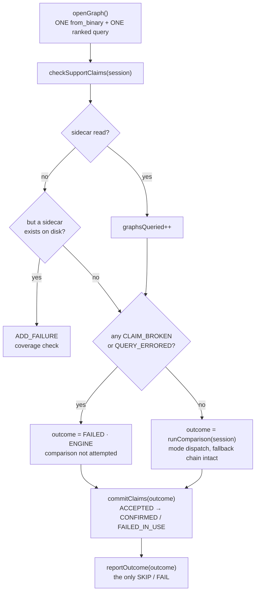

# Support Claim Enforcement

A **support claim** is a promise, checked into git next to a bundle, that a named
engine supports that graph on a given arch and platform. `--enforce-support-claims`
turns a broken promise into a test failure instead of a silent skip.

This document covers what a claim asserts, how one graph's claims are checked,
and the lifecycle inside `TestBody()` that decides when a claim is checked and when
it is published.

> Enforcement is **off** by default and requires `--test-engine`. A run with
> `--enforce-support-claims` and no engine named exits 1 rather than degrading to
> "enforced nothing, exit 0".

---

## What a claim asserts

**That the engine accepts the graph — not that the graph produces correct output.**

Correctness is the job of the ordinary comparison against golden data or a
reference executor (see [Verification modes](../README.md#verification-modes)).
Claims are a separate axis: they catch an engine *dropping* support for a graph it
previously advertised, which otherwise shows up as a skip nobody notices.

The two axes meet in exactly one place — a claim that was accepted and then failed
in use is reported as such, and never published as working support. See
[Phase 3](#phase-3--commit-with-the-outcome).

## Sidecar layout

`.support.json` files live beside the bundle they describe and are excluded from
graph discovery, so they can never register as a test.

| Bundle kind | Sidecar path | Shape |
|---|---|---|
| Single graph `dir/Small.json` | `dir/Small.support.json` | `claims: {engine: {arch: [platforms]}}` |
| Template sweep `dir/sweep.json` | `dir/support.json` (one file, whole sweep) | `claims: {engine: [{cases: [ids], support: {arch: [platforms]}}]}` |

```json
{
  "version": 1,
  "claims": {
    "MIOPEN_ENGINE": { "gfx942": ["linux", "windows"], "gfx1151": ["windows"] }
  }
}
```

A sweep sidecar keys each claim group by `cases[].id`, so one file covers every
case in the sweep and a case named in no group is simply unclaimed.

**Arch and platform come from the running machine, not the bundle.** The sidecar is
a matrix; a run picks one cell. `arch` is the base token — `gfx90a:sramecc+:xnack-`
matches a `gfx90a` claim. `platform` is `linux` or `windows`.

## One lane, one engine

Enforcement checks the claim for **the single engine named by `--test-engine`**,
and nothing else. A sidecar claiming some other engine is that engine's lane's
business: this run cannot execute it, so it has no basis to pass or fail it, and
an engine with no lane at all is the static inventory's problem, not the harness's.

That makes the verdict a two-bit decision:

- **claimed** — does the sidecar name this engine for the running (arch, platform[, case])?
- **accepted** — is this engine's id in the list `get_ranked_engine_ids()` returned?

| | accepted | declined |
|---|---|---|
| **claimed** | `CLAIM_ACCEPTED` | `CLAIM_BROKEN` **fails the test** |
| **unclaimed** | `UNCLAIMED_SUPPORT` | *(nothing emitted)* |

The fourth quadrant — neither claimed nor accepted — carries no information and is
never recorded, which keeps the verdict count proportional to what was actually
promised.

### All verdicts

| Verdict | Meaning | Fails the test |
|---|---|---|
| `CLAIM_BROKEN` | claimed, but absent from the ranked list | **yes** |
| `QUERY_ERRORED` | claimed, but the query did not resolve, so acceptance is unknown | **yes** |
| `CLAIM_ACCEPTED` | claimed and in the ranked list; the run did not get far enough to say more | no |
| `CLAIM_CONFIRMED` | accepted, **and** the run reached the depth the bundle declares | no |
| `CLAIM_FAILED_IN_USE` | accepted, but the engine itself failed the graph | no |
| `UNCLAIMED_SUPPORT` | in the ranked list with no claim — positive drift | no |

There is no `ENGINE_NOT_LOADED`: `main()` exits non-zero at startup if
`--test-engine` names an engine that is not loaded, so by the time a test runs the
engine under test is always present.

`isFailure()` is a whitelist of the non-failures, so a verdict added later without
being classified is fatal by default.

Three notes on the non-obvious ones:

- **`QUERY_ERRORED` is not `CLAIM_BROKEN`.** Only `OK` and `GRAPH_NOT_SUPPORTED`
  mean the ranked list can be trusted. Anything else makes **A** unknown, and
  reporting a decline would state a fact nobody read.
- **`CLAIM_FAILED_IN_USE` is not a claim failure.** The claim held — the engine did
  accept the graph — and the run is already red from whatever actually broke.
  Failing it again would double-report one defect and bury the real diagnostic.
- **`CLAIM_FAILED_IN_USE` is only for the engine's own failures.** A reference
  executor that errored, or a bundle whose golden `.bin` was never pulled, fails the
  run without saying anything about the engine. Demoting the claim there would
  publish "do not use this cell" over somebody else's defect, so those outcomes
  leave the claim at `CLAIM_ACCEPTED` — red run, untouched claim.

---

## Lifecycle in `TestBody()`

One graph, then three phases, each producing a value the next one consumes. Nothing
under `TestBody()` calls `GTEST_SKIP()` or `FAIL()` where it stands — the body
returns a `VerificationOutcome`, and the verdict and the test result are both
derived from it in one place each.



### One graph, one query, one applicability answer

`openGraph()` is the only place a graph is built and the only place
`get_ranked_engine_ids()` is called. It returns a `GraphSession`, which `TestBody()`
hands to everything below it:

```cpp
struct GraphSession
{
    std::unique_ptr<Graph> graph;   // null ⇒ build failed, or a deviceless stub
    std::string buildError;
    RankedEngines engines;          // status, message, rankedIds, accepted
};
```

`engines.accepted` is computed once, by `enginesAccept()`, and is the single
definition of "will this engine take this graph". The claim verdict, `runEngine()`
and the enforcement rungs all read that one bool, so a graph cannot be a broken
claim to one of them and an engine decline to another. Before this, three places
each rebuilt the graph and spelled the predicate their own way.

`RankedEngines` is split out from the session on purpose: every decision needs only
that part, and that part needs no device, no handle and no graph — so the decisions
are unit-testable on their own (`TestGraphSession`).

### Phase 1 — claims, above everything

`checkSupportClaims(session)` hands `session.engines` to `observeSupport()` for the set
comparison and returns `{sidecar, results}`.

It sits **above `runComparison()` on purpose.** The check needs only the ranked
list — no inputs, no outputs, no golden data, no execution — so nothing in the
comparison path is a prerequisite for it. Every early return inside
`runComparison()` (build failure, no output tensors, inputs unavailable, non-`FULL`
routing) would otherwise leave that graph's claims undecided while the run still
exited 0.

It returns an empty observation, touching nothing, when no engine was injected, no
sidecar exists, or enforcement is off.

Neither `openGraph()` nor `checkSupportClaims()` is virtual — **the harness has no
virtual members at all.** Everything needing a GPU, a handle, a loaded plugin, or
process-wide state sits behind one of the four collaborators a test injects through
`HarnessDependencies`:

| Collaborator | Stands in for |
|---|---|
| `IGraphEngineRunner` | `openGraph()` / `buildPlans()` / `execute()` — the frontend graph and the handle |
| `IReferenceExecutors` | the CPU and GPU reference executors |
| `ISupportClaimObserver` | reading the sidecar and comparing it against the ranked list |
| `IVerificationReporter` | every verdict, coverage update and unverifiable reason the run publishes |

So a deviceless suite constructs the **real** harness with gmock doubles
(`mocks/MockX.hpp`, the convention the providers already use) plus a `HarnessPolicy`
value, rather than subclassing it to stub methods out. A test that does not want a
real graph opened returns a `GraphSession` from the mocked runner and says what it
is simulating by setting `engines.accepted` — otherwise it would open a real graph
just to be told nobody ranked it.

### Coverage accounting

Two facts, deliberately not derived from each other:

- **`sidecar == CHECKED` → `graphsQueried++`.** A named state, *not* `results.empty()`.
  A sidecar that claims another arch, another platform, another sweep case, or only
  other engines leaves zero verdicts but was still read in full, and must count as
  covered.
- **Per-graph invariant.** If a sidecar exists on disk and enforcement is on but the
  query did not happen, the test fails. The run-level guard only fires when *no*
  graph anywhere was queried, so a partial gap slips past it; this makes any future
  short-circuit above the query loud immediately instead of surviving behind one
  healthy bundle.

### A broken claim is terminal

`CLAIM_BROKEN` means the engine declined the graph. Running the comparison anyway
would execute nothing, leave the NaN sentinel output buffers untouched, and print a
full tensor diff on top of the real diagnostic. So the comparison is not attempted,
and the aggregated claim message becomes the outcome's failure text.

### Phase 2 — what the run achieved

`runComparison()` returns a `VerificationOutcome`: a status, a depth, who broke, and
the text to print. The depth is the ladder the enforcement rungs and the comparison
share:

| Depth | Reached when |
|---|---|
| `NOT_REACHED` | the engine never got the graph — declined, or a mode failed first |
| `APPLICABLE` | the engine is in the ranked list (`enforcement_level=applicability`) |
| `BUILDABLE` | plans compiled (`enforcement_level=buildable`) |
| `EXECUTED` | the graph ran, but no oracle compared its outputs |
| `VERIFIED` | outputs compared against golden data or a reference |

The fallback chain is unchanged — golden → GPU ref → CPU ref → skip — it just
returns these values instead of skipping from six levels down.

### Phase 3 — commit with the outcome

`CLAIM_ACCEPTED` is an observation about the ranked list, taken before the graph was
built or run. Only the engine this test actually drove can be promoted:

```cpp
const VerificationDepth required = requiredDepth(bundle.metadata.enforcementLevel);
record.verdict = promoteAcceptedClaim(outcome, required);   // engine under test only
record.detail  = describeOutcome(outcome, required);
```

| Outcome | Verdict |
|---|---|
| reached `required`, not failed | `CLAIM_CONFIRMED` |
| failed, and the engine or the comparison is at fault | `CLAIM_FAILED_IN_USE` |
| failed, but the reference or the harness is at fault | stays `CLAIM_ACCEPTED` |
| short of `required` (skipped, no oracle, rung not reached) | stays `CLAIM_ACCEPTED` |

**Confirmation is measured against the bundle's own `enforcement_level`, not against
a fixed "outputs were compared".** A `buildable` bundle whose plans compiled has done
everything it promises, so its claim is confirmed. A `full` bundle that executed and
then found no oracle has not, so its claim stays accepted — nothing verified it, and
`confirmed` is the column a published support matrix reads.

`describeOutcome()` writes the depth into the verdict's detail, so the report says
*how far* a cell got rather than only that it got somewhere. `UNCLAIMED_SUPPORT` for
the engine under test picks up the same annotation: positive drift that actually ran
green is a stronger "add this to the sidecar" than one the ranked list merely named.

Other engines' verdicts pass through untouched — this test never ran them, so the
run has no evidence either way about their claims.

---

## Reading the summary

```text
==== SUPPORT CLAIM SUMMARY ====
  graphs: 3 found, 3 with claims, 3 queried (3 verdicts)
  confirmed: 0  accepted: 1  failed-in-use: 0  broken: 1  errored: 0  unclaimed: 1
  (accepted = engine advertises support; confirmed = the run reached the depth
   this bundle's enforcement_level declares)
```

- **`queried`** counts graphs whose sidecar was read; **`verdicts`** counts the
  verdicts they produced. A graph yields at most one verdict — the engine under
  test's — and zero when the sidecar says nothing about this cell, so
  `verdicts ≤ queried`.
- **`found ⊇ with claims ⊇ queried`** is the nesting invariant.
- **`accepted` is weaker than `confirmed`.** Only `confirmed` reached the depth its
  bundle declares; the detail column names how far each cell actually got. A
  published support matrix should carry `confirmed`.

A shortfall between `with claims` and `queried` is attributed explicitly:

```text
  2 claim-bearing graph(s) were discovered but not selected to run (--gtest_filter);
  their claims are unenforced by this run.
```

Discovery counts every claim-bearing bundle; only selected tests run. Because a
*selected* graph can no longer go unqueried, the whole remainder is the filter's
doing — so the summary names it rather than leaving a mismatch to be misread as an
enforcement gap. **Filtered lanes do not enforce the claims they filtered out.**

A second shortfall hides inside `queried` itself: a sidecar read in full that
claims nothing for this arch/platform still counts as queried, so it looks
identical to a graph that was never claimed at all. The summary names that gap
too:

```text
  1 queried graph(s) carry a sidecar that claims nothing for this arch/platform;
  nothing was promised for them, so nothing was enforced.
```

On a bring-up ASIC this line is often the whole tree, and it is the difference
between "enforced and green" and "enforced nothing here".

Three detail sections follow the counters when non-empty:

- **`CLAIM FAILURES`** — every `isFailure()` verdict, with bundle, engine, cell, and
  the backend's own message for an errored query.
- **`ACCEPTED BUT UNCONFIRMED`** — cells where the engine accepted the graph and the
  test then failed. Not a claim failure, but the one signal that says *do not
  publish this cell as working support*.
- **`UNCLAIMED SUPPORT`** — cells that work but are not written down. This is the
  positive-drift signal: add them to the sidecar.

## Run-level guard

After `RUN_ALL_TESTS()`, a run with enforcement on where claim-bearing graphs were
discovered but **not one** was ever queried exits 1. Enforcement that passes having
verified nothing is a lie, not a pass.

The per-graph invariant above covers the finer-grained case the run-level guard
cannot see.

---

## Running it

```bash
# Validate checked-in golden data against both references — no engine, no claims
./bin/hipdnn_golden_data_tests --gtest_filter='quick_*'

# Just the CPU reference, which needs no GPU at all
./bin/hipdnn_golden_data_tests --reference cpu

# Enforce claims for one engine over the quick tier
./bin/hipdnn_integration_tests \
    --test-article /path/to/libmiopen_plugin.so \
    --test-engine MIOPEN_ENGINE \
    --enforce-support-claims \
    --gtest_filter='quick_*'
```

> Golden `.bin` blobs are DVC-managed. A tree that has not run `dvc pull` in
> `integration-test-bundles/` registers zero validation tests and says so.

| Symptom | Cause |
|---|---|
| `--enforce-support-claims requires --test-engine` | No engine named; there is nothing to check claims against |
| `support claims exist for X but were never queried` | A code path short-circuited above the query — a harness bug, not a data problem |
| `FATAL: … not one of them was ever queried` | Claim-bearing graphs were discovered but none ran; usually the filter selected only graphs without claims |
| `CLAIM_BROKEN … not in ranked list` | The engine dropped support for a graph the sidecar promises. Fix the engine, or update the sidecar |
| `Engine 'X' is not loaded` | `--test-engine` named an engine this build does not have; startup exits 1 before any test runs |
| `verification-mode 'golden-check' has been retired` | Run the `hipdnn_golden_data_tests` binary instead, and unset `HIPDNN_TEST_VERIFICATION_MODE` |
| `No golden-data validation tests ran` | Golden `.bin` blobs are not pulled, so no bundle qualified |

## Scope: two harnesses, never both — and now two binaries

A run either verifies an engine or validates our own golden data. They are separate
harnesses because they are separate jobs with different failure meanings, and
folding the second into the first is what produced a "verification mode" that
structurally never reached an engine — and therefore never enforced the claims the
engine harness exists to enforce.

They now live in **separate binaries**, so the separation is a property of the link
rather than of a flag. `hipdnn_golden_data_tests` does not compile
`FrontendGraphEngineRunner.cpp` or `HarnessDependencies.cpp`, loads no plugin, and
creates no `hipdnnHandle_t`: there is no configuration in which a golden-data run
can become an engine run.

| | `IntegrationBundleVerificationHarness` | `BundleReferenceValidationHarness` |
|---|---|---|
| binary | `hipdnn_integration_tests` | `hipdnn_golden_data_tests` |
| selected by | default | that binary; `--reference cpu\|gpu\|both` narrows it |
| verifies | the engine under test | our checked-in golden `.bin` data |
| engine involved | yes | **no** |
| support claims | queried and enforced | **not linked in** |
| verification modes | `auto` / `golden` / `gpu` / `cpu` | n/a |
| skip path | yes (no oracle, engine declines, TOML skip) | no *verification* skip; skips only when the machine cannot host it — no device, too little VRAM, wrong arch |
| TOML config | engine's own `config/<ENGINE>.toml`: skip list and tolerance overrides both apply | **none** — an engine's config cannot skip or loosen a check on our own data |
| device | yes | GPU reference only; the CPU one is host-only |
| ctest registration | per provider, via `add_external_integration_test_target()` | once, via `add_integration_test_target()` |
| suite name | `{tier}_{Op}_{Topology}` | `…_CpuRef` / `…_GpuRef` |

Registering the golden-data binary once rather than per provider is the point: no
engine is involved, so running it in each provider's lane repeated identical work
and gave three lanes a chance to disagree about our own data.

Registration is the gate, not a runtime verification skip: a test is created only
when the bundle has golden data **and** every node type in its graph is inside
that reference's required-op set (`ReferenceOpCoverage.hpp`). Given both, a
reference that cannot run the graph is a gap in the reference, so it fails rather
than skips. The exceptions are all machine capability, checked before that gate:
`SetUp()` calls `SKIP_IF_NO_DEVICES()` and applies the bundle's VRAM and arch
guards, same as the engine harness. A bundle nobody on this machine could run is
not a gap in the reference. The CPU reference needs no device, so it never takes
the first of those paths.

What `SetUp()` deliberately does **not** consult is the TOML skip list, and the
comparison uses `tolerance::defaultTolerance()` rather than `resolveTolerance()`.
Both of those read an engine's own config file, so both describe how far *that
engine* may drift. Our golden data does not get to opt out of a check, and no
engine's tolerance may loosen one: reference output tracks golden data closely at
all times, or the data is wrong.

Bundles outside a reference's op set are simply absent from its suite, and the
counts are printed at registration so the gap is visible rather than silent:

```text
Golden-data validation (CpuRef): 12 bundle(s) registered, 40 without golden data,
    7 outside this reference's supported-op set
    (BatchnormInferenceAttributes, ReductionAttributes)
```

Adding an op to a reference's set is a commitment: every bundle using it becomes a
test that must pass.

Claims apply to **bundle tests only**. The C++ graph tests under
`src/integration-tests/` carry no sidecars and are not enforced yet; extending
enforcement to them is future work.

## Who owns what

The pieces this harness is assembled from, and the one question each answers.

| Type | Owns |
|---|---|
| `IntegrationBundleVerificationHarness` | The lifecycle: one graph, claims, comparison, commit, report. Decides nothing itself that a collaborator can decide. |
| `HarnessDependencies` | The four collaborators plus a `HarnessPolicy`, handed to the harness at construction. The only place production wiring is chosen. |
| `HarnessPolicy` | The run's settings as a value — mode, placement, arch, platform, VRAM, whether claims are enforced. |
| `IGraphEngineRunner` / `FrontendGraphEngineRunner` | Everything that needs the frontend `Graph` and a handle: open, compile plans, execute. The only production type that touches either. |
| `GraphSession` / `RankedEngines` | What one `from_binary` plus one ranked query produced. `enginesAccept()` turns it into the single applicability answer everything else reads. |
| `IReferenceExecutors` / `ReferenceExecutorPool` | The CPU and GPU reference executors, built once per run rather than once per bundle. |
| `ReferenceOpCoverage` | Which ops a reference is *required* to handle, and which ops in a graph it does not cover. |
| `OutputComparison` | Whether two sets of output tensors agree, and the formatted diff when they do not. No gtest state. |
| `VerificationOutcome` | What the run achieved: status, depth reached, who is at fault, and the text to print. |
| `SupportVerdict` | The claim verdict, from the sidecar and the ranked list. `promoteAcceptedClaim()` is the only place an accepted claim becomes confirmed. |
| `ISupportClaimObserver` | Reading a sidecar and comparing it against the ranked list. |
| `IVerificationReporter` | Every verdict, coverage update and unverifiable reason the run publishes. |
| `SupportClaimReport` | The end-of-run summary and the coverage counters behind it. |
| `BundleReferenceValidationHarness` | The other job entirely: our golden data vs a reference. No engine, no claims, no skip path. |
| `BundleRegistration` | Discovery and eager load, then one of two registration entry points — engine tests or golden-data tests. |

## See Also

- [`README.md`](../README.md) — the integration test suite, bundle formats, tiers,
  and provider wiring.
- [`integration-test-bundles/README.md`](../integration-test-bundles/README.md) —
  on-disk bundle layout and the DVC workflow.
