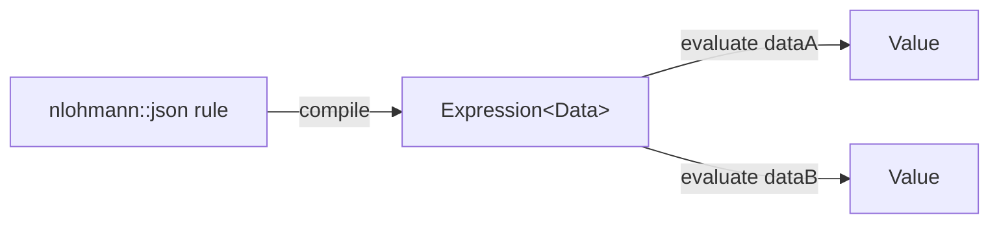

# JSON Expression Language

A header-only compiler
([`JsonExpression.hpp`](../plugin_sdk/include/hipdnn_plugin_sdk/ingestor/JsonExpression.hpp))
for boolean and arithmetic expressions written as JSON. Compile a rule once into
a reusable `Expression<Data>`, then evaluate it many times against different
data sources.

The syntax is that of [JsonLogic](https://jsonlogic.com/). The operator set here
is neither a superset nor a subset of it, so treat this document, not
jsonlogic.com, as the contract.

**Audience.** Plugin authors who write kernel-selection rules in descriptor
files, and anyone who implements a data source for them. This document assumes
C++ and JSON. It does not assume you know JsonLogic.

## Quickstart

The pipeline has two halves. Compilation happens once per rule; evaluation
happens once per data source.



Follow these four steps.

1. Define a type that exposes `getData`. This is your data source.

   ```cpp
   #include <hipdnn_plugin_sdk/ingestor/JsonExpression.hpp>

   namespace jexpr = hipdnn_plugin_sdk::ingestor::jsonexpr;

   struct MyData {
       jexpr::Value getData(const std::string& path) const;
   };
   ```

2. Write the rule as an `nlohmann::json` value. Build it in code:

   ```cpp
   nlohmann::json rule = {{"+", {"$x", "$y"}}};
   ```

   Or parse it from a JSON string, which is what a rule read from a descriptor
   file looks like:

   ```cpp
   auto rule = nlohmann::json::parse(R"({"+": ["$x", "$y"]})");
   ```

   Either form compiles the same way. The rest of this document writes rules as
   JSON text.

3. Compile the rule. This parses the JSON and builds the node tree.

   ```cpp
   auto expr = jexpr::compile<MyData>(rule);
   ```

4. Evaluate the compiled expression against each data source. No step re-parses
   the rule.

   ```cpp
   jexpr::Value a = expr(dataA);
   jexpr::Value b = expr(dataB);
   ```

All names live in namespace `hipdnn_plugin_sdk::ingestor::jsonexpr`. The examples
below assume `namespace jexpr = hipdnn_plugin_sdk::ingestor::jsonexpr;`.

## Terms

Define these once. Later sections use them without re-explaining.

| Term | Meaning |
| --- | --- |
| **Sigil** | The `$` prefix that marks a string as a variable reference. |
| **Resolve** | Read a variable path successfully. A path that does not resolve yields `null`. |
| **Unresolved** | A `null` value, or an array holding an unresolved element at any depth. |
| **Resolve completely** | Be non-null and hold no unresolved element. |
| **Decline** | Yield `null` because the question cannot be answered, instead of guessing `false` or `0`. |
| **Fail closed** | Answer `false` for both a question and its opposite when the input is only partly known. |
| **Stride order** | An integer array giving, for each logical dimension `d`, that dimension's stride rank. `0` is the fastest-varying. |
| **Rank pin** | A comparison that fixes a tensor's `rank` to an exact integral literal, such as `{"==": ["$x.rank", 4]}`. |
| **Plugin SDK** | The hipDNN plugin software development kit, under `plugin_sdk/`. |

## Headers

`JsonExpression.hpp` is the entry point and the only header to include. It pulls
in the implementation, which is split by layer under
[`ingestor/jsonexpr/`](../plugin_sdk/include/hipdnn_plugin_sdk/ingestor/jsonexpr).

| Header | Contents |
| --- | --- |
| `Error.hpp` | `JsonExpressionCompileError`, depth limit |
| `Syntax.hpp` | the variable sigil |
| `Value.hpp` | the runtime value type |
| `DataSource.hpp` | the type-erased data-source contract |
| `Node.hpp` | compiled tree nodes |
| `Operators.hpp` | one function per operator |
| `OperatorTable.hpp` | the operator table, and `OpNode` |
| `LayoutAliases.hpp` | the `stride_order` layout-name pre-pass |
| `Compiler.hpp` | json → node tree |
| `VarIterator.hpp` | iteration over referenced variables |

These headers belong to the Plugin SDK's kernel-ingestor subtree. They compile
and install only when `HIPDNN_ENABLE_KERNEL_INGESTOR` is set.

The runtime value type, `Value`, is a small standalone variant. It does not
depend on nlohmann/json. nlohmann/json expresses the rule being compiled and
nothing else.

## Data source

The evaluator is templated on your data type, which must expose one function:

```cpp
jexpr::Value getData(const std::string& path) const;
```

The compiled expression passes the variable path, such as `"a.b.c"`, straight to
this accessor. Your type owns path resolution. Two conventions apply:

- The path is always non-empty. A bare sigil names no path and is rejected at
  compile time, so a data source never receives `""`.
- Returning `Value()`, that is null, means "not found". A rule supplies a
  fallback for such a path with `value_or_default`.

Any type that satisfies this one-function contract is a valid data source.
`JsonDataSource` below is one implementation, not a privileged one.

### Sample: `JsonDataSource`

[`JsonDataSource.hpp`](../plugin_sdk/include/hipdnn_plugin_sdk/ingestor/JsonDataSource.hpp)
provides a data source backed by an `nlohmann::json` document. Use it to
evaluate rules against JSON without writing an accessor.

```cpp
#include <hipdnn_plugin_sdk/ingestor/JsonDataSource.hpp>

jexpr::JsonDataSource src(nlohmann::json{{"q", {{"dims", {8, 16}}}}});
auto expr = jexpr::compile<jexpr::JsonDataSource>(rule);
jexpr::Value r = expr(src);
```

It resolves dotted keys (`a.b.c`), `[N]` array subscripts (`arr[0]`,
`rows[2].name`, `grid[0][1]`), and dot-form indices (`arr.1`). It strips a
leading sigil, so `"$q.dims[0]"` and `"q.dims[0]"` address the same location.

#### Path and value rules

A path may not be empty, and may not start with `.` after the optional sigil.
`getData` reads any malformed path as null rather than guessing at it. So does
an index too long to name a slot in any document this addresses.

Objects and null in the document read back as `Value` null, which matches
`Value`'s scalar-and-array-only model. So does an unsigned integer too large for
`int64_t`.

> **Why large integers read as null.** Narrowing such an integer would silently
> answer from a number the document does not contain.

## `Value`

A json-like tagged value with no external dependency. Its alternatives are null,
bool, `int64_t`, `double`, `std::string`, and `Array` (`std::vector<Value>`).

Numeric results are stored as integers when exactly integral, so `1 + 1` is `2`,
not `2.0`.

Key members:

- the `is*()` and `as*()` inspectors;
- `truthy()`, `toNumber()`, and `dump()`;
- strict `operator==`;
- `containsUnresolved()`;
- the static `compare`, which returns a `Value::Ordering` of `LESS`, `EQUAL`,
  `GREATER`, or `UNORDERED`. `UNORDERED` is the non-finite case that makes
  ordering predicates decline rather than answer.

There is intentionally no object alternative. Reach nested structure through the
data source's path accessor, not through a `Value`.

## Variables

A variable reference is a string prefixed with `$`. That is the only way to read
data. There is no `var` operator, and writing one is a compile-time error rather
than a second spelling of the same thing.

Strings without `$` are literals, so a variable can appear anywhere a literal
can.

| Reference    | Meaning                                    |
| ------------ | ------------------------------------------ |
| `"$x"`       | top-level key                              |
| `"$a.b.c"`   | nested path                                |
| `"$arr[0]"`  | array index (subscript)                    |
| `"$arr.1"`   | dot-form array index                       |
| `"$"`        | names no path — rejected at compile time   |
| `"$$text"`   | escaped string literal `"$text"`           |

## Layout aliases

A tensor's layout is carried as a stride order. The common layouts also have
names, and a name expands to its array at compile time. The array stays the
single canonical form, and evaluation only ever compares arrays.

| Alias   | Array         | | Alias   | Array           |
| ------- | ------------- |-| ------- | --------------- |
| `nchw`  | `[3,2,1,0]`   | | `bhsd`  | `[3,2,1,0]`     |
| `nhwc`  | `[3,0,2,1]`   | | `bshd`  | `[3,1,2,0]`     |
| `ncdhw` | `[4,3,2,1,0]` | | `mk`    | `[1,0]`         |
| `ndhwc` | `[4,0,3,2,1]` | | `km`    | `[0,1]`         |
|         |               | | `bmk`   | `[2,1,0]`       |
|         |               | | `bkm`   | `[2,0,1]`       |

The letters list a tensor's logical axes slowest-varying first, so `mk` is a
row-major matmul operand `(M, K)` and `km` the column-major spelling of the same
pair. `bmk` and `bkm` are their batched, rank-3 forms.

```jsonc
{"==": ["$x.stride_order", "nhwc"]}                  // same as [3, 0, 2, 1]
{"==": ["$a.stride_order", "mk"]}                    // a row-major GEMM operand
{"in": ["$q.stride_order", ["bhsd", "bshd"]]}        // a set of accepted layouts
```

Every alias is one fixed array, which is what lets a name expand before any
tensor is in hand. A packing that means a different array at each rank has no
name: write the array. A column-major operand is `mk` reversed at rank 2 (`km`)
and `bkm` at rank 3, and above that it is spelled out.

```jsonc
{"==": ["$a.stride_order", [3, 2, 0, 1]]}            // column-major, two batch dims
```

### Where a name means an alias

A name is read as an alias only where a `stride_order` reference gives it that
meaning. Two positions do so:

- opposite one in an `==` or `!=`;
- as an element of the array an `in` searches.

Anywhere else, `"nhwc"` is an ordinary string literal, so a data field that
happens to hold layout names is untouched.

An alias is a plain string. A sigil-prefixed string in an alias position stays a
variable reference, or, when doubled, an escaped literal. The compiler leaves it
alone. That lets you compare one tensor's layout against another's.

```jsonc
{"==": ["$q.stride_order", "$k.stride_order"]}       // do q and k share a layout?
{"in": ["$q.stride_order", ["$k.stride_order", "nhwc"]]}
```

An alias names an array, not a distinct layout. `bhsd` and `nchw` both expand to
`[3,2,1,0]`, and so do `bmk` and a rank-3 channel-first convolution, so either
name accepts a tensor carrying that stride order. Treat aliases as spelling
conveniences, not as narrowing checks.

### Alias errors

In alias positions a `stride_order` is an integer array, so a string can only be
an alias. Two mistakes are therefore compile-time errors rather than expressions
that quietly never match.

**An unrecognized name**, such as `"nhcw"`. It would otherwise compare unequal
against every array forever.

**An alias whose rank contradicts a rank pin on the same tensor.** Every alias is
fixed-rank, so a rank-5 alias on a tensor pinned to rank 4 can never hold:

```json
{"and": [{"==": ["$x.rank", 4]}, {"==": ["$x.stride_order", "ndhwc"]}]}
```

Three details govern this check.

- Rank pins are exact integral numeric literals, `4` or `4.0`.
- Only pins reachable through `and` count. A pin inside an `or` or `if` arm is
  conditional and cannot contradict the alias.
- The tensor is the whole path ahead of the final `.rank` or `.stride_order`
  segment. So `$inputs[0]` and `$inputs[1]` are two tensors, and a pin on one
  says nothing about the other.

That last rule is why this rule is accepted. It holds whenever the second input
really is 5d.

```json
{"and": [
  {"==": ["$inputs[0].rank", 4]},
  {"==": ["$inputs[1].stride_order", "ndhwc"]}
]}
```

## Supported operators

"Operands" is the argument count enforced at compile time. A mismatch raises
`JsonExpressionCompileError`.

"Operand types" describes what each operator does with the values it gets. It is
not a static type system. The language is dynamically typed, and *number* means
the operand is put through `Number()`-style coercion via `toNumber()`, so a
numeric string works where a number is wanted.

Most operators below yield `null` when an operand is unresolved. The exceptions
are `and`, `or`, `present`, `not_present`, and `value_or_default`. Their rows
describe the special handling, as does
[Null is unknown](#null-is-unknown-and-it-propagates).

### Data access

Reading a variable is not an operator. It is the sigil-prefixed string form
above, so `"$q.dims[0]"` resolves the path `q.dims[0]` against the data source
and yields `null` when it does not resolve. One operator supplies a fallback for
that case.

| Operator | Operands | Operand types | Description |
| --- | --- | --- | --- |
| `value_or_default` | 2 | value: any expression; default: any expression | Returns the first operand when it resolves completely, and the second otherwise. |

Three properties follow from that definition.

- A value carrying an unresolved element takes the fallback, rather than being
  handed back with a hole in it.
- The operator keys on existence, not on truthiness. A present `0`, `""`, or
  `false` is returned rather than the fallback.
- The default is evaluated lazily, so `{"value_or_default": ["$a", "$b"]}` reads
  "this field, else that one".

### Logic and control

| Operator | Operands | Operand types | Description |
| --- | --- | --- | --- |
| `if` / `?:` | 2+ | condition, result pairs, optional trailing else: any | Evaluates condition/result pairs left to right and returns the first result whose condition is truthy. A lone trailing operand is the else branch. |
| `and` | 1+ | any | Truthy-fold. Returns the first falsy operand, else the last. Short-circuits. |
| `or` | 1+ | any | Truthy-fold. Returns the first truthy operand, else the last. Short-circuits. |
| `!` | 1 | any | Logical negation of truthiness. |
| `!!` | 1 | any | Cast to boolean truthiness. |

`if` branches are lazy, so only the taken branch is evaluated. An unresolved
condition picks no branch and yields `null`.

`and` and `or` are three-valued. A definite falsy operand decides an `and`, and a
definite truthy operand decides an `or`, even beside an unresolved operand.
Otherwise a `null` operand makes the whole fold `null`. See
[Null is unknown](#null-is-unknown-and-it-propagates) for the truth table.

### Comparison

| Operator | Operands | Operand types | Description |
| --- | --- | --- | --- |
| `==` | 2 | any | Strict equality. No type coercion, so `1 == "1"` is false. |
| `!=` | 2 | any | Strict inequality, the negation of `==`. |
| `<` | 2–3 | two numbers, or two strings | Less-than. The 3-operand form is the between-chain `a < b < c`. |
| `<=` | 2–3 | two numbers, or two strings | Less-than-or-equal, with the same between-chain form. |
| `>` | 2 | two numbers, or two strings | Greater-than. |
| `>=` | 2 | two numbers, or two strings | Greater-than-or-equal. |

Equality compares two integers exactly, so magnitudes past 2^53 are not
conflated by a detour through `double`. For the same reason, an integer and a
double compare equal only when the double names that integer exactly.

**Ordering agrees with equality about kinds.** Two numbers compare numerically
and two strings compare lexicographically, but a string opposite a number is a
kind mismatch, and the ordering operators decline rather than coercing it. So
`"1" == 1` is false and `"1" <= 1` is `null`, not true.

> **Why it declines.** These are the predicates that gate criteria, and
> coercing is the answer that widens one. A rule reporting a pair as unequal
> *and* as ordered is a contradiction its author cannot reason about, so the
> operator that would have answered from a coercion declines instead.

This is the one place the language is stricter than `Number()` coercion. A data
source that models a number as a string (`"tile_m": "128"`) stops ordering and
starts declining, which is that modelling error surfacing rather than passing
quietly. Arithmetic is unaffected: `{"+": ["2", "3"]}` is still `5`.

### Arithmetic

| Operator | Operands | Operand types | Description |
| --- | --- | --- | --- |
| `+` | any | number (coerced) | Sum of all operands; `0` with no operands. |
| `-` | 1–2 | number (coerced) | Unary negation with one operand, subtraction with two. |
| `*` | any | number (coerced) | Product of all operands; `1` with no operands. |
| `/` | 2 | number (coerced) | Division. Declines on a zero divisor rather than producing `inf` or `NaN`. |
| `%` | 2 | number (coerced) | Remainder (`fmod`). Declines on a zero divisor. |
| `min` | 1+ | number (coerced) | Smallest operand. Declines if any operand is unresolvable, rather than skipping it. |
| `max` | 1+ | number (coerced) | Largest operand. Declines if any operand is unresolvable, rather than skipping it. |

Every operator in this section and the next declines whenever its result would
not be finite. See
[Unresolvable arithmetic declines](#unresolvable-arithmetic-declines).

### Math extensions

These go beyond the core operator set. They supply the tiling and scaling
arithmetic that descriptor dispatch formulas need.

| Operator | Operands | Operand types | Description |
| --- | --- | --- | --- |
| `ceil_div` | 2 | number (coerced) | Ceiling division, `ceil(a / b)`. Declines on a zero divisor. |
| `abs` | 1 | number (coerced) | Absolute value. |
| `pow` | 2 | number (coerced) | `a` raised to the power `b`. Declines when the result is not finite, such as a negative base under a fractional exponent, or an overflow. |
| `log2` | 1 | number (coerced) | Base-2 logarithm. Declines on a non-positive operand. |
| `rsqrt` | 1 | number (coerced) | Reciprocal square root, `1 / sqrt(x)`. Declines on a non-positive operand. |

### Short-hands

| Operator | Operands | Operand types | Description |
| --- | --- | --- | --- |
| `divisible` | 2 | number (coerced) | True when `a` is an exact multiple of `b`. |

`divisible` is exactly `{"==": [{"%": [a, b]}, 0]}`. It therefore declines on a
zero divisor as `%` does, and `0` is divisible by everything.

`value_or_default` is the other short-hand. It is listed under
[Data access](#data-access) because it is how a rule handles a path that does not
resolve.

### Membership

| Operator | Operands | Operand types | Description |
| --- | --- | --- | --- |
| `in` | 2 | needle: any; haystack: array or string | Tests membership of `needle` in `haystack`. |

An array haystack is true when it contains `needle` by strict element equality. A
string haystack is a substring test, and a non-string needle is rendered via
`dump()`. Any other haystack type is false.

### Presence

These two operators and `value_or_default` are the presence operators. They
answer "was this supplied?", so they always yield a real boolean rather than
propagating `null`.

| Operator | Operands | Operand types | Description |
| --- | --- | --- | --- |
| `present` | 1+ | any, normally variable references | True when every operand resolves completely. An `and`-fold, so one call decides a whole list. |
| `not_present` | 1+ | any, normally variable references | True when every operand is wholly `null`. Also an `and`-fold. |

**Both fail closed on a value that only partly resolves.** An array with an
unresolved element is neither wholly supplied nor wholly absent, so both answer
`false`. See [Null is unknown](#null-is-unknown-and-it-propagates).

## Null is unknown, and it propagates

`null` means unresolved. It is not a value. Most operators return `null` when any
argument is `null`, rather than coercing it to `false`, `0`, or not-equal.

This matters whenever a data source has optional fields, where an unresolved path
means the field is absent rather than false. Consider a narrowing check:

```json
{"!=": ["$bias.dtype", "BFLOAT16"]}
```

> **Why it declines.** If `null` coerced, this check would evaluate true on input
> that carries no `bias` at all. It would accept data it never examined.

Two `null`s are not equal to each other either. The question is unanswerable, so
`==` and `!=` both decline.

### Three-valued `and` and `or`

A definite `false` still decides an `and`, and a definite `true` still decides an
`or`, even beside a `null` argument. Otherwise the result is `null`.

| `a` | `b` | `and` | `or` |
| --- | --- | --- | --- |
| true | true | true | true |
| true | false | false | true |
| true | null | null | true |
| false | false | false | false |
| false | null | false | null |
| null | null | null | null |

That behaviour is what lets this guard accept an absent operand whose field reads
cannot run:

```json
{"or": [{"not_present": ["$bias"]}, {"and": [{"present": ["$bias"]}, "..."]}]}
```

### Resolved values follow JavaScript semantics

Once every argument resolves, value semantics follow JavaScript. `false`, `0`,
`""`, `null`, and the empty array are falsy. `Number()`-style coercion drives
arithmetic and ordering. A `null` root is falsy, so an undecided expression
declines.

### Arrays are unresolved when any element is

**An array is unresolved when any element is**, however deeply nested. That holds
whether the array is written into the rule or handed back by the data source.

Take a `stride_order` whose second entry could not be represented. It reads as
`[3, null, 1, 0]`.

> **Why this matters.** Comparing that array against a literal would otherwise
> answer a confident `false` from a value the language never fully read.

The presence operators fail closed in both directions here. A partly-resolved
value is neither wholly supplied nor wholly absent, so `present` and
`not_present` are both `false` on it. That is what keeps the guard above from
accepting such a value through its `not_present` arm.

If the final result is a partly resolved array, the expression returns `null`.
This also applies when `if` or `value_or_default` returns that array, so a caller
reading the result with `truthy()` rejects it.

### A document nested past the depth bound is unresolved

A `Value` is a tree, and every consumer of one walks it recursively. A data
source must therefore hand back nothing deeper than `MAX_VALUE_DEPTH` (256)
levels, or the recursion overflows the stack inside the language rather than
inside the accessor.

`MAX_EXPRESSION_DEPTH` bounds a *rule*; this bounds a *document*. Both are read
off disk and neither is more trusted than the other, but only the rule is
checked at compile time, so a document needs its own bound at the point a
`Value` is built.

`JsonDataSource` enforces it: at the bound it yields `null` for the subtree
beneath rather than recursing. By the rule above, an array holding that `null`
is unresolved throughout, so the enclosing predicate declines — and so does its
negation, and both presence operators report `false`.

A data source of your own carries the same obligation. The bound is not
re-checked when a value crosses the `IDataSource` boundary, because that would
cost a full traversal of every value read on every evaluation to catch a
mistake in one accessor.

## Unresolvable arithmetic declines

`null` is not the only way a value can fail to resolve. `Number()` coercion turns
a non-numeric string or a multi-element array into `NaN`, and arithmetic can
overflow to an infinity. A non-finite operand cannot be ordered against anything.

Ordering against a non-finite operand yields `UNORDERED`, and the predicate
declines. `null` in, `null` out, negation included.

> **Why negation must decline too.** Consider this criterion, where `dtype` is a
> name rather than a number, so `log2` yields `NaN`:
>
> ```json
> {"!": [{"<": [{"log2": "$q.dtype"}, 8]}]}
> ```
>
> If the `<` reported `false`, the `!` would make the whole criterion `true`. The
> kernel would apply on the strength of a question nobody answered.

Every arithmetic and math operator yields `null` unless its result is finite.
That puts an unresolvable computation back under the ordinary propagation rule
above: the enclosing predicate declines, and so does its negation.

`min` and `max` decline outright rather than skipping an unresolvable operand.
Answering from fewer operands than were written is the same failure in quieter
form.

### Numeric strings

`Number()` coercion reads a string with `std::from_chars`, not `std::strtod`,
so parsing does not consult the host process's locale. Under a comma-decimal
`LC_NUMERIC`, `strtod` reads `"1.5"` as `1`; a library evaluating rules read off
disk does not control that setting.

Accepted: an optional leading `+` or `-`, decimal digits, a decimal point, and
an exponent, with surrounding whitespace trimmed. The empty string is `0`, as
`Number("")` is.

Rejected — the whole string coerces to `NaN`, so the enclosing operator
declines: trailing garbage (`"5abc"`), interior whitespace (`"1 5"`), a bare
sign, and a hexadecimal float (`"0x10"`, a typo in a descriptor rather than
`16`).

**A non-finite spelling is rejected too.** `from_chars` reads `"inf"`,
`"infinity"`, `"nan"` and `"nan(char-seq)"` in any case, where `Number()`
accepts none of them but `"Infinity"`. A dim, stride, or bound is a finite
quantity, so all of them coerce to `NaN` rather than to a value no operator
would accept anyway.

A magnitude outside the `double` range declines in **both** directions, and for
the same reason: `from_chars` reports it as out of range, so `"1e309"` never
becomes an infinity. Underflow (`"1e-999"`) is the subtler one: it would
otherwise read as a clean `0` — a number the language never represented, which
then compares equal to a literal `0` and divides as a zero divisor. A genuine
denormal such as `"5e-324"` is representable and keeps its value.

## Compile-time errors

Malformed rules raise `JsonExpressionCompileError` at `compile` time, so
evaluation stays on the fast path. Four cases qualify:

- an unknown operator;
- a wrong argument count;
- a non-operator object;
- an unsigned integer literal too large for `int64_t`.

Nesting deeper than `MAX_EXPRESSION_DEPTH` is rejected the same way.

> **Why the depth limit.** Compilation and evaluation both recurse per level, and
> rules are read from descriptor files on disk. An over-deep rule must report a
> bad rule rather than exhaust the stack.

A level is one operator. `{"!": [X]}` puts `X` one level down, because an
operator's argument array is not a level of its own. A bare array literal is a
level, and so is the array a layout alias expands into. A rule whose deepest node
is an alias therefore fits one operator less than the same rule spelled with the
array.

## Not included

The `var` operator is not supported. Variables take the sigil form only.

The collection and string operators are not supported either: `map`, `reduce`,
`filter`, `all`, `some`, `none`, `merge`, `cat`, `substr`, `missing`, and
`missing_some`.

## Tests

Unit tests live in
[`TestJsonExpression.cpp`](../plugin_sdk/tests/ingestor/TestJsonExpression.cpp)
(the language through compiled rules),
[`TestJsonValue.cpp`](../plugin_sdk/tests/ingestor/TestJsonValue.cpp) (the
`Value` type directly: coercion, the comparison ladder, and every producer of
an unorderable result), and
[`TestJsonDataSource.cpp`](../plugin_sdk/tests/ingestor/TestJsonDataSource.cpp)
(the sample data source).
They build into the `hipdnn_plugin_sdk_tests` GTest binary. Like the rest of
`ingestor/`, they are compiled only when `HIPDNN_ENABLE_KERNEL_INGESTOR` is set.

Run them with:

```bash
ctest -R hipdnn_plugin_sdk_tests
# or, filtered directly on the binary:
./hipdnn_plugin_sdk_tests --gtest_filter='TestJsonExpression.*:TestJsonValue.*:TestJsonDataSource.*'
```
