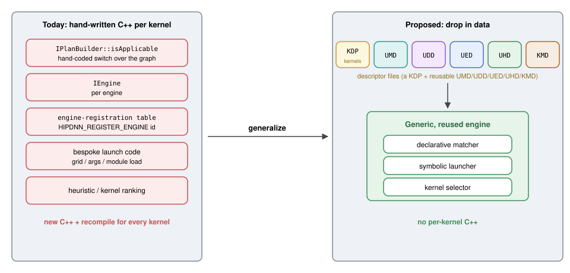
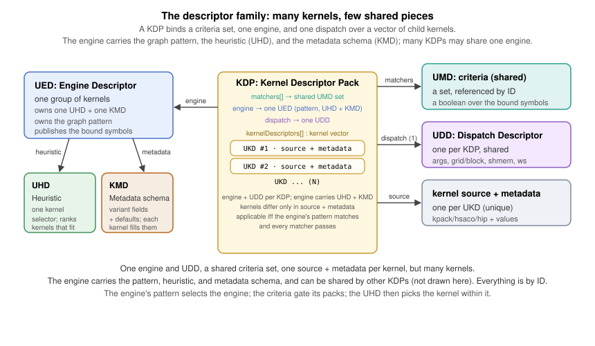
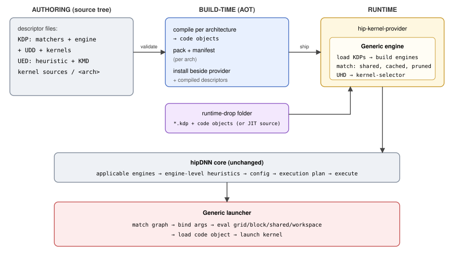
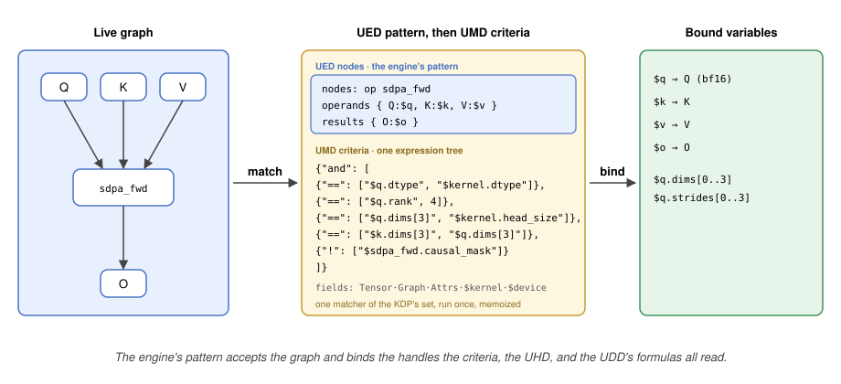
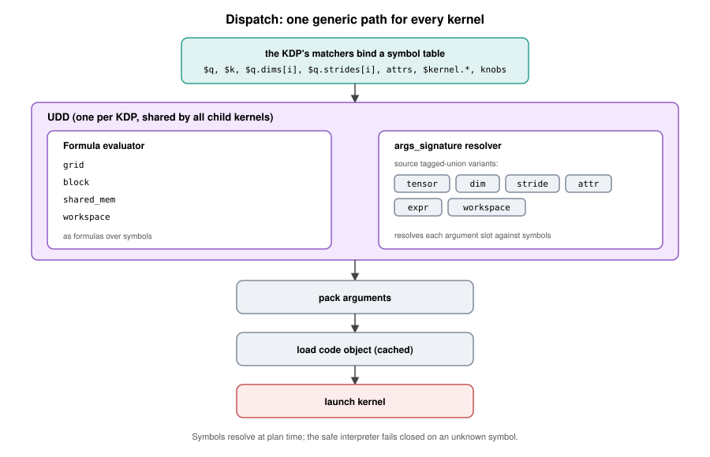
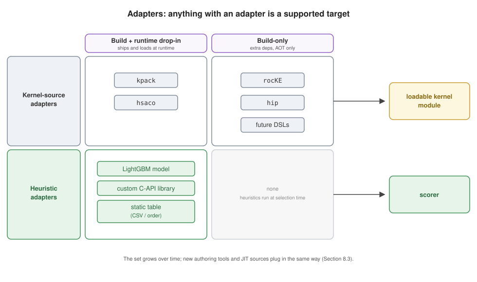
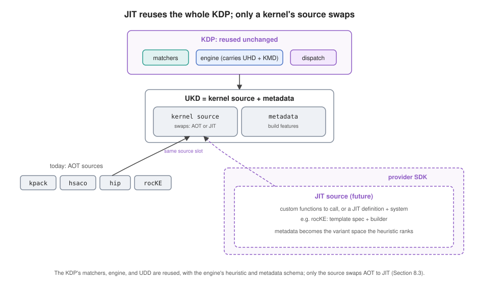
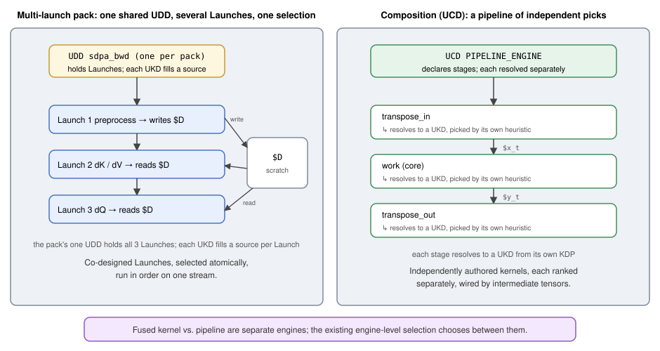

# RFC 0017: Universal Kernel Descriptors (UKD/UMD/UDD/UED/UHD/KMD/KDP): A Data-Driven Kernel Ingestor

- Contributors: Brian Harrison, Daryl Hawkins, Jason Campbell, Brad Pepers

## Table of Contents

1. [Overview](#1-overview)
2. [The Descriptors](#2-the-descriptors)
3. [How It Works](#3-how-it-works)
4. [Descriptor Formats](#4-descriptor-formats)
5. [Matching and the UMD](#5-matching-and-the-umd)
6. [Dispatch and Workspace](#6-dispatch-and-workspace)
7. [Kernel Source](#7-kernel-source)
8. [End-to-End Flow](#8-end-to-end-flow)
9. [Adapters and Extensibility](#9-adapters-and-extensibility)
10. [Observability and Diagnostics](#10-observability-and-diagnostics)
11. [Tooling](#11-tooling)
12. [Packaging and Delivery](#12-packaging-and-delivery)
13. [Worked Example: SDPA as a UKD](#13-worked-example-sdpa-as-a-ukd)
14. [Phased Delivery](#14-phased-delivery)
15. [Multiple Kernels and Composition](#15-multiple-kernels-and-composition)
16. [Risks](#16-risks)
17. [Open Questions](#17-open-questions)
18. [References and Prior Art](#18-references-and-prior-art)
19. [Glossary](#19-glossary)

---

## 1. Overview

Every kernel hipDNN's kernel provider runs today is hand-written C++: a plan builder that
matches the graph, an engine, a registration-table entry, launch code, and a selection
heuristic. Writing this by hand creates four compounding problems as the library grows.

- **Scale.** Kernels multiply combinatorially: one variant per architecture, data type,
  problem shape, and fused form. rocKE already has three to four scaled dot-product
  attention (SDPA) forward variants per architecture, and convolution alone spans several
  algorithm families (implicit GEMM, explicit GEMM, direct, and Winograd). Ten variants per
  architecture is a near-term floor; hundreds are likely as coverage grows, each one more
  hand-written engine.
- **Staleness.** Upstream authors keep revising these kernels, so each hand-ported variant
  falls behind: it misses a niche uplift (sometimes more than 2x) or keeps a solution that
  is now 2x slower. The value already built stays undelivered until someone prioritizes the
  re-port.
- **Maintainability.** Every hand-written variant is code the team must carry: tested, kept
  building, updated as interfaces change, fixed when broken. Near-identical copies drift
  apart over time, so that burden, test coverage included, is paid again for each one, with
  no single source of truth.
- **Feature velocity.** A cross-cutting change, such as hipGraph support or plan
  serialization, must be threaded by hand through every near-duplicate engine. Platform
  features arrive slowly and unevenly as a result.

This RFC moves kernel behavior out of code and into data: declarative descriptor files that
one **generic engine** loads and runs. An author drops in files, and that engine matches,
selects, and launches the kernel with no new code. The behavior lives in one shared base, so
a cross-cutting feature is written once and inherited by every descriptor-backed kernel. A
small family of reusable descriptors, bound together for a kernel family by a **KDP (Kernel
Descriptor Pack)**, does the work. There are five **Universal** descriptors, and the middle
letter of each says what it describes: a U**M**D matches, a U**D**D dispatches, a U**E**D is
the engine, a U**H**D is the heuristic, and a U**K**D is the kernel. The **KMD** completes
the set: the engine-wide metadata schema every UKD fills in.
[Section 2](#2-the-descriptors) defines each descriptor and maps it onto the hipDNN concept it
replaces.

A family of near-identical kernels launches the same way and matches the same graph shapes,
differing only in their compiled source and its build metadata. That family is a KDP: one
file that binds a **set of matchers** (referenced by ID and shared across packs), **one
engine descriptor**, and **one dispatch descriptor**, over a **vector of child kernels**
that each supply only their source and metadata values. The engine carries the heuristic
and metadata schema, so many KDPs may share one engine, and matchers and the UDD are
authored once and referenced by ID, so packs may share those too. One matcher set and UDD
per KDP is intentional: a kernel whose ABI or matcher set differs belongs in another pack,
and one whose engine, heuristic, or metadata schema differs belongs in another engine. A
family therefore reduces to a handful of shared descriptors plus one tiny entry per kernel,
avoiding hundreds of near-duplicate files.

A prototype for a single operation (SDPA) already matches and selects a prebuilt kernel end
to end, using a generic engine plus a thin operation-specific adapter. It proves the AOT
load path (rocKE, [PR #9207](https://github.com/ROCm/rocm-libraries/pull/9207)); only
running the selected kernel remains. This RFC generalizes that adapter into a complete data
description of a kernel, and makes that generalized form the delivery vehicle: any kernel
expressible as a code object plus a description of when and how to run it is ingested the
same way.



**Vision.** The goal is to let kernel authors own delivery end to end: hipDNN provides the
tools and platform to describe, package, and release a kernel, and the author takes it from
there without waiting on a provider change or someone else's release train. How close a
given kernel comes to that goal depends on whether its family already exists. Adding a
variant to an established family reaches it fully: the author writes one descriptor and
ships. Standing up a new family costs more, because the matcher, engine, heuristic, and
metadata schema must be authored first; after that, every later kernel in that family is a
single descriptor. Neither path is meant to be walked by hand. The descriptor formats are
precise and machine-checkable so that agents can author them: the intended workflow is a
kernel author describing intent to an agentic skill that drafts the descriptors, validates
them against the schema, and reports what is wrong in the author's terms. Hand-authoring
stays available and the format is readable enough for it, but the agentic skills ship with
the capability and are the path a kernel author is expected to take. The end state is one
generalized description covering both AOT and just-in-time (JIT) kernels; AOT is the focus
here, JIT a future follow-on.

**Scope.** This document frames the system and its direction. Each descriptor format
(match, dispatch, engine, heuristic) and subsystem (the matcher, expression language,
packaging, and drop-in loader) is designed in its own follow-up RFC. The first deliverable
is the single-kernel path; multi-kernel launch and composition are separate follow-ups. A
named escape hatch covers a step needing C++; anything needing a new runtime dependency
stays a full provider, one per dependency. This complements build-time codegen.

### 1.1 What Ships Now Versus Later

| Capability | This RFC (day-one) | Deferred to a follow-up |
|---|---|---|
| Single-kernel path: UKD + UMD + UDD + UED + UHD + KMD, bound by a KDP | Yes | None |
| Fusion **matching**: one UMD matches a bounded multi-op subgraph that is the entire graph, run as one kernel | Yes | matching a fused pattern *inside* a larger graph: JIT |
| Match criteria: opcode, dtype, shape/rank, stride order, packed, divisibility, range, attribute, graph-structure, cross-tensor, per-element `all`, bounded `or` | Yes | None |
| General matching: N-ary commutative, unbounded chains, optional/variadic operands | None | JIT |
| Kernel sources | `kpack`, `hsaco`, and `rocke` (build-only, runs the rocKE AOT build) first; `hip` follows | new authoring adapters, DSLs |
| Heuristic sources | LightGBM model; custom C-API library | other model formats, static tables |
| Runtime drop-in | prebuilt code objects, opt-in, off by default | JIT-compiled sources |
| Multi-kernel launch program (e.g. SDPA backward) | None | composition |
| Selection composition: UCD (Universal Composite Descriptor) decomposition | None | composition |
| JIT compilation; normalized providers | None | JIT |
| Authoring workflow | agentic skills that draft, validate, and inspect descriptors | further skills for retraining, packaging, and migration |

### 1.2 Provider or Kernel Pack

Both paths add a kernel to hipDNN; they differ in what they cost and what they can carry.

A **provider** is the unit that carries a **runtime dependency**: a whole project, built,
versioned, packaged, and shipped on its own, one per dependency. This mirrors the three
that exist today (MIOpen, hipBLASLt, and the HIP kernel provider), each wrapping exactly
one backend library. Choosing a provider means bringing an existing library into hipDNN and
taking on a project to build, maintain, and release.

A **KDP** is the unit for a standalone kernel someone wants to ship, with no new runtime
dependency of its own. It skips the project entirely: an author self-serves and
fast-tracks delivery instead of waiting on a release vehicle. Anything the kernel needs only
to *build*, an authoring toolchain, a compiler, a codegen step, is an **adapter**
([Section 9](#9-adapters-and-extensibility)) rather than a provider; the build-time
dependency never reaches the shipped runtime. rocKE is this case: a Python authoring
environment used only at build time, absorbed as a build-only adapter. The **HIP kernel
provider is the first home** for data-driven ingestion: HIP kernels, assembly, and AOT
rocKE.

**The pieces are shared across providers.** The machinery this system needs (the matcher, the
expression interpreter, the selector, the loader) is built as reusable static libraries in the
provider SDK, so any provider can adopt a piece without adopting the whole ingestor. Converting
MIOpen's hand-coded applicability checks to UMD-style declarative ones is the obvious candidate: the
same matcher, applied to a provider that keeps its own kernels and selection.

**JIT is where a technology can force a new provider.** A JIT engine may need runtime access
to a compiler or interpreter, a runtime dependency by definition, so a JIT technology can
warrant a provider scoped to it rather than an adapter. DSLs are the prime example: hipDNN
and TheRock cannot ship a native library carrying a Python dependency, so a Python DSL would
be delivered as its own project shipping an **extension wheel** that installs a provider
into hipDNN's plugin folder, published in as many builds as the Python ABIs it must support.
That provider extends hipDNN with the DSL and can itself accept drop-in KDPs written for
that technology, so the data-driven path survives the dependency split. hipDNN's plugin
mechanism already supports loading such a provider; bundling and releasing an extension
provider is future work, left to the delivery follow-up RFC.

---

## 2. The Descriptors

Each descriptor maps directly onto a concept hipDNN already has, expressed as data instead of
hand-written code.

| Descriptor | Purpose | Exists in hipDNN today as |
|---|---|---|
| **KMD** (metadata) | One schema per engine, shared across every kernel it owns: the variant fields each kernel carries, each with a type and an optional default (tile size, block size, and the like). Each kernel supplies concrete values, and that completed tuple is the kernel's unique key in the catalog, so the field set must uniquely describe every kernel variant. The heuristic ranks the catalog on it, and matchers read the fields as `$kernel.<field>` | The compile-time template and tuning parameters that distinguish one kernel variant from another |
| **UHD** (heuristic) | One kernel-selection model, one per engine. Given the kernels that fit a graph, the engine's **catalog** for that graph, it ranks them on kernel metadata, problem shape, and device details, and picks the best one for the problem | A ranking model living inside an engine's dispatcher |
| **UED** (engine) | One engine, carrying no logic of its own: a stable identity, the KMD fields it exposes as knobs, and its behavior and numerical notes. It **names** the engine's one heuristic (UHD) and one metadata schema (KMD) by id, because a single selector ranks all of the engine's kernels over one feature space. An engine is a named group of kernels | The provider's engine-registration table plus a `HIPDNN_REGISTER_ENGINE` id |
| **UMD** (match) | One applicability check over the graph, device properties, and kernel metadata, written as a graph pattern plus a declarative criteria expression, binding the named variables the launch step references; a pack's matcher **set** is its full applicability test, and what survives it is the engine's catalog for that graph | The provider's entire applicability implementation: graph-level, device-level, and per-kernel checks a hand-written `isApplicable` performs before a kernel is a candidate |
| **UDD** (dispatch) | How to invoke a kernel: the dispatch application binary interface (ABI), meaning argument binding and ordering, grid, block, shared memory, and workspace | The bespoke launch and argument-wiring code |
| **UKD** (kernel) | One launchable kernel, carrying no logic of its own: a source, either a compiled kernel or the details for building it ahead of time (AOT), plus concrete values for the fields the engine's KMD declares. It inherits everything else, matchers and dispatch from its pack, heuristic and metadata schema from that pack's engine, and it applies only when **all** of its pack's matchers pass | The compiled kernel module (code object) and its hand-tracked build config |
| **KDP** (pack) | Bind a matcher set, one engine, and one dispatch over a kernel vector | The engine-registration table plus the per-kernel registration and launch scaffolding |

A UED is 1:1 with a hipDNN engine, so "the engine" and "the UED" name the same unit going
forward. An engine serves a scoped family of kernels, tight enough that one heuristic and
one metadata schema cover the kernels it owns. Legacy engines are not scoped this way
today; mapping UED onto the existing registration restructures how engines are organized,
not merely describing current practice.

**A note on the name.** hipDNN's host-side engine descriptor and a UED describe the same
engine from two sides. The host object is what a caller holds: an engine plus the knob
settings it runs with for one graph. A UED is the provider-side definition that engine is
built from: its identity, heuristic, metadata schema, and the fields it exposes as knobs.
The knobs a caller sets through the host object are exactly the KMD fields the UED chose
to expose.

The KDP's one UDD holds one or more **Launches**, each a dispatch step paired at runtime with
the UKD source that fills it: a simple kernel is a one-Launch UDD, and a multi-launch kernel
such as SDPA backward is a several-Launch UDD run in order. The remaining term is the
**UCD (Universal Composite Descriptor)**, which splits a graph into child graphs, each
satisfied by an engine (future work).



Two independent selection levels exist, named apart to avoid conflation. The
**engine-selection heuristic** is hipDNN's existing heuristic plugin interface, choosing
which engine handles a graph. A UHD is a **kernel-selection heuristic** one level down,
choosing which kernel within an engine to run, part of the generic engine rather than a new
host interface. Both are needed: engine selection is unchanged, and the kernel-selection
heuristic is what makes dropping in a family of kernels useful, ranking them per problem.

**Cross-engine arbitration is hipDNN's, and the user controls it.** Which engine handles a
graph is decided above the descriptor system, by the caller, through three existing
mechanisms: **explicit selection** of an engine, **policy configuration**, where a resolved
sequence of heuristic-policy plugins supplies the ranked engine list and a policy may itself
be a heuristic, and **auto-tuning**, which measures engines and picks the winner outright
([RFC 0013](0013_Autotune.md)). Registration order plays no role. This proposal leaves that
unchanged, making engine selection only more visible as more engines become cheap to add.

Kernel selection is the UHD's job: given a catalog, it picks one kernel, the out-of-the-box
path with no measurement. Measurement is the opt-in path, one lever rather than an
enumeration: the caller asks the engine to measure, and the engine samples its own catalog
for this graph and keeps the winner. The precedent: the MIOpen provider already exposes
this as a knob, `global.benchmarking`, a single 0/1 value that makes the engine search its
candidates on the first execution and reuse the cached choice afterwards. A
descriptor-backed engine offers the same lever. Because it measures its own catalog rather
than the caller reaching kernels through knob settings, the whole catalog is reachable to
measurement even though only a subset of KMD fields is exposed as knobs. Restricting the
catalog by knob configuration remains available, and tuning across engines uses the
existing auto-tuning API ([RFC 0013](0013_Autotune.md)), which may ignore the heuristic's
suggestion or use it to converge faster. Exposing the catalog for kernel-by-kernel
enumeration would be a great deal of surface for a consumer to drive; the single lever
covers the case. How hipDNN consumes heuristic output on each path is left to the UHD
follow-up RFC.

---

## 3. How It Works

There is one family of descriptor formats, one generic engine, and two ways descriptors reach it:

- **Build-time (AOT).** Descriptors and kernel sources in the source tree are compiled and packed
  per GPU architecture, then installed beside the provider.
- **Runtime drop-in.** Descriptors backed by a prebuilt code object (or JIT source) are placed in a
  folder and picked up on demand, with no build step and no restart.

Both paths produce the same thing the generic engine consumes, so everything downstream (matching,
selection, launch) is identical regardless of how a kernel arrived.



Loading is on demand and cached: nothing is parsed until a graph needs it. An engine whose
matchers reject a graph never pays to load its kernels, and a heuristic model is not read
until something needs the catalog ranked. What the provider keeps up front is only the
descriptor inventory: the ids, kinds, and locations that say what exists
([Section 8](#8-end-to-end-flow) has the exact order and what each step loads).

Each UED becomes an engine that names its heuristic (UHD) and metadata schema (KMD); the
KDPs naming it contribute their matchers, dispatch, and kernels. Deciding which kernels
apply to a graph is a cheap, shared-matcher pass: shared checks run once for the whole
graph, per-kernel checks run only for the survivors, and results are cached.

**The runtime lifecycle in one table.** hipDNN makes up to four calls per graph, each arriving only
after the one above it, in the order the rest of this document describes formats:

| Call | Asked of | Loads | Produces |
|---|---|---|---|
| `isApplicable` | every engine | UED, KMD, KDPs, UMDs, kernel metadata | the **catalog** and the **bound token state** |
| `getDetails` (knobs, optional) | engines the caller inspects | UHD | a ranked catalog |
| `getMaxWorkspaceSize` | candidate engines | UDD | a byte count |
| `initializeExecutionContext` | the selected engine | kernel sources | the plan |

Two terms from that first call recur throughout. The **catalog** is the set of an engine's
kernels that pass every matcher for one graph, keyed by each kernel's KMD values; an engine
is applicable exactly when its catalog is non-empty. The **bound token state** is every
`$`-prefixed value the matchers resolved along the way (`$graph.*`, `$device.*`, tensor
fields, `$kernel.*`), kept so ranking, workspace, and dispatch read it instead of
recomputing it. Both are cached per graph and device.

The engine has **one plan builder**, not one per kernel: a catalog entry is a candidate,
and the builder's job is to produce a plan that can launch them. Ranking the catalog builds
nothing, so an engine with 150 kernels still has one builder and pays only for the kernels
a plan needs. Ordinarily that is the heuristic's top choice, and the plan holds one kernel
loaded with its UDD bound. When the caller opts into measurement, the builder instead
prepares the sampled candidates, each loaded and dispatch-ready in the same plan, with a UDD
per pack they came from, so the measured winner can be chosen and cached.

No new engine or plugin-ABI interfaces are introduced; the generic engine satisfies hipDNN's existing
contracts using descriptor data, and the new machinery (the matcher, the expression interpreter, the
selector, and the predicate and custom-plan registries) lives inside the provider behind those
contracts.

Four things change outside the provider, none altering an interface an engine implements, and each
additive:

| Addition | Why it is needed |
|---|---|
| A **graph identity**, an additive field carried on the graph | so a provider can cache per-graph work instead of reconstructing an identity of its own |
| An extended **`$device.*` property set** | the expression vocabulary reads device facts hipDNN does not carry today |
| **UED names** in hipDNN's engine-id space, registered at load | a descriptor-backed engine needs an id the host already understands, and a name diagnostics can print |
| A **workspace entry point for custom plans** | the workspace query arrives before a plan exists, so a custom-plan handler must be able to answer it |

---

## 4. Descriptor Formats

Descriptors are authored in a human-readable, diffable text format and compiled to a
compact binary form for fast loading. Every descriptor carries a stable `id`, a GUID used
for cross-references, and a `name` mandatory for logging and diagnostics; both appear in
the examples. GUIDs let any author mint an id locally that never collides with another's,
with no central allocation authority to serialize through. The examples are illustrative;
version plumbing shown here is elided in later ones.

**A UED is the exception: an engine needs an id hipDNN already understands.** hipDNN
identifies engines by a 64-bit id derived from a registered engine name, and a
descriptor-backed engine hashes its UED `name` into that same id space, the way a
hand-written engine's name is hashed. Engine names must therefore be **globally unique**,
so a UED name should be scoped, for example `rocke:SDPA`, in the same spirit as the GUIDs
above but in a namespace humans read. Descriptor engines also register at load rather than
at build, so the collision a compile-time registration would have caught becomes a
**load-time check**: two UED names colliding, by name or by hash, is an error naming both,
reported like any other validation failure. The id space is sized for hundreds to low
thousands of engines, not millions.

Naming both descriptors takes one addition. hipDNN's name-to-id map, populated by a
compile-time registration macro, holds only engines built into the tree, so a
descriptor-backed engine falls back to its numeric id, rendered as hex, wherever a name is
wanted. The loader closes that gap by registering each UED's name against its id as it
loads, letting a collision name both descriptors, a support claim
([RFC 0015](0015_EngineSupportClaims.md)) key on the engine's real name, and an operator
read a log line naming the engine instead of a hex value.

**Each file type is versioned independently**, as `major.minor`, following ordinary semantic-version
rules:

| Condition | Result |
|---|---|
| `major` differs from the runtime's | Reject |
| `minor` newer than the runtime's | Reject |
| Otherwise | Load |

A descriptor is refused, never silently reinterpreted. A file stamped `1.0` loads on a
`1.1` runtime; a file stamped `1.1` does not load on a `1.0` runtime, since it carries
features that runtime cannot understand. Removing or retyping a field is a major bump;
adding one is a minor bump. Authors stamp the lowest version their descriptor needs, so it
stays loadable on the oldest runtime that can serve it.

Versioning is per file type, so a KMD and a UDD advance on their own schedules. These
versions should move rarely in practice, since the formats carry expressions rather than
fixed fields, so new behavior is usually authored in the expression language instead of a
schema change.

**A UMD carries a second version: the graph schema it understands.** A matcher is the only
descriptor that reads graph fields, so besides its own format version it declares the
hipDNN schema (SDK) version it was authored against. Every other descriptor needs only its
own version.

The rule takes the same reject-what-you-do-not-understand shape, applied to the graph. A
graph reports the schema version its own contents require, computed from the optional
fields it sets. A matcher declaring a version below that floor is declined before it runs:
the graph uses a feature its author never accounted for.

Concretely: a matcher is authored against schema `1.0` and accepts SDPA graphs. hipDNN later adds
an optional SDPA field at `1.1`.

- A graph that leaves the new field unset still requires only `1.0`, so the matcher runs as before.
- A graph that sets it requires `1.1`. The matcher declares `1.0`, so it is skipped instead
  of asked: it would otherwise match on the fields it knows and silently ignore a field that
  changes what the graph means.

The matcher is not broken and needs no reauthoring; it has stopped claiming graphs it was never
written for. Its author adopts `1.1` when the kernel can honor the new field, or stays on `1.0`
when it cannot.

This mirrors an existing hipDNN mechanism instead of inventing one: a graph already
carries a minimum-required engine-plugin API version, computed in the plugin SDK from the
optional features it uses, and providers below that floor are excluded before their
applicability check runs ([RFC 0016](0016_RuntimePassByValueTensors.md) and
[RFC 0008](0008_OverridableTensorShapesDesign.md) are the features that drive it today; the
plugin's side of the contract is [RFC 0005](0005_Versioning.md) section 4.6.4). Both
mechanisms are finer-grained than RFC 0005's component-level versioning, which advances
hipDNN's components in lockstep. The concrete serialization, schema, and version tags for
each format are specified in that format's follow-up RFC.

**UED, an engine with its heuristic, metadata schema, knobs, and notes:**

```jsonc
{
  "schema": "hipdnn.ued/v1",
  "id":     "efc9eae4-fe33-4cb0-a593-95d771dc13b2",                        // stable, unique; referenced by the KDP
  "name":   "Example attention engine",        // human-readable label
  "heuristic": "ae896b07-80cd-473c-b3f4-6a8892998519",                     // one UHD: the selector for this engine's kernels
  "metadata":  "9ae0b215-32a7-49d1-96df-e9b05e1927ea",                     // one KMD: the variant schema this engine's kernels fill
  "behavior_notes":  ["runtime_compilation"],  // hipDNN behavior notes for this engine
  "numerical_notes": ["tensor_core", "reduced_precision_reduction"],  // hipDNN numerical notes
  "knobs": ["split_k", "tile_m"]               // KMD fields this engine lets the user control
}
```

**A knob is a KMD field the engine chooses to expose.** It is a name, nothing more: the KMD
already declares the field's type and default, and every kernel already carries a value for
it, so restating that in the UED would be a second source of truth that can disagree with
the first. Exposing a field is additive and reversible: add a name to expose it, remove it
to withdraw it. Only KMD fields can appear in a UED's `knobs` list, and a name no field
matches is a load error.

That rule governs the knobs a UED *declares*, not hipDNN's reserved `global.` knobs, which
every engine answers and no plugin may register ([RFC 0004](0004_EngineConfigKnobs.md)). The
self-measure lever described earlier is one of those: it reaches a descriptor-backed engine
as `global.benchmarking`, the built-in knob the MIOpen provider already implements, not a
KMD field a UED exposes. The two namespaces do not overlap; a descriptor-backed engine
implements the reserved ones like any other engine.

**A knob's legal values come from the catalog, not the schema.** A knob offers the set of
values the field takes among the kernels in the catalog for this graph, never the KMD
field's theoretical range. If the KMD declares `tile_m` but every kernel matching this
graph declares `tile_m: 4`, the value set is `[4, 4]`: offering a range no kernel implements
would produce a request nothing can serve. This holds for the AOT path and the future JIT
path alike.

**A knob's default is the heuristic's choice, not a constant.** Whatever the UHD ranks
first is what the knob reports, so leaving every knob alone reproduces the out-of-the-box
selection. The reported default tracks the ranking: retraining the UHD can change it, as
can a kernel entering the catalog once a retrain has taught the model about it. A caller
needing a value stable across releases should set the knob rather than read the default;
one recording a configuration for later replay should record the resolved value, not the
default flag.

Order follows: the catalog is built first, its values determine what the knobs offer, and a
user-set knob then restricts it. Setting `split_k = 4` keeps only kernels whose `split_k`
is 4, and the UHD ranks those. Filtering and ranking commute: a UHD scores each kernel on
its own metadata and the problem, independent of the rest of the catalog. The scorer
interface enforces this: it takes one kernel at a time and is never handed the catalog, so
a scorer that ranks relative to its peers cannot be written against it.

**hipDNN already enforces this order.** A knob query reaches an engine as
`IEngine::getDetails(handle, opGraph, out)`, which fans out to the engine's plan builders.
It cannot arrive without a built graph, or before applicability, since the engine id it
needs came from the list hipDNN ranked after calling `isApplicable` on every engine. The
catalog already exists and is cached when the query lands, so ranking it is a read, not a
rebuild. MIOpen's convolution knob query already does comparable work, sweeping its
solvers to compute a workspace default.

**UHD, a kernel-selection model for one group:**

```jsonc
{
  "schema": "hipdnn.uhd/v1",
  "id":     "ae896b07-80cd-473c-b3f4-6a8892998519",       // stable, unique; referenced by the UED (one per engine)
  "name":   "Example attention LightGBM selector",
  "kind":   "model",          // "model" | "static_order" | "custom_library"
  "model": {
    "framework": "lightgbm",  // tagged so other frameworks are additive
    "artifact":  "example_attn/model.bin"
  },
  "features_signature": [     // ordered model inputs, bound like a UDD args_signature; order and form must match training
    "$device.cu_count",                          // device property
    "$device.lds_size",                          // device property
    "$kernel.tile_m",                            // kernel metadata
    "$kernel.split_k",                           // kernel metadata
    "$sdpa_fwd.head_size",                       // graph node attribute
    "$q.seqlen_q",                               // graph tensor dim
    {"*": ["$q.batch", "$q.num_heads"]}          // a derived feature (expression)
  ],
  "objective": "max"          // higher predicted score wins
}
```

The `features_signature` binds the model's inputs the same way a UDD's `args_signature`
binds a kernel's arguments: an ordered list where each entry is a token or an expression
over the schema's declared fields, drawing on device properties (`$device.*`), kernel
metadata (`$kernel.*`), and graph and node properties (tensor dims and attributes the match
bound). Every value the model was trained on is bound here, in the same order and form as
training, so the feature vector the provider assembles at selection time matches what the
model expects.

**KMD, the metadata schema:** the variant fields every kernel in the engine carries, each
with a type and an optional default. It declares upfront which variants the engine spans;
each UKD fills in concrete values. When the engine's KDPs span different axes, the schema
is their union and unused fields take their defaults.

**The KMD field set is the engine's kernel key, and it must be unique.** A kernel's
metadata values, with defaults filled in for the fields it omits, form its key, and every
kernel in the engine must produce a distinct one. This is a hard requirement, not a style
rule: the KMD fields are the only per-kernel input selection has. A UHD scores a kernel on
its metadata plus device and graph features, and a matcher reads the same values as
`$kernel.*`. Two kernels with the same key are indistinguishable to both, so there is no
basis on which to prefer one over the other, and no answer to give. The catalog is
therefore keyed on the tuple: a duplicate key is logged as an error and the colliding
kernel dropped, rather than silently admitted into a set where selection cannot choose
between its entries. Uniqueness is engine-wide, not per-pack, because the catalog spans
every KDP that names the engine.

The remedy when two kernels must coexist is to add the KMD field that distinguishes them,
so the schema grows to describe the variants the engine spans. This is additive and
carries no retrain obligation until the new field is exposed to selection
([Section 16](#16-risks)).

The KMD is the feature space the engine's heuristic ranks over, which is why the UED owns
both the KMD and the one UHD. The coupling is not unconditional: an additive change, a new
field or new legal values added to an existing field, does not require a retrain until the
change is exposed, because the old feature space is still valid. A breaking change, one
that removes or reinterprets an existing field's values, must land its retrain in the same
change, because a field the UHD was not trained on is not selected against until the model
learns it. [Section 16](#16-risks) has the full classification and what else counts as
breaking.

The KMD holds more than the fields the UHD ranks on. All per-kernel fields the UHD needs
must be in the KMD, but the KMD may also carry fields the UHD never reads: values a UDD
formula consumes to compute per-kernel dispatch detail, such as launch geometry.

```jsonc
{
  "schema": "hipdnn.kmd/v1",
  "id":     "9ae0b215-32a7-49d1-96df-e9b05e1927ea",       // stable, unique; referenced by the UED (one per engine)
  "name":   "Example attention variant fields",
  "fields": [                                             // the UED's knobs[] names a subset of these
    {"name": "tile_m",  "type": "int", "optional": true, "default": 1},
    {"name": "split_k", "type": "int", "optional": true, "default": 1}
  ]
}
```

**UMD, a matcher:** one shared, ID-referenced match descriptor, a structural pattern (when
present) plus a declarative criteria expression ([Section 5](#5-matching-and-the-umd) covers
both). A KDP lists the matcher IDs its kernels require.

```jsonc
{
  "schema": "hipdnn.umd/v1",
  "version":     "1.0",   // matcher format version, gated at load (Section 4)
  "sdk_version": "1.0",   // hipDNN graph schema version this matcher was authored against (Section 4)
  "id":     "968156a8-ee21-4827-bcd7-893a8a72dccc",    // stable; listed in KDP matchers[], shared across packs
  "name":   "Example attention forward (d128, bf16) match",
  "nodes":    [ ... ],     // structural pattern that binds $vars (Section 5)
  "criteria": { ... }      // declarative expression tree over bound tokens (Section 5)
}
```

**UDD, how to invoke a kernel:** the dispatch ABI, referenced by ID. A UDD's formulas use
the same declarative expression language as the UMD criteria and the same referencable
namespaces: kernel metadata, device properties, graph facts, node attributes, and tensor
fields ([Section 6](#6-dispatch-and-workspace) has the full list).

```jsonc
{
  "schema": "hipdnn.udd/v1",
  "id":     "625df14f-f0cd-4beb-9297-1872d055c1cb",
  "name":   "Example attention forward (d128) dispatch",
  "grid":   { ... }, "block": { ... },  // Section 6
  "shared_mem_bytes": 32768,
  "workspace_bytes":  0,
  "args_signature":   [ ... ]           // argument binding + ordering (Section 6)
}
```

**UKD, one kernel:** its source details plus concrete metadata values for the fields the
KMD declares. The source points at a compiled kernel or says how to build it AOT; the
metadata gives the exact variant this kernel was built with (a field the UKD omits takes
the KMD's default). The engine's heuristic ranks the catalog on these values, and criteria
read them as `$kernel.*` tokens, checked against the engine's KMD at load. A UKD's
matchers, engine, and dispatch are all the KDP's, and its heuristic and metadata schema are
the engine's, so it names none of them.

A UKD's `id` identifies the descriptor; its **metadata values identify the kernel** to the system
that has to choose it, since applicability and ranking read only those. That completed tuple is the
kernel's catalog key and must be unique, by the KMD rule above.

```jsonc
{
  "schema": "hipdnn.ukd/v1",
  "id":        "15b02840-05ba-40cf-ac17-384b50f56a7d",
  "name":      "Example attention forward (d128, bf16, gfx942)",
  "kernel_source": { ... },                       // Section 7: a compiled kernel, or how to build it AOT
  "metadata":  {"tile_m": 128},                    // tile_m set; split_k omitted, takes the KMD default
  "priority":  100                                // tie-break when the UHD is not decisive
}
```

**KDP, a cohesive pack:** one file that binds a shared **matcher set**, **one engine**, and
**one dispatch descriptor**, over a **vector of child kernels** (the deployment shape and
its one-of-each rationale are in [Section 1](#1-overview)). Every referenced descriptor is
shared by ID across packs; only the child kernels are unique to this pack. A pack carries its
own `id` and `name` like every other descriptor: the id is what a diagnostic names when a pack
fails to load, and what `HIPDNN_DISABLE_KDPS` ([Section 10](#10-observability-and-diagnostics))
accepts to pull one pack out of selection.

```jsonc
{
  "schema": "hipdnn.kdp/v1",
  "id":      "b4f0c1d2-7a63-4e18-9c05-2f8ab41d6e37",  // stable GUID, as on every descriptor
  "name":    "rocke:sdpa_fwd_dense_gfx942",           // human-readable, for logs and diagnostics
  "version": "1.0",            // pack format version, major.minor, gated at load (Section 4)
  "arch":     ["gfx942"],      // arch is a pack property, resolved at selection (Section 5)
  "matchers": ["968156a8-ee21-4827-bcd7-893a8a72dccc"],   // UMD ids; a child kernel applies iff all listed matchers pass
  "engine":    "efc9eae4-fe33-4cb0-a593-95d771dc13b2",     // one UED id: the engine every child kernel joins (carries UHD + KMD)
  "dispatch":  "625df14f-f0cd-4beb-9297-1872d055c1cb",     // one UDD id, shared by every child kernel (Section 6)
  "kernelDescriptors": [       // the vector of child kernels; each is just source + metadata values
    { "id": "15b02840-05ba-40cf-ac17-384b50f56a7d", ... },
    { "id": "562e3777-8082-483d-82b8-12b0f7a363e4", ... }
    // ...
  ]
}
```

---

## 5. Matching and the UMD

Matching replaces a hand-coded applicability check with declarative data. Today the check is a C++
switch over the graph. The same idea becomes a **matcher**, called a **UMD (Universal Match
Descriptor)**: a **structural pattern** (named op nodes and their operand/result edges over the op
DAG, for checks about graph shape) plus a **criteria expression** over the fields the pattern binds.
A **KDP (Kernel Descriptor Pack)** lists a set of matcher IDs, and a kernel applies only when all of
them pass; matchers are shared by ID across packs. A validated study of MIOpen CK convolution and
rocKE SDPA applicability found that over a thousand concrete kernels collapse to a handful of shared
matcher shapes, with tile and vector constants carried as matcher *parameters* rather than new
matchers.

**Criteria are expressions, not flat token lists.** A criterion is a nested `{"op": [args]}` tree
over the fields the pattern binds. The table below is the complete operator vocabulary a criteria or
dispatch expression may use; naming an unknown operator fails load validation.

| Class | Operators |
|---|---|
| Logical | `and`, `or`, `!` |
| Comparison | `==`, `!=`, `<`, `<=`, `>`, `>=`, `in` |
| Arithmetic | `+`, `-`, `*`, `/`, `%`, `ceil_div`, `min`, `max`, `rsqrt` |
| Per-element | `all` |
| Presence | `present`, `not_present` |
| Short-hands | `divisible`, `value_or_default`, and the pattern-binding `shape`/`rank` |
| Escape hatch | registry-resolved custom operations, for checks the built-ins cannot express (below) |

`ceil_div`, `min`, `max`, and `rsqrt` earn their place in real dispatch code: every grid formula here
is a `ceil_div` over a sequence or spatial dim, and `min`/`max` size a workspace that depends on a
knob, such as a split-K GEMM whose scratch is the larger of its partials and its reduction, or one
floored at a minimum. `rsqrt` expresses the SDPA convention's implicit default scale
(`1/sqrt(head_size)`), which two kernel families in this repository compute today.
`value_or_default(["$field", <fallback>])` reads a possibly-absent optional field and substitutes
the fallback when unset, so a matcher treats an unset field like an explicitly-defaulted one, the way
hand-written applicability code already does. The fallback is usually a literal, but it may be any
expression of the same type, including a second field reference, so "this field, else that one" is
one operator instead of a branch. Both arms must be type-compatible, which the loader checks against
the schema's declared field types.

Operators nest to any depth, and either side of a comparison can itself be a computed expression
rather than a raw field. A leaf is a literal or a `$`-prefixed field reference (`"$q.dtype"`); the
`$` marks a reference, so no `var` wrapper is needed.

**Criteria are boolean; dispatch formulas produce values.** Both draw on the same operators and the
same five namespaces. A criterion's root must evaluate to a boolean. The value-producing roots, a
dispatch descriptor's `grid`, `block`, `shared_mem_bytes`, and `workspace_bytes`, plus the `expr`
form of an argument source ([Section 6](#6-dispatch-and-workspace)), evaluate to a number. The
root's expected type is the only thing that tells the two uses apart.

**The hipDNN schema declares every field an expression may reference**, so an author sees the whole
vocabulary up front, and the interpreter fails closed on anything undeclared. The fields fall into
five namespaces, and every criteria and dispatch expression draws from the same set:

- **Tensor:** a bound operand's fields: `$q.dtype`, `$q.rank`, its named dims (`$q.seqlen_q`, `$w.c`),
  evaluated flags (`$q.stride_order`, `$q.packed`), `$q.is_runtime_pass_by_value` (its value arrives
  per execution rather than being baked into the graph, [RFC 0016](0016_RuntimePassByValueTensors.md)),
  the precomputed scalar `$q.value_f32` (explained below), and `$q.virtual` (an internal intermediate
  between matched nodes, not a graph input or output).
- **Graph:** structural facts and graph-level flags of the matched graph: `$graph.node_count` pins an
  exact match (the graph has exactly this many nodes), and `$graph.is_override_shape_enabled` is the
  graph's opt-in to execute-time override shapes.
- **Attributes:** a matched op node's attributes, named by the node's pattern `id`: an SDPA node
  `{"id": "sdpa_fwd"}` exposes `$sdpa_fwd.head_size`, a conv node `{"id": "conv"}` exposes `$conv.dilation`.
- **Kernel metadata:** `$kernel.<field>`, the values a kernel descriptor (UKD) supplies for the fields
  its engine's metadata schema (KMD) declares, such as tile and vector constants or the dtype it
  targets. These are also the fields the heuristic ranks on. A check binds a kernel to the graph with
  them, for example `divisible($q.head_size, $kernel.tile_m)`. A `$kernel.*` field a shared matcher
  reads must exist in the engine's KMD; the loader checks this.
- **Device properties:** `$device.<field>` such as `$device.lds_size` or `$device.warp_size`, for a
  check like an LDS budget `<=($kernel.lds_per_block, $device.lds_size)`. The device facts hipDNN
  carries today are narrower than this vocabulary needs, so the device-property set is extended as
  part of this work. Each addition is an additive schema field, not a new interface.

A bare token used on its own is a truthiness check on a boolean field: a lone `"$q.packed"` in an
`and` list reads as "the tensor is packed", equivalent to `==($q.packed, true)`, so such a token is a
criterion, not a stray element. Asking whether an *optional* operand or field was supplied at all is
a different question, answered further down by `present`/`not_present`.

New fields are added to the schema and referenced the same way. The full field and operator
vocabulary, the operand-property set (broadcast, alignment, sparse and ragged kinds), and the
interpreter profile are in the UMD follow-up.

**A prebuilt match is exact.** A prebuilt kernel solves one complete graph, so a matcher asserts
`$graph.node_count` to accept only a graph of exactly that size, marking each intermediate tensor
`virtual`. A single-op kernel checks `node_count == 1`; a fused Conv-Bias-ReLU kernel checks
`node_count == 3` with its two intermediates `virtual`. Shared checks, like the tile matcher below,
stay graph-shape-agnostic, so one such matcher composes into packs of either shape. Matching a
pattern inside a larger graph, with no fixed count, is the looser JIT / general-matching mode
([Section 9.3](#93-future-jit-and-normalized-providers)).

**Exactness runs to the kernel, not just the graph.** Node count and topology pin the *shape of the
graph*, but they say nothing about whether a given candidate kernel can serve it. A prebuilt kernel
typically bakes quantities into its binary: a dtype, a head size, sometimes a full sequence length. A
graph that satisfies the pack's graph-level gates may still disagree with what a particular kernel
baked. The rule therefore has a second half: **every quantity a kernel bakes must be a KMD field,
and the pack's matcher must pin it against the graph with a `$kernel.*` criterion.** These are the
clauses the matcher re-evaluates per candidate, turning one matcher plus a kernel vector into a
per-kernel applicability test.

Getting this wrong is a common, silent failure in a prebuilt system: a matcher that gates dtype only
as `in ["HALF", "BFLOAT16"]` accepts an fp16 graph and may hand it to a bf16 binary, which does not
fail outright, it just returns wrong numbers. A field missing from the KMD also cannot be pinned, so
two kernels differing only in an unmodelled baked constant collide on the catalog key. The check is
mechanical, so the loader performs it: a UKD whose source declares a baked constant with no
corresponding KMD field is a load error.

**Every KDP needs one umbrella matcher.** At least one matcher in a pack must check the complete
graph topology it accepts: the same `node_count` and shape-defining criteria, applied to the whole
graph rather than a fragment. Other shared matchers in the pack may constrain any subset of what
that matcher already binds. Without this rule, several matchers could each verify disjoint pieces of
a graph without ever confirming the overall topology, producing loose or incorrect matches. Authors
may write one large matcher that does everything or split the work across several focused ones; the
only requirement is that the full graph shape is checked explicitly somewhere in the pack.

**Architecture is handled at pack selection, not as a runtime criterion, at least for AOT.** A pack
carries code objects for the arches it targets, so its per-architecture `kpack` manifest gates both
loadability and arch applicability, and no arch criterion runs at match time. A JIT pack that
generates per arch may instead reference arch as a `$device` field at match time; that path belongs
to the JIT follow-up.

The `conv.tile_fit` matcher shows the form, checking a conv's implicit-GEMM dims (products of its bound
dims) against the kernel instance's tile constants (its `$kernel.*` metadata):

```jsonc
// conv.tile_fit: implicit-GEMM M/N/K (products of the conv's bound dims) must divide the tile constants
{
  "schema": "hipdnn.umd/v1",
  "id":   "a541565e-09eb-471b-8507-0e00f5bf75d7",
  "name": "conv.tile_fit",
  "nodes": [
    {"kind": "op", "id": "conv", "op": "convolution_fwd",
     "operands": {"X": "$x", "W": "$w"}, "results": {"Y": "$y"}}
  ],
  "criteria": {"and": [
    {"divisible": [{"*": ["$y.n", "$y.ho", "$y.wo"]}, "$kernel.MPerBlock"]},  // GEMM M = output positions
    {"divisible": ["$y.k", "$kernel.NPerBlock"]},                             // GEMM N = output channels
    {"divisible": [{"*": ["$w.c", "$w.y", "$w.x"]}, "$kernel.KPerBlock"]}     // GEMM K = reduction (C*Y*X)
  ]}
}
```

**Fusion ships day one, but only fusion matching.** A matcher's pattern is a multi-node subgraph, so
one matcher can match a fused op sequence, bind all its tensors at once, and hand it to a single UKD
(the fused case is below). A fused matcher (`node_count == 3` for Conv-Bias-ReLU, say) and its
unfused counterpart (`node_count == 1`) are mutually exclusive by node count and never share a
candidate set, so nothing in the heuristic's ranking can compare a fused kernel against its
decomposed equivalent. Whether to fuse is the host's decision, made through ordinary engine
selection; there is no fusion cost model anywhere in this design. Fusion is distinct from
composition, running one graph as several kernels, which goes the opposite direction and is future
work.

The matcher below matches SDPA forward: its `nodes` bind the tensor tokens, its `criteria` constrain
them:

```jsonc
{
  "schema": "hipdnn.umd/v1",
  "id":   "daef2dc6-647d-4c9e-b0e0-85402d2dc2bd",
  "name": "SDPA forward (d128, bf16) match",
  "nodes": [
    {"kind": "op", "id": "sdpa_fwd", "op": "sdpa_fwd",
     "operands": {"Q": "$q", "K": "$k", "V": "$v"}, "results": {"O": "$o"}}
  ],
  "criteria": {"and": [
    {"in":    ["$q.dtype", ["BFLOAT16"]]},
    {"==":    ["$q.stride_order", [0, 1, 2, 3]]}, "$q.packed",  // contiguous bhsd
    {"shape": ["$q", ["batch", "num_heads", "seqlen_q", "head_size"]]},  // binds these dims
    {"in":    ["$k.dtype", ["BFLOAT16"]]},
    {"shape": ["$k", ["batch", "num_heads", "seqlen_k", "head_size"]]},  // reuses head_size: must equal $q's
    {"in":    ["$v.dtype", ["BFLOAT16"]]},
    {"shape": ["$v", ["batch", "num_heads", "seqlen_k", "head_size"]]},  // same head_size across Q, K, V
    {"==":    ["$sdpa_fwd.head_size", 128]},
    {"in":    ["$sdpa_fwd.mask_mode", ["none"]]},
    {"==":    ["$graph.node_count", 1]}  // exact: this kernel is the whole graph
  ]}
}
```

Matching does double duty: it decides the kernel applies, and it binds the fields the launch will
use. A field is **declared** in the pattern (a dim named in a `shape`, or an op attribute), **bound**
when the graph matches, then **used** in the dispatch formulas: `$q.seqlen_q` binds here and feeds
`ceil_div($q.seqlen_q, 16)` there ([Section 6](#6-dispatch-and-workspace)). A formula can only
reference fields the match produces. A capture name reused across patterns binds once and requires
the matches to agree, so `head_size` naming a dim in the Q, K, and V shapes expresses equal head dim
across the three tensors as ordinary data, with no escape hatch needed. Reuse handles the equality
case; a cross-tensor relation that is not equality is written explicitly as an operator over two
bound references, for example GQA grouping as `divisible($q.num_heads, $k.num_heads)`, or a derived
comparison over a product of dims. Both forms are plain data over the fields the match binds.



**Variable-rank tensors.** Naming every dim in `shape` pins the rank. When rank varies (NCHW vs
NCDHW), the pattern names the fixed dims and binds the variable run as a single vector, for example
`["n", "c", "$spatial"]`, where `$spatial` captures the 2 or 3 spatial dims. One matcher then accepts
both ranks and still reaches those dims through `all` or a product (`*($spatial)`). Per-dim names
like `$x.h` are the fixed-rank shorthand; the vector is the general form. This is variable dims
within one tensor, distinct from variadic *operands*; exact `shape` syntax is in the UMD follow-up.

**Escape hatch.** When the built-ins cannot express a check, a criterion invokes a **custom
operation**: a native predicate resolved from the provider's registry, for example a probe into a
backing library's own support query whose logic lives in vendor code and cannot be reduced to schema
fields. It is carried as a symbol name and typed arguments, never inline code, and is a last resort,
not a routine tool: the validated catalog of MIOpen CK convolution and rocKE SDPA applicability
needed none.

A third mechanism, **precomputed fields**, sits between the built-ins and the escape hatch: values
the schema layer derives once and exposes as ordinary tokens, so a matcher compares them instead of
re-deriving them. `$q.packed` and `$q.stride_order` are the layout examples, standing in for
`inferLayout`'s contiguous-stride arithmetic. `$q.value_f32` is the other kind: a tensor's
compile-time `value` is a tagged union over eight differently-typed arms in the schema, and the
expression language has no discriminator syntax to unwrap one, so the schema layer coerces whichever
arm is set to `f32` once and publishes it as a single typed token, present only when the tensor
carries a compile-time value at all. A precomputed field is declared in the hipDNN schema like any
other field and versioned with it, so adding one is an additive schema change, not a per-pack
extension point. A file naming a predicate the provider does not ship fails to resolve, so the
registry is part of its published contract. The dispatch layer has an analogous custom plan
([Section 6](#6-dispatch-and-workspace)); together they form a graded ladder from declarative data,
to a named escape hatch for a step that needs real C++, to a full provider.

**Applicability is a cheap, shared-matcher pass.** A matcher that reads only graph fields
(Tensor/Graph/Attributes/Device) runs once for the whole graph (*run-once memoization*). On failure
it disqualifies every pack that lists it (*fail-prune*), so evaluating the most-shared checks first
(arch, dtype, layout) prunes the candidate set fast. A matcher that also reads `$kernel.*` is the
same matcher re-evaluated once per distinct value of the `$kernel.*` fields it reads, memoized on
those, and disqualifies per kernel rather than per pack. The projection matters: a kernel's full
metadata tuple is unique by construction, so memoizing on the whole tuple would save nothing, while
a matcher that reads one field collapses an engine's whole catalog to that field's handful of
distinct values. The loader already computes which `$kernel.*` fields each matcher reads, so the
memoization key is available with no extra work. Kernel-level checks run only for kernels whose packs
survived the graph-only pruning. Results are cached across queries, and a kernel whose matchers all
pass goes to the heuristic to be ranked.

**Arbitration is deterministic.** When several UKDs accept the same graph, the heuristic ranks them
and the top-scored kernel wins. Ties break in a fixed order: explicit `priority`, then the
descriptor's stable `id`, compared as raw bytes. That byte order carries no meaning; it is a
tie-break chosen for being stable across runs, load orders, and machines, not because a lower id is
better. When the decision falls to `id`, the provider logs the conflict to the warning log.

**Optional operands and optional fields.** A pattern marks an operand optional with a `?` suffix,
`"bias": "$bias?"`, binding it only when the graph supplies it. Whether something optional was
supplied is asked directly: `{"present": ["$bias"]}` and `{"not_present": ["$bias"]}`. Both apply to
an optional operand or an optional schema field alike, and both always evaluate, since answering
"was this supplied?" is their whole job.

A criterion over an optional operand's *fields* works differently: it runs only when that operand is
bound. A dtype or layout check on an absent `$bias` neither passes nor fails, it simply does not run,
which lets presence checks and field checks compose. A pack that cannot serve a bias at all writes
`{"not_present": ["$bias"]}`. A pack that serves one only in a particular form writes the pair it
means:
```jsonc
{"or": [
  {"not_present": ["$bias"]},                                  // no bias: fine
  {"and": [{"present": ["$bias"]},                             // or a bias, but only bf16 and packed
           {"==": ["$bias.dtype", "BFLOAT16"]}, "$bias.packed"]}
]}
```

Without a presence operator that second form cannot be written: a bare field check is skipped when
the operand is absent, so "absent, or present and constrained" collapses into "present and
constrained, or nothing at all", and the pack silently accepts graphs it cannot serve. Presence is
also how a pack refuses a feature outright. The worked example later uses exactly this to decline 23
of the 24 optional operands its kernel does not implement, admitting only the 24th.

**Out of scope for v1.** General N-ary commutative matching, unbounded variadic operands, and
unbounded chains are deferred to the JIT follow-up. A prebuilt kernel encodes one fixed graph shape,
so bounded matching covers it.

**A fused match.** The same matcher form matches several ops as one fusable unit. This
Conv-Bias-ReLU matcher pins the exact graph: `$graph.node_count == 3` accepts only these three ops,
and `$conv_out` and `$bias_out` are required `virtual`, so those intermediates are absorbed into the
fused kernel and one UKD serves the whole chain as a single kernel.

```jsonc
{
  "schema": "hipdnn.umd/v1",
  "id":   "963e2d15-9293-4eca-b071-793eb0a47d60",
  "name": "Conv-Bias-ReLU (NHWC, f16) match",
  "nodes": [
    {"kind": "op", "id": "conv", "op": "convolution_fwd",
     "operands": {"X": "$x", "W": "$w"},           "results": {"Y": "$conv_out"}},
    {"kind": "op", "id": "bias", "op": "pointwise_add",
     "operands": {"A": "$conv_out", "B": "$bias"},  "results": {"Y": "$bias_out"}},
    {"kind": "op", "id": "act",  "op": "pointwise_relu",
     "operands": {"A": "$bias_out"},                "results": {"Y": "$y"}}
  ],
  "criteria": {"and": [
    {"in":    ["$x.dtype", ["FLOAT16"]]},
    {"==":    ["$x.stride_order", [0, 2, 3, 1]]}, "$x.packed",  // NHWC
    {"in":    ["$y.dtype", ["FLOAT16"]]},
    {"==":    ["$y.stride_order", [0, 2, 3, 1]]}, "$y.packed",  // NHWC
    {"shape": ["$y", ["batch", "out_h", "out_w", "out_channels"]]},
    {"shape": ["$bias", ["out_channels"]]},
    {"==":  ["$graph.node_count", 3]},  // exactly these three ops
    "$conv_out.virtual",                // internal intermediate, absorbed by the fused kernel
    "$bias_out.virtual"
  ]}
}
```

Its bound `$y` dims feed the fused kernel's launch formulas the same way the single-op case does.

---

## 6. Dispatch and Workspace

The second hard problem is dispatching a matched kernel with no bespoke code. The dispatch ABI
lives in a **UDD (Universal Dispatch Descriptor)**, referenced by ID: one UDD per KDP, shared by
every child kernel. A UDD holds one or more **Launches**, each a dispatch step (grid, block,
shared memory, workspace, argument signature) that a kernel's source fills to run. A
single-kernel UDD has one Launch, shown below; a multi-launch UDD runs several in order. The
launch ABI is written once, so every kernel in the pack inherits it; a kernel needing a different
one belongs in a different pack.

**One expression language**, shared with the criteria ([Section 5](#5-matching-and-the-umd)),
describes grid, block, shared memory, and workspace as formulas over the schema's declared
fields. A UDD formula draws on the same five namespaces as the criteria: tensor fields (a bound
operand's dims and attributes, `$q.*`), graph facts (`$graph.*`), node attributes (`$conv.*`,
`$sdpa_fwd.*`), kernel metadata (`$kernel.*`, the values this UKD supplies for fields its engine's
KMD declares), and device properties (`$device.*`). A safe interpreter evaluates each formula,
failing closed on an undeclared field or invalid operation and never executing arbitrary code, so
descriptors stay pure data.

A KDP pairs one UDD with a set of matchers, and the matchers publish the fields they bind, so the
pairing can be checked at build and at drop-in load: a UDD referencing a graph field none of its
pack's matchers bind is rejected then, before it can reach a live graph. Plan-time fail-closed is
only a backstop.

```jsonc
{  // a UDD; every $q.* dim below is a field the pack's matcher bound (Section 5)
  "schema": "hipdnn.udd/v1",
  "grid":  {"x": {"ceil_div": ["$q.seqlen_q", 16]},
            "y": "$q.num_heads", "z": "$q.batch"},
  "block": {"x": 256, "y": 1, "z": 1},
  "shared_mem_bytes": 32768,                        // dynamic LDS per workgroup: on-chip launch config
  "workspace_bytes": {"*": [{"*": ["$q.batch", "$q.num_heads"]},  // global scratch (provider-allocated) = batch*num_heads*seqlen_q*4
                           {"*": ["$q.seqlen_q", 4]}]}
}
```

Workspace, when non-zero, is an expression in this same language, most commonly a sum of
dimension products (from the graph) times per-element byte rates (author constants), gated by
knobs or attributes where needed. A kernel whose scratch depends on a knob, such as a split-K GEMM
sizing its partials by the split factor, uses the full expression language, including ceil-div and
max, beyond the sum-of-products form. The workspace query is answered before a kernel is chosen,
so it is evaluated for each kernel the caller's knobs leave in the catalog and reported as the
maximum, satisfying hipDNN's existing workspace-size query generically. The formula is the
author's contract: the provider allocates what it reports and hands the kernel that scratch, so a
wrong formula is an author bug caught by testing and code review, not a runtime guard.

**Declarative argument binding** describes each kernel argument and where its value comes from, so
the generic launcher assembles the call directly from the matched graph:

```jsonc
{  // the same UDD, continued
  ...,
  "args_signature": [
    {"name": "Q",          "kind": "pointer", "source": {"from": "tensor", "ref": "$q"}},
    {"name": "seqlen_q",   "kind": "scalar", "type": "i64", "source": {"from": "dim",    "ref": "$q", "axis": 2}},
    {"name": "stride_q",   "kind": "scalar", "type": "i64", "source": {"from": "stride", "ref": "$q", "axis": 2}},
    {"name": "epsilon",    "kind": "scalar", "type": "f32", "source": {"from": "scalar", "ref": "$eps"}},
    {"name": "scale_log2", "kind": "scalar", "type": "f32",
       "source": {"from": "expr",
                  "expr": {"*": [{"rsqrt": ["$q.head_size"]}, 1.4426950408889634]}}},
    {"name": "__workspace__", "kind": "workspace"}
  ]
}
```

Each argument's `source` is one of a small set: a tensor pointer, a dim or stride read off a
bound tensor, an attribute, a scalar operand's value, a computed expression, or the
plan-allocated workspace. These name the same schema fields the criteria use: a `dim` source is
the field `$q.seqlen_q`, an `expr` source is a formula in the same token language, and together
they describe the full kernel call as data, letting the launcher assemble it without per-kernel
code. In `dim` and `stride` sources, `axis` indexes the tensor's logical dimension order (as
listed in `shape`), independent of its physical `stride_order`.

**A `scalar` source resolves whenever its value exists.** A scalar operand carries its value one
of two ways ([RFC 0016](0016_RuntimePassByValueTensors.md)): baked into the graph at build time,
or marked `is_runtime_pass_by_value` and supplied per execution through the variant pack, where
its entry is a host pointer to the scalar. A baked value folds into the packed argument buffer
once at plan build; a runtime one is read from the variant pack on each launch, through the same
uid lookup the launcher already performs for every tensor pointer. Arguments are packed per
launch, so the runtime case costs a read, and the UDD does not name which case it is getting. The
argument's declared `type` governs: the launcher coerces the supplied scalar to it, so a kernel
taking an `f32` accepts any scalar operand hipDNN can carry.

The generic launcher runs the same steps for every kernel: resolve the argument sources against the
bound variables, evaluate the grid/block/shared/workspace formulas, pack the arguments, load the
kernel's code object, and launch. A parsed dispatch spec, cached kernel handle, and preallocated
argument buffer keep this close to hand-written launch cost.



**Per-kernel dispatch detail via `$kernel.*`.** A UDD is shared by every child kernel in a pack,
so any launch quantity varying per kernel rather than per graph is expressed through `$kernel.*`,
reading the metadata values that kernel supplies ([Section 4](#4-descriptor-formats)).

rocKE's CTA-geometry heuristics are a concrete instance of the case this answers. Today
`num_warps`, `block_m_per_warp`, and `tile_size` come from measured-threshold branching over the
problem shape: a decision tree of roughly ten gates, each selecting a **cohort**, a bucket of
problem shapes sharing one measured tuning configuration and an out-of-tree performance sweep
rather than a graph-dimension formula. A UKD vector replaces that branch tree: each measured
cohort becomes one distinct UKD with fixed KMD geometry, and the engine's UHD, trained on the same
sweep data, replaces the hand-written thresholds. Ranking the catalog picks the cohort; the
winning UKD's KMD values carry its geometry into the shared UDD's formulas. `$kernel.*` carries
fixed per-instance metadata no formula over graph dimensions can derive, matching how rocKE's own
dispatcher already marks `CompileSpec` block-size fields kernel-internal and excluded from
matching.

One UDD per pack holds within one kernel family, where the argument list is single-sourced across
every shape and dtype variant that family builds, but not across FMHA families: paged-KV,
split-KV decode, varlen, and unified-attention builders differ in tensor count (roughly two to
five) and argument shape (extra stride scalars, workspace pointers, presence or absence of Q or
O). This clarifies the existing pack boundary: a kernel whose ABI differs from its siblings
belongs in a different pack, with its own UDD.

**One UDD per KDP is the rule.** A pack generalizes its dispatch once and expresses anything
kernel-specific through per-kernel metadata and expressions over it, excluding both a per-UKD UDD
reference and a layered UKD-overrides-UDD-default precedence. Every launch quantity that varies
per kernel, geometry included, is a KMD field a formula reads. The boundary is argument
*presence*, not *value*: an `args_signature` entry can resolve its value conditionally, but the
entry list itself is fixed for the pack, so a kernel that adds or drops a whole argument slot has
a different ABI and belongs in a different pack.

**Two triggers, not one.** Argument-slot presence is the first: a kernel that adds or drops a
whole argument slot has a different ABI. The second is **formula shape**: two kernels whose
`grid`, `block`, or workspace formulas differ in *shape*, not merely in the substituted values,
also belong in different packs, because a UDD carries one formula per launch quantity and no
substitution reconciles two different shapes. A grid sized `ceil_div($q.seqlen_q, <tile>)` over
graph dimensions and a fixed one-dimensional grid whose extent is a per-kernel constant with no
graph dimension are two shapes, not two values, even with identical argument lists. The
[worked example](./examples/0017_UniversalKernelDescriptor_WorkedExample.md) uses this case: two cohorts
of one real kernel family, same five-argument ABI,
different grid shape, split across two KDPs sharing one matcher and one engine. Splitting costs
little, since a KDP's matcher, engine, heuristic, and metadata schema are all shared by ID.

This is distinct from one kernel needing several dispatches: a multi-launch pack, one UDD holding
several Launches over a single match, not two packs.

**When optional groups multiply, count the ABIs, not the options.** Some operations vary their
argument list over more than one independent choice at once. Batch normalization is the standard
case: whether it saves mean and variance, and whether it maintains running statistics, are
separate options, with a kernel for each of the four combinations, four argument lists, hence
four packs, one per ABI, sharing a matcher set and an engine. What counts is how many distinct
`args_signature` shapes ship, usually far fewer than the combinations the options could describe,
since most operations build only the combinations worth building. Where the shipped set is the
full cross-product and large enough that per-pack authoring stops paying, that signals the family
wants a generated pack set rather than hand-written ones.

```jsonc
{  // one UDD shared by a two-kernel pack; per-kernel geometry comes from $kernel.* metadata
  "schema": "hipdnn.udd/v1",
  "id":     "05d68b90-04b9-44ff-b6bb-d442fd9b7e3e",
  "name":   "Example attention forward (tiled) dispatch",
  // num_warps, block_m_per_warp, tile_size are KMD fields this engine declares (Section 4);
  // each child UKD below fixes its own values for them.
  "grid":  {"x": {"ceil_div": ["$q.seqlen_q",
                                {"*": ["$kernel.num_warps", "$kernel.block_m_per_warp"]}]},
            "y": "$q.num_heads", "z": "$q.batch"},
  "block": {"x": {"*": ["$device.warp_size", "$kernel.num_warps"]}, "y": 1, "z": 1},
  "shared_mem_bytes": {"*": [{"*": ["$kernel.num_warps", "$kernel.tile_size"]}, 4]}
}
```

```jsonc
// two child UKDs in the same pack, sharing the UDD above; each fixes its own $kernel.* values
"kernelDescriptors": [
  {"schema": "hipdnn.ukd/v1", "id": "861f0b5f-e638-4590-997b-e79ad854a591",
   "name": "Example attention forward (short seqlen, gfx950)", "kernel_source": { ... },
   "metadata": {"num_warps": 2, "block_m_per_warp": 32, "tile_size": 64}},
  {"schema": "hipdnn.ukd/v1", "id": "697c23ee-5c6f-4d6f-983f-3fe21531298e",
   "name": "Example attention forward (long seqlen, gfx950)", "kernel_source": { ... },
   "metadata": {"num_warps": 4, "block_m_per_warp": 16, "tile_size": 128}}
]
```

**Escape hatch: a custom plan.** When declarative dispatch cannot express what a kernel needs,
for example a swizzled or data-dependent grid, host-side logic between launches, or nonstandard
compile flags, a UDD may name a registered custom plan instead of the declarative fields:

```jsonc
{"custom_plan": "hipdnn.persistent_gemm", "config": {"compile_flags": ["-mllvm", "..."]}}  // a UDD
```

As with the native predicate, the descriptor carries only a symbol name and typed config, never
inline code, and the handler resolves from the provider-internal registry. Because a custom plan
replaces the UDD's declarative fields, its handler owns everything those fields would have
provided, including workspace: it must supply a workspace calculation alongside its launch,
answerable before a kernel is chosen and before any plan is built, because that is when hipDNN
asks. A handler that can launch but cannot size its scratch is incomplete. The exact shape of that
entry point is left to the UDD follow-up; matching still happens declaratively through the UMD, so
only the launch itself becomes C++. On the drop-in path a custom plan must be a built-in
registered handler, subject to the source-trust rules for drop-in packages.

---

## 7. Kernel Source

A kernel source points at code through a small tagged union, the one piece unique to a UKD,
and fills a Launch slot in the pack's shared UDD to run. A single-kernel UKD supplies one
source; a multi-launch UKD supplies one per Launch. The initial variants:

```jsonc
"kernel_source": {
  "kind": "kpack" | "hsaco" | "hip" | "rocke",
  // kind-specific fields point at a compiled kernel, or say how to build one; each yields one loadable handle:
  // kpack:  {"library": "rocke_attn.kpack", "symbol": "sdpa_fwd_d128_bf16_gfx942"}
  //           a function symbol resolved from a packed multi-arch library artifact (build-time)
  // hsaco:  {"file": "sdpa_fwd_d128_bf16_gfx942.co"}
  //           a prebuilt code-object file (runtime drop-in)
  // hip:    {"source": "sdpa_fwd.hip", "entry": "sdpa_fwd_kernel"}
  //           a HIP source file, compiled ahead of time and packaged (build-time; covers hipRTC too)
  // rocke:  {"source": "kernels/gfx950/attention_dense.py", "entry": "build_attention_dense",
  //          "build": {"head_size": 128, ...}}
  //           a rocKE builder plus the build values for this one instance; the adapter runs the
  //           rocKE AOT build and packs the resulting code object (build-time, Section 9.1)
}
```

The set is open. Every source, however authored, terminates in a single loadable kernel
handle, and each source kind reaches it through an adapter, so growing the set never adds a
new launcher or dispatch path. A `build`-carrying source kind is not a second heuristic
surface: its values are the fixed build parameters of one instance, chosen by the author,
and the same values reappear as that UKD's KMD metadata so selection and matching can read
them ([Section 9](#9-adapters-and-extensibility) covers the adapter model and the order
sources arrive).

---

## 8. End-to-End Flow

This section covers the runtime order: what loads, when, why, and where the result is kept.
Everything happens behind `IEngine` and `IPlan`, the contracts a hand-written engine already
implements, so no new engine or plugin-ABI interface is introduced.

**hipDNN enforces this order.** Four host calls arrive, and each one can only arrive after the
last:

| Phase | Host call | Asked of | Loads | Produces |
|---|---|---|---|---|
| Applicability | `IEngine::isApplicable` | every loaded engine | UED, KMD, KDPs, UMDs, UKD metadata | the **catalog**, plus the **bound token state**: every `$`-prefixed value the matchers resolved |
| Knob query (optional) | `IEngine::getDetails` | engines the caller asks about | UHD | a **ranked** catalog, so knob value sets and defaults |
| Workspace | `IEngine::getMaxWorkspaceSize` | candidate engines | UDD | a byte count |
| Plan build | `IEngine::initializeExecutionContext` | the selected engine only | kernel sources | the plan |

A knob query cannot precede applicability. The engine id a caller passes came from the list hipDNN's
engine-selection heuristic ranked after calling `isApplicable` on every engine, and finalizing the
engine descriptor re-checks that id against the applicable set before requesting details. Every phase
therefore reads what the phase before it cached, and each descriptor kind loads exactly once, at the
first phase that needs it.

### 8.1 Applicability, Once Per Engine

**1. The host asks whether this engine can serve the graph.**
`IEngine::isApplicable(handle, opGraph)`. The provider receives the graph; the handle identifies
the device the answer is for.

**2. Check the cache.** Look up `(engine id, graph id, device id)` and, on a hit, return the cached
verdict.
*Why this key:* the graph id and the device describe the problem, and the engine id says whose answer
it is. The catalog is per-engine, so a key without it would let one engine's catalog answer for another
in the same provider. The handle is absent from the key because the caller may swap it between calls.

**The graph id is a small addition to hipDNN, and this RFC owns it.** A graph does not carry an
identity today, so one is added: an id minted when a graph descriptor is finalized. A finalized
graph is immutable, so the id is stable for the graph's lifetime. This mirrors existing
`GraphDescriptor` machinery, where the serialized-graph buffer builds at finalize, and follows the
precedent of the cached runtime-pass-by-value flag, which turns a later query into a read instead of
a rescan of every tensor. The id is an additive schema field, so an older reader sees its default
and is unaffected.

Hashing the serialized bytes was the rejected alternative: it hashes the whole graph on a call that
arrives once per engine per graph, obliges the provider to retain a copy of those bytes to confirm a
hit, and answers a correctness-critical question, which catalog is this, with a probability. An id
carries none of those costs, and every provider gets the same one instead of inventing its own key.

The id identifies a graph *object*, not its *content*. Two structurally identical graphs built
separately carry different ids and do not share a cache entry. That costs a rematch, never a wrong
answer, and a content hash can be layered on later if cross-construction reuse proves worth having.

**3. Resolve this engine's descriptor and metadata schema.** The engine descriptor (**UED**) gives
the engine identity, the metadata fields it exposes as knobs, and the ids of its one heuristic
(**UHD**) and one metadata schema (**KMD**). The metadata schema loads with it, because its fields
key the catalog and name the `$kernel.*` references the matchers validate. The heuristic is named
but **not** loaded; nothing ranks yet.
*Stored:* the parsed engine descriptor and metadata schema, in the provider's descriptor cache,
reused by every later graph.

**4. Resolve the kernel packs that name this engine, and their matchers.** Each pack (**KDP**)
contributes a matcher set, one dispatch-descriptor (**UDD**) id, and a kernel vector with each
kernel's metadata values. The dispatch descriptor is named but **not** loaded; nothing dispatches
yet.
*Stored:* the parsed packs, matchers, and kernel metadata, in the same descriptor cache.

**5. Run the matchers in pruning order.** Graph-level matchers first, the ones reading only
`$graph.*`, node-attribute, and tensor fields; per-kernel matchers last. A graph-level failure
disqualifies every kernel in every pack that lists it, so the broadly shared checks prune before
the per-kernel pass runs.
*Produces two things, cached together under the applicability key:* the **catalog**, the kernels
whose full matcher set passed, keyed by each kernel's metadata value tuple; and the **bound token
state**, the values bound while matching.

**6. Return.** True if and only if the catalog is non-empty: applicability is whether any kernel
survived matching.

### 8.2 Selection, By hipDNN

**7. hipDNN picks the engine.** Its existing engine-selection heuristic, unchanged by this
proposal, decides among the engines that answered true. An engine that answered true but was not
selected does no further work.

### 8.3 Knobs, If The Caller Asks

**8. Rank the catalog to answer a knob query.** `IEngine::getDetails(handle, opGraph, out)` arrives
for an engine the caller is inspecting. Read the cached catalog and bound token state, load this
engine's heuristic, and score the catalog. A knob reports two things and the ranked catalog
supplies both: the **value set** is the distinct values that field takes across the catalog, the
**default** is the value the top-ranked kernel carries.
*Why the heuristic loads here:* this is the first call that needs an order rather than a membership
test.
*Stored:* the ranked catalog, cached with the catalog it came from, so a repeated query is a lookup
and the plan build reuses it.

This phase is optional: a caller enumerating its options queries knobs for every ranked engine id,
not only the winner's, so the heuristic may load for an engine that is never selected.

### 8.4 Workspace

**9. Report the workspace requirement.** `IEngine::getMaxWorkspaceSize(handle, opGraph, engineConfig)`
arrives with no execution context, so in general no kernel has been chosen yet. Apply whatever knob
filter the config carries, load the dispatch descriptor of each surviving kernel's pack, and
evaluate its workspace requirement over the cached bound token state: `workspace_bytes`, or for a
multi-launch program the sum of its intermediates and each Launch's own scratch
([Section 15.3](#153-intermediate-buffers)). Report the **maximum** across survivors.
*Why the dispatch descriptor loads here:* workspace is the first question whose answer is a
dispatch property.
*Stored:* the parsed dispatch descriptors, in the descriptor cache; the plan build reuses them.

The maximum suffices because the buffer is reused, not partitioned: kernels launch one at a time on
one stream, so a candidate's scratch is live only while it runs. That holds under measurement too,
where the plan holds several candidates loaded at once but samples them one after another. A kernel
needing less over-allocates, which is accepted.

A workspace **limit** exposed as a knob follows the ordinary rule: default from the ranked winner,
range `[min, max]` across the catalog.

### 8.5 Plan Build and Execute, Selected Engine Only

**10. Choose the kernel.** `IEngine::initializeExecutionContext` arrives. Read the cached catalog,
bound token state, and ranked order. With no knobs set the kernel is the top-ranked one; with knobs
set, filter the catalog to the kernels whose metadata values match every setting and take the
highest-ranked survivor. If a knob query never ran, the heuristic loads here.

**11. Build the plan.** The engine's one plan builder produces a plan for the kernels it needs to
be able to launch, loading each one's `kernel_source` and evaluating its pack's dispatch grid,
block, shared-memory, and argument formulas over the bound token state from matching. Ordinarily
that is the single chosen kernel; under measurement it is the candidates being sampled, prepared
the same way in the same plan. Candidates can come from different packs, so a plan may hold several
dispatch descriptors, each bound to the kernels from its own pack.
*Stored:* the resulting plan, held by the execution context. Nothing is re-matched and nothing is
re-scanned; every decision was made before this step.

**12. Execute.** `IPlan::execute(handle, deviceBuffers, numDeviceBuffers, workspace)`. hipDNN passes
a flat array pairing each tensor uid with a device pointer, built from the caller's variant pack,
and the launcher resolves each dispatch argument against it by uid.

### 8.6 The Base-Path Invariant

**Accept implies a launchable kernel.** Returning true from `isApplicable` means at least one
kernel passed every matcher in some pack, and it is a promise the engine keeps for the rest of the
flow. Applicability is the only stage where declining is free: an empty catalog answers false, and
hipDNN moves on to the next engine having lost nothing.

After that the promise is binding. hipDNN has already chosen this engine on the strength of it, so
a later failure (a heuristic that ranks nothing, a source that fails to resolve, a descriptor that
fails validation) is not a fallback to another engine; it surfaces to the caller as a failed plan
build. The catalog is settled during applicability and every later stage is a read, so the cost of
being wrong is paid by the user, not absorbed by the framework. Producing no launchable kernel after
accepting is a bug, not a legal outcome. The same invariant applies to a composite's mandatory
stage.

The invariant is scoped to a stable inventory, which is the one thing the engine does not control.
A drop-in pack may be deleted between the applicability that accepted it and the plan build that
needs it, and a kernel's source is not loaded until that plan build. Inventory mutation is
therefore a legal cause of a failed plan build rather than a bug, and it is reported as such. It is
not a silent wrong answer: the generation counter below retires the cached verdict, so the next
query re-decides against the inventory that exists.

**The cache is provider-owned and keyed on the problem, not the caller.** hipDNN caches none of
this itself, so the provider keeps its own, keyed on the graph id and device that describe the
problem.

**Nothing is keyed on the handle.** A handle is a caller-side object that can be swapped, rebound
to another device, or destroyed while a plan built through it is still in use, so keying on it
would tie cached work to a lifetime that has nothing to do with the work's validity. The provider
reads the device from whichever handle a call carries and keys on that; two handles on the same
device share a cache entry, and one handle rebound to a different device does not.

**The cache lives on the provider's shared container, not on an engine.** An engine is expected to
be stateless, with per-execution state held on an execution context, and the same plan may execute
concurrently from several threads. This state belongs on the container the provider already shares
across handles; reaching it through a handle works even when a call receives that handle by const
reference, since the container is shared, not owned by the handle. Access is synchronized, and a
hit on the applicability path takes no more than a short read-side lock.

**Descriptor inventory is part of the key.** A drop-in pack can appear or disappear while the
process runs, so the provider keeps a generation counter that advances whenever a discovery scan
changes the inventory and folds it into the key. Entries from a prior generation become
unreachable, so a newly dropped-in kernel is picked up even for a graph shape the process has
already seen.

**A scan is not triggered by an applicability query.** Rescanning the drop-in directory on every
`isApplicable` would put filesystem work on the hot path of a call that arrives once per engine
per graph, so a cached verdict is accepted against the generation current when the query arrives,
not against a freshly taken inventory. Discovery runs at provider startup and on the explicit
rescan trigger the drop-in loader defines; the counter records what that scan found. The
consequence worth stating plainly: a pack dropped in after a graph has already been decided is
not seen by that cached verdict until a scan advances the generation. The supported usage is
therefore to stage drop-in packs before the process starts and leave the directory alone while it
runs, which is what the user documentation will say when the feature ships. Mutating the
directory mid-run stays safe, never a wrong answer, because the generation retires the stale
verdict and the invariant above already makes a vanished pack a legal plan-build failure rather
than a bug; it is simply not guaranteed to be observed promptly. The
scan trigger and its exact timing belong to the drop-in packaging follow-up RFC
([Section 14.2](#142-follow-up-rfcs)).

The cache is LRU with a bounded entry count, sized generously because entries hold ids and bound
field values, not kernels or graphs. Eviction costs a rematch, never a wrong answer.

---

## 9. Adapters and Extensibility

Two of the descriptors are open-ended: a kernel source can be authored many ways, and a heuristic
descriptor can carry many kinds of selection model. Both reach their content through **adapters**,
each covering one authoring form: a loadable kernel module for a source, or a scorer for a
heuristic. Anything with an adapter is a supported target, and the set of adapters grows over
time.

Adapters come in two delivery classes, which decides where a target is available:

- **Build-only.** The adapter needs dependencies unavailable in the shipped runtime (for example a
  DSL's compiler or toolchain), so it runs at build time (AOT) and emits a prebuilt artifact; the
  runtime never needs the dependency.
- **Build and runtime drop-in.** The adapter is self-contained enough to run at load too, so its
  targets work on the drop-in path as well as AOT.



### 9.1 Kernel-Source Adapters

The source variants of [Section 7](#7-kernel-source) are the first built-in adapters: `kpack` and
`hsaco` ship prebuilt, and `hip` follows as a build-only adapter since it needs the compiler to
lower its source to a code object ahead of time. Adding a new authoring tool means adding one
adapter that lowers its form to a code object, never a new launcher or dispatch path: a DSL with
its own compiler is typically build-only, and a self-contained generator can be build-and-runtime.
Runtime JIT of source is a future direction (Section 9.3 below).

The rocKE prototype ([PR #9207](https://github.com/ROCm/rocm-libraries/pull/9207)) is the first
concrete case, the **build-only** `rocke` source kind. A rocKE kernel is a Python builder that
emits IR from a frozen spec, so the adapter takes the builder (`source` plus `entry`) and the
`build` values for one instance, calls it, runs the rocKE AOT compile, and packs the resulting
code object. Every kernel descriptor in a pack names the same builder and differs only in its
`build` values, so the pack's kernel vector *is* the AOT build list: what gets compiled is derived
from the descriptors instead of tracked beside them.

### 9.2 Heuristic Adapters

Heuristic descriptors extend the same way: a heuristic names a `kind`, and an adapter interprets
that content into a scorer. The first adapter is a **LightGBM model**; alongside it, a **custom
heuristic library** adapter satisfies a small C-API, so a provider can supply a bespoke selector
without a model file. Further adapters extend what a heuristic can reference (other model formats,
or plain file types such as a static CSV lookup or a fixed static order) without changing the
spec. A heuristic runs at selection time, so its adapter is always build-and-runtime, never
build-only.

**Every adapter presents the same shape: score one kernel, given the problem.** A scorer receives
one kernel's metadata plus the graph and device features and returns a number; the engine calls it
once per catalog entry and sorts. It never receives the catalog, so it cannot normalize across
candidates, rank one kernel relative to another, or otherwise depend on which other kernels happen
to be present. That is what keeps knob filtering and ranking consistent: a subset of the catalog
scores exactly as it did in the whole, so the kernel a knob selects is the kernel the reported
default named. The property is structural, not advisory: the failure it prevents, a reported
default that a knob setting then contradicts, is silent and would surface to a user rather than to
the author who caused it.

Config in, ranked order out is the only shape offered now. It is not the last one: a future
selector may want to reason over the candidate set as a whole, for instance to spread a choice
across a batch or to rank by a criterion that is only meaningful relatively. Admitting one means
giving up that consistency, so it needs its own treatment of what a knob-filtered query
then means; that design is deferred to the heuristic follow-up.

### 9.3 Future: JIT and Normalized Providers

JIT is deferred to its **own deeper follow-up RFC**; only its shape is sketched here. The same
pieces built for this AOT ingestor (the match, dispatch, heuristic, and engine descriptors, and
the source/adapter model) carry over to JIT with no new *dispatch or engine* vocabulary: the
launch and selection machinery is unchanged. A kernel source already gives a clear path: at build
time (or, for supported runtime sources, at load) convert the authored source into a launchable
kernel module. A JIT source uses the same seam, except it either names custom functions to call
(like the escape hatches used for matching and dispatch) instead of lowering straight to a module,
or ties to a specific JIT definition and the system that runs it. Two things grow in the JIT
follow-up: the matcher gains the general-pattern extensions below, and a generated kernel's
metadata describes the space of variants it can emit instead of one fixed build, so the heuristic
ranks over that space.



Because JIT is bound to a JIT engine and its source technology, it belongs in the **provider
SDK**: each provider reuses this same descriptor system to describe its own provider matches, so a
JIT source may be custom function sources, a kernel-authoring framework such as rocKE, or a DSL.
JIT sources need their own extensible adapters to register and describe them; for rocKE, a
template spec plus a builder maps the matched graph's details onto the final spec and build, which
is complex enough to warrant the dedicated follow-up.

The matcher's general-pattern extensions land here too: general matching is useful only once a
kernel can be generated for whatever was matched.

Longer term, some providers normalize onto this system: AOT sources become kernel packs, a C-API
provider becomes a custom JIT version, future fusions are ingested the same way, and the model is
expressive enough to describe compositions *within* a provider, where support is extended through
composition instead of a hand-fused kernel. This is not every provider's destination: MIOpen and
hipBLASLt keep their own internal kernel selection behind their existing C-API and are not
expected to converge onto this system. Comparison against descriptor-backed engines happens at the
engine-selection level instead of folding into a heuristic. This RFC describes a new ingestion
path for engines that want one, not a replacement mandate: its focus is giving kernel authors a
generic, self-serve recipe for delivering their kernels through hipDNN.

---

## 10. Observability and Diagnostics

A data-driven provider needs more diagnostic surface than hand-written code, not less. When a
kernel is a dropped-in file, an operator must see why one was not selected or not loaded, why one
winner beat another, and where time went. Because selection and launch are data-driven, they are
inspectable, so this design treats tooling as a first-class deliverable.
The provider surfaces:

- **A resolved-plan view**: the chosen kernel, its bound variables, and the concrete grid, block,
  and workspace values.
- **A why-not and arbitration trace**: which kernels matched, how the heuristic scored them, and
  where a tie fell to `priority` or stable `id`.
- **Load and compile diagnostics**: which descriptors were discovered, which were quarantined and
  why, and the wall-time that descriptor discovery, loading, and any JIT compilation took, using
  the same instrumentation the provider applies elsewhere. Because loading is on demand, that cost
  lands on the queries that first touch a descriptor rather than at startup: an operator on a
  machine with many dropped-in kernels can see which query paid for what, and what an inventory
  revalidation cost.
- **Load-time validation**: each descriptor is checked when first loaded, and a failure names the
  descriptor, the field, and the reason. The checks include expression syntax (balanced tree,
  known operators, right arity); token references that resolve (every `$`-field is declared in the
  schema, and every `$kernel.*` a matcher or dispatch formula reads exists in the engine's
  metadata schema); cross-descriptor references that resolve (a pack's `engine`, `matchers`, and
  `dispatch`; an engine descriptor's `heuristic` and `metadata`); dispatch formulas that reference
  only fields the matcher binds; and launch slots that every referenced kernel source fills. Where
  a code object exposes its kernarg layout, the dispatch descriptor's argument signature is checked
  against it, catching an ABI mismatch here rather than at a corrupted launch. An unbound token, an
  unknown operator, or a dangling reference is therefore a clear error that quarantines the
  offending descriptor at load time, never a runtime surprise.
- **Duplicate kernel keys**: a kernel whose completed metadata tuple collides with one already
  admitted to the engine is logged as an error and dropped, naming both ids and the tuple they
  share. Only the colliding kernel is dropped; the rest of its pack loads. Because the key is
  engine-wide, a collision can span two packs that were each valid alone, so the diagnostic names
  the pack as well as the kernel.
- **Dormant versus ranked kernels**: each kernel in an engine is reported as ranked, meaning the
  engine's heuristic was trained on a catalog containing it, or dormant, meaning it is catalogued
  and measurable but the model cannot yet select it ([Section 16](#16-risks)). Without this an
  author has no way to distinguish a kernel waiting on a retrain from one the retrain already
  covered, and the two call for opposite fixes.
- **Operator opt-out**: an engine, an individual kernel pack, or a single kernel can each be
  disabled at runtime by id or name through an environment variable (`HIPDNN_DISABLE_ENGINES`,
  `HIPDNN_DISABLE_KDPS`, and `HIPDNN_DISABLE_UKDS`; each takes a comma-separated, whitespace-trimmed
  list of ids or names, and unmatched entries are skipped silently), removing a problematic engine,
  pack, or kernel from selection without rebuilding or deleting files. The three levels form a
  coherent ladder from coarsest to finest: engine, then pack, then individual kernel. Pulling one
  misbehaving kernel is the most common production hotfix, and no mechanism reaches that
  granularity today: editing a shared matcher to exclude one kernel breaks every other pack that
  references it, the engine and pack level disables over-block healthy sibling kernels, removing
  the kernel outright means an AOT redeploy, and a drop-in kernel source can only add a kernel,
  never remove one at runtime. Disabling a kernel carries a risk: a shared matcher written around
  the kernel set it was meant to cover may no longer be correct once one of those kernels is
  excluded, leaving the engine over-claiming applicability for cases the matcher no longer serves.
  The option is provided with that risk stated. Excluding a kernel this way does not mutate the
  metadata schema, so it never triggers a heuristic retrain; the heuristic ranks over a smaller
  catalog. Disabled descriptors of all three kinds are reported in the load diagnostics like any
  other exclusion.

- **Knob-flow visibility**: a knob's path from input to effect is observable at every step, since
  static ownership ([`ukd_concepts.svg`](../images/ukd_concepts.svg)) does not show configuration
  flow. The load and why-not diagnostics report the metadata field each knob names, the value set
  the catalog left it, which catalog entries its value filtered out, and what the heuristic then
  ranked. A knob naming a field the metadata schema does not declare is a load error, reported like
  any other validation failure.

These make a descriptor-backed kernel as debuggable as hand-written C++ and let an operator trust
a system whose behavior lives in data. [Section 11](#11-tooling) covers the tooling authors and
operators use to work with these descriptors.

---

## 11. Tooling

The descriptor formats in this document are the base representation: precise, diffable, and
machine-checkable, but low-level. Tooling grows around the format during rollout to handle
hand-writing, reviewing, and validating descriptors at scale, and much of it is expected to be
agentic: agent-driven skills that build and check descriptors from intent. Agentic authoring is a
committed first step; the specific tools in the other categories below are added as the need
becomes concrete.

- **Agentic skills**: agent-driven workflows that turn a kernel and its intent into a correct kernel
  pack, and that help validate and inspect descriptors conversationally, so an author does not
  hand-assemble descriptor files. An authoring skill is the first tool built, with further skills
  following for the categories below.
- **Heuristic retraining**: the pipeline that takes an engine's catalog and its measurements and
  produces the heuristic descriptor the engine ships. This is what promotes a newly added kernel
  from measurable to selected, so it sits on the critical path for adding a kernel. It is built to
  be self-serve: an author retrains their own engine's heuristic instead of filing a request.
- **Authoring**: generators that emit descriptors from higher-level inputs (an existing kernel's build
  config, a template, or an interactive definition) and mint their ids, so an author does not assemble
  descriptor files by hand.
- **Validation**: a linter and schema checker that runs the load-time checks
  ([Section 10](#10-observability-and-diagnostics)) offline, plus deeper checks such as criteria
  satisfiability, dispatch-to-ABI agreement, and metadata/heuristic feature-signature consistency,
  so problems surface at author time rather than at load.
- **Bundling and packaging**: tools that assemble a kernel pack and its per-arch code objects into
  a distributable bundle with its manifest and verify arch and toolchain provenance.
- **Inspection**: viewers that render a descriptor set the way the provider sees it (the resolved plan,
  the why-not trace, the catalog of engines and packs), so a change can be reviewed without deploying it.

Beyond the agentic authoring skill, none of these tools is specified here; each is added as
needed during implementation, on top of the stable descriptor format this RFC defines.

---

## 12. Packaging and Delivery

The two ingestion paths differ only in where a kernel's code comes from:

- **Build-time (AOT).** Discover and validate descriptors, compile each kernel per target
  architecture, pack the code objects into per-arch bundles with a self-describing manifest, and
  install them beside the provider. The manifest records provenance (architecture, toolchain,
  build id) so incompatible bundles are rejected before load.
- **Runtime drop-in.** The path is opt-in and off by default. When enabled, the provider scans a
  dedicated drop-in location for custom bundles, compiles each descriptor to a matcher once on first
  use, and registers it the same way as an installed one. A single package may declare many
  descriptors, and a bad one is quarantined on load without failing the rest. JIT kernels compile
  on first use and cache their result. (The concrete enablement and location mechanism is left to
  the delivery follow-up RFC.)

Compatibility is gated the same way in both paths: a descriptor whose schema version, required
architecture, or toolchain does not match the runtime is refused with a clear error rather than
risking silent misexecution.

**Trust boundary.** Prebuilt code objects, whether packed in a bundle or installed into the
provider's tree, inherit the trust of that install tree: an actor who can write them there can
already replace hipDNN's own installed libraries, so this is not a new attack surface. Runtime JIT
of author source is different, since it invokes a compiler on author-controlled text; the intent
is still to support dropping in sources, so JIT source lives in a sibling directory beside the
installed `arch_content` and is enabled by its own opt-in. The exact source-trust requirements, up
to and including restricting drop-in to prebuilt code objects, are deferred to the delivery
follow-up RFC.

---

## 13. Worked Example: SDPA as a UKD

The dense flash-attention prefill kernel productized in
[PR #9480](https://github.com/ROCm/rocm-libraries/pull/9480) collapses into a matcher, a dispatch
descriptor, an engine, and a small kernel vector. It is a real kernel that is not yet
hipDNN-reachable, which is what makes it a useful test of the design rather than an illustration
of it: every gate in it traces to a condition the kernel enforces today, so the example either
encodes those conditions as data or exposes a gap in the format.

Because that walkthrough runs to several hundred lines of descriptor data, it lives in its own
document:
**[RFC 0017 Worked Example: SDPA as a UKD](./examples/0017_UniversalKernelDescriptor_WorkedExample.md)**.
It covers the complete matcher,
the mask-mode classifier encoded as criteria data, one accept and two declines traced end to end,
the dispatch geometry for both of the family's performance cohorts, and the engine, metadata
schema, and two kernel packs that bind them. Three results from it are load-bearing for this RFC
and are worth stating here:

- **Decline is expressible.** The kernel's real reject set, not just its happy path, encodes in
  the criteria language of [Section 5](#5-matching-and-the-umd) with no custom operation. That is
  the half that matters for an allowlist: an under-specified decline accepts a graph the kernel
  cannot serve, which is a wrong answer rather than a missed optimization.
- **A 5-input precedence classifier needs no escape hatch.** The mask-mode state machine inverts
  into a boolean disjunction over `$kernel.mask_mode`, because the kernel's own metadata supplies
  the value the C++ would have computed and compared. That inversion is the general recipe for
  porting a classifier into criteria data.
- **Per-instance geometry rides on `$kernel.*`.** Measured cohorts that a formula over graph
  dimensions cannot derive become distinct UKDs with fixed metadata, and the shared dispatch
  descriptor's formulas read that metadata, so the cohort split costs kernel entries rather than
  bespoke launch code.

### 13.1 What an Author Actually Writes

The companion document is the whole system; this is the slice a kernel author touches. Adding one
kernel to an **existing** engine, the common case, is a single UKD: pick the build values for the
instance, write one UKD carrying an `id`, a `name`, a `kernel_source`, and a value for each field
the engine's KMD declares, then add it to a KDP's `kernelDescriptors` or ship it as a drop-in
pack. **That last step alone does not make the kernel the default choice.** Under an unchanged
KMD the new UKD is loaded, catalogued, and immediately measurable, but the heuristic's ordinary
ranking picks it only once retrained to expose it, or if it is the only kernel matching the graph
([Section 16](#16-risks) has the full rule).

**Standing up a new family costs more, and that example is one.** Everything the companion walks
through is the first-time case: `attention_dense` has no engine in hipDNN today, so its
descriptors are the whole set, not one UKD added to something existing. That is one UMD
([the matcher](./examples/0017_UniversalKernelDescriptor_WorkedExample.md#2-the-matcher), the largest
single artifact), one KMD, one UED, one UHD, two UDDs because the cohorts differ in grid shape,
two KDPs to bind them, and two UKDs. Ten descriptors, of which eight are authored once for the
family and shared by every kernel that joins it.

This ratio favors the pack boundary: the second kernel in this family costs one UKD, the tenth
costs one UKD, and the eight shared descriptors are written once. The first one is not free,
though; an author bringing a new family should expect to write and defend a matcher, not just
fill in metadata. Tooling is aimed squarely at this case.

| Change | What the author writes |
|---|---|
| A kernel with different metadata values, same grid shape | one UKD |
| A kernel matching different graphs (e.g. `ragged=True`, `varlen=True`) | a new UMD, and a KDP that lists it |
| A kernel with a different launch ABI or grid-formula shape (the persistent/default cohort split) | a new UDD, and its own KDP |
| A kernel with a variant field the schema lacks | a KMD field, additive ([Section 16](#16-risks)) |
| A new family with its own ranking | a UED, a UHD, and a KMD, plus the pack |
| A kernel built from a source kind with no adapter yet | a new kernel-source adapter ([Section 9.1](#91-kernel-source-adapters)), not a new descriptor kind |

---

## 14. Phased Delivery

Each piece is designed in its own follow-up RFC (Section 14.2 below), one per descriptor format
bundled with the subsystem it drives, so the design is agreed before code lands. Implementation
proceeds against that series, validated against the SDPA path from the rocKE work with the checks
of [Section 14.1](#141-testing-and-performance).

**Most of the series is a prerequisite, not a menu.** Running one kernel end to end from descriptor
data requires the metadata schema (KMD), the match descriptor (decides the kernel applies), the
engine descriptor (to be an engine at all), the dispatch descriptor (to launch it), the kernel pack
and its packaging (to bind and deliver the above), and the heuristic descriptor (to choose among
matching kernels): six of the ten follow-ups, forming a dependency chain where nothing runs until
all six land. The metadata schema comes first, because the matcher's `$kernel.*` references, the
dispatch descriptor's per-kernel formulas, and the heuristic's feature space are all defined against
it. The remaining four, runtime drop-in, adapters beyond the first, composition, and JIT, are
independent and can land later without blocking a running kernel.

No existing engine converts until the system can demonstrate a kernel running end to end from
descriptor data. Migration then proceeds incrementally and without disruption: a hand-written
engine and its descriptor-backed replacement coexist until the generic one reaches parity on the
graphs that engine covers, at which point the hand-written code retires.

Multi-kernel launch and composition are separate follow-ups, outside this plan.

### 14.1 Testing and Performance

The descriptor-backed kernel reuses hipDNN's existing testing strategy (`docs/Testing.md`,
`docs/testing/TestingStrategy.md`) and slots into the established tiers. A descriptor-backed kernel
runs through the generic engine as an ordinary engine, producing the same `graph.fbs` graphs
everything else consumes, so the existing correctness path applies unchanged: the plugin-agnostic
integration harness ([RFC 0006](0006_PluginAgnosticIntegrationTests.md)) validates the generic
engine against the CPU reference ([RFC 0001](0001_CpuGraphExecutorDesign.md)) with the
golden-reference tolerance chain ([RFC 0011](0011_GoldenReferenceValidation.md)), and each
descriptor-backed engine carries support claims ([RFC 0015](0015_EngineSupportClaims.md)) like any
other. New tests go into those tiers.

Three areas are new here:

- **Fuzzing the descriptor pipeline.** The loader, matcher, and expression interpreter parse
  untrusted input on the drop-in path. This adds a seed corpus and a fuzzer over them, run under
  the existing ASAN build, backing the fail-closed requirement of [Section 16](#16-risks).
- **Generic-vs-hand-written parity.** A cross-engine test runs the same graph through the generic
  and a hand-written engine and asserts numerical agreement, proving the generic launch and
  argument packing equivalent to the code they replace, and that a loaded kernel descriptor leaves
  selection unchanged for graphs it covers.
- **Launch overhead.** Generic launch and plan-time matching add some overhead, kept minimal. As
  hipDNN's benchmarking and performance testing (the `dnn-benchmarking` tooling,
  [RFC 0013](0013_Autotune.md)) matures, this overhead is validated against the hand-written
  baseline. Loading is on demand and cached, so that cost is paid once, at first use, and only for
  descriptors a graph reaches.

### 14.2 Follow-up RFCs

The pieces this document frames but does not design land in focused follow-up RFCs, each bundling
a descriptor format with the subsystem it drives. Together they form the planned series below.

| Follow-up RFC | Covers |
|---|---|
| KDP + AOT packaging | The pack format plus the producer, packer, per-architecture manifest, and build-time validation ([§12](#12-packaging-and-delivery)) |
| UMD + graph matcher | The match format plus the pattern and criteria-expression model, the shared-matcher evaluator (run-once memoization, fail-prune), custom-operation registry, and arbitration ([§5](#5-matching-and-the-umd)) |
| UED + engine registry | The engine format plus the registry that populates the generic engine and its plan builder from descriptor data |
| UDD + expression language | The dispatch format plus the symbolic grid, block, shared-memory, workspace, and argument language and its safe interpreter |
| UHD + kernel selection | The heuristic format plus the generic selector that ranks the kernels matching a graph, the per-kernel scorer interface, the retraining pipeline, the training-set provenance that makes a kernel's dormant-or-ranked state observable, and whether a future selector may reason over the candidate set as a whole |
| KMD + metadata schema | The metadata format plus the field/type/default declaration and the feature contract the heuristic and matchers consume |
| Runtime drop-in | Loading custom bundles, compatibility gating, and source-trust rules. Five open questions land here: the enablement and location mechanism; the minimum trust requirement for drop-in source, including whether JIT source is allowed at all; whether a pack may carry its own engine/heuristic pair or must bind an installed one; how an extension provider (a DSL wheel) is bundled and released; and the three removal/deprecation cases |
| Adapters | Registering kernel-source and heuristic adapters |
| Composition | Multi-kernel launch, intermediate buffers, and composite (UCD) graph decomposition |
| JIT and normalized providers | JIT sources, general pattern matching, and normalizing existing providers onto the descriptor system |

---

## 15. Multiple Kernels and Composition

So far a kernel descriptor is one kernel: it lives in a pack, matched by the pack's matchers and
launched by the pack's one shared dispatch descriptor. That one kernel may already cover a *fused*
multi-op subgraph, where a matcher matches the whole subgraph (for example Conv-Bias-ReLU) and the
single Launch runs the fused kernel. This section covers two further capabilities that differ in
kind:

- **A multi-launch pack (several kernels for one operation).** Some operations are intrinsically
  multi-launch. A fused attention backward pass is three co-designed kernels over one problem: a
  preprocess that computes `D = rowsum(dO * O)`, a `dK/dV` kernel, and a `dQ` kernel. Split-K GEMM
  with a separate reduction has the same shape. These kernels share tiling and scratch, are
  authored together, and are selected as a unit: one pack whose shared dispatch descriptor holds
  several Launches over a single match, with each kernel descriptor supplying a source per Launch.
- **Composition (one graph split across several engines).** No single engine satisfies the graph,
  but a chain of them does, for example `Transpose -> Conv -> Transpose` where a reusable
  transpose adapts a layout the convolution requires. The composite splits the parent graph into
  child graphs and assigns each to an engine, which answers it the same way it answers any graph.
  Each engine is chosen on its own merits; the pieces are not co-designed. Composition is the one
  new descriptor kind here, the **composite descriptor (UCD)**.

Both are future work: not committed in this RFC or its first deliverable, each specified in its
own follow-up RFC, presented so the single-kernel format does not foreclose them. The pack's
dispatch descriptor resolves to a program: an ordered sequence of Launches over a shared symbol
table and a shared set of intermediate buffers. The single-Launch case is the one-step form, so
nothing authored today changes.



### 15.1 Several Kernels for One Operation

The pack's one dispatch descriptor generalizes from one Launch to several; nothing moves onto the
kernel descriptor. The graph is matched and its variables bound once; every Launch shares that
binding and symbol table. Each Launch is a dispatch step, its own grid, block, shared memory, and
argument signature, with a named source slot, and the Launches run in written order on the plan
stream so a producer's writes are visible to its consumers. The dispatch descriptor stays one per
pack and shared by the whole family; each kernel descriptor just fills the launch slots with its
own sources. The program is ranked as a unit by the engine's heuristic, competing against other
whole programs for the same graph rather than against its own Launches, and is selected atomically:
a caller never picks a subset of its Launches.

The pack's matcher (id `fa32046b-c6e7-4270-8759-8bf879fd5a09`, not shown) matches `sdpa_bwd` and
binds the inputs `$q, $k, $v, $o, $do`, the gradient outputs `$dq, $dk, $dv`, and the dims
`batch, num_heads, seqlen_q, seqlen_k` that the Launch formulas and the `$D` intermediate use.

```jsonc
// --- UDD: one per KDP, the launch program shared by every UKD in the family ---
{
  "schema": "hipdnn.udd/v1",
  "id":   "f2513834-5b17-4084-b09f-f0c3b440588a",
  "name": "SDPA backward (d128) dispatch",
  "intermediates": [        // named scratch shared across the Launches (see 15.3)
    {"name": "$D", "dtype": "FLOAT", "shape": ["batch", "num_heads", "seqlen_q"]}
  ],
  "launches": [             // three dispatch steps, run in order; each has a named source slot
    {"name": "preprocess",
     "grid":  {"x": {"ceil_div": ["$q.seqlen_q", 128]},
               "y": "$q.num_heads", "z": "$q.batch"},
     "block": {"x": 128, "y": 1, "z": 1},
     "args_signature": [
       {"name": "O",  "kind": "pointer", "source": {"from": "tensor",       "ref": "$o"}},
       {"name": "dO", "kind": "pointer", "source": {"from": "tensor",       "ref": "$do"}},
       {"name": "D",  "kind": "pointer", "source": {"from": "intermediate", "ref": "$D", "access": "write"}}
     ]},
    {"name": "dkdv",
     "grid":  {"x": {"ceil_div": ["$k.seqlen_k", 64]},
               "y": "$q.num_heads", "z": "$q.batch"},
     "block": {"x": 256, "y": 1, "z": 1},
     "args_signature": [ /* $q, $k, $v, $do, $D (read), $dk, $dv */ ]},
    {"name": "dq",
     "grid":  {"x": {"ceil_div": ["$q.seqlen_q", 64]},
               "y": "$q.num_heads", "z": "$q.batch"},
     "block": {"x": 256, "y": 1, "z": 1},
     "args_signature": [ /* $q, $k, $v, $do, $D (read), $dq */ ]}
  ]
}

// --- UKD: fills each Launch slot with a source, plus metadata (one per family member) ---
{
  "schema": "hipdnn.ukd/v1",
  "id":   "8e0f76d6-3522-4099-b5f1-7b1544bde29c",
  "name": "SDPA backward (d128, bf16, gfx942)",
  "sources": {              // replaces kernel_source: one source per Launch name in the pack's UDD
    "preprocess": {"kind": "kpack", "library": "rocke_attn.kpack", "symbol": "sdpa_bwd_preprocess_d128_bf16_gfx942"},
    "dkdv":       {"kind": "kpack", "library": "rocke_attn.kpack", "symbol": "sdpa_bwd_dkdv_d128_bf16_gfx942"},
    "dq":         {"kind": "kpack", "library": "rocke_attn.kpack", "symbol": "sdpa_bwd_dq_d128_bf16_gfx942"}
  },
  "metadata": {"head_size": 128, "dtype": "bf16"}
}
```

A multi-launch kernel descriptor replaces the single-Launch `kernel_source` object with a
`sources` map keyed by Launch name. Each Launch carries a `name` for diagnostics, wiring
intermediates, and matching a kernel's source to its slot; `preprocess` writes `$D` and both
`dkdv` and `dq` read it, so the producer-before-consumer order is explicit. A single-Launch
dispatch descriptor has one unnamed slot, filled directly by the kernel's `kernel_source`. The
loader rejects a kernel descriptor that does not fill every Launch the dispatch descriptor
declares, the same gate that rejects a dispatch symbol no matcher binds. A sibling family member
(d64) is one more kernel descriptor supplying its own sources against the same dispatch descriptor;
because the dispatch descriptor holds the launch structure, a variant needing a different Launch
count or wiring shares nothing at that level and belongs in its own pack.

### 15.2 One Graph Split Across Several Engines

Some graphs no single engine can serve, but a short chain of engines can. NCHW convolution with
only an NHWC convolution kernel available is the standard case: `Transpose -> Conv -> Transpose`
satisfies the request, and each of those three steps is an operation some engine already
implements well. Folding the chain into one kernel descriptor would be wrong: the transposes are
reusable, separately-tuned kernels that each deserve their own heuristic.

A **composite descriptor (UCD)** expresses this as a decomposition: it claims a parent graph,
splits it into an ordered set of **child graphs** wired by intermediate tensors, and assigns each
child graph to an engine. The child graphs together must satisfy the parent, making the composite
a legal substitute for it. Each assigned engine answers its child graph through the ordinary path,
its own applicability check and its own heuristic, exactly as it would answer a user's graph.

The unit of composition is the **engine**, not the kernel: a composite says "this engine
transposes, this engine convolves, this engine transposes back," and each engine resolves its own
step. That keeps the composite author in control of which pieces combine, while selection stays
where it already lives. Within one engine, picking a specific kernel is what the heuristic and
knobs do; across engines it is ordinary engine selection. A composite adds no third selection
mechanism and no way to hand-pick a kernel.

Sketch, not a proposed schema:

```jsonc
{
  "schema": "hipdnn.ucd/v1",  // UCD = Universal Composite Descriptor
  "id":   "21d7eb92-5948-43f0-a4c7-d25bf60fca40",
  "name": "Layout-adapted convolution",
  "engine": "9a5d91ec-0b87-43dd-bb3e-69ebeabc6a76",  // its own engine; engine selection picks it vs. a native NCHW engine
  "match":  "aa038018-049d-4caf-a448-b26f6c2f5b5f",  // the parent graph it claims: NCHW conv; binds $x, $w, $y

  "intermediates": [
    {"name": "$x_t", "dtype": {"same_as": "$x"}, "shape": {"layout_of": "$x", "as": "nhwc"}},
    {"name": "$y_t", "dtype": {"same_as": "$y"}, "shape": {"layout_of": "$y", "as": "nhwc"}}
  ],
  "stages": [
    // each stage: a child graph, and the engine that must satisfy it
    {"name": "to_nhwc",   "engine": "1bd3d4c3-...", "graph": { ... transpose($x) -> $x_t ... }},
    {"name": "conv",      "engine": "7f2c60a1-...", "graph": { ... conv($x_t, $w) -> $y_t ... }},
    {"name": "to_nchw",   "engine": "1bd3d4c3-...", "graph": { ... transpose($y_t) -> $y ... }}
  ]
}
```

The choice between a fused kernel and a decomposed chain is not made inside a descriptor: each
alternative is its own engine, so ordinary engine selection picks between them, with no new
composite cost model.

**What is unresolved.** How a child graph is written is the substance of this feature. The open
questions are how much of the child graph the composite states literally versus derives from the
parent binding, whether a stage names its engine outright or states criteria and lets any matching
engine qualify (drop-in packs would then extend a composite without editing it), and how the split
is validated to reconstruct the parent rather than merely type-check. Each will be settled in the
composition RFC.

### 15.3 Intermediate Buffers

Both capabilities share one new data model: **intermediate buffers**. A multi-launch dispatch
descriptor (or a composite) declares named intermediate regions that exist only across its
Launches and are never part of the graph, each with a dtype, a symbolic shape drawn from the same
expression language and bound dims as grid and block, and an optional `align` giving the region's
byte alignment:

```jsonc
"intermediates": [
  {"name": "$D", "dtype": "FLOAT", "shape": ["batch", "num_heads", "seqlen_q"], "align": 256}
]
```

These are scratch shared between Launches, never part of the graph itself, distinct from a
matcher's `$x.virtual`, which marks a tensor that *is* in the matched graph as an internal one the
fused kernel absorbs. They, and each Launch's own scratch, are sub-allocated from the single flat
workspace pointer the host already provides in the execute call, so no ABI change is needed. The
existing execution contract makes this possible: the host hands a plan one workspace buffer valid
for the plan's whole execution, and all of the plan's kernels run on the one stream tied to its
handle, so a multi-launch program lives inside that same buffer and stream. Intermediates are
therefore just offsets into workspace the host has already sized and does not reclaim mid-plan,
and stream ordering makes each producer's writes visible to its consumers.

The plan's total workspace is the sum of the intermediate regions **plus** each Launch's own
`workspace_bytes`, its per-kernel scratch; the existing workspace-size query is answered with that
sum instead of a single term. The two are distinct sources: a Launch binds a shared region with
`{"from": "intermediate", "ref": "$D", "access": "read" | "write"}`, while its own private scratch
remains the `{"kind": "workspace"}` argument of a single kernel.

Each region has a single writer and is live from that write to its last read, so regions whose
lifetimes do not overlap can later share storage. The initial model sums the regions instead;
liveness and storage sharing are deferred to the composition follow-up.

### 15.4 Execution and Selection

The launcher gains one outer loop: sub-allocate each region from the plan workspace once, then
for each Launch bind arguments, evaluate the grid/block/shared formulas, load the code object,
pack, and launch on the plan stream. A resolved program is a fixed launch sequence over fixed
offsets, making it a natural capture-and-replay target when launch latency matters.

Selection reuses the two levels defined earlier: a program is one kernel descriptor ranked by its
heuristic descriptor, competing alternatives are separate engines ranked by the existing engine
chain, and within a composite each stage's engine answers its child graph in dependency order, its
own heuristic picking the kernel. A mandatory stage whose engine cannot satisfy its child graph
fails the composite closed **at applicability**: the composite declines and engine selection moves
on, the same free decline any engine gets at that stage. Comparing whole chains never arises,
since those alternatives are separate engines the existing chain already ranks.

Cross-step correctness is the new surface, validated at build and load: every read of an
intermediate is preceded by a write with matching dtype and shape, every region is written before
it is read, the stage graph is acyclic, and a composite is offered on a given architecture only if
every mandatory stage's engine can satisfy its child graph on that architecture.

### 15.5 What This Adds

| Capability | Existing piece | Extension |
|---|---|---|
| Multi-launch program | the pack's one shared dispatch descriptor | the dispatch descriptor's `launches[]` holds several dispatch steps; each kernel descriptor supplies a source per Launch; one Launch is the simple case |
| Intermediate buffers | workspace + argument sources | scalar workspace becomes named `intermediates[]`, summed; new `intermediate` argument source |
| Composite decomposition | engine and matching concepts | a composite descriptor (UCD) that splits a parent graph into child graphs, each assigned to an engine |
| Alternative selection | engine selection | each alternative is its own engine; the existing chain arbitrates |
| Cross-step safety | validation | producer-before-consumer, acyclicity, and per-arch coverage gates |

The only new descriptor kind is the composite descriptor (UCD). There are no new plugin
interfaces and no hipDNN core changes: a multi-step program is a dispatch descriptor with several
Launches, and a decomposition is one composite descriptor whose child graphs are answered by
ordinary engines.

---

## 16. Risks

This proposal is high-level by design; several hard areas are called out here and deferred to
follow-up RFCs.

- **Performance.** Generic launch and plan-time matching add overhead; matching is compiled and indexed
  by root opcode so match cost does not grow linearly with descriptor count, though per-candidate
  constraint, predicate, and expression evaluation is separate and unbounded by that index. The overhead
  target and its validation live in [Section 14.1](#141-testing-and-performance).
- **Trust and enablement.** Prebuilt drop-in inherits install-tree trust and is opt-in and off by
  default; runtime JIT of author source is a separate opt-in with trust rules deferred to the delivery
  follow-up RFC.
- **Hostile and malformed input.** The descriptor loader, the matcher, and the expression interpreter
  parse input that, on the drop-in path, may be untrusted or malformed. They must be bounded
  (recursion, step count, and size limits) and fail closed instead of crashing, and shape and workspace
  arithmetic must use checked-width integers that fail closed on overflow instead of under-allocating.
  The same applies to launch configuration: a dispatch descriptor that computes a grid or block extent
  of zero, negative, or past the device's limits is refused. A zero extent is the dangerous case: it is
  a legal argument that dispatches no work and returns success, so a kernel that never ran looks like
  one that ran and produced whatever the output buffer already held.
- **Identity collisions.** Ids are GUIDs, so independent authors do not collide by construction and
  no central allocation authority is needed. References are typed by field: a match descriptor and
  an engine descriptor are told apart by where the id appears. A duplicate id, normally a copy-paste
  mistake, is caught at load, logged, and ignored without taking down the provider. This framing is
  provisional: it does not yet cover an in-place kernel retune, the same id with different compiled
  bytes, which the copy-paste rule as stated would wrongly drop. Whether kernel ids stay mutable
  (retune keeps the id) or move to content identity (retune mints a new id) depends on how plan
  serialization for the generic ingestor, a future feature, ends up working. A plan that captures the
  compiled binary itself makes id mutability irrelevant to it; a plan that captures only which kernel
  was picked requires strict id immutability and stricter plan versioning, since a mutated id could
  then resolve to different compiled code on replay. Overlapping matches that are not id collisions
  are handled by arbitration.
- **Compatibility and caching.** Each descriptor file type is versioned independently as
  `major.minor`; a descriptor newer than the runtime understands is refused, an older minor within
  the same major always loads, and architecture and toolchain are gated before load. This covers both
  directions: a pack built against an older minor keeps loading as the runtime advances, and a pack
  built against a newer runtime is refused by an older one. Whether a drop-in pack may carry its own
  engine/heuristic pair instead of binding an installed one is deferred to the drop-in packaging
  follow-up RFC. Additive schema evolution and JIT cache-key composition (architecture, toolchain,
  driver and runtime version, source hash, descriptor version) will be defined per subsystem.

- **Change classification and lifecycle.** Not every change needs a retrain immediately; which class
  it falls into decides when the retrain has to land.

  | Class | Examples | When it must land | Consumer expectation |
  |---|---|---|---|
  | A new kernel, schema unchanged | a new kernel descriptor whose metadata fits the existing schema | measurable at once, not ranked against peers until a retrain includes it; retrain may land whenever the author is ready | old state stays valid; new kernel is not default until the retrain, unless it is the only match |
  | Additive (non-breaking) | a new metadata field; new values for a field with no change to existing meanings; exposing or withdrawing a knob, which changes only what the user may set | no retrain required until the new capability is exposed; may land after the adding PR | old state stays valid, no change expected |
  | Breaking (mutates existing metadata) | removing a field; retyping a field; changing a default; new values that change existing meanings | the retrain must land in the same change as the metadata mutation | old state is invalid, or results changed; change is expected |

  The general rule: a breaking change updates every related piece (metadata schema, heuristic,
  matchers) as it lands; an additive change may land alone, since the old state stays valid, but it
  still owes a follow-up that exposes the new capability.

  **Adding a kernel is a two-step process.** A kernel that lands under an unchanged metadata schema
  is loaded, validated, and admitted to the catalog immediately, so it is applicable and
  **measurable**: the engine's measurement lever samples the catalog it has, so a brand-new kernel
  can be benchmarked against its peers the moment it exists. It is not yet *selected*, because a
  model ranks over the feature space it was trained on and a kernel it has never seen is not a
  candidate the ranking can choose. This delay is intentional: the kernel sits in the tree, gets
  measured, and proves itself while the retrain, which promotes it to the default choice, is
  pending. Authors who need it selected sooner retrain sooner, using the self-serve tooling of
  [Section 11](#11-tooling).

  Dormancy suppresses a kernel in a ranking against peers; it never turns an applicable engine into
  one that produces nothing. If a dormant kernel is the only survivor in the catalog for a graph,
  the engine has already answered true on the strength of it and the base-path invariant binds: that
  kernel is what runs.

  **Dormancy has to be observable, which makes the training set something the system tracks.**
  Whether a kernel is dormant or ranked is not a property of the kernel: it is a question about
  the heuristic, namely whether that kernel was in the catalog the model was trained against. If
  nothing records that, an author cannot tell a kernel awaiting a retrain from one the retrain
  already covered and the model simply ranks poorly, and those two need opposite responses. A
  heuristic descriptor therefore carries read-only provenance describing the catalog it was
  trained on, enough to answer "is this kernel in the training set" for every kernel in the
  engine. Validation tooling and the load diagnostics report each kernel as dormant or ranked
  from it, so the state is visible at author time rather than inferred from a selection that
  never happens. The heuristic's own lifecycle is broader than what the ingestor needs, so the
  provenance format, and how a retrain is tracked and maintained, belong to the heuristic
  follow-up RFC ([Section 14.2](#142-follow-up-rfcs)).

  Two corollaries. Adding a kernel that is a new *variant*, one the existing fields cannot tell
  apart from a sibling, needs a metadata field first, the additive row above, because the catalog
  key must stay unique. A kernel arriving by runtime drop-in obeys the identical rule: it is
  measurable on arrival and selected once the installed engine's heuristic has learned it.

  A kernel's dispatch ABI follows the same rule at the pack level: an existing dispatch descriptor,
  and the ABI it encodes, may be mutated in place, provided every kernel in the pack moves to the
  new ABI together and the change leaves the existing heuristics and metadata fields unaffected. If
  the dispatch descriptor is shared by another pack that still needs the old definition, splitting
  it into two is the escape valve. Breaking a shared descriptor that another pack still references
  surfaces as a logged, non-fatal pack-load error, the kind caught by testing; the load diagnostics
  report the malformed pack while applicability for the affected packs changes accordingly.

  Removal is straightforward for the cases that exist today. Removing a kernel is acceptable: the
  heuristic ranks only over the catalog of kernels available, so removing one does not break
  selection. The real risk is that a removed kernel's matcher may no longer be correct once the
  kernel is gone, a general risk of any change, not one specific to removal; over-claiming support
  is always a bug. Removing a shared descriptor another pack still references is caught, not silent:
  the dangling reference fails the load-time cross-reference validation, which quarantines the
  orphaned pack and names the missing id, in CI and at runtime alike.

  Removing a dropped-in pack is deleting its file: the provider notices the inventory change and
  drops it, along with anything cached from it, on the next query. What that pack contained is not
  hipDNN's to manage, since a drop-in pack is self-contained and its lifecycle belongs to whoever
  dropped it in. One case is unspecified here: a serialized plan that has baked in a removed id.
  Plan serialization for the generic ingestor does not exist yet, and how it captures a selected
  kernel is undecided, so there is nothing yet to keep consistent.

  The validation tooling flags a metadata change as a retraining event at author time, against the
  classification above, instead of leaving it to be discovered at review or at runtime.
- **Composition correctness (future).** When composition ([Section 15](#15-multiple-kernels-and-composition))
  is pursued, concatenating and remapping programs must preserve each sub-program's buffer
  assumptions (dtype, shape, alignment, single-writer, no aliasing between concurrently-live regions),
  all steps must run on the plan stream, and a composite must have per-arch stage coverage. The
  single-kernel first deliverable carries none of this.

---

## 17. Open Questions

1. **Source trust for drop-in:** what is the minimum trust requirement for drop-in JIT source, from
   restricting drop-in to prebuilt code objects, to bounding compiler inputs, to a separate opt-in?
2. **Composition:** if composition ([Section 15](#15-multiple-kernels-and-composition)) is pursued,
   should multi-kernel launch land before composite graph decomposition?
3. **Expression coverage:** validate the expression language against several real kernels (for
   example a split-K GEMM with workspace, a normalization, and a ragged attention that forces the
   data-dependent-launch discussion) before freezing it.
4. **Feature-vector contract:** standardize a graph/device feature extractor so selection models are
   portable across engines, or keep it per-model?
5. **Static versus dynamic shared memory:** a dispatch descriptor's `shared_mem_bytes` describes the
   dynamic allocation passed at launch, but a kernel may instead size its LDS internally at build
   time, in which case the launch value is zero and the real figure is invisible to the descriptor
   ([the worked example's dispatch geometry](./examples/0017_UniversalKernelDescriptor_WorkedExample.md#5-dispatch-geometry-from-kernel)
   is such a kernel). Should the dispatch
   descriptor distinguish the two, so an operator can see a kernel's true LDS footprint, or is the
   launch value the only thing dispatch needs?
6. **Deriving a conventional default versus requiring it explicitly:** where an operation defines a
   conventional default for an attribute, such as SDPA's `1/sqrt(head_size)` scale, a pack may either
   derive it or require the graph to supply it
   ([the worked example's matcher](./examples/0017_UniversalKernelDescriptor_WorkedExample.md#2-the-matcher)). Deriving accepts
   more graphs; requiring keeps the pack's contract narrow and its dispatch free of derived values.
   Should this be an author's choice per pack, as it is today, or a convention the schema settles
   once for every operation?

---

## 18. References and Prior Art

The design borrows established ideas rather than inventing new ones. These systems informed specific
choices; none is a dependency.

| System | Idea borrowed |
|---|---|
| **MLIR PDL / PDLL** | Two-layer design (declarative pattern compiled to a fast matcher); constraints inline on the binding; named native-predicate escape hatch; pattern priority |
| **TVM Relax DFPattern** | Constraint vocabulary (op, dtype, symbolic shape, wildcard); dataflow use-def constraints; cross-tensor same-shape relations |
| **XLA pattern matcher** | Exact-vs-compatible equality; use-count vs user-count; layout as a distinct constraint; optional operands; capture-by-reference |
| **PyTorch Inductor / torch.library** | Node/edge pattern vocabulary; serialized precompiled patterns; duplicate-pattern detection; fake-tensor shape derivation as the basis for symbolic workspace sizing |
| **ExecuTorch** | Tag-then-lower seam; backend interface (is-available, init, execute); name-keyed registration; compatibility rejection |
| **ONNX Runtime** | Single-node vs fused-subgraph capability; shared-context blobs; session-scoped drop-in registration (not borrowed: first-claim-wins arbitration; hipDNN's engine selection is instead user-controlled through explicit choice, policy, or auto-tuning) |
| **MIGraphX** | Generic code-object launch (raw module load plus kernarg patching); problem-to-solution cache; module-of-instructions model for fused operations |
| **Triton AOT** | Generic launch stub with trailing scratch slots |
| **CUTLASS / CK / Tensile** | Description/configuration/arguments split; per-problem workspace sizing; workspace as a sum of dim-product terms times byte rates; natural-alignment argument packing |

---

## 19. Glossary

- **UKD (Universal Kernel Descriptor):** one launchable kernel, carrying no logic of its own. It holds
  a source, either a compiled kernel or how to build it AOT, with one source per Launch for a
  multi-launch pack; concrete metadata values for the fields its engine's KMD declares; and an
  optional `priority`. Everything shared it inherits: matchers, engine, and UDD from its KDP,
  heuristic and metadata schema from that engine. It names none of them.
- **UMD (Universal Match Descriptor) / matcher:** one shared, ID-referenced matcher, a structural
  pattern (when present) plus a declarative **criteria expression**, that decides whether a kernel
  applies and binds the variables its dispatch and workspace formulas use. A KDP lists a set of
  matcher IDs; a kernel applies only when all of them pass. Reused across packs by ID.
- **UDD (Universal Dispatch Descriptor):** the dispatch ABI, meaning argument binding and ordering,
  grid, block, shared memory, and workspace. It holds one or more Launches (one for a single-kernel
  pack, several for a multi-launch one). One per KDP, shared by every child kernel, and reused
  across packs by ID.
- **Criteria expression:** the declarative `{"op": [args]}` tree that forms a matcher's checks, over
  `$`-prefixed references to schema-declared fields. Plain data the safe interpreter walks; it fails
  closed on any field the schema does not declare.
- **UED (Universal Engine Descriptor):** one engine, a stable identity plus the KMD fields it exposes
  as knobs and its behavior/numerical notes. It names the engine's one heuristic (UHD) and one
  metadata schema (KMD); many KDPs may share one engine.
- **UHD (Universal Heuristic Descriptor):** one kernel-selection model that ranks the kernels fitting
  a graph and picks one. One per engine, named by the UED.
- **KMD (Kernel Metadata Descriptor):** despite the name, an **engine-wide schema, not a per-kernel
  file**: one KMD per engine, named by the UED, declaring the variant fields every kernel in that
  engine carries, each with a type and optional default. It is the feature space the UHD ranks over,
  so it and the UHD are both engine-owned and change together. Each UKD fills in concrete values, and
  that completed tuple is the kernel's unique key in the engine's catalog, so the fields must be rich
  enough to tell every variant apart. Matchers read them as `$kernel.<field>`.
- **Launch:** one dispatch step in a UDD (grid, block, shared memory, argument signature) with a
  named source slot, paired at runtime with the UKD source that fills it. A UDD holds one Launch for
  a single-kernel pack; several run in order for a multi-launch pack. It is always one shared UDD per
  pack.
- **KDP (Kernel Descriptor Pack):** one cohesive file binding a **set of matchers** (referenced by ID,
  shared across packs), **one engine**, and **one dispatch descriptor**, over a **vector of child
  kernels**, so a family of kernels is not hundreds of near-duplicate files. The engine carries the
  heuristic and metadata schema, so many KDPs may share one engine while differing in their matchers
  and dispatch. One of each is intentional: a kernel whose launch ABI, engine, or matcher set differs
  belongs in a different pack.
- **UCD (Universal Composite Descriptor):** a decomposition of one graph into ordered child graphs,
  each assigned to an engine that satisfies it with its own applicability check and heuristic.
- **id / name:** every descriptor carries a stable `id`, a GUID minted by the author so ids never
  collide without a central authority, and a human-readable `name`; references (a KDP's `matchers`,
  `engine`, and `dispatch`, and a UED's `heuristic` and `metadata`) use the id.
- **ABI:** the calling convention a kernel expects, its argument layout and order plus launch
  configuration, which a UDD encodes as data.
- **SDPA:** scaled dot-product attention, the running example operation used throughout this
  document ([Section 13](#13-worked-example-sdpa-as-a-ukd) summarizes it, and the
  [worked example](./examples/0017_UniversalKernelDescriptor_WorkedExample.md) walks it in full).
- **Engine-selection heuristic / kernel-selection heuristic:** the two selection levels; the
  engine-selection heuristic (existing) picks the engine, the kernel-selection heuristic (a UHD)
  picks the kernel within it.
- **Program / Launches:** a pack's UDD resolves to an ordered sequence of Launches sharing one symbol
  table and one set of intermediate buffers; a single-Launch UDD is the one-step case.
- **Intermediate buffer:** a named scratch region with a dtype and symbolic shape, written by one
  Launch and read by later ones; workspace size is the sum of a program's regions.
- **Engine:** a named group of kernels with a stable identity; hipDNN selects among engines, then a
  UHD selects a kernel within the chosen engine.
- **Catalog:** the set of an engine's kernels that pass every matcher for one graph, built during the
  applicability query and cached for that graph, keyed on each kernel's KMD value tuple. The UHD
  ranks it, knobs restrict it, and it is what "applicable" means: a non-empty catalog.
- **Cohort:** a bucket of problem shapes that share one measured tuning configuration. rocKE's
  threshold branches pick a cohort today; under this design each cohort is one UKD carrying that
  configuration as KMD metadata.
- **Bound token state:** the field values the match sequence binds for one graph (`$kernel`, `$graph`,
  `$device`, node attributes, tensor fields), cached alongside the catalog so matching, ranking, and
  dispatch all read them without recomputing them.
- **Graph id:** the identity of one graph, minted when its descriptor is finalized and stable for the
  graph's lifetime. It lets a provider cache per-graph work without reconstructing an identity of its
  own, and it keys the applicability cache alongside the engine and device.
- **Inventory generation:** a counter the provider advances whenever a discovery scan changes the set
  of descriptors it can see. It is folded into the cache key, so a pack appearing or disappearing
  retires every prior cached verdict rather than leaving one stale.
- **Dormant kernel:** a UKD that is loaded, catalogued, and measurable, but not yet chosen by its
  engine's heuristic, because the UHD has not been retrained to rank it. Dormancy is the normal state
  of a newly added kernel, not a fault.
- **Scorer:** what a UHD adapter produces: a function given one kernel's metadata plus the graph and
  device features, returning that kernel's score. It is never handed the catalog, which is what makes
  knob filtering and ranking commute.
- **knobs:** the KMD fields a UED exposes for user control, named only; type and default come from
  the KMD, the legal value set from the catalog, and the reported default from the heuristic's
  top-ranked kernel.
- **Behavior / numerical notes:** hipDNN's existing per-engine annotations that a UED carries;
  behavior notes describe execution properties (for example runtime compilation), numerical notes
  describe precision behavior (for example tensor-core use).
- **GQA:** grouped-query attention, where several query heads share one key/value head, so
  `num_heads` is a multiple of `num_kv_heads` rather than equal to it.
- **LDS:** local data share, a GPU workgroup's on-chip scratch memory. A kernel either requests it
  dynamically at launch, which a UDD's `shared_mem_bytes` describes, or sizes it internally at build
  time, in which case the launch value is zero.
- **CTA:** cooperative thread array, one workgroup's worth of threads; the unit a launch grid counts.
- **FMHA:** fused multi-head attention, the family of attention kernels that fuse the whole
  attention computation into one kernel rather than materializing the intermediate score matrix.
- **Code object:** a loadable, prebuilt GPU kernel binary.
- **kpack:** a packed multi-architecture archive of code objects.
- **hsaco:** a single prebuilt GPU code-object file (Heterogeneous System Architecture Code Object).
- **hip:** a HIP source file compiled ahead of time into a code object and packaged (covers
  hipRTC-style sources, processed AOT rather than at runtime).
- **Adapter:** a plug-in that turns one supported authoring form into something the generic engine
  can use: a loadable kernel module for a kernel source, or a scorer for a UHD. Build-only adapters
  need dependencies not shipped in the runtime; build-and-runtime adapters also work on the drop-in
  path.
- **Provider SDK:** the shared machinery and registries a provider builds on, and the home for JIT
  sources and their adapters.
- **JIT (future):** runtime kernel generation reached through the same descriptors and a JIT-source
  adapter in the provider SDK; deferred to its own follow-up RFC.
- **Escape hatch:** a named, registry-resolved predicate or binding for logic the declarative model
  cannot express, carried as a symbol name and typed arguments, never inline code. The two instances
  are the **native predicate** (match side) and the **custom plan** (dispatch side).
