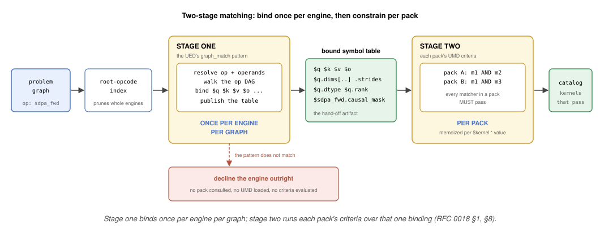
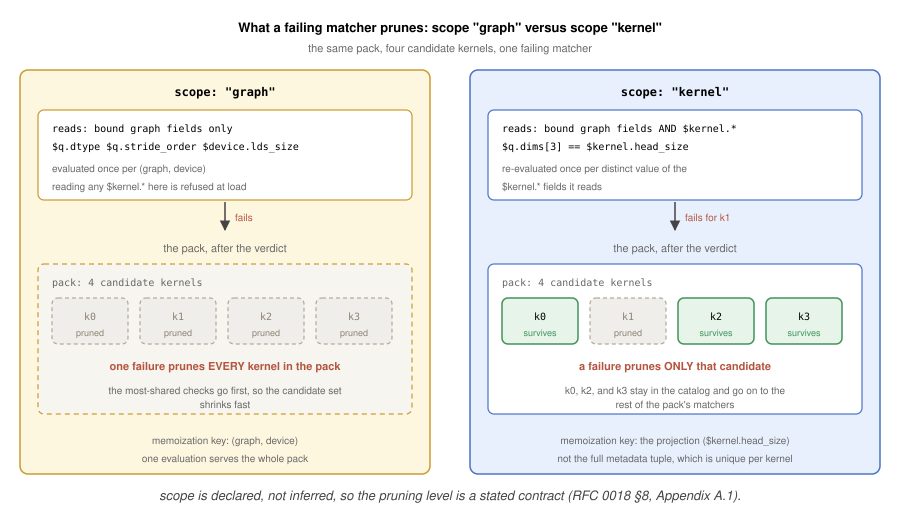
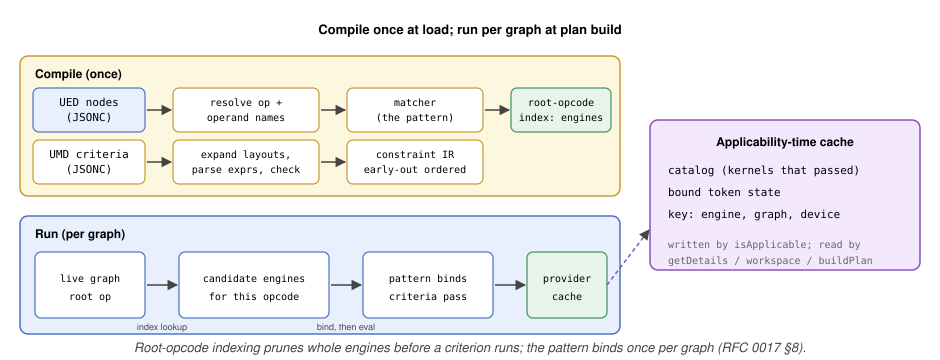

# RFC 0018: The UMD's Criteria: Applicability over the Engine's Binding

- Contributors: Brian Harrison

> Follow-up to [RFC 0017 (Universal Kernel Descriptors)](0017_UniversalKernelDescriptor.md),
> covering the "UMD + applicability" row of its follow-up series
> ([RFC 0017 §14.2](0017_UniversalKernelDescriptor.md#142-follow-up-rfcs)).
> This RFC designs the UMD, one criteria expression that decides whether a kernel applies, and the
> stage of matching that evaluates it. The engine's `nodes` pattern, the symbol table that matching
> publishes, and stage one of the matcher belong to the "UED + graph matching" row. Those are
> specified in [RFC 0020](0020_UniversalEngineDescriptor.md); this RFC reads that table and does not
> define it. The sibling formats (UDD, Universal Dispatch Descriptor; UHD, Universal Heuristic
> Descriptor; KDP, Kernel Descriptor Pack) and the sibling subsystems (packaging, drop-in, adapters)
> have their own follow-ups. They are referenced here, not redesigned.

**Series descriptor formats.** Each is defined in
[RFC 0017 §2](0017_UniversalKernelDescriptor.md#2-the-descriptors).

- **UKD**, the Universal Kernel Descriptor: one compiled kernel, its source and its metadata values.
- **UMD**, the Universal Match Descriptor: the criteria deciding whether a kernel applies.
- **UED**, the Universal Engine Descriptor: the engine, and the graph shape it serves.
- **UDD**, the Universal Dispatch Descriptor: how a kernel is launched.
- **UHD**, the Universal Heuristic Descriptor: the engine's heuristic, which ranks matching kernels.
- **KMD**, the Kernel Metadata Descriptor: the engine-wide metadata schema every UKD fills in.
- **KDP**, the Kernel Descriptor Pack: the file binding those descriptors to one kernel family.

## Table of Contents

1. [Overview](#1-overview)
2. [The Symbol Table Criteria Read](#2-the-symbol-table-criteria-read)
3. [Criteria Vocabulary](#3-criteria-vocabulary)
4. [The Shared Expression Language](#4-the-shared-expression-language)
5. [Layout and Stride-Order Criteria](#5-layout-and-stride-order-criteria)
6. [The Native-Matcher Escape Hatch](#6-the-native-matcher-escape-hatch)
7. [Composite Criteria](#7-composite-criteria)
8. [The Matcher: Compilation, Indexing, and Caching](#8-the-matcher-compilation-indexing-and-caching)
9. [Arbitration](#9-arbitration)
10. [Serialization and Versioning](#10-serialization-and-versioning)
11. [Security and Hostile Input](#11-security-and-hostile-input)
12. [Observability and Diagnostics](#12-observability-and-diagnostics)
13. [Testing and Performance](#13-testing-and-performance)
14. [Migration](#14-migration)
15. [Worked Example: SDPA Forward](#15-worked-example-sdpa-forward)
16. [Risks](#16-risks)
17. [Open Questions](#17-open-questions)
18. [References and Prior Art](#18-references-and-prior-art)
19. [Glossary](#19-glossary)
20. [Appendix A: Schema Reference](#appendix-a-schema-reference)

---

## 1. Overview

Deciding whether a kernel applies to an incoming problem graph is two questions, and the series
gives each its own descriptor. The first question is: does this engine serve graphs of this shape,
and what are the pieces called? That is the **UED (Universal Engine Descriptor)**, specified in
[RFC 0020](0020_UniversalEngineDescriptor.md). Its `graph_match` binds every tensor and attribute
the graph supplies. A `graph_match` is either a structural pattern over the op DAG (directed acyclic
graph), or the native escape hatch standing in for one. The second question is: given those pieces,
can this kernel take the problem? That is the **UMD (Universal Match Descriptor)**, one JsonLogic
boolean over the symbols the pattern bound, and it is what this RFC specifies. Together the two
replace a hand-coded `IPlanBuilder::isApplicable`
([RFC 0017 §2](0017_UniversalKernelDescriptor.md#2-the-descriptors)).

Matching is therefore two stages over one graph. The engine's pattern runs first. It resolves op and
tensor names against the op-schema registry, walks the graph, and publishes the bound symbol table:
every operand and result tensor with its dims and strides, plus every matched node's scalar
attributes. The pattern runs once per engine per graph. A graph its pattern does not match declines
the engine outright, before any pack is consulted ([RFC 0020 §
7](0020_UniversalEngineDescriptor.md#7-pattern-matching-stage-one)). The criteria run second. Each
UMD a pack lists evaluates its single boolean over that table, and a kernel applies only when every
matcher in its pack passes ([RFC 0017
§5](0017_UniversalKernelDescriptor.md#5-matching-the-ueds-pattern-and-the-umds-criteria)). A family
of near-identical kernels therefore shares a handful of criteria sets, rather than carrying a
bespoke C++ check each.

The split follows the shape of the calls hipDNN actually makes. `isApplicable` arrives per engine
([RFC 0017 §8](0017_UniversalKernelDescriptor.md#8-end-to-end-flow)). Had every matcher carried its
own pattern, an engine would re-walk one graph once per matcher of every pack naming it. It would
match the same nodes structurally again and again, before any of those matchers could disagree. One
pattern per engine collapses that to a single structural pass. The root-opcode index then keys
engines rather than matchers, so an engine whose pattern is not rooted at the graph's opcode is
pruned before a single criterion is read.

One pattern per engine also gives the bound-symbol set one owner. A UED names one heuristic and one
metadata schema ([RFC 0017 §2](0017_UniversalKernelDescriptor.md#2-the-descriptors)), and that
heuristic's `features_signature` reads graph tokens such as `$q.dims[2]` and
`$sdpa_fwd.dropout_probability`. Something the engine owns has to bind those symbols. Otherwise an
engine-wide model is written against names only some pack happens to supply. The UED publishes the
bound-symbol set, and every consumer is checked against that one source: a UMD's criteria, its
pack's UDD formulas, and the engine's own UHD `features_signature`. A reference none of them can
resolve is rejected at load, rather than failing closed later on a live graph.

This document turns the criteria half of that frame into a concrete format and a concrete evaluation
stage. It specifies the criteria schema, the layout representation as a stride-rank array, the
native-matcher escape hatch, and deterministic arbitration. It also specifies how criteria are
compiled, memoized, and cached over the binding the engine publishes. The static (compile-time)
matcher is sketched as options in this iteration, not fully designed.

The expression language itself is not specified here either. Criteria are written in the descriptor
expression language, a deferred follow-up that will own its grammar, type system, operator set,
three-valued semantics, and bounded interpreter. This document supplies the *criteria* written in
that language, plus the reader's contract on the environment they evaluate over
([§2](#2-the-symbol-table-criteria-read)).



### 1.1 What This RFC Specifies Versus Defers

| Capability | This RFC (day-one) | Deferred |
|---|---|---|
| The reader's contract on the engine's binding: which namespace roots criteria may name and what each yields | Yes ([§2](#2-the-symbol-table-criteria-read)) | The `nodes` format: [RFC 0020 § 4.3](0020_UniversalEngineDescriptor.md#43-the-nodes-pattern-normative); the published field set: [RFC 0020 § 6.1](0020_UniversalEngineDescriptor.md#61-the-published-field-set-normative) |
| Criteria (UMD) as one JsonLogic expression: dtype (exact/set/relation), rank, dim relations, divisibility, stride order, packed, attribute, `virtual`, cross-tensor relation, optional operand, device property, `$kernel.*` pins | Yes ([§3](#3-criteria-vocabulary)) | None |
| The expression language criteria are written in: grammar, operators, type system, semantics, interpreter | None: the descriptor expression language follow-up owns it, with [RFC 0017 §5](0017_UniversalKernelDescriptor.md#5-matching-the-ueds-pattern-and-the-umds-criteria) the interim authority and [§4](#4-the-shared-expression-language) the recap | Operator additions, to that follow-up |
| Layout as a stride-rank array, with named aliases | Yes ([§5](#5-layout-and-stride-order-criteria)) | None |
| Escape hatch for checks needing C++, beside the descriptor rather than inside the expression language | Yes ([§6](#6-the-native-matcher-escape-hatch)) | None |
| Composite criteria: `(A AND B) OR C` as one criteria expression, via JsonLogic `and`/`or`/`!`/`if` | Yes ([§7](#7-composite-criteria)) | None |
| Stage two of matching: criteria evaluated per pack, memoized per `$kernel.*` projection, cached at applicability | Yes ([§8](#8-the-matcher-compilation-indexing-and-caching)) | None |
| Stage one: pattern compilation, the root-opcode index over engines, and the bind step | None: [RFC 0020 § 7](0020_UniversalEngineDescriptor.md#7-pattern-matching-stage-one) | None |
| Static (compile-time, ahead-of-time (AOT) lowered) matcher | None | Full design, including the interpreted-versus-lowered parity contract |
| General N-ary commutative matching, unbounded variable-length chains | None | JIT (just-in-time) follow-up ([RFC 0017 §9.3](0017_UniversalKernelDescriptor.md#93-future-jit-and-normalized-providers)) |

---

## 2. The Symbol Table Criteria Read

A UMD's criteria are evaluated over a symbol table it does not produce. That table belongs to the
engine. The UED carries a `graph_match` whose declarative arm is a `nodes` block, a structural
pattern over the op DAG. Matching that pattern binds every tensor, dim, stride, and scalar
attribute the pattern names. The engine is the only producer, so a criterion reads the table and
never adds to it.

The pattern's format is [RFC 0020 §
4.3](0020_UniversalEngineDescriptor.md#43-the-nodes-pattern-normative), and the field set matching
it publishes is [RFC 0020 §
6](0020_UniversalEngineDescriptor.md#6-symbol-binding-what-the-pattern-publishes). What this
section fixes is the reader's side of that contract: the roots a criteria expression may name,
what each yields, and what the criteria may assume about when they are bound.

Criteria may name five namespace roots. The engine's pattern binds three of them.

| Root | Yields | Bound by |
|---|---|---|
| a pattern variable (`$q`) | the matched tensor and its fields: dims and strides positionally, plus derived facts such as rank, dtype, stride order, and packedness | the engine's pattern |
| `$graph` | structural and graph-level facts of the matched graph, such as its node count and its override-shape opt-in | the engine's pattern |
| a node `id` (`$sdpa_fwd`) | that matched node's scalar attributes, named as the schema declares them | the engine's pattern |
| `$kernel` | the values a candidate UKD supplies for the fields the engine's KMD declares | the UKD, per candidate |
| `$device` | device properties read from the `Handle`, such as `$device.lds_size` | the runtime |

The exact fields under each root, their types, and the reserved-root rule are [RFC 0020 §
6.1](0020_UniversalEngineDescriptor.md#61-the-published-field-set-normative).
[Appendix A.2](#a2-variable-references-and-resolution) fixes the rules a reader
needs on top of it: reference syntax, and what a read yields when the thing read is absent.

Any JSON string beginning with `$` is a reference into that table. Every other JSON scalar is a
literal: numbers, enum values (`"BFLOAT16"`), and layout aliases. The node id in an attribute
reference is bare, and the reference carries the `$` (`$sdpa_fwd.dropout_probability`).

Three properties of the binding shape everything below.

- **The pattern is engine-wide and singular**, one per UED. Criteria on one engine therefore all
  read the same table ([§8](#8-the-matcher-compilation-indexing-and-caching)), and a matcher can
  only constrain what the pattern already bound.
- **`$kernel.*` is not pattern-bound.** Those values come from the candidate UKD, so a matcher
  reading them is re-evaluated per kernel rather than once per graph
  ([§8](#8-the-matcher-compilation-indexing-and-caching)). The matcher also publishes the set of
  `$kernel.*` fields it reads, so the loader can check them against the engine's KMD
  ([Appendix A.5](#a5-compile-time-validation-normative)).
- **A reference that the engine's pattern does not publish is a load error, not a runtime
  decline.** A UMD is validated against the engine of each pack that lists it, so an unresolvable
  reference is caught at pair-validation. The diagnostic names both descriptors and the pack that
  paired them ([Appendix A.5](#a5-compile-time-validation-normative)).

Quantities like head size, batch, and head count are not attributes. They are specific tensor dims;
for scaled dot-product attention (SDPA) they are `q.dims[3]`, `q.dims[0]`, and `q.dims[1]`. A
criterion reaches them positionally as `$q.dims[i]`, never as an attribute read ([RFC 0020 §
5](0020_UniversalEngineDescriptor.md#5-the-graph-model-the-pattern-matches)). Layout is likewise
not stored on a tensor. It is derived from the stride order and compared as a stride-rank array
([§5](#5-layout-and-stride-order-criteria)).

---

## 3. Criteria Vocabulary

The `criteria` field is a **single JsonLogic boolean expression** evaluated over the symbol table the
engine's pattern published ([§2](#2-the-symbol-table-criteria-read), [§4](#4-the-shared-expression-language)). It is
normally an `and` of the individual tests, and reaches for `or` / `!` / `if` wherever a real
disjunction is needed ([§7](#7-composite-criteria)). The table below is not a set of criterion
*kinds* (there are none); it is the set of hand-written checks and the
JsonLogic sub-expression that expresses each. A handful of checks need real C++, and those are not
operators at all. Each is a **native matcher** the pack lists beside the descriptor
([§6](#6-the-native-matcher-escape-hatch)), which keeps the expression language itself closed.

| Hand-written check | JsonLogic criterion | Lowers from |
|---|---|---|
| **Opcode** | in the engine's pattern, not a criterion ([RFC 0020 § 4.3](0020_UniversalEngineDescriptor.md#43-the-nodes-pattern-normative)) | node attribute-type gate |
| **Dtype (exact / set)** | `{"==": ["$q.dtype", "BFLOAT16"]}` / `{"in": ["$q.dtype", ["BFLOAT16", "FP8_E4M3"]]}`; pin against a kernel with `{"==": ["$q.dtype", "$kernel.dtype"]}` when the pack ships one binary per dtype (below) | `validateDataTypeIsSupported`, `validateFixedDataType` |
| **Dtype (relation)** | `{"==": ["$k.dtype", "$q.dtype"]}` | `validateConsistentDataTypes`, `q == k == v` |
| **Rank** | `{"==": ["$q.rank", 4]}` | `validateDimensionCount`, rank == 4 |
| **Dim (value / relation)** | `{"==": ["$q.dims[3]", 128]}`; relate with `{"==": ["$k.dims[3]", "$q.dims[3]"]}`; pin against a kernel with `{"==": ["$q.dims[3]", "$kernel.head_size"]}` where the value is one the kernel bakes (below) | dim reads and cross-tensor dim relations |
| **Divisibility** | `{"divisible": [{"*": ["$y.dims[0]", "$y.dims[2]", "$y.dims[3]"]}, "$kernel.MPerBlock"]}` | tile-fit / GEMM-dim gates |
| **Layout** | `{"==": ["$q.stride_order", [3, 2, 1, 0]]}` ([§5](#5-layout-and-stride-order-criteria)) | `validateSupportedLayout` |
| **Packing** | `"$q.packed"` (a bound boolean) | `validatePackedTensors` |
| **Cross-tensor layout** | `{"==": ["$x.stride_order", "$y.stride_order"]}` (per pair), or the per-axis form where the two tensors may differ in which axes are unit-extent ([§5](#5-layout-and-stride-order-criteria)) | `validateConsistentLayouts` |
| **Attribute (value)** | `{"==": ["$sdpa_fwd.causal_mask", false]}`; absent-or `{"or": [{"not_present": ["$sdpa_fwd.dropout_probability"]}, {"==": ["$sdpa_fwd.dropout_probability", 0.0]}]}` | per-attr value gates |
| **Attribute (one_of)** | `{"in": ["$sdpa_fwd.diagonal_alignment", ["TOP_LEFT", "BOTTOM_RIGHT"]]}` | enum-attribute set gates |
| **Optional operand present/absent** | the operand is declared optional in the engine's pattern ([RFC 0020 § 4.3](0020_UniversalEngineDescriptor.md#43-the-nodes-pattern-normative)); `{"not_present": ["$attn_mask"]}` (absent) / `{"present": ["$bias"]}` (present); one call takes a list, so a pack declines every optional operand it cannot serve at once | `attn_mask_tensor_uid()` absent gate |
| **Graph structure (exact / fusion)** | `{"==": ["$graph.node_count", 3]}`, and each intermediate `"$conv_out.virtual"` | node-count gate, fusion legality |
| **Cross-tensor / arithmetic** | `{"==": ["$q.dims[1]", "$k.dims[2]"]}`, `{"<": ["$q.dims[3]", 129]}`, `{"==": [{"%": ["$q.dims[1]", "$k.dims[1]"]}, 0]}` | arithmetic and comparison gates |
| **Device property** | `{"<=": ["$kernel.lds_per_block", "$device.lds_size"]}` (arch is a pack property, not a criterion) | local data share (LDS) / occupancy budgets; `getDeviceString` arch → pack `arch` |
| **Needs real C++** | not a criterion; a native matcher listed beside the descriptor ([§6](#6-the-native-matcher-escape-hatch)) | |

Architecture gates *applicability* at pack selection, through the KDP `arch` property and the
per-arch `kpack` manifest ([RFC 0017 §5](0017_UniversalKernelDescriptor.md#5-matching-the-ueds-pattern-and-the-umds-criteria),
[§11](0017_UniversalKernelDescriptor.md#12-packaging-and-delivery)). For the ahead-of-time (AOT)
path it is not a match-time criterion. Other device properties, such as `$device.lds_size` and
`$device.warp_size`, are read directly in criteria.

Exactness has to run to the kernel, not just to the graph. `$graph.node_count` and the engine's
pattern pin the shape of the *graph*. They say nothing about whether a given candidate kernel can
serve it. A prebuilt kernel bakes quantities into its binary: a dtype, a head size, sometimes a
sequence length. A graph that clears a pack's graph-level gates may still disagree with what one
kernel baked. Every quantity a kernel bakes **MUST** therefore be a KMD field, and the pack's
matcher **MUST** pin it against the graph with a `$kernel.*` criterion. Those are the clauses
re-evaluated per candidate ([§8](#8-the-matcher-compilation-indexing-and-caching)), which is what
turns one matcher plus a kernel vector into a per-kernel applicability test. A KDP may list no
matchers at all and rest on the engine's pattern alone, but a prebuilt pack in practice always
lists one.

Getting this wrong fails silently rather than loudly. A matcher gating dtype only as
`{"in": ["$q.dtype", ["FLOAT16", "BFLOAT16"]]}` accepts an fp16 graph and may hand it to a bf16
binary, which returns wrong numbers instead of an error. A field missing from the KMD also cannot
be pinned, so two kernels differing only in an unmodelled baked constant collide on the catalog
key. One case is mechanical, so the loader performs it: a UKD whose source declares a baked
constant with no corresponding KMD field is a load error. That check is a KDP/KMD-loader
responsibility and is specified by
[RFC 0017 §5](0017_UniversalKernelDescriptor.md#5-matching-the-ueds-pattern-and-the-umds-criteria).
The UMD's part is to publish the `$kernel.*` fields it reads
([§2](#2-the-symbol-table-criteria-read)), so the loader can perform that check.

That check narrows the gap but does not close it. It catches a baked constant with no field to pin
it against, and a catalog-key collision is loud when it happens. Neither covers the case where the
field exists, the matcher pins it, and the pack still ships concrete instances whose criteria leave
a graph unserved or two kernels overlapping. That case depends on which instances the kernel pack
actually contains, and no per-descriptor check sees them. Authoring a matcher against the set a
pack ships remains the author's responsibility.

---

## 4. The Shared Expression Language

A UMD's `criteria` field is a single `Bool`-rooted expression in the **descriptor expression
language**. That language is a deferred follow-up, reserved as RFC 0019, which is why the series
numbering steps from this document to
[RFC 0020](0020_UniversalEngineDescriptor.md) with a gap. It is not restated here. Until it is
written,
[RFC 0017 §5](0017_UniversalKernelDescriptor.md#5-matching-the-ueds-pattern-and-the-umds-criteria)
is the interim authority for its operator vocabulary. The semantics this document leans on are
stated locally in [Appendix A.2](#a2-variable-references-and-resolution) and
[Appendix A.3](#a3-the-expression-language). What
this document supplies is the binding environment those expressions evaluate over
([§2](#2-the-symbol-table-criteria-read)).

Any JSON string beginning with `$` is a reference into the bound symbol table of
[§2](#2-the-symbol-table-criteria-read). Every other JSON scalar is a literal.

Criteria are boolean-rooted; the UDD's dispatch formulas are value-rooted. Both are the same
language over the same symbol table: a criterion decides applicability, and a formula yields a grid,
block, or workspace number
([RFC 0017 §6](0017_UniversalKernelDescriptor.md#6-dispatch-and-workspace)). The engine's UHD writes
its `features_signature` entries over that same table
([RFC 0017 §4](0017_UniversalKernelDescriptor.md#4-descriptor-formats)), so one parser, validator,
and interpreter serve all three subsystems.

The operator set is closed: a descriptor cannot introduce an operation. A check that needs real C++
is a native matcher listed beside the descriptor, never a nested extension point
([§6](#6-the-native-matcher-escape-hatch)).

```jsonc
// criteria (boolean): sub-expressions of the single top-level criteria expression
{"==": ["$q.rank", 4]}                                      // rank pin
{"==": ["$q.dims[3]", 128]}                                 // head dimension (last axis)
{"==": ["$k.dims[3]", "$q.dims[3]"]}                        // cross-tensor dim relation
{"in": ["$q.dtype", ["BFLOAT16", "FP8_E4M3"]]}              // dtype set
{"==": ["$q.stride_order", [3, 2, 1, 0]]}, "$q.packed"      // layout + packed
{"or": [{"not_present": ["$attn_mask"]},
        {"==": ["$attn_mask.dtype", "$q.dtype"]}]}          // composition (§8)
```

---

## 5. Layout and Stride-Order Criteria

hipDNN tensors store no layout enum; layout is implied by stride order
([RFC 0020 § 5](0020_UniversalEngineDescriptor.md#5-the-graph-model-the-pattern-matches)). The UMD
represents layout the way
[RFC 0017 §5](0017_UniversalKernelDescriptor.md#5-matching-the-ueds-pattern-and-the-umds-criteria)
writes it, which is the encoding hipDNN already computes: an array indexed by **logical dimension**.
Entry `d` is the **stride rank** of logical dimension `d`. A lower rank means faster-varying, and
rank `0` marks the unit-stride dimension. The array therefore reads as the packing order it
describes: over an `(n, c, h, w)` logical dim order, `[3, 0, 2, 1]` puts C fastest, then W, then H,
then N, which is NHWC.

```jsonc
{"==": ["$q.stride_order", [3, 2, 1, 0]]}   // descending-stride packed (BHSD, rank-4)
{"==": ["$x.stride_order", [3, 0, 2, 1]]}   // NHWC over an NCHW logical dim order
```

- The array is a permutation of `0..rank-1`, counting up from the fastest-varying dimension. So
  `[3,2,1,0]` is descending-stride packed, and `[3,0,2,1]` gives the channel dim rank `0`, hence
  fastest-varying (NHWC). It is indexed the same way as `dims`, `strides`, and the `axis` of
  `args_signature`: all four select a logical dimension. A tensor's layout is therefore read off the
  same axis numbering the rest of a descriptor uses.
- This is the encoding `extractStrideOrder` returns
  (`projects/hipdnn/data_sdk/include/hipdnn_data_sdk/utilities/ShapeUtilities.hpp:146`, called from
  `ApplicabilityChecks.cpp:22`), so the binding layer publishes `$q.stride_order` as the data SDK
  already computes it. One spelling serves descriptors and the shipped code alike.
- **Named aliases** cover the common cases and expand to the array literal at compile time, so
  `{"==": ["$x.stride_order", "nhwc"]}` compiles to a comparison against `[3, 0, 2, 1]`
  (A.5). The array remains the single canonical form. The four convolution aliases are exactly the
  layouts `validateSupportedLayout` accepts today: NCHW/NHWC at rank 4, NCDHW/NDHWC at rank 5
  (`ApplicabilityChecks.cpp:76`). The `bhsd` / `bshd` and the matmul `mk` / `km` / `bmk` / `bkm`
  aliases are additions for the attention and GEMM families, which that oracle never covered. An
  alias is a whole-array comparison, so it inherits the tie caveat below; a family that must
  separate BSHD from BHSD at a unit head count does not use one. A packing that is a different
  array at each rank has no alias and is written as an array (A.4).
- **The encoding is lossy under stride ties.** `extractStrideOrder` sorts axes by descending
  stride and breaks equal strides by original position, so a tensor with a **unit extent** encodes
  identically under two layouts that disagree on that axis's stride. Over `dims [4,1,256,64]`,
  BSHD strides `[16384,64,64,1]` and BHSD strides `[16384,16384,64,1]` both yield `[3,2,1,0]`,
  where at `dims[1] > 1` they are the distinguishable `[3,1,2,0]` and `[3,2,1,0]`. A criterion
  that must separate two layouts differing only on an axis a graph may make unit-extent
  **MUST NOT** use `stride_order`. It reads the axes directly instead, exempting unit extents:

  ```jsonc
  // head axis is BSHD (stride == head size), or is a don't-care because the extent is 1
  {"or": [{"==": ["$q.dims[1]", 1]},
          {"==": ["$q.strides[1]", "$q.dims[3]"]}]}
  ```

  `$q.strides[i]` is published for exactly this
  ([RFC 0020 § 6.1](0020_UniversalEngineDescriptor.md#61-the-published-field-set-normative)). The
  exemption is sound rather than lenient: a stride on a unit-extent axis multiplies an index that
  is always zero, so no address depends on it and a producer may declare anything there. This is
  the rule `hasBshdStrides` states in the one attention engine in the tree, and it is not a corner
  case: 336 of the 2,710 kernels in the shipped gfx942 `attention_dense` catalog (12.4%) are
  `num_kv_heads == 1`.
- **Cross-tensor consistency** is a JsonLogic equality between stride orders,
  `{"==": ["$x.stride_order", "$y.stride_order"]}`, one per pair and joined by the top-level `and`.
  It lowers `validateConsistentLayouts`. Layout-agnostic tensors (rank-1 scalars, pass-by-value) are
  skipped as they are today. **This form is a false decline whenever the two tensors differ in
  which axes are unit-extent**, because each side is encoded independently and the tie rule then
  resolves them differently. A shipped multi-query descriptor (`batch=1, Hq=8, Hkv=1,
  Sq=Skv=1024, D=128`), correct BSHD on every operand, encodes `$q.stride_order` as `[3,1,2,0]`
  and `$k.stride_order` as `[3,2,1,0]`: the pair-equality declines a graph the kernel serves. Two
  tensors that may disagree on a unit extent are related per axis, in the `or` form above, not by
  array equality.
- **Packing** is the separate bound boolean `$q.packed` (written `"$q.packed"`), since a supported
  stride order does not imply the tensor is gap-free; it lowers `validatePackedTensors`.
- `$q.stride_order` is an ordinary bound value ([§2](#2-the-symbol-table-criteria-read)),
  so a `stride_order == [3,2,1,0]` gate is expressible directly.

---

## 6. The Native-Matcher Escape Hatch

Some checks cannot be stated with the built-in operators: they need real C++. The expression
language has no extension point for them. There is no custom operation, no namespaced operator key,
and no predicate registry the criteria tree resolves against. An operation key the vocabulary does
not list ([Appendix A.3](#a3-the-expression-language)) is unrecognized and refused at compile time
([Appendix A.5](#a5-compile-time-validation-normative)).

Instead, such a check is a **native criterion**: an ordinary `GraphCriterionFn` registered in the
provider's `NativeRegistry` and named by a UMD's `match_symbol`
([RFC 0017 §5](0017_UniversalKernelDescriptor.md#5-matching-the-ueds-pattern-and-the-umds-criteria)).
It stays a pack-level listing beside the descriptor-backed matcher. What it expresses is a gate on
the kernel family, not a statement about the graph shape the engine serves. The ingestor conjoins
their verdicts: a pack's graph-scoped matchers all run and all must pass. So "this UMD's criteria
and this C++ predicate" is expressed by listing two matcher ids, not by nesting one inside the
other. The schema enforces that reading: a UMD carries a criteria expression or a native symbol,
never both ([Appendix A.1](#a1-the-umd-descriptor-object)). A conjunction is therefore always
visible in the pack's matcher list rather than buried inside one descriptor, and a UMD file stays
either pure data or a name, never a mixture of the two. A nested hatch would force the expression
language to grow a registry, a signature table, and a per-argument type contract: a second extension
mechanism differing only in grain from the closed operator set
([Appendix A.3](#a3-the-expression-language)).

This is the pack-scoped half of a two-part hatch. The engine-scoped half is the UED's
`graph_match.native` ([RFC 0020 § 4.5](0020_UniversalEngineDescriptor.md#45-the-native-arm-normative)),
which *produces* the binding at stage one by declining the graph or returning the bound tokens. A
native criterion *reads* that binding and returns a verdict; it cannot add to it. The two use
distinct registries and distinct signatures. Do not conflate them: one decides what an engine
serves, the other narrows which of its packs apply.

```jsonc
// pack.matcherIds: [ <the UMD above>, <"hipdnn.sdpa.mask_self_consistent">, ... ]
```

The split also changed what a native check receives. A nested custom operation would have received
*bound variables* (`["$q", "$k", "$v", "$o"]`). A `GraphCriterionFn` now receives
`(const MatchContext&, const BoundTokens&)`: the raw graph and device id, plus the binding the
engine's `graph_match` published before any pack's checks ran
([§2](#2-the-symbol-table-criteria-read)). A criterion therefore reads a resolved graph attribute
instead of rewalking the graph. The structural search the engine already performed is not repeated
in hand-written code that could drift from the registry-driven binding.

What remains is a *representational* limit, not a plumbing one. `BoundTokens` is
`string -> MetadataValue`, a scalar variant: it carries a dim, a uid, or a dtype name, but not a
tensor object. A criterion wanting whole-tensor access still reaches through `MatchContext` by uid.
Widening that variant is an additive change to one type. The operand order every native stage shares
([RFC 0020 § 6.1](0020_UniversalEngineDescriptor.md#61-the-published-field-set-normative)) is what
keeps the declarative and native spellings in step when it happens.

The registry a provider ships is part of its published contract, unchanged from
[RFC 0017 §5](0017_UniversalKernelDescriptor.md#5-matching-the-ueds-pattern-and-the-umds-criteria).
A pack naming a `match_symbol` the running provider does not ship fails to resolve, and fails
closed. What changes is that this is the *only* place a name resolves to C++. The drop-in story is
therefore simple: a UMD file is pure data and always loads identically, and a pack that needs C++ is
not a drop-in.

**What the hatch gives up, and how a descriptor buys some of it back.** A criteria expression is
an AST, so the compiler derives which `$kernel.*` fields it reads and uses that set twice: as the
per-candidate memoization projection, and as the list checked against the engine's KMD
([§8](#8-the-matcher-compilation-indexing-and-caching),
[Appendix A.5](#a5-compile-time-validation-normative)). A `match_symbol` UMD has no AST, so neither
is derivable: the shipped gfx942 `attention_dense` matcher declares `scope: "kernel"` and nothing
else, while the C++ behind it reads ten KMD fields. The descriptor therefore declares them, in
`kernel_fields` ([Appendix A.1](#a1-the-umd-descriptor-object)), and that one list restores both
uses. Declaring it is optional; a criterion that does not is evaluated once per candidate and its
metadata reads are unchecked until a live graph reaches them. This is the same trade
[RFC 0020 § 4.5](0020_UniversalEngineDescriptor.md#45-the-native-arm-normative) records for the
engine-scoped hatch, one scope down.

**A native criterion owes totality itself.** The bounded, fail-closed guarantees of
[§11](#11-security-and-hostile-input) — depth and step caps, checked arithmetic, a decline on any
unknown symbol or out-of-range axis — are the interpreter's, and a `GraphCriterionFn` is arbitrary
C++ that runs outside it. It MUST therefore be total over an **unvalidated** graph: a caller can
present a tensor the frontend would have rejected, so a criterion checks rank and extents before it
indexes an axis, uses width-safe arithmetic on any product of dims, and returns a verdict rather
than throwing. The provider that ships the symbol owns that obligation, and the fuzzing corpus of
[§11](#11-security-and-hostile-input) covers the registered symbols as well as the interpreter.

Together with the UDD's custom-plan hatch
([RFC 0017 §6](0017_UniversalKernelDescriptor.md#6-dispatch-and-workspace)), these form the graded
ladder: fully declarative constraints, then a native matcher beside the descriptor for one gate that
needs C++, then a full provider.

---

## 7. Composite Criteria

Composition is native to the expression language, so `(A AND B) OR C` is stated directly in the one
`criteria` tree with no extra mechanism
([§4](#4-the-shared-expression-language)):

```jsonc
"criteria":
  {"or": [
    {"and": [{"==": ["$q.dims[3]", 64]},          // head dimension (last axis)
             {"==": ["$q.dims[1]", "$k.dims[1]"]}]},  // (A AND B): equal head counts, so not GQA
    {"==": ["$q.dims[3]", 128]}                   // OR C
  ]}
```

A UMD whose tests all conjoin simply makes the top-level expression an `and`, the common case.
General N-ary commutative matching and unbounded chains remain deferred to the just-in-time (JIT)
follow-up, as in RFC 0017 §5.

---

## 8. The Matcher: Compilation, Indexing, and Caching

Both halves are authored as text and compiled once into in-memory structures. The pattern's
compilation, and the root-opcode index that prunes engines before any pattern runs, belong to the
UED ([RFC 0020 § 7](0020_UniversalEngineDescriptor.md#7-pattern-matching-stage-one)). Compiling a
UMD's criteria expands layout aliases and parses the expression into an abstract syntax tree (AST).
Compilation is on demand: nothing is parsed until a graph needs it, and the parsed result is cached
and reused ([RFC 0017 §3](0017_UniversalKernelDescriptor.md#3-how-it-works)). Neither compiled form
is complete on its own. A UMD is validated against the engine of each pack that lists it. That check
confirms every `$`-reference resolves in the engine's published symbols, and every `$kernel.*`
exists in its KMD ([Appendix A.5](#a5-compile-time-validation-normative)). A failure names both
descriptors and the pack that paired them. The pair-validation is cached on `(matcher, engine)`, so
a matcher shared by several packs on one engine is checked once. The compiled forms, not the text,
are what run against live graphs.

By the time any criterion is evaluated, stage one has already run. The engine's pattern has matched
the graph and published the bound symbol table ([RFC 0020 §
7](0020_UniversalEngineDescriptor.md#7-pattern-matching-stage-one)). A graph the pattern does not
match declines the engine outright: no pack is consulted, no UMD is loaded, and no criteria are
evaluated. That cost is paid once per engine per graph, however many packs name the engine. It is
the structural saving the split buys, and it is why this section specifies only what stage two adds.

Stage two constrains, per pack and per kernel. A KDP lists a set of matcher IDs, and a kernel
applies only when all of them pass
([RFC 0017 §5](0017_UniversalKernelDescriptor.md#5-matching-the-ueds-pattern-and-the-umds-criteria)).
Matchers are therefore the unit of sharing and of evaluation within an engine. A matcher reading
only bound graph fields (Tensor / Graph / Attributes / Device,
[§2](#2-the-symbol-table-criteria-read)) declares `scope: "graph"` and runs once per graph. On
failure it prunes every pack that lists it, so the most-shared checks (dtype, layout, rank)
evaluated first shrink the candidate set fast. A matcher that also reads `$kernel.*` declares
`scope: "kernel"`. It is the same matcher re-evaluated once per distinct value of the `$kernel.*`
fields it reads, memoized on those, pruning per kernel rather than per pack. The projection is what
makes this pay, and how much it pays is a property of that projection rather than of the mechanism.
A kernel's full metadata tuple is unique by construction, so memoizing on the whole tuple would
save nothing. A matcher reading one low-cardinality field collapses an engine's catalog to that
field's handful of distinct values. The saving is `1 - |projection| / |catalog|`, and it degrades
smoothly as the read set widens.

**A shape-specialized pack is the degenerate case, and [§3](#3-criteria-vocabulary)'s MUST is what
makes it one.** Every quantity such a kernel bakes has to be pinned, so its matcher reads every
baked quantity, so the projection approaches the full tuple that memoizes to nothing. Measured on
the shipped gfx942 `attention_dense` catalog: 2,710 kernels, all metadata tuples distinct as
stated, and the projection over the ten fields its matcher reads has 1,931 distinct values. 71.3%
of candidates are still evaluated; memoization saves 28.7%, not an order of magnitude. Nothing is
wrong there — the pack is correct precisely because it pins everything — but an author should not
expect the collapse. What does pay at that end is the other thing the projection buys: it is a key,
so the catalog is indexed on it and the matcher looks candidates up rather than scanning them.
That index is the real saving for a shape-specialized pack, and it is available for exactly the
same declared read set.

The compiler already computes which `$kernel.*` fields a `criteria` matcher reads
([§2](#2-the-symbol-table-criteria-read)), so for the declarative arm the memoization key costs
nothing extra. That same read set is what
[Appendix A.5](#a5-compile-time-validation-normative) checks the declared `scope` against, in both
directions. The two can never disagree at match time, because a descriptor where they disagree does
not compile.

**A native criterion has no AST, so it has no derived read set.** A `match_symbol` UMD names C++
that reads `KernelDefinition` directly, and nothing about that is visible to the compiler: the
shipped gfx942 `attention_dense` matcher declares `scope: "kernel"` and no more, while the function
behind it reads ten KMD fields plus a bound token. The descriptor closes that gap by declaring
`kernel_fields` (A.1), which then serves as the memoization projection and as the KMD cross-check,
exactly as the derived set does for the declarative arm. **A native criterion that omits
`kernel_fields` is unmemoized**: it is evaluated once per candidate. That is stated rather than
inferred, because the alternatives are both wrong — memoizing on the declared `scope` alone would
be unsound, since the function may read anything, and memoizing on the full tuple would be a no-op
dressed as a cache. Declaring the set is the price of the optimization, and paying it is optional.

Results are cached across queries.



The matcher evaluates in written order and short-circuits, so a non-match is rejected as early as
the author's structure allows. This document states that rule locally, pending the expression
language follow-up. The compiler may additionally hoist a cheap, highly selective sub-expression
ahead of an expensive one (for example, a scalar attribute or dtype read ahead of a wide
cross-tensor relation). Hoisting changes when a decision is reached, never what it is.

Both stages run inside `IEngine::isApplicable`. The order and the cache are specified by
[RFC 0017 §8](0017_UniversalKernelDescriptor.md#8-end-to-end-flow), which this RFC follows rather
than restates. Matching produces two things. The **catalog** is the set of kernels whose full
matcher set passed. The **bound token state** is every `$`-prefixed value the pattern and the
criteria resolved. Both are cached together on the provider's shared container, keyed on the engine,
graph, and device that describe the problem, plus the descriptor-inventory generation. The key
already carries the engine, which is what makes a per-engine binding the natural thing to cache
under it. Later phases read that cache instead of re-matching. The `isApplicable` /
`getMaxWorkspaceSize` / `buildPlan` sequence that re-runs the loop today (`AsmSdpaEngine.cpp:67,87`)
therefore matches a graph once. The compiled pattern and criteria are built once and shared across
every graph; only the binding result is per-problem.

A non-empty catalog commits the engine to producing a launchable kernel, because the catalog is
settled during applicability. A later failure surfaces as a failed plan build, not a fallback to
another engine. This is RFC 0017 §8.6's base-path invariant, and it is what makes match semantics
load-bearing. A pattern or criteria set that accepts a graph its kernel cannot serve turns a decline
into a user-visible error rather than a retry. That is the reason every quantity a kernel bakes must
be pinned by a `$kernel.*` criterion ([§3](#3-criteria-vocabulary)).

Device properties are constant per stream, so a `$device.<field>` sub-expression (for example
`$device.lds_size`) is evaluated once per graph. Architecture is not a match-time criterion at all
for the ahead-of-time (AOT) path: it is a pack property gated at selection
([RFC 0017 §5](0017_UniversalKernelDescriptor.md#5-matching-the-ueds-pattern-and-the-umds-criteria)).



---

## 9. Arbitration

Today the first applicable plan builder wins, which is a documented latent bug when more than one
matches (`HipMlopsEngine.cpp:34`). Descriptor-driven matching makes overlap explicit and resolves it
deterministically, reusing the rule from RFC 0017 §5:

1. When several UKDs match a graph, the engine's **heuristic** (the UHD) ranks them and the
   top-scored kernel wins.
2. Ties break by explicit **`priority`** on the UKD.
3. Remaining ties break by the descriptor's stable **`id`**, compared as raw bytes, and the conflict
   is logged to the warning log so an unintended overlap is visible. That byte order carries no
   meaning; it is chosen for being stable across runs, load orders, and machines, not because a lower
   id is better.

**Tier 3 is written as a last resort, and a constant-score engine promotes it to the primary
selector.** Each tier only discriminates if its input varies. A UHD scoring on one axis that the
catalog holds constant returns one number for every candidate, and a catalog whose UKDs all leave
`priority` at its default ties again, so selection falls to the byte order tier 3 concedes is
meaningless. That is the shipped gfx942 `attention_dense` state rather than a hypothetical: over
655 distinct graph geometries, 652 (99.5%) leave more than one candidate after matching, 4.14 on
average and up to 6; the scorer reads `block_n`, which takes the single value 64 across all 2,710
kernels; and every `priority` is 0. The surviving candidates differ in `block_m` (64, 128 or 256),
`persistent`, and `use_exp2_fast` — materially different binaries with materially different
performance. Determinism holds, and it is worth keeping. Meaningfulness does not: the engine is
choosing by UUID.

This is a performance-correctness hazard, not a rare cosmetic one, and [§16](#16-risks) records it
as such. Two things move a decision back up the ladder, and a pack shipping a catalog with
more than one candidate per geometry SHOULD use one. **`priority` encodes a measured preference**
directly, which is what the worked example's persistent pack does when it sets `priority: 10` on
the cohort it measured 70% faster. **The autotune path measures rather than guesses**: the engine's
self-measure lever benchmarks the catalog for a graph and caches the winner
([RFC 0013](0013_Autotune.md)), so the tie is resolved by the device instead of by the id space,
and the cached winner survives the run. A UHD whose feature set is too coarse to separate its own
catalog is a signal to widen the model's features, not to accept the tie.

Arbitration is a property of the generic engine over the set of matching UKDs; a UMD shared by several
UKDs contributes each of them as a candidate. This closes the mutual-exclusion-by-construction
requirement that the current engines depend on: overlap is allowed and resolved, not a correctness
hazard. Overlap *between* engines — two engines whose patterns both accept one graph — is not
arbitrated here at all. That is ordinary engine selection, which hipDNN owns and the caller controls
([RFC 0017 §2](0017_UniversalKernelDescriptor.md#2-the-descriptors)).

---

## 10. Serialization and Versioning

- **Authoring form.** Human-readable, diffable JSONC (the examples here): the JsonLogic criteria
  expression of [§4](#4-the-shared-expression-language) with the `$`-variable convention.
- **Compiled form.** The compact binary the matcher runs
  ([§8](#8-the-matcher-compilation-indexing-and-caching)). Its concrete bytes are defined with the
  KDP/packaging follow-up ([RFC 0017 §14.2](0017_UniversalKernelDescriptor.md#142-follow-up-rfcs));
  the schema those bytes encode is specified in [Appendix A](#appendix-a-schema-reference).
- **Type and identity.** Every UMD carries a stable `id` (a universally unique identifier, or UUID)
  and a mandatory `name` for diagnostics; the pattern travels with the UED and is versioned with it.
  The descriptor type is carried by the `.umd.json` filename, not by an in-band `schema` member. The
  name already states the fact, and a file whose name and body disagree has no correct reading, so
  there is nothing to reconcile. A descriptor whose format version is newer than the runtime
  understands is refused with a clear error, never silently reinterpreted, matching
  [RFC 0017 §4](0017_UniversalKernelDescriptor.md#4-descriptor-formats).
- **`version` is a ceiling.** It is the format version of the descriptor itself. A differing
  `major`, or a `minor` newer than the runtime's, is refused, because the descriptor carries
  features that runtime cannot understand. An older minor within the same major always loads: a file
  stamped `1.0` loads on a `1.1` runtime. An author therefore stamps the lowest version their
  descriptor needs, and it stays loadable on the oldest runtime that can serve it. This is RFC 0017
  §4's rule for every format, applied here.
- **The graph-schema floor.** The floor is the engine's alone, and a UMD carries no `sdk_version`.
  The hipDNN graph schema version a descriptor was authored against is declared once, on the UED
  ([RFC 0020 § 4.2](0020_UniversalEngineDescriptor.md#42-normative-schema)), and it gates the whole
  engine. A graph reports the schema version its own contents require. An engine declaring less
  declines that graph before binding, taking every pack that names it. A matcher inherits the floor
  from the engine of each pack that lists it. That is the same pairing which already validates its
  `$`-references ([§8](#8-the-matcher-compilation-indexing-and-caching)), so a matcher never carries
  a floor of its own to disagree with. One gate, at the level that owns the symbol table the
  criteria read.
- **The rejected alternative.** A per-matcher floor was considered and rejected;
  [§16](#16-risks) records that trade.
- **The graph's floor.** This is an existing mechanism, not a new one. hipDNN already computes the
  minimum engine-plugin API version a graph requires from the optional features it uses, and stamps
  it into the serialized graph (`min_required_engine_api_version`). Override shapes
  ([RFC 0008](0008_OverridableTensorShapesDesign.md)) raise it to `1.1`, and runtime pass-by-value
  tensors ([RFC 0016](0016_RuntimePassByValueTensors.md)) to `1.2`. The engine reads that field
  rather than deriving a second floor of its own. A graph carrying no stamp reads as the `1.0`
  baseline.
- **Additive evolution.** New layout aliases and new bound fields are additive within `v1` where
  they do not change the meaning of an existing descriptor. Anything that would reinterpret existing
  fields bumps the version. The expression language versions on its own axis, in its own follow-up.
- **Identity.** A UMD `id` is a **UUID**: globally unique with no central allocator, so descriptors
  authored independently, including third-party drop-in files, do not collide by construction.
  References are typed by field (a KDP's `matchers` versus `engine`), so a matcher id and an engine id
  are never confused. A duplicate `id` seen on the drop-in path is logged and ignored rather than
  taking down the provider ([RFC 0017 §16](0017_UniversalKernelDescriptor.md#16-risks)).
- **Versioned alone, validated in context.** A UMD's `version` is its own, and it is the only
  version the descriptor carries. The check that its `$`-references resolve, and the graph-schema
  floor it runs under, are both the engine's, taken from each pack that lists it
  ([§8](#8-the-matcher-compilation-indexing-and-caching)). A UED pattern edit that drops or renames
  a bound variable therefore invalidates every matcher written against it. That is a load-time error
  naming both descriptors and the pack that paired them, not a silent behavior change
  ([§16](#16-risks)).

---

## 11. Security and Hostile Input

On the drop-in path the loader, the matcher, and the expression interpreter parse input that may be
untrusted or simply malformed. All three must be bounded and must fail closed rather than crash
([RFC 0017 §16](0017_UniversalKernelDescriptor.md#16-risks)).

- **Bounded parsing.** Descriptor size, pattern node count, and pattern edge count are capped.
  Exceeding a cap quarantines the descriptor; it does not abort the provider. The caps split with the
  descriptors: node and edge counts bound a UED, and descriptor size bounds either.
- **A bounded, fail-closed interpreter.** The language's contract, stated here pending its
  follow-up, caps expression depth and step count and uses checked arithmetic. It declines on an
  unknown symbol, an unrecognized operator key, an out-of-range axis, or a type error. Evaluation is
  therefore bounded and total: a criteria expression terminates and cannot trap.
- **Those guarantees cover the expression language, and nothing else.** They are properties of the
  interpreter, so they reach a `criteria` expression and stop there. A `GraphCriterionFn` or a
  `GraphMatchFn` is arbitrary C++ running outside it: nothing caps its depth, checks its
  arithmetic, or makes it total. The one attention engine in the tree illustrates the gap — its
  32-bit-addressing check multiplies four `int64_t` dims unchecked, which is fine for the shapes it
  serves and unguarded for a graph that lies about them. A native symbol therefore carries the
  obligation itself ([§6](#6-the-native-matcher-escape-hatch)): total over an unvalidated graph,
  width-safe on any product of dims, a verdict rather than a throw. The fuzzer below is what tests
  that obligation, since no static check can state it.
- **Quarantine, not cascade.** A bad descriptor is quarantined on load with a diagnostic; the rest load
  ([RFC 0017 §12](0017_UniversalKernelDescriptor.md#12-packaging-and-delivery)).
- **Fuzzing.** A seed corpus of patterns, criteria, and graphs, plus a fuzzer over the loader and
  matcher, run under the existing AddressSanitizer (ASAN) build
  ([§13](#13-testing-and-performance)). This backs the fail-closed requirement. The graph half of
  that corpus drives the registered native symbols too, which is the only mechanism that tests the
  totality obligation above: an interpreter bound is a static property, a `GraphCriterionFn`'s is
  not.

---

## 12. Observability and Diagnostics

Because matching is data-driven, it is inspectable. The provider surfaces:

- **A why-not trace, in two stages.** Matching declines in one of two places, and the trace says
  which. When an engine's **pattern** did not match, the trace reports the node or edge that failed
  to resolve; that one line explains why every pack on that engine is absent from the answer. When a
  **criterion** evaluated false, the trace reports the sub-expression and the concrete values
  compared, and it names the matcher and the pack. An author then sees which test declined and which
  kernels it took with it. The two stages are reported separately for a reason: an author whose
  criteria are never reached needs to be told that the engine never claimed the graph. The
  per-sub-expression content of the criterion trace is the language's evaluation-trace contract,
  owed by its follow-up and rendered on the matcher's diagnostic surface.
- **A binding view.** For a successful pattern match, the full bound symbol table (tensors, dims,
  strides, attributes) as the criteria and the UDD will see it. This is the bound token state of
  [RFC 0017 §8](0017_UniversalKernelDescriptor.md#8-end-to-end-flow). The table is the engine's, so
  one view serves every pack naming that engine.
- **An arbitration trace.** Which UKDs matched, how the heuristic scored them, and where a tie fell to
  `priority` or stable `id` ([§9](#9-arbitration)).
- **Load diagnostics.** Which patterns and criteria compiled, which were quarantined and why, which
  `(matcher, engine)` pairs failed symbol resolution and on which reference, and unresolved native
  predicates by name.

These reuse the diagnostic surface
[RFC 0017 §10](0017_UniversalKernelDescriptor.md#10-observability-and-diagnostics) defines rather than
adding a UMD-specific one. Authoring and validation tooling around the format is a separate,
first-class deliverable, specified in
[RFC 0017 §11](0017_UniversalKernelDescriptor.md#11-tooling). That section commits to agentic
authoring (agent-driven skills that build and check descriptors from intent) as a first step. These
descriptors are a good fit for it: the schema of [Appendix A](#appendix-a-schema-reference) and the
compile-time checks of A.5 are exactly what such a tool validates against.

A matcher is also affected by the runtime opt-outs RFC 0017 §10 defines: `HIPDNN_DISABLE_ENGINES`,
`HIPDNN_DISABLE_KDPS`, and `HIPDNN_DISABLE_UKDS`. Disabling a kernel carries a risk specific to
shared matchers. A matcher is written around the kernel set it was meant to cover, so excluding one
of those kernels can leave that matcher no longer correct. The engine then over-claims applicability
for cases it no longer serves. The option is provided with that risk stated.

---

## 13. Testing and Performance

The split introduces no new testing strategy. It slots into hipDNN's existing tiers
(`docs/Testing.md`, `docs/testing/TestingStrategy.md`) as RFC 0017 §14.1 requires. A
descriptor-backed kernel runs through the generic engine as an ordinary engine, and it produces the
same graphs everything else consumes. The plugin-agnostic integration harness
([RFC 0006](0006_PluginAgnosticIntegrationTests.md)) therefore validates it against the CPU reference
([RFC 0001](0001_CpuGraphExecutorDesign.md)), using the golden-reference tolerance chain
([RFC 0011](0011_GoldenReferenceValidation.md)).

Matcher-specific coverage:

- **Match-equivalence against hand-written `isApplicable`.** For each converted engine, a test drives
  a battery of accepting and rejecting graphs through both the hand-written builder and the
  pattern-plus-criteria pair. It asserts identical accept/reject decisions and identical bound
  values. The scaled dot-product attention (SDPA) forward builder
  ([§15](#15-worked-example-sdpa-forward)) is the first target.
- **Documented criteria are executed, not just read.** Every criteria set published in this RFC or
  in a worked example is a claim about a real kernel family, so it is run as one: each documented
  set is evaluated against the shipped bundle corpus and the shipped descriptor catalog for the
  family it describes, and must agree accept-for-accept with that family's native arm. This is the
  same harness as the bullet above, pointed at the documents rather than at a converted engine.
  It exists because the failure it catches has occurred: an RFC's criteria set and the shipped C++
  for one kernel family disagreed on layout (a `stride_order` equality that false-declines a
  multi-query graph, [§5](#5-layout-and-stride-order-criteria)), on mask precedence (a first-match
  classifier transcribed in source order, reproducing a defect the C++ had already fixed), and on
  two attribute references that do not resolve as written — none of which review caught, and all
  of which one execution would have. The first instance is the gfx942 `attention_dense` family:
  24 SDPA_FWD BSHD integration bundles and a 2,710-kernel catalog, against
  [RFC 0017's worked example](examples/0017_UniversalKernelDescriptor_WorkedExample.md).
  A worked example is a fixture, not prose.
- **Symbol-resolution rejection.** A UMD referencing a symbol a given UED does not publish is rejected
  at pair-validation, naming the reference, both descriptors, and the pack that paired them. A UED
  pattern edit that removes a bound variable is caught the same way
  ([§8](#8-the-matcher-compilation-indexing-and-caching)). This is the check the split exists to make
  possible, so it is tested directly rather than only through the descriptors that happen to be valid.
- **Static/runtime parity.** Should a matcher ever be lowered to a static form, the interpreted
  matcher is the oracle. The same UMD and graph must decide identically on both, across the engine's
  pattern and the criteria alike.
- **Expression-language conformance.** The shared conformance suite the language follow-up will own.
  This subsystem runs it as a consumer of the language rather than re-specifying it.
- **Fuzzing.** The corpus and fuzzer of [§11](#11-security-and-hostile-input).
- **Match overhead.** Plan-time match cost is measured against the hand-written baseline as
  benchmarking matures (`tools/dnn-benchmarking`, [RFC 0013](0013_Autotune.md)). The compiled matcher,
  root-opcode index, and applicability-time cache ([§8](#8-the-matcher-compilation-indexing-and-caching))
  keep that cost minimal, and it is paid once per graph and device.

---

## 14. Migration

Migration follows RFC 0017 §14. No engine is converted until a descriptor-backed kernel runs end to
end. A hand-written engine and its descriptor-backed replacement coexist until the generic one
reaches parity on the graphs that engine covers, at which point the hand-written code is retired.

The **SDPA-forward** `isApplicable` (`SdpaFwdPlanBuilder.cpp:169`) is the first conversion. It
exercises nearly the whole vocabulary (opcode, attribute gates, optional-operand absence, rank, dtype
relations, and cross-tensor dim relations) in one node, with its two non-declarative gates in the
paired native matcher. It splits cleanly: the single `sdpa_fwd` node and its operands are the
engine's pattern, and every gate is criteria. Its match-equivalence
test ([§13](#13-testing-and-performance)) gates the cutover. The mlops builders follow, reusing the
`IValidator` primitives (`dnn-providers/hip-kernel-provider/src/engines/hip_mlops_engine/plans/ApplicabilityChecks.cpp`) as the reference for their criteria
lowering. The kernel-table lookups dissolve into the KDP as described in
[§6](#6-the-native-matcher-escape-hatch).

---

## 15. Worked Example: SDPA Forward

The SDPA-forward check collapses into one UED pattern, one UMD, and one native matcher. Compare it to
the hand-written builder (`SdpaFwdPlanBuilder.cpp:169-317`). The node-shape gates become the engine's
pattern, and each remaining C++ gate becomes a criteria sub-expression. Only the one genuinely
non-declarative gate, mask self-consistency, stays in C++. It stays as a native matcher the pack
lists beside the criteria, not as criteria themselves ([§6](#6-the-native-matcher-escape-hatch)).
Note the head dimension is a dim of `$q`, read positionally, not an attribute
([RFC 0020 § 5](0020_UniversalEngineDescriptor.md#5-the-graph-model-the-pattern-matches)).

This example is grounded on the asm-SDPA builder because that builder is this RFC's first migration
target ([§14](#14-migration)), so the mapping table below doubles as the cutover checklist. It is
deliberately a different example from
[RFC 0017 §13](0017_UniversalKernelDescriptor.md#13-worked-example-sdpa-as-a-ukd), which works the
`attention_dense` kernel family end to end across all seven descriptor kinds. That one shows the pair
in the context of a full UKD; this one shows one hand-written `isApplicable` becoming one pattern plus
one criteria set.

The engine's pattern is a single `sdpa_fwd` node binding `$q`, `$k`, `$v` and the result `$o`. It also
binds the optional operands this kernel intends to decline: `attn_mask`, `page_table_k`, and
`page_table_v`, each declared optional
([RFC 0020 § 4.3](0020_UniversalEngineDescriptor.md#43-the-nodes-pattern-normative)). An operand the
pattern never binds cannot be asked about at all. The engine's KMD declares `dtype` and `head_size`,
the two graph quantities these kernels bake ([§3](#3-criteria-vocabulary)), so the pack's matcher can
pin them per candidate. The pack's matcher then constrains what that pattern bound:

```jsonc
{
  "version": "1.0",
  "id":   "9c3f5b2a-7d41-4e88-b6a0-1f2e3d4c5b6a",
  "name": "SDPA forward (d128, bf16/fp8) criteria",
  "scope": "kernel",       // reads $kernel.*, so a failure prunes only that candidate
  "criteria": {"and": [
    {"==": ["$q.dtype", "$kernel.dtype"]},                         // the dtype this binary baked
    {"==": ["$k.dtype", "$q.dtype"]}, {"==": ["$v.dtype", "$q.dtype"]},  // q == k == v
    {"==": ["$q.rank", 4]}, {"==": ["$k.rank", 4]},                // (batch, heads, sequence, head dim)
    {"==": ["$v.rank", 4]}, {"==": ["$o.rank", 4]},
    {"==": ["$k.dims[3]", "$q.dims[3]"]},                          // same head dim across q/k/v
    {"==": ["$v.dims[3]", "$q.dims[3]"]},
    {"==": ["$v.dims[1]", "$k.dims[1]"]},                          // same KV head count on k and v
    {"==": ["$q.dims[3]", "$kernel.head_size"]},                   // the head dim this binary baked
    {"or": [{"not_present": ["$sdpa_fwd.dropout_probability"]}, {"==": ["$sdpa_fwd.dropout_probability", 0.0]}]},
    {"==": ["$sdpa_fwd.alibi_mask", false]},
    {"==": ["$sdpa_fwd.padding_mask", false]},
    {"or": [{"not_present": ["$sdpa_fwd.generate_stats"]}, {"==": ["$sdpa_fwd.generate_stats", false]}]},
    // unsupported optional operands declined together; `not_present` always evaluates,
    // unlike a field read on an absent operand
    {"not_present": ["$attn_mask", "$page_table_k", "$page_table_v"]},
    {"==": ["$graph.node_count", 1]}                               // bounds the graph: the pattern
                                                                   // does not (RFC 0020 § 4.3.1)
  ]}
  // arch is a pack property (KDP.arch), not a match criterion
  // mask self-consistency is a native matcher the pack lists
  // alongside this descriptor (§6), conjoined with these criteria by the ingestor
}
```

Mapping to the hand-written code:

| Hand-written (`SdpaFwdPlanBuilder.cpp`) | Where it lands |
|---|---|
| `getDeviceString` gfx942/gfx950 (:188) | pack `arch` property (KDP), gated at selection |
| `nodeWrappers().size() != 1` (:199) | UMD `{"==": ["$graph.node_count", 1]}` |
| `attributesType() != SdpaAttributes` (:200) | UED pattern node matching `sdpa_fwd` |
| dropout / alibi / padding / stats gates (:208-235) | UMD `$sdpa_fwd.*` criteria |
| `attn_mask` / `page_table_*` absent (:214-220) | UED optional operands + one UMD `{"not_present": [...]}` over all three |
| rank == 4 (:252-263) | UMD `{"==": ["$q.rank", 4]}`, one per bound tensor |
| `q == k == v` dtype (:265-271) | UMD `{"==": ["$k.dtype", "$q.dtype"]}` |
| `k.dims[1] == v.dims[1]` head count (:272-276) | UMD `{"==": ["$v.dims[1]", "$k.dims[1]"]}` |
| head dim, enforced implicitly by a registry miss (`key.empty()`, :309) | UMD `{"==": ["$q.dims[3]", "$kernel.head_size"]}`, stated explicitly |
| `getMaskType` throw-on-contradiction (:293) | native matcher ([§6](#6-the-native-matcher-escape-hatch)) |
| `getKernelNameKey` table lookup (:301) | dissolves into the KDP's Launch ([§6](#6-the-native-matcher-escape-hatch)) |

The split is visible in the two columns: everything about *which graph* is the engine's, and
everything about *whether this kernel takes it* is the pack's. The engine publishes the bound symbols
`$q`..`$o` and every auto-bound dim, stride, and attribute. Those symbols are what the criteria above
read, and what the paired UDD's grid and argument formulas reference
([RFC 0017 §6](0017_UniversalKernelDescriptor.md#6-dispatch-and-workspace)).

---

## 16. Risks

- **Op-schema registry coupling, inherited.** Every symbol a criterion reads was auto-bound from a
  registry generated off the flatbuffer op schema. A registry that drifts from the graph definitions
  makes criteria compare the wrong field while still evaluating cleanly. The risk and its mitigation,
  schema-annotation generation and fail-closed resolution, are the UED's
  ([RFC 0020 § 5](0020_UniversalEngineDescriptor.md#5-the-graph-model-the-pattern-matches),
  [RFC 0020 Appendix B](0020_UniversalEngineDescriptor.md#appendix-b-op-schema-registry-generation)).
  What is this document's is the consequence: a criterion cannot detect the drift itself. That is why
  the published set is validated per `(matcher, engine)` pair at load rather than trusted at match
  time ([Appendix A.5](#a5-compile-time-validation-normative)).
- **Expression language sharing.** The expression language is shared with the UDD
  ([§4](#4-the-shared-expression-language)), so a change made for one subsystem can affect the
  other. That risk and its mitigation belong to the language follow-up.
- **Native-symbol contract, at two scopes.** A pack's `match_symbol` names C++ the provider must ship
  ([§6](#6-the-native-matcher-escape-hatch)), and an engine's `graph_match.native` does the same at
  engine scope ([RFC 0020 § 4.5](0020_UniversalEngineDescriptor.md#45-the-native-arm-normative)). A
  drop-in naming an unshipped symbol fails to resolve. Mitigation: version and document the shipped
  symbol set, fail closed with a clear diagnostic, and keep pure-UMD packs free of symbols so they
  remain true drop-ins. The engine-scoped case is the sharper one. An engine on the native arm
  publishes no load-time symbol set, so a UMD's `$`-reference against it is unvalidated until a graph
  arrives ([RFC 0020 § 13.2](0020_UniversalEngineDescriptor.md#132-semantic-validation-cross-descriptor)).
- **Match overhead.** Per-candidate evaluation of the criteria expression is unbounded by the
  root-opcode index ([§8](#8-the-matcher-compilation-indexing-and-caching)). Mitigation: short-circuit
  evaluation, applicability-time caching, and the overhead test of [§13](#13-testing-and-performance).
  Memoization is a weaker mitigation than it looks for a shape-specialized pack, whose
  [§3](#3-criteria-vocabulary) pins force a near-unique projection: measured at 28.7% of candidates
  skipped on the shipped gfx942 `attention_dense` catalog, not an order of magnitude
  ([§8](#8-the-matcher-compilation-indexing-and-caching)). The saving there comes from indexing the
  catalog on the projection rather than from cache hits.
- **A constant-score heuristic makes the id tie-break the primary selector.** Arbitration's three
  tiers ([§9](#9-arbitration)) each discriminate only if their input varies, and a UHD scoring on
  an axis its catalog holds constant, over UKDs that all leave `priority` at its default, sends
  essentially every graph to the stable-`id` byte order — the one tier that concedes it carries no
  meaning. Measured on the shipped gfx942 `attention_dense` engine: 652 of 655 geometries (99.5%)
  reach it, with 2 to 6 surviving candidates differing in `block_m`, `persistent`, and
  `use_exp2_fast`. This is a *performance*-correctness hazard rather than a functional one, which
  is why it is easy to ship: every answer is right, reproducible, and possibly slow, so no test
  fails. Mitigation: `priority` states a measured preference where the model cannot, the autotune
  winner cache ([RFC 0013](0013_Autotune.md)) resolves the tie by measurement, and the warning
  logged at tier 3 is what makes an unintended tie visible at all. The residual risk is a pack that
  ignores all three; nothing structural catches it, and it is recorded here as a review obligation
  on any pack shipping several candidates per geometry.
- **A native criterion's read set is a promise, not a derivation.** `kernel_fields`
  ([Appendix A.1](#a1-the-umd-descriptor-object)) is hand-written, so a criterion that reads a
  field it did not declare is memoized on too narrow a key and can return one candidate's verdict
  for another. The declarative arm cannot have this bug, because its set comes from the AST.
  Mitigation: the field is optional and omitting it is safe (the criterion is simply unmemoized,
  [§8](#8-the-matcher-compilation-indexing-and-caching)), so an author opts into the risk
  deliberately; when declared, A.5 check 6 verifies every name against the engine's KMD, and the
  match-equivalence test of [§13](#13-testing-and-performance) drives the whole catalog through
  both the memoized and unmemoized paths.
- **Static-matcher parity.** Should a matcher ever be lowered to a static form, one that diverges
  from the interpreter is a silent correctness bug. Mitigation: the interpreter is the oracle and the
  parity test gates any lowering.
- **Matcher reuse is narrower than pack-scoped sharing suggests.** A UMD's criteria read symbols a
  particular engine's pattern published. A matcher over tensor and attribute names is therefore
  reusable only across packs whose engine publishes a compatible set, which in practice means packs
  on the same engine ([§8](#8-the-matcher-compilation-indexing-and-caching)). Only criteria confined
  to `$kernel.*`, `$device.*`, and `$graph.*` are reusable anywhere. Mitigation: none is needed for
  correctness, since pair-validation rejects a mismatch loudly at load. Authors should still expect
  matcher libraries to be organized per engine rather than globally. The `conv.tile_fit` shape, a
  pure `$kernel.*` tile gate, is the pattern to reach for when portability matters.
- **A UED pattern edit invalidates the matchers written against it.** Because the pattern owns the
  symbol table, dropping or renaming a bound variable breaks every UMD, UDD, and the UHD that read
  it. Mitigation: the break is a load-time error, never a silent behavior change. It names both
  descriptors, the unresolved reference, and the pack that paired them
  ([§13](#13-testing-and-performance)). A pattern is engine-wide and versioned like any descriptor,
  so a breaking edit is a coordinated change in the sense of
  [RFC 0017 §16](0017_UniversalKernelDescriptor.md#16-risks).
- **The graph-schema floor is engine-grained, so a stale matcher is not declined individually.**
  With `sdk_version` on the UED alone ([§10](#10-serialization-and-versioning)), raising an engine
  to a newer schema admits graphs that use the new field to *every* pack on it. That includes a
  matcher whose criteria never gate the new field. A per-matcher floor was considered and rejected.
  The argument for it was that binding is registry-driven
  ([RFC 0020 Appendix B](0020_UniversalEngineDescriptor.md#appendix-b-op-schema-registry-generation)).
  A newly added attribute binds whether or not the pattern changed. What goes stale is therefore a
  criteria set that never gates that attribute, and a per-matcher floor could have skipped exactly
  that matcher while other packs on the same engine carried on. The finer grain is real, and it is
  given up here. Two floors are two places to state one fact, and therefore a place to contradict
  each other. A matcher above its engine's floor is dead weight; one below it decides by a rule the
  engine never stated. Partial-skip semantics also leave a graph's candidate set depending on which
  matchers were silently dropped. Raising an engine's schema version is instead a review point for
  every matcher on it. The engine's author confirms the criteria gate whatever the revision added,
  because nothing narrower will decline them. That is a coarser and louder unit of change, and the
  engine is already the unit a matcher is validated against. Mitigation: the raise is a deliberate,
  reviewable edit to one descriptor, and the engine's author owns the matchers on it. An engine left
  at its old floor declines those graphs wholesale, which is the safe default. The residual risk is
  an author who raises the engine without auditing its matchers. No mechanism catches that; it is a
  review obligation, recorded here as one.
- **Engine granularity is now forced by graph shape.** One pattern per UED
  ([§2](#2-the-symbol-table-criteria-read)) means a family serving two structurally different
  topologies must split into two engines, each with its own KMD and UHD. That holds even where the
  kernels are otherwise siblings. Mitigation: the pattern's opcode-set and optional-operand forms
  ([RFC 0020 § 4.3](0020_UniversalEngineDescriptor.md#43-the-nodes-pattern-normative)) absorb most
  variation without a split, and a genuinely different topology already implied a different metadata
  schema and heuristic. The residual cost is more engines in the id space, which
  [RFC 0017 §4](0017_UniversalKernelDescriptor.md#4-descriptor-formats) sizes for hundreds to low
  thousands.
- **A positional axis read is legible only by convention.** A criterion names an axis by index, not
  by name. `$q.dims[3]` is the head dimension because the pattern's operand order says so
  ([RFC 0020 § 5](0020_UniversalEngineDescriptor.md#5-the-graph-model-the-pattern-matches)). A wrong
  index therefore resolves and evaluates cleanly. The pair-validation of
  [Appendix A.5](#a5-compile-time-validation-normative) proves the *tensor* is bound, but never that
  the *axis* is the intended one. The same index then recurs across criteria, the UDD's grid
  formulas, and the UHD's `features_signature`. The `stride_order` encoding sharpens this: a
  stride-rank array is read against the logical axis order rather than spelling the layout out, so
  BSHD is `[3,1,2,0]` ([§5](#5-layout-and-stride-order-criteria)). A transposed pair of entries is a
  legal permutation that silently names a different layout. Mitigation: pin `$x.rank` beside every
  positional read, comment the axis at each site, and rely on the match-equivalence tests of
  [§13](#13-testing-and-performance) against the hand-written builder to catch what static
  validation structurally cannot. Whether dims may be named at all is the shape-matching follow-up's
  ([RFC 0017 §14.2](0017_UniversalKernelDescriptor.md#142-follow-up-rfcs)).
- **`stride_order` cannot separate every layout pair.** The encoding is derived by sorting strides,
  so a unit-extent axis makes two different layouts collide on one array
  ([§5](#5-layout-and-stride-order-criteria)). Two failures follow, and both are quiet. A
  cross-tensor `stride_order` equality **falsely declines** a correct graph whose two tensors
  differ in which axes are unit-extent — 12.4% of the shipped gfx942 `attention_dense` catalog is
  `num_kv_heads == 1`, where exactly that happens. And at that extent the encoding **cannot
  distinguish** the correct layout from the wrong one at all, so a matcher written on it accepts
  both. Mitigation: §5 states the caveat and the per-axis stride form that avoids it, `$q.strides[i]`
  is published for the purpose, and the match-equivalence tests of
  [§13](#13-testing-and-performance) run the unit-extent cases against the hand-written oracle.
  The residual is that `stride_order` remains the convenient spelling and the trap is silent, so a
  family whose graphs may present a unit extent on a layout-bearing axis is expected to reach for
  the per-axis form from the start.

---

## 17. Open Questions

1. **Native-criterion bindings. SETTLED: the contract was extended.** A native criterion now takes
   `(const MatchContext&, const BoundTokens&)`. It therefore reads the binding the engine's
   `graph_match` published rather than re-locating tensors by hand
   ([§6](#6-the-native-matcher-escape-hatch)). The same widening applies to the kernel-scoped matcher
   and the scorer. All three share one operand order with the engine's match
   ([RFC 0020 § 6.1](0020_UniversalEngineDescriptor.md#61-the-published-field-set-normative)). The
   question weighed extending the signature against accepting the duplication, and it is answered in
   favor of extending. The residual is representational, not structural: `BoundTokens` carries
   scalars, so whole-tensor access still goes through `MatchContext` by uid
   ([§6](#6-the-native-matcher-escape-hatch)).
2. **Static-matcher form.** Should a matcher be pre-compiled into a static form that cuts runtime
   cost, such as an interpreted intermediate representation (IR), a serializable bytecode, or
   generated C++? Can one form serve both the ahead-of-time (AOT) and drop-in paths? Whatever is
   chosen must decide identically to the interpreted matcher.
3. **Feature-vector overlap.** Largely settled by the split. The UED's pattern is engine-wide and
   publishes the tensor, dim, and attribute symbols a UHD's `features_signature` reads, so an
   engine's binding is the natural canonical feature source
   ([RFC 0017 §17 Q4](0017_UniversalKernelDescriptor.md#17-open-questions)). What remains is whether
   a *portable* extractor across engines is still wanted for model reuse, or whether per-engine
   feature spaces are the right granularity.

---

## 18. References and Prior Art

The design borrows established ideas; none is a dependency. These informed the matcher specifically.

| System | Idea borrowed |
|---|---|
| **MLIR PDL / PDLL** | Two-layer design: a declarative pattern compiled once to a fast matcher; constraints inline on the binding; a named native-predicate escape hatch; pattern priority for arbitration |
| **TVM Relax DFPattern** | Constraint vocabulary (op, dtype, symbolic shape, wildcard); dataflow use-def constraints; cross-tensor same-shape relations |
| **XLA pattern matcher** | Exact-vs-compatible equality; a tensor virtual/internal flag gating fusion; layout as a distinct constraint; optional operands; capture-by-reference binding |
| **PyTorch Inductor / torch.library** | Node/edge pattern vocabulary; serialized precompiled patterns; duplicate-pattern detection |
| **LLVM ISel / discrimination nets** | Sharing common prefixes of many patterns rooted at one opcode into one decision structure |
| **ONNX Runtime** | First-claim arbitration as the anti-pattern this RFC replaces with deterministic ranking; single-node versus fused-subgraph capability |

---

## 19. Glossary

- **UMD (Universal Match Descriptor) / matcher:** one criteria expression that decides whether a
  kernel applies, evaluated over the symbols its engine's pattern bound. A KDP lists a set of matcher
  IDs; a kernel applies only when all pass. Reused across packs whose engine publishes the symbols it
  reads ([§3](#3-criteria-vocabulary)).
- **UED (Universal Engine Descriptor) / the engine's pattern:** the engine. It names its one metadata
  schema and optionally one heuristic. It also carries the `graph_match`: the graph shape it serves
  and the binding that shape produces, as either a declarative `nodes` block or a native symbol. One
  match per engine; specified in [RFC 0020](0020_UniversalEngineDescriptor.md).
- **UKD (Universal Kernel Descriptor):** one launchable kernel: a source, plus concrete values for the
  fields its engine's KMD declares. It inherits its matchers and dispatch from its pack
  ([RFC 0017 §2](0017_UniversalKernelDescriptor.md#2-the-descriptors)).
- **KDP (Kernel Descriptor Pack):** one file binding a matcher set, one engine, and one UDD over a
  vector of child kernels ([RFC 0017 §2](0017_UniversalKernelDescriptor.md#2-the-descriptors)).
- **KMD (Kernel Metadata Descriptor):** the engine-wide schema declaring the variant fields every
  kernel in that engine carries; criteria read them as `$kernel.<field>`
  ([RFC 0017 §2](0017_UniversalKernelDescriptor.md#2-the-descriptors)).
- **UDD (Universal Dispatch Descriptor):** how to invoke a kernel, meaning the dispatch application
  binary interface (ABI): argument binding and ordering, grid, block, shared memory, and workspace.
  One per KDP ([RFC 0017 §2](0017_UniversalKernelDescriptor.md#2-the-descriptors)).
- **UHD (Universal Heuristic Descriptor):** the one kernel-selection model per engine, which ranks the
  kernels fitting a graph and picks one
  ([RFC 0017 §2](0017_UniversalKernelDescriptor.md#2-the-descriptors)).
- **Two-stage matching:** the pattern binds once per engine per graph
  ([RFC 0020 § 7](0020_UniversalEngineDescriptor.md#7-pattern-matching-stage-one)), then each pack's criteria
  evaluate over that binding ([§8](#8-the-matcher-compilation-indexing-and-caching)).
- **Criteria expression:** the single JsonLogic `{"op": [args]}` boolean a UMD evaluates over the
  engine's bound symbol table, typically an `and` of the individual tests ([§3](#3-criteria-vocabulary)).
- **Published symbol set:** what a UED's pattern binds and every consumer is validated against. A
  reference that does not resolve is a load error, not a runtime decline. The set itself is
  [RFC 0020 § 6.1](0020_UniversalEngineDescriptor.md#61-the-published-field-set-normative); the
  reader's view of it is [§2](#2-the-symbol-table-criteria-read).
- **Op-schema registry:** the generated table mapping each op type to its operand/result UID fields and
  attributes, letting the matcher reconstruct edges and auto-bind
  ([RFC 0020 § 5](0020_UniversalEngineDescriptor.md#5-the-graph-model-the-pattern-matches)).
- **JsonLogic:** the descriptor expression language, owned by a deferred follow-up with
  [RFC 0017 §5](0017_UniversalKernelDescriptor.md#5-matching-the-ueds-pattern-and-the-umds-criteria)
  as the interim authority. A UMD's criteria are its boolean-rooted form over the five namespaces of
  [§2](#2-the-symbol-table-criteria-read). A UDD's dispatch formulas and the engine's UHD
  `features_signature` entries are its value-rooted form over the same table
  ([§4](#4-the-shared-expression-language)).
- **Stride-order layout:** layout represented as a per-logical-dimension stride-rank array, lower
  meaning faster-varying, since tensors carry no layout enum ([§5](#5-layout-and-stride-order-criteria)).
- **Native criterion:** the pack-scoped escape hatch, for logic the built-in operators cannot state.
  It is a `GraphCriterionFn` named by a UMD's `match_symbol`, which the ingestor conjoins with the
  pack's other matchers. It **reads** the engine's binding and returns a verdict, and it lives beside
  the expression language, never inside it ([§6](#6-the-native-matcher-escape-hatch)).
- **Native match:** the engine-scoped counterpart, a `GraphMatchFn` named by the UED's
  `graph_match.native`, which **produces** the binding by declining the graph or returning the
  bound tokens ([RFC 0020 § 4.5](0020_UniversalEngineDescriptor.md#45-the-native-arm-normative)).
  Distinct registry, distinct signature, distinct scope.
- **Composite criteria:** any boolean combination of tests within the one `criteria` expression
  ([§7](#7-composite-criteria)).
- **Arbitration:** the deterministic resolution when several UKDs match: heuristic (UHD) score, then
  `priority`, then stable `id` compared as raw bytes ([§9](#9-arbitration)).
- **Catalog / bound token state:** the two products of matching a graph — the kernels whose full
  matcher set passed, and every `$`-prefixed value the matchers resolved. Both are cached by the
  provider during applicability and read by every later phase
  ([RFC 0017 §8](0017_UniversalKernelDescriptor.md#8-end-to-end-flow)).
- **Root-opcode index:** the index of compiled patterns by root opcode that keeps match cost sublinear
  in descriptor count; a miss prunes an engine and every pack naming it
  ([RFC 0020 § 7](0020_UniversalEngineDescriptor.md#7-pattern-matching-stage-one)).

---

## Appendix A: Schema Reference

This appendix is the normative schema for the UMD descriptor object. The engine's `graph_match`, and
the field set matching it publishes, are specified with the UED and not here
([RFC 0020 § 4.3](0020_UniversalEngineDescriptor.md#43-the-nodes-pattern-normative), [RFC 0020 § 6.1](0020_UniversalEngineDescriptor.md#61-the-published-field-set-normative)).
Where the prose sections above describe a construct by example, the grammar and tables here fix its
exact form. A descriptor that violates a **MUST** here is refused at compile
([§8](#8-the-matcher-compilation-indexing-and-caching)); it never matches by default
([§11](#11-security-and-hostile-input)). Grammar is written in Extended Backus-Naur Form (EBNF), and
quoted terminals are JSON tokens. The expression language has its own normative reference: grammar,
operator table, type rules, and static validation. That reference belongs to the descriptor
expression language follow-up. This appendix fixes the descriptor object and the hipDNN environment
its criteria are evaluated over.

### A.1 The UMD descriptor object

| Field | Type | Required | Default | Rule |
|---|---|---|---|---|
| `id` | string (UUID) | yes | — | A UUID; stable, globally unique identity ([§10](#10-serialization-and-versioning)) |
| `name` | string | yes | — | Diagnostics only; not semantic |
| `version` | string | no | `"1.0"` | Matcher format version, `<major>.<minor>`, gated at load as a **ceiling**. A differing `major`, or a `minor` newer than the runtime's, is refused. An older minor always loads ([§10](#10-serialization-and-versioning)) |
| `allow_override_shape` | bool | no | `false` | The matcher's opt-in to accepting a graph that enables execute-time override shapes. When `false`, such a graph is declined before the criteria run. This is the matcher's own gate. It is distinct from `$graph.is_override_shape_enabled`, which reports the graph's state ([§2](#2-the-symbol-table-criteria-read), [RFC 0020 § 6](0020_UniversalEngineDescriptor.md#6-symbol-binding-what-the-pattern-publishes)). A prebuilt kernel that bakes its shape leaves this at the default. It does not restate the condition as a criterion |
| `criteria` | Expr | see below | — | A single expression whose static type is `Bool` (A.3) |
| `scope` | `"graph"` \| `"kernel"` | yes | — | Which inputs the criteria read, and so what a failure prunes. A `graph` scope is evaluated once per `(graph, device)` and disqualifies every kernel in the pack. A `kernel` scope also reads `$kernel.*` and disqualifies only the candidate ([§8](#8-the-matcher-compilation-indexing-and-caching)). Scope is declared rather than inferred, so the pruning level is a stated contract. It is not a consequence of which tokens an expression happens to name |
| `match_symbol` | string | no | — | The **native criterion** escape hatch: a symbol naming a `GraphCriterionFn` the provider ships, resolved through its registry ([§6](#6-the-native-matcher-escape-hatch)) |
| `kernel_fields` | string[] | no | — | Permitted **only** alongside `match_symbol`: the `$kernel.*` fields the native criterion reads, declared by hand because a native criterion has no criteria AST for the compiler to derive them from. It is what a native criterion trades for memoization and for the KMD cross-check the declarative arm gets for free ([§6](#6-the-native-matcher-escape-hatch), [§8](#8-the-matcher-compilation-indexing-and-caching), A.5 check 3n). Omitted, the criterion is evaluated once per candidate and its metadata reads go unchecked. A `graph`-scoped UMD declaring it is refused, on the same grounds as a graph-scoped `criteria` reading `$kernel.*` |

A UMD carries exactly one of `criteria` and `match_symbol`. One that declares neither states no
check. One that declares both hides a conjunction inside a descriptor, which a pack instead states
by listing two matcher ids ([§6](#6-the-native-matcher-escape-hatch)). Either is refused.
`kernel_fields` appears only beside `match_symbol`. On a `criteria` UMD the compiler derives that
set from the expression, so a hand-written one is a second statement of a derivable fact and a
place for the two to disagree; it is refused rather than cross-checked.

No other top-level keys are permitted, and an unknown key is refused. In particular, a UMD carries
no `schema` member. The `.umd.json` filename already states the type, and a file whose name and body
disagree has no correct reading, so the body does not restate it
([§10](#10-serialization-and-versioning)). It carries no `nodes` either: the pattern is the engine's
([§2](#2-the-symbol-table-criteria-read)). It carries no `sdk_version`: the graph-schema floor is
declared once, on the UED, and a matcher runs under the floor of the engine of each pack that lists
it ([§10](#10-serialization-and-versioning)). `version` compares numerically by `(major, minor)`, so
`1.10` is above `1.9`. A value that does not parse as exactly two decimal components is refused.

A UMD names no engine. It is bound to one by the KDPs that list it
([RFC 0017 §4](0017_UniversalKernelDescriptor.md#4-descriptor-formats)), and its `$`-references are
resolved per `(matcher, engine)` pair rather than in isolation (A.5).

### A.2 Variable references and resolution

A `$`-reference is spelled and resolved as the descriptor expression language follow-up will
specify. The environment it resolves against is
[RFC 0020 § 6.1](0020_UniversalEngineDescriptor.md#61-the-published-field-set-normative): the five
namespace roots, the fields each carries, their types, and the reserved-root rule.
[§2](#2-the-symbol-table-criteria-read) summarizes that environment for the reader. What follows is
normative for a *criteria* expression on top of it.

- A reference resolves against the published set of the engine of each pack that lists this UMD; one
  that does not resolve there is refused at pair-validation, never at match time (A.5).
- A field access on an **absent** optional operand or attribute yields **unknown**. `$attn_mask.dtype`
  is unknown when `attn_mask` is absent. Unknown is then resolved at two levels. *Per operand*,
  unknown propagates through the enclosing expression rather than short-circuiting it. An `or` with a
  definite-`true` arm is `true`, and an `and` with a definite-`false` arm is `false`, whichever way
  the unknown arm would have gone. *At the root*, a criteria expression whose `Bool` root still
  holds unknown fails closed and declines the match ([§11](#11-security-and-hostile-input)). The
  per-operand level is what lets the "absent, or present and constrained" pair of
  [§3](#3-criteria-vocabulary) accept a graph without the operand. The root level is what stops an
  undecided criterion from admitting one. This restates
  [RFC 0017 §5](0017_UniversalKernelDescriptor.md#5-matching-the-ueds-pattern-and-the-umds-criteria)
  for the reader's side, and moves to the expression-language follow-up with the rest of the
  semantics.
- Presence itself is never a field read, so it never yields unknown. `{"present": ["$attn_mask"]}`
  and `{"not_present": ["$attn_mask"]}` always evaluate to a definite answer. That is what makes
  them usable as the guard arm above.
- An out-of-range `dims[i]`/`strides[i]` is unknown on the same terms, one outcome for every
  producer of it. `value_f32` resolves only when the tensor carries a compile-time value, and is
  unknown on one that does not.

### A.3 The expression language

The criteria expression grammar, the operator table with arities and types, and the type rules
belong to the descriptor expression language follow-up. Until it lands,
[RFC 0017 §5](0017_UniversalKernelDescriptor.md#5-matching-the-ueds-pattern-and-the-umds-criteria)
is the interim authority for the operator vocabulary. The semantics this document depends on are
stated locally: unknown propagation in A.2, short-circuit order in
[§8](#8-the-matcher-compilation-indexing-and-caching), and the interpreter's bounds in
[§11](#11-security-and-hostile-input). Each moves out when the follow-up is written.

The operator set is closed in the sense that matters to a descriptor. There is no registry,
namespace, dotted key, or provider hook by which one introduces an operator. An unlisted operation
key is therefore refused at compile at whatever revision is in force, including a dotted one such as
`{"hipdnn.mask_self_consistent": [...]}`. The published vocabulary still grows additively across
revisions. A check the operators cannot express belongs to a native criterion listed beside this
descriptor in the pack ([§6](#6-the-native-matcher-escape-hatch)).

### A.4 `stride_order` values and layout aliases

A `stride_order` comparison accepts either an integer array or an alias string. Aliases expand to
the array at compile time, and the array is the single canonical form
([§5](#5-layout-and-stride-order-criteria)). An array MUST be a permutation of `0 .. rank-1`. For
each logical dimension `d` it gives that dimension's stride rank, with `0` the fastest-varying,
matching
[RFC 0017 §5](0017_UniversalKernelDescriptor.md#5-matching-the-ueds-pattern-and-the-umds-criteria).

| Alias | Array | | Alias | Array |
|---|---|---|---|---|
| `nchw` | `[3,2,1,0]` | | `bhsd` | `[3,2,1,0]` |
| `nhwc` | `[3,0,2,1]` | | `bshd` | `[3,1,2,0]` |
| `ncdhw` | `[4,3,2,1,0]` | | `mk` | `[1,0]` |
| `ndhwc` | `[4,0,3,2,1]` | | `km` | `[0,1]` |
| | | | `bmk` | `[2,1,0]` |
| | | | `bkm` | `[2,0,1]` |

A name lists the tensor's logical axes slowest-varying first, which is how
`nchw` reads. The matmul names follow: `mk` is a row-major operand `(M, K)`, `km` its
column-major spelling, and `bmk` / `bkm` the rank-3 batched forms.

Every name in that table is one fixed array, which is what lets the compile pass expand it before
any tensor is in hand. An alias compared against a tensor the criteria pin to a different rank is
refused at compile, rather than declining silently at match time.

A packing that is a different array at each rank therefore has no name. `mk` / `km` cover a rank-2
operand and `bmk` / `bkm` a rank-3 one; a matmul operand with more than one leading batch
dimension writes its stride order as an array, `[3,2,0,1]` for a column-major rank-4 operand.

`bhsd` and `nchw` expand to the same permutation, as do `bmk` and a rank-3 channel-first
convolution. That is not a duplicate entry: the arrays are stride ranks over a logical axis order,
and the names give the same packing over differently named axes, so an author writes whichever
names the axes their family thinks in. The `bhsd` / `nchw` pair also
shows what an alias cannot do. Because an alias is a whole-array comparison, it inherits
[§5](#5-layout-and-stride-order-criteria)'s tie caveat: at a unit head extent a BSHD tensor also
encodes as `[3,2,1,0]`, so `{"==": ["$k.stride_order", "bshd"]}` declines a correct BSHD tensor
whose head count is 1. A family that must separate the two spellings at that extent writes the
per-axis stride reads of §5 instead of any alias.

### A.5 Compile-time validation (normative)

A UMD MUST pass every check below to compile. A failure refuses the descriptor with a diagnostic,
and on the drop-in path quarantines it ([§8](#8-the-matcher-compilation-indexing-and-caching),
[§11](#11-security-and-hostile-input)). The checks fall into two groups, because a UMD's references
cannot be resolved without an engine to resolve them against
([§8](#8-the-matcher-compilation-indexing-and-caching)). The pattern's own validation belongs to
the UED ([§2](#2-the-symbol-table-criteria-read)).

**The UMD alone:**

1. `id` is a well-formed UUID, and only the keys of A.1 appear at the top level. `version`, when
   present, is a well-formed `<major>.<minor>` string the runtime can honor: same `major`, and a
   `minor` no newer than the runtime's ([§10](#10-serialization-and-versioning)).
2. `scope` is `"graph"` or `"kernel"`, and exactly one of `criteria` and `match_symbol` is
   present (A.1).
3. `criteria`, when present, passes the expression language's static validation: operator
   recognition, arity, argument types, and the `Bool` root. Every layout alias in it resolves
   (A.4). Its `$kernel.*` reads must agree with the declared `scope`, in both directions. A
   `graph`-scoped UMD whose criteria read any `$kernel.*` is **refused**. A graph-scoped verdict is
   computed once and disqualifies every kernel in the pack
   ([A.1](#a1-the-umd-descriptor-object)), so reading a per-candidate field there would prune the
   whole pack on one candidate's metadata. A `kernel`-scoped UMD whose criteria read no `$kernel.*`
   is the harmless converse: accepted, but diagnosed, since it pays per-candidate evaluation for a
   decision that cannot vary by candidate. The compiler already computes the `$kernel.*` read set
   to build the memoization projection ([§8](#8-the-matcher-compilation-indexing-and-caching)), so
   neither check costs a second walk.
   3n. **The native counterpart.** A `match_symbol` UMD has no criteria AST, so nothing about it
   is derivable and check 3 does not apply to it. What stands in its place is `kernel_fields`
   (A.1), and it is optional. When present it MUST be a non-empty array of distinct names and the
   `scope` MUST be `"kernel"`; a `graph`-scoped UMD declaring it is **refused**, for the reason
   check 3 refuses the declarative form. When absent, the descriptor declares that it reads no
   `$kernel.*`, or declines to say: either way the criterion is unmemoized
   ([§8](#8-the-matcher-compilation-indexing-and-caching)) and check 6 has nothing to check. A
   `kernel`-scoped UMD with neither `criteria` nor `kernel_fields` is accepted and diagnosed, on
   the same terms as check 3's harmless converse: the runtime cannot tell whether it pays
   per-candidate evaluation for a per-candidate decision.
4. `match_symbol`, when present, is registered in the provider's registry
   ([§6](#6-the-native-matcher-escape-hatch)); an unregistered symbol refuses the descriptor
   rather than deferring the failure to match time.

**The UMD against the engine of each pack that lists it:**

5. Every `$`-reference in `criteria` resolves to a symbol that engine's pattern published: a
   pattern variable, a node `id`'s attribute, or a reserved `$graph.*` / `$device.*` root (A.2).
6. Every `$kernel.*` field the criteria read, and every name in `kernel_fields` when present, is
   declared by that engine's KMD ([§3](#3-criteria-vocabulary)). A native criterion that omits
   `kernel_fields` reads its metadata through `KernelDefinition` at match time, so this check
   cannot run for it: a field it names that the KMD does not declare fails closed on a live graph
   instead of erroring at load. This is the pack-scoped instance of the trade
   [RFC 0020 § 4.5](0020_UniversalEngineDescriptor.md#45-the-native-arm-normative) records at
   engine scope.

Checks 5 and 6 are cached on `(matcher, engine)` and re-run when either side changes. A failure
names the unresolved reference, both descriptors, and the pack that paired them
([§12](#12-observability-and-diagnostics)). Without the pack, the reader cannot tell which of an
engine's packs to correct. The same two checks apply to a pack's UDD formulas and to the engine's
UHD `features_signature`. That is what makes the engine's published set the single contract
([§2](#2-the-symbol-table-criteria-read)).
