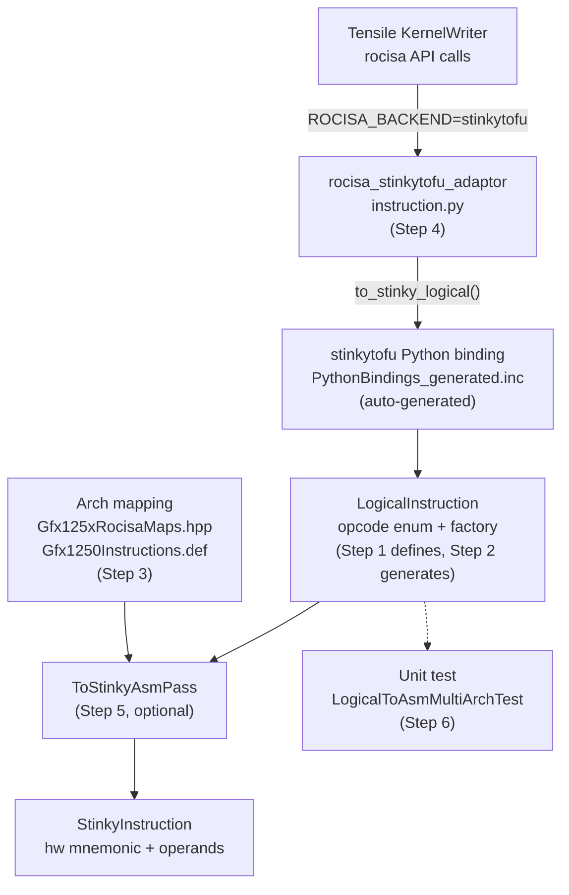

# Adding a New Instruction to the Logical IR Path

This guide explains how to fully integrate a new instruction into the stinkytofu logical IR path (the "left path" in the architecture diagram). Use this when:

- A new ISA introduces a hardware instruction that needs logical IR representation
- An existing rocisa instruction has not yet been bridged by the stinkytofu adaptor

## Architecture Overview



## Files at a Glance

| Step | File | Action |
|------|------|--------|
| 1 | `stinkytofu/src/ir/logical/LogicalInstructionDefs.inc` | Add IRInstDef entry |
| 2 | (build-time auto-generated, no manual edit) | Verify build succeeds |
| 3a | `stinkytofu/hardware/src/gfx/common/Gfx125xRocisaMaps.hpp` | Add logical-to-mnemonic mapping |
| 3b | `stinkytofu/hardware/src/gfx/Gfx1250/Gfx1250Instructions.def` | Add `.logical` reverse mapping |
| 3b' | `stinkytofu/hardware/src/gfx/Gfx1250v0/Gfx1250v0Instructions.def` | Same as 3b (if this arch variant also supports it) |
| 4 | `rocisa_stinkytofu_adaptor/rocisa_stinkytofu_adaptor/instruction.py` | Add Python shim class |
| 5 | `stinkytofu/src/transforms/logical/ToStinkyAsmPass.cpp` | (Optional) Special lowering logic |
| 6 | `stinkytofu/tests/unit/logical/LogicalToAsmMultiArchTest.cpp` | Add test case |

---

## Step 1: Define the Logical IR Instruction

**File**: `stinkytofu/src/ir/logical/LogicalInstructionDefs.inc`

Add a new `IRInstDef` entry. The nine fields in order are:

```
1. className    — C++ class name / opcode name (e.g. "VAdd3U32")
2. comment      — Instruction description (usually same as className)
3. numSrcs      — Number of source operands
4. hasDest      — Whether it has a destination register (bool)
5. category     — Instruction category string
6. supportsDPP  — Whether it supports DPP modifiers (bool)
7. supportsSDWA — Whether it supports SDWA modifiers (bool)
8. hasDS        — Whether it has DS (LDS) modifiers (bool)
9. flags        — Instruction flags, joined with "|"
```

### Example: Ternary vector ALU instruction

```cpp
{"VAdd3U32",
 "VAdd3U32",
 3,          // numSrcs: src0, src1, src2
 true,       // hasDest
 "Vector Arithmetic",
 true,       // supportsDPP
 true,       // supportsSDWA
 false,      // hasDS
 "IF_Commutative|IF_VALU"},
```

### Example: DS load instruction

```cpp
{"DSLoadB64",
 "DSLoadB64",
 1,          // numSrcs: address only
 true,       // hasDest
 "Memory LDS",
 false,      // no DPP
 false,      // no SDWA
 false,      // hasDS (DS offset set via set_ds())
 "IF_DSRead"},
```

### Common Flags Reference

| Flag | Meaning |
|------|---------|
| `IF_VALU` | Vector ALU |
| `IF_SALU` | Scalar ALU |
| `IF_Commutative` | Operands are commutative |
| `IF_DSRead` | DS (LDS) read |
| `IF_DSWrite` | DS (LDS) write |
| `IF_BufferRead` | Buffer (MUBUF) read |
| `IF_BufferWrite` | Buffer (MUBUF) write |
| `IF_FlatRead` | Flat read |
| `IF_FlatWrite` | Flat write |
| `IF_GlobalRead` | Global read |
| `IF_GlobalWrite` | Global write |
| `IF_Branch` | Branch instruction |

### Important: numSrcs Must Be Correct

`numSrcs` determines how many source operand parameters the tablegen-generated factory function accepts. If set incorrectly, the adaptor will pass the wrong number of arguments and cause a runtime error.

---

## Step 2: Verify Auto-Generated Artifacts (No Manual Edit)

When building stinkytofu, `tools/tablegen/GenLogicalIR.cpp` reads `LogicalInstructionDefs.inc` and auto-generates three files:

1. **`LogicalOpcodes_generated.inc`** — enum values (e.g. `VAdd3U32 = 10`)
2. **`LogicalInstructions_generated.hpp`** — C++ factory functions
3. **`PythonBindings_generated.inc`** — nanobind Python bindings

The factory function signature is derived automatically from the `.inc` fields:

- `numSrcs` -> number of source parameters
- `hasDest` -> whether a dest parameter exists
- `supportsDPP` -> whether an `std::optional<DPPModifiers> dpp` parameter is included
- `supportsSDWA` -> whether an `std::optional<SDWAModifiers> sdwa` parameter is included

For example, `VAdd3U32` (numSrcs=3, hasDest=true, DPP=true, SDWA=true) generates:

```cpp
inline LogicalInstruction* VAdd3U32(
    const StinkyRegister& dst,
    const StinkyRegister& src0,
    const StinkyRegister& src1,
    const StinkyRegister& src2,
    std::optional<DPPModifiers> dpp = std::nullopt,
    std::optional<SDWAModifiers> sdwa = std::nullopt,
    const std::string& comment = "");
```

The corresponding Python binding:

```python
stinkytofu.VAdd3U32(dest, src0, src1, src2, dpp=None, sdwa=None, comment="")
```

> **Verification**: After build completes, confirm the three `_generated` files exist under `build/` with no tablegen errors.

---

## Step 3: Architecture Mapping

You need to tell stinkytofu which hardware mnemonic this logical opcode maps to on a specific architecture. This requires two places:

### 3a. Rocisa Mapping Table

**File**: `stinkytofu/hardware/src/gfx/common/Gfx125xRocisaMaps.hpp`

Add a `{logical_name, hw_mnemonic}` pair in the map literal:

```cpp
{"VAdd3U32", "v_add3_u32"},
```

This table is used by `ToStinkyAsmPass` to look up the hardware mnemonic from the logical name.

### 3b. Hardware Instruction Definition

**File**: `stinkytofu/hardware/src/gfx/Gfx1250/Gfx1250Instructions.def`
(and `Gfx1250v0/Gfx1250v0Instructions.def` for variants)

Add a `.logical` reverse mapping in the appropriate `DEF_BATCH` block:

```cpp
DEF_BATCH(.format = VOP3_COMMUTATIVE,
    VAdd3U32Inst, "v_add3_u32", .logical = "VAdd3U32",
    // ... other instructions with the same format ...
```

`.def` files group instructions by encoding format using `DEF_BATCH` macros. Each instruction entry has three parts:
- **InstName** — C++ hardware instruction ID (convention: `<LogicalName>Inst`)
- **mnemonic** — assembly mnemonic (`"v_add3_u32"`)
- **.logical** — reverse pointer to the logical opcode name

At build time, `GenLogicalToAsmMapping.cpp` reads all `.def` files to generate `LogicalToAsmMappings_generated.inc`.

---

## Step 4: Python Adaptor

**File**: `rocisa_stinkytofu_adaptor/rocisa_stinkytofu_adaptor/instruction.py`

Create a Python shim class so that KernelWriter's rocisa API calls are converted to logical IR.

### Choosing the Factory Function

Select the appropriate `_make_*_class` factory based on instruction type:

| Instruction Type | Factory Function | Operand Shape |
|-----------------|-----------------|---------------|
| Binary ALU (dst, src0, src1) | `_make_scalar_alu_class` | dst, src0, src1 |
| Unary ALU (dst, src) | `_make_scalar_unary_class` | dst, src |
| Ternary ALU (dst, src0, src1, src2) | `_make_ternary_class` | dst, src0, src1, src2 |
| Zero-source (dst only) | `_make_zero_src_class` | dst |
| Zero-operand | `_make_no_operand_class` | (none) |
| Immediate, no dest | `_make_imm_no_dest_class` | imm |
| Scalar shift | `_make_scalar_shift_class` | dst, value, shift |
| Vector shift | `_make_vector_shift_class` | dst, shift, value |
| Scalar compare (no dst) | `_make_scalar_cmp_class` | src0, src1 |
| Vector compare | `_make_vcmp_class` | dst, src0, src1 |
| Branch | `_make_branch_class` | labelName |
| Register jump | `_make_reg_jump_class` | src (or dst, src) |
| Scale CVT | `_make_cvt_scale_class` | dst, src, scale |
| SR scale CVT | `_make_cvt_scale_sr_class` | dst, src0, src1, scale |
| Buffer load | `_make_buffer_load_class` | dst, vaddr, saddr, soffset, mubuf |
| Buffer store | `_make_buffer_store_class` | src, vaddr, saddr, soffset, mubuf |
| Flat load | `_make_flat_load_class` | dst, vaddr |
| Flat store | `_make_flat_store_class` | src, vaddr |
| Global load | `_make_global_load_class` | dst, vaddr, saddr |
| Global store | `_make_global_store_class` | src, vaddr, saddr |
| DS load | `_make_ds_load_class` | dst, addr (+ ds.offset) |
| DS store | `_make_ds_store_class` | addr, src (+ ds.offset) |
| DS store2 | `_make_ds_store2_class` | addr, src0, src1 |
| DS load2 | `_make_ds_load2_class` | dst, src (src passed twice) |

### Example: Adding a Ternary ALU Instruction

```python
# logicalIR: VAdd3U32
VAdd3U32 = _make_ternary_class("VAdd3U32", "v_add3_u32", InstType.INST_U32)
```

Three arguments:
- **class_name** — Must exactly match the className in `LogicalInstructionDefs.inc`
- **mnemonic** — Original ISA mnemonic (used by `setInst()`, still needed for the native rocisa path)
- **inst_type** — rocisa's `InstType` enum

The factory-generated `to_stinky_logical()` method will:
1. Convert `self.dst` and `self.srcs[]` to `StinkyRegister` objects
2. Call `stinkytofu.VAdd3U32(dst, src0, src1, src2, comment=...)`
3. Propagate VOP3P modifiers (op_sel, op_sel_hi, byte_sel) if present

### Example: Adding a DS Load Instruction

```python
DSLoadB64 = _make_ds_load_class("DSLoadB64", "ds_load_b64")
```

The DS factory's `to_stinky_logical()` additionally calls `inst.set_ds(offset=self.ds.offset)`.

### Special Case: MFMA Family

MFMA, SMFMA, and MXMFMA are too complex for factory generation (they require deriving type_str, accType, matrix dimensions, etc.) and are implemented as full hand-written class definitions. If the new instruction is an MFMA variant, refer to the `MFMAInstruction` class's `to_stinky_logical()` implementation.

---

## Step 5: Special Lowering (Optional)

**File**: `stinkytofu/src/transforms/logical/ToStinkyAsmPass.cpp`

Most instruction lowering (logical -> asm IR) follows the generic path: look up the arch mapping for the mnemonic, copy operands and modifiers. However, the following cases require special handling:

### When Special Handling Is Needed

1. **Instruction splitting** — e.g. `VCmpX` on architectures that don't support `v_cmpx` must be split into `v_cmp` + `s_mov_exec`
2. **Implicit operands** — e.g. automatically inserting VCC carry operands
3. **Special metadata** — e.g. MFMA's `MFMAData` (type, m, n, k, etc.) needs to be converted to asm IR modifiers
4. **Conditional mnemonic selection** — e.g. choosing different hw instructions based on data type

### When Special Handling Is NOT Needed

Most ALU, compare, and branch instructions only need to exist in the arch mapping table. The generic path in `ToStinkyAsmPass` handles them automatically.

---

## Step 6: Testing

**File**: `stinkytofu/tests/unit/logical/LogicalToAsmMultiArchTest.cpp`

### 6a. Add a Factory Switch Case

In the `createInstruction` function, add a case:

```cpp
case logical::VAdd3U32:
    return VAdd3U32(vgpr(0), vgpr(1), vgpr(2), vgpr(3));
```

The number of arguments = hasDest(1) + numSrcs. Choose vgpr/sgpr based on instruction category.

### 6b. Add to SKIP_LOWERING (if Step 3 was skipped)

If the instruction has **no arch mapping** (Step 3 was skipped — no entry in `Gfx125xRocisaMaps.hpp` or `Gfx1250Instructions.def`), you **must** add its opcode to the `SKIP_LOWERING` set inside `AllInstructionsAllArchitectures`:

```cpp
std::set<logical::Opcode> SKIP_LOWERING = {
    // ...existing entries...
    logical::VAdd3U32,  // no gfx1250 arch mapping yet
};
```

Without this, the comprehensive test attempts to lower every opcode on every architecture. An opcode with no arch mapping will hit an `UNREACHABLE` in `ToStinkyAsmPass` and **abort the entire test binary** (not just fail one case).

### 6c. (Optional) Add Exact Mnemonic Verification

Add an entry in `EXPECTED_LOWERING_GFX1250` (or the corresponding architecture map):

```cpp
{logical::VAdd3U32, "v_add3_u32"},
```

Instructions not listed in this table are still tested (lowering success counts as a pass), but the generated mnemonic is not verified. Adding entries here is recommended for important instructions.

---

## Full Checklist

When adding instruction `XXX`, verify each item:

- [ ] Added `{"XXX", ...}` entry in `LogicalInstructionDefs.inc` with correct numSrcs
- [ ] Built stinkytofu with no tablegen errors
- [ ] Added `{"XXX", "hw_mnemonic"}` in `Gfx125xRocisaMaps.hpp`
- [ ] Added `.logical = "XXX"` entry in `Gfx1250Instructions.def`
- [ ] Same for `Gfx1250v0Instructions.def` (if the variant also supports it)
- [ ] Created shim class in `instruction.py` using the appropriate factory, with class_name exactly matching `.inc`
- [ ] (If Step 3 skipped) Added opcode to `SKIP_LOWERING` in `LogicalToAsmMultiArchTest.cpp`
- [ ] (If needed) Added special lowering logic in `ToStinkyAsmPass.cpp`
- [ ] Added switch case in `LogicalToAsmMultiArchTest.cpp`
- [ ] Full build + `ctest --test-dir build -R LogicalToAsm`
- [ ] End-to-end verification with YAML test (KernelWriter -> adaptor -> logical IR -> asm)

## Common Errors

| Symptom | Cause |
|---------|-------|
| `too few operands for instruction` | `numSrcs` set too low; factory receives insufficient arguments |
| `unknown logical opcode` | className in `.inc` does not match the adaptor's class_name (spelling/case) |
| `no mapping for arch` | Missing entry in `Gfx125xRocisaMaps.hpp` or `.def` file |
| `AttributeError: module 'stinkytofu' has no attribute 'XXX'` | stinkytofu Python binding not reinstalled after build |
| Adaptor class_name mismatch | First argument of `_make_*_class` differs in case from className in `.inc` |
| `AllInstructionsAllArchitectures` aborts (Subprocess aborted) | Opcode has no arch mapping but is not in `SKIP_LOWERING`; lowering hits UNREACHABLE |
