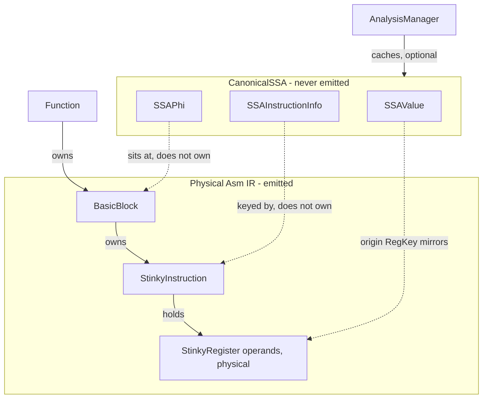
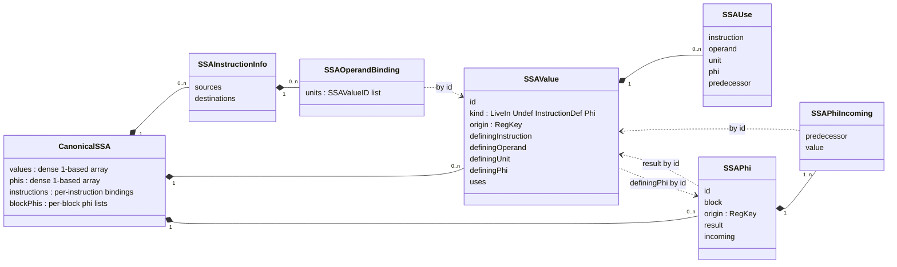
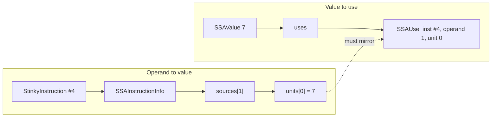
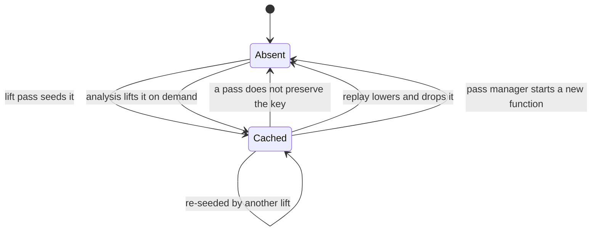

# Lift Asm registers to SSA pass

`LiftAsmRegistersToSSAPass` converts a function's physical register operands
into canonical static single assignment form. The result is a cached analysis,
`CanonicalSSAAnalysis`, that later passes consume.

It supports VGPR and SGPR operands and is available through `stinkytofu-opt`.
It is not part of the gfx1250 pipeline; section 4.1 explains why.

## 1. Purpose

Register allocation needs to know that one physical register written twice
holds two unrelated values. The existing `buildUseDefChain()` and the pseudo
PHIs it places cannot express that: they are keyed by physical `RegKey`, so
they give the scheduler and wait-count insertion the reaching-definition edges
those passes need, but they never rename a definition.

This pass supplies the missing value identity. It is the boundary between the
existing physical-register Asm pipeline and anything that reasons about values
rather than registers.

The pass converts the final optimized and scheduled physical-register dataflow
into canonical SSA:

```text
physical non-SSA Asm IR
  -> LiftAsmRegistersToSSAPass
  -> physical instructions plus a cached canonical SSA graph
  -> liveness, pressure, and register allocation
  -> SSA destruction and physical rewrite
```

The pass does not require TensileLite to produce virtual registers. A physical
register such as `v8` is treated as the name of mutable storage before the pass.
Each reaching definition of `v8` becomes a distinct SSA value.

```text
v8 = op_a()
use(v8)
v8 = op_b()
use(v8)

        |
        v

%1 {legacy=v8} = op_a()
use(%1)
%2 {legacy=v8} = op_b()
use(%2)
```

## 2. Pass name and public API

Use:

```text
C++ pass name: LiftAsmRegistersToSSAPass
Factory:        createLiftAsmRegistersToSSAPass()
Display name:   Lift Asm Registers to SSA
Analysis:       CanonicalSSAAnalysis
stinkytofu-opt: LiftAsmRegistersToSSAPass[=strictLiveIns,noVerify]
```

The graph itself is an analysis:

```cpp
// include/stinkytofu/analysis/ssa/CanonicalSSAAnalysis.hpp
struct CanonicalSSAAnalysis {
    STINKYTOFU_ANALYSIS_KEY("CanonicalSSAAnalysis")

    using Result = Expected<CanonicalSSA>;

    static Result run(Function& F, AnalysisManager& AM) {
        return liftAsmRegistersToSSA(F, AM.getResult<DominanceAnalysis>(F));
    }
};
```

`Result` is an `Expected` because failure is ordinary: an accumulator kernel
cannot be lifted, and the reason is worth carrying. Consumers read
`getCachedResult<CanonicalSSAAnalysis>()`, which answers "was this function
lifted" rather than "lift it now", and check for an error before dereferencing.

Construction lives beside the type it builds:

```cpp
// include/stinkytofu/analysis/ssa/CanonicalSSA.hpp
namespace stinkytofu {

struct LiftAsmRegistersToSSAOptions {
    bool verify = true;
    bool allowInferredLiveIns = true;
};

// Construction, independent of the pass manager.
STINKYTOFU_EXPORT Expected<CanonicalSSA> liftAsmRegistersToSSA(
    Function& function,
    const LiftAsmRegistersToSSAOptions& options = {});

// Same, reusing dominance the caller already has.
STINKYTOFU_EXPORT Expected<CanonicalSSA> liftAsmRegistersToSSA(
    Function& function,
    const DominanceInfo& dominance,
    const LiftAsmRegistersToSSAOptions& options = {});

}  // namespace stinkytofu
```

The pass header holds only the pipeline entry points:

```cpp
// include/stinkytofu/transforms/ssa/LiftAsmRegistersToSSAPass.hpp
namespace stinkytofu {

// Whole-kernel preflight; see section 5.1.
STINKYTOFU_EXPORT bool kernelHasCallSites(
    const std::vector<const Function*>& functions);

STINKYTOFU_EXPORT std::unique_ptr<Pass>
createLiftAsmRegistersToSSAPass(
    const LiftAsmRegistersToSSAOptions& options = {});

}  // namespace stinkytofu
```

Construction is a free function returning `Expected<CanonicalSSA>`, which is
also the analysis's `run()`. That keeps the algorithm testable without a pass
manager, makes unsupported input a recoverable error rather than a pass-level
abort, and makes the result atomic: a caller can only ever receive a fully
built and verified graph, or the reason there is none.

The `Function&` is non-const only because computing dominance needs it. Lifting
reads the function and mutates nothing, which is what allows it to serve as an
analysis at all.

Diagnostics are located as `@function #instruction operand: message`, for
example:

```text
@kernel #1 src0: register class 'a' is not lifted yet; VGPRs and SGPRs are supported
```

The implementation follows the existing pass convention:

```cpp
class LiftAsmRegistersToSSAPassImpl : public Pass {
  public:
    static char ID;

    const char* getName() const override {
        return "Lift Asm Registers to SSA";
    }

    PassID getPassID() const override {
        return &LiftAsmRegistersToSSAPassImpl::ID;
    }

    PreservedAnalyses run(Function&, PassContext&, AnalysisManager&) override;
};
```

## 3. Why an analysis, and why a pass as well

The graph is a pure function of the CFG, the instruction order, and the register
operands. That makes it a cache rather than IR state, and it is why the pass
manager's lifecycle is the right one: any pass that does not preserve
`CanonicalSSAAnalysis` evicts it, so a graph whose `const StinkyInstruction*`
pointers no longer resolve is unreachable rather than merely discouraged.

Recomputation is safe because construction is deterministic. Two lifts of an
unchanged function produce identical graphs, including identical SSA value IDs,
which is what lets an `AllocationResult` keyed by those IDs survive an eviction
and rebuild. When the function *has* changed, the shape fingerprint of
section 3.1 catches it.

A pass exists on top of the analysis for three things an analysis cannot do:

- **Options.** An analysis factory takes no arguments, so `verify` and
  `allowInferredLiveIns` have nowhere to live. The pass applies them and seeds
  the result with `AnalysisManager::insertResult()`.
- **Diagnostics.** An analysis has no `PassContext`, so it cannot emit the
  located missed-optimization remark. The pass can.
- **An explicit position.** Lifting marks the point after which mutation is
  illegal. Placing the pass says where that is; leaving it to lazy computation
  would not.

Failure is seeded too, as an error rather than a graph. That matters as much as
never seeding a partial graph: a consumer then finds the reason there is no SSA
instead of a result describing an earlier version of the IR. Consumers read
`getCachedResult<CanonicalSSAAnalysis>()` and fall back to the physical path
when it is absent or holds an error, which is what keeps production output
unchanged while the supported input set is still narrow.

Cleanup is a separate pass. Discarding the def-use analysis mutates the
instruction stream, so it cannot happen inside an analysis;
`RemoveDefUseAnalysisPass` does it, and lifting rejects a function
that still carries a `GFX::PHI` rather than repairing it.

The instruction stream stays physically spelled. The canonical SSA graph is
authoritative for dataflow, while the physical operands remain available for
legacy replay and diagnostics.

Lifting is function-wide, not a `StinkyInstPass`. Partial basic-block filtering
is invalid because PHI placement and renaming require the complete CFG. If
`PassContext::shouldProcessBasicBlock()` excludes any block, the pass records
that as the reason there is no graph; it never constructs partial SSA.

### 3.1 The shape fingerprint

`computeFunctionShape()` hashes everything the graph depends on: block count,
per-block edge counts, instruction count and order, opcodes, and every register
operand. The lifter stamps it into the graph, and `AllocationResult` copies it
from the graph it was computed against.

Two checks use it, and both reject rather than proceed. SSA destruction refuses
a graph whose stamp does not match the function it is about to rewrite, and
refuses an allocation whose stamp does not match the graph. The verifier makes
the first of those checks too, and stops before walking a graph whose pointers
may already be dangling.

This exists because there is no revision counter to rely on: mutation happens on
`BasicBlock` and directly through `setSrcRegs`/`setDestRegs`, neither of which
notifies the `Function`. Comparing fingerprints at the two boundaries that
matter costs one pass over the instructions and needs no instrumentation
anywhere else. A graph built by hand, as the unit tests do, carries
`kUnstampedShape` and is exempt, since it makes no claim about which program it
describes.

## 4. Pipeline position

The pass runs once per function after every transformation that may change the
CFG, instruction order, physical operands, or temporary registers:

```text
region scope   CFGBuilderPass
               optimization passes
               scheduler
kernel scope   cluster barrier, CFGBuilderPass, RegionClonePass
               RemoveDefUseAnalysisPass
               LiftAsmRegistersToSSAPass
               register liveness and pressure
               register allocation
               SSA destruction and physical rewrite
               InsertVgprMsbPass
               waitcnt insertion
               wait-alu, coexec hazard, delay-alu, matrix reuse, Gfx1250 hazard
               FlattenCalleesPass
               prologue, software prefetch, sizing
               emission
```

No optimizer or scheduler runs between SSA lifting and allocation. A pass added
to that window must return `preserveCFGAndCanonicalSSA()`, or the graph is
evicted and its consumer finds nothing. `PreservedAnalyses` preserves nothing by
default, so this is easy to get wrong; because every consumer reads the *cached*
result rather than asking the analysis to recompute, the mistake surfaces as a
loud failure instead of a silent re-lift.

Two things fix that position. Lifting needs final instruction order and a whole
function, so it cannot go earlier: the scheduler is region-scoped, and the
region adaptor splices instructions into a temporary `Function`, which is a
slice of a kernel rather than something an allocator can colour. And allocation
must precede every consumer of physical register numbers, which in
`Gfx1250Backend.cpp` means everything from `InsertVgprMsbPass` onwards.

That leaves exactly one slot: kernel scope, after `RegionClonePass` rebuilds the
final CFG and before `InsertVgprMsbPass`. Placed there, no existing pass has to
move, because `InsertVgprMsbPass` and every hazard pass already sit after it.

`FlattenCalleesPass` is an exception: it is a temporary final-layout pass, not a
call-lowering pass. SSA lifting, allocation, and SSA destruction must run on
the separate caller/callee `Function`s before flattening. Layout-dependent
software-prefetch and prologue passes may remain after flattening only if their
registers are fixed/reserved, scavenged, or otherwise included safely in final
resource verification.

### 4.0 Why hazard and wait insertion must follow allocation

`InsertWaitAluPass`, `InsertCoexecHazardPass`, `InsertDelayAluPass`,
`SetMatrixReusePass`, and `Gfx1250HazardPass` all reason about which physical
registers an instruction touches. Allocation changes exactly that, and not only
by renaming: it makes unrelated values share a register, which creates hazards
that did not exist before. A delay or NOP computed against pre-allocation
registers is therefore not conservative, it is wrong, and it can be wrong in the
unsafe direction.

Waitcnt insertion has the same problem for a subtler reason. Consistent renaming
preserves value dependences, so a wait placed before a consumer stays correct.
What does not survive is register reuse: if the allocator puts an unrelated
value into a register an outstanding load will land in, the instruction defining
that value must now wait for that load, or the load clobbers it. That is a
write-after-write requirement on the physical register with no counterpart at
value level, so no pre-allocation pass could have emitted it.

This is why LLVM's AMDGPU backend puts both in `addPreEmitPass()`, after
register allocation: `SIMemoryLegalizer`, `SIInsertWaitcnts`,
`SIShrinkInstructions`, `SIModeRegister`, `SIInsertHardClauses`, and only then
`PostRAHazardRecognizer`. The hazard recognizer was moved to the end of that
list deliberately, because "memory legalizer, waitcnt, and shrink passes can
perturb the instructions … otherwise, one of those passes may invalidate the
work done by the hazard recognizer".

StinkyTofu currently inserts waitcnts at region scope, before any viable
allocation point, so enabling allocation requires moving that insertion to
kernel scope after SSA destruction. The pipeline already uses this
strip-then-reinsert idiom for `delay_alu`, `s_wait_alu`, and waitcnts around the
scheduler; allocation is another transformation of the same kind.

#### What that ordering does and does not give the allocator

It frees the allocator from hazard *correctness* entirely. Any legal colouring
is safe, because each hazard pass recomputes against whatever was chosen and
emits the stalls that choice requires. No hazard rule needs to appear in the
allocator, and no allocator assumption gets baked into a hazard pass.

It does not free the allocator from hazard *cost*, and on this target that is
the harder half. Reuse manufactures write-after-read and write-after-write edges
between unrelated values, and every one of them becomes a real `s_delay_alu` or
NOP. Placing a value in a register an outstanding load will land in forces the
wait earlier and collapses memory-level parallelism. Meanwhile fewer VGPRs means
more waves per SIMD, which pulls the other way. So the allocator owns a genuine
trade-off, not a monotone objective, and it has to anticipate passes it never
talks to.

LLVM handles this without coupling by shaping the input rather than teaching the
allocator hazards. `SIFormMemoryClauses` runs before allocation specifically so
registers inside a memory clause cannot be reused and the clause survives; the
pre-allocation `MachineScheduler` is register-pressure aware and targets an
occupancy goal through `GCNSchedStrategy`; and individual decisions are biased
through `getRegAllocationHints`. All of it is pre-allocation work whose purpose
is to keep allocation from damaging what comes after.

### 4.1 Why the backend is not wired yet

The pipeline above is the target, not the current state. `Gfx1250Backend.cpp` is
deliberately untouched, for reasons that are measurable rather than cautious:

- **Enabling it could not change output.** Legacy replay is an identity
  transform by construction, so until an allocator chooses different registers,
  the only observable effect of running the window is compile time.
- **Waitcnt insertion has to move first.** It runs at region scope, before any
  viable allocation point, and section 4.0 explains why reallocating after it is
  unsound. Moving it to kernel scope is a real change to a working pipeline, and
  making it in exchange for a path that never activates would be trading risk
  for nothing.
- **Accumulator kernels still fall back.** Over the FileCheck corpus, 200 of
  230 functions lift, five of them trivially because they are empty. Of the 30
  rejections, 26 are accumulator classes: 20 AGPR and 6 ACC, against three
  unreachable blocks and one call site. Matrix kernels keep their accumulators
  in AGPRs, so the shapes that matter most for register pressure are exactly
  the ones still out of scope.

Wiring it up therefore waits on an allocator that produces a non-legacy
colouring. What the pass provides in the meantime is the correctness gate that
makes such wiring safe: lift, colour, and lower must reproduce the program
exactly. That gate holds across the whole corpus today: all 230 functions
round-trip byte-identically, the rejected ones because they keep their original
operands untouched.

Two safeguards are already in place. `kernelHasCallSites()`
preflights a whole kernel so a call-connected kernel keeps the legacy path
entirely, and SSA destruction rejects any colouring that would need a PHI copy
instead of mis-lowering it.

## 5. Input contract

The pass requires:

1. a complete per-function CFG with stable predecessor order;
2. final scheduled instruction order;
3. only physical allocatable operands; template registers carrying
   `StinkyRegister::kVirtualBit` are rejected;
4. complete explicit source and destination register operands;
5. instruction metadata for tied and read-modify-write operands;
6. no `GFX::PHI` instructions left in the stream, whatever placed them;
7. no stale instruction-level `sources` or `users` graph that a later pass
   expects to remain valid.

Register classes are recognised from the operands themselves, through
`isAllocatableReg()` and `isPseudoReg()`. No target register description is
consulted, which is why fixed, reserved, and alignment-constrained registers
are invisible to the pass; section 10.1 covers what that costs.

Full-DWORD VGPR and SGPR units are supported. Covering SGPRs is safe because
VCC and EXEC are their own register types in this IR rather than SGPR indices,
so a scalar operand can never alias a special register at the `RegKey` level.
SGPR alignment and ABI-fixed registers constrain allocation, not lifting, since
lifting never renames anything.

Accumulator classes stay unsupported until target register information can
model them: on some architectures an AGPR and a VGPR name the same storage, and
building two independent SSA values over one physical register would be unsound.
Sub-DWORD True16 units are likewise deferred.

Special and pseudo registers such as EXEC, VCC, SCC, M0, memory tokens, and
barrier tokens do not enter allocator SSA.

### 5.1 Function calls and `FlattenCalleesPass`

Before flattening, StinkyTofu has:

- one entry `Function` and separate callable `Function`s;
- `IF_Call` instructions recognized by `isCall()`;
- possible callee names in `CallTargetData`;
- per-function CFGs where a call has normal caller fall-through and is not a
  CFG edge to the callee.

This is sufficient to retain function boundaries and build a call graph. It is
not sufficient for register allocation across calls. `CallTargetData` does not
define argument registers, result registers, caller-saved/clobbered registers,
callee-saved registers, return-address registers, or special-register effects.
Those choices are currently implicit in TensileLite's physical allocation.

`FlattenCalleesPass` does not solve this problem. It moves callable instruction
bodies into their assembly placement-marker positions and empties the callable
functions, but it leaves call instructions and their `CallTargetData` intact.
Running SSA lifting after flattening would lose the useful per-function
ownership while still lacking call effects. It could also confuse assembly
layout with control flow.

Until a target-owned calling convention and call-clobber model exist:

1. run `LiftAsmRegistersToSSAPass` independently on each function before
   `FlattenCalleesPass`;
2. reject an `isCall()` instruction in strict SSA/allocation mode;
3. if any reachable function contains a call, fall back to legacy physical
   allocation for the entire call-connected kernel;
4. do not partially recolor a callee while leaving its caller under an implicit
   physical convention;
5. flatten only after successful allocation and SSA destruction, or on the
   unchanged legacy path.

The future calling-convention contract must provide:

```text
call target set
  + precolored argument uses
  + precolored result definitions
  + caller-saved/clobber mask
  + callee-saved/preserved mask
  + return-address register effects
  + relevant EXEC/VCC/SCC and other special-state effects
```

With that contract, each function still keeps an independent SSA graph.
Values live across a call must be colored to preserved registers or
saved/restored/spilled. Interprocedural SSA is not required.

## 6. Output contract

On success the cached analysis holds one valid `CanonicalSSA` graph:

- every supported allocatable source unit maps to exactly one SSA value;
- every instruction destination unit defines a new SSA value;
- every SSA value has one definition, or is a live-in or undef;
- merge points contain canonical PHIs where required;
- PHI inputs are uses on predecessor edges;
- all uses have exact instruction, operand, and unit positions;
- every value records its original physical `RegKey`;
- tuple grouping, tied operands, and operand order are recoverable from the
  bindings, as section 10.1 describes; alignment is not, because nothing models
  it yet;
- IDs and printed output are deterministic.

The pass does not:

- select new physical registers;
- mutate physical source or destination operands;
- emit `GFX::PHI` instructions;
- lower PHIs to copies;
- compute interference or color registers;
- update kernel resource metadata.

## 7. SSA representation

### 7.0 Data model at a glance

Two graphs coexist. The physical one is the program; the SSA one describes its
dataflow and is thrown away before emission.



The dashed edges are the whole design in one picture: the graph points *into*
the physical IR and never owns any of it. That is why deleting an instruction
invalidates the graph, and why the `Function` does not hold it: the pass manager
does, so that any mutation evicts it.

Inside the graph, four collections hang off `CanonicalSSA`:



Everything that crosses between collections travels as an ID, not a pointer, so
the arrays can grow during construction without invalidating anything.

### 7.0.1 The two directions of def-use

The same relationship is stored twice, from opposite ends, and the verifier's
job is largely to keep the two in agreement.



Reading an instruction answers "what values does this operand consume", and
reading a value answers "where is this consumed". Neither direction is derived
from the other, which is what makes exact use counts possible - a value read
twice by one instruction has two `SSAUse` records - and also what makes the
symmetry check worth running.

Worked example for `v2 = v_add_f32 v0, v1` where `v0` and `v1` arrive as
live-ins:

```text
SSAValue 1  LiveIn          origin v0   uses = [ {#0, src 0, unit 0} ]
SSAValue 2  LiveIn          origin v1   uses = [ {#0, src 1, unit 0} ]
SSAValue 3  InstructionDef  origin v2   definingInstruction #0, dst 0, unit 0

SSAInstructionInfo for #0
    sources      = [ [1], [2] ]
    destinations = [ [3] ]
```

Which field answers which question:

```text
value.origin              which physical register did this come from
value.kind                live-in, undef, instruction result, or phi result
value.definingInstruction where an InstructionDef was produced
value.definingPhi         which phi produced a Phi value
value.uses                every place the value is consumed
info.sources[i].units     values consumed by source operand i, one per DWORD
info.destinations[i]      values produced by destination operand i
phi.incoming[e]           value arriving on predecessor edge e
phisForBlock(b)           phis that sit at the top of block b
```

### 7.1 Ownership and lifecycle

The graph lives in the `AnalysisManager`, keyed by `CanonicalSSAAnalysis`.
Nothing on `Function` refers to it, which is deliberate: the pass manager's
invalidation is the enforcement mechanism.

`CanonicalSSA` is move-only because it contains function-local instruction and
block references, and the analysis result is handed out as `const&`. A consumer
therefore cannot patch the graph incrementally; it reads, decides, mutates the
physical IR, and lets the graph be evicted and rebuilt.



Those transitions are, in order, `LiftAsmRegistersToSSAPass` calling
`insertResult()`, a consumer calling `getResult()`,
`AnalysisManager::invalidate()` evicting a key the returning pass omitted,
`ReplayLegacyColoringPass` omitting it deliberately, and `PassManager::run()`
clearing the whole cache when it starts on a function.

There is no `Stale` state, which is the point of the move. Editing instructions,
operands, or the CFG means the editing pass does not preserve the key, so the
graph is evicted rather than left describing a program that no longer exists.

One gap remains, and it is why section 3.1's fingerprint exists.
`AnalysisManager::invalidate()` runs only after a pass returns, so a pass that
mutates the IR and then keeps reading the cached graph is reading dangling
pointers. Decide against the graph first and mutate last; never interleave.

### 7.2 Storage key

Before lifting, one mutable variable is one physical register unit:

```cpp
struct RegKey {
    RegType type;
    unsigned idx;
    RegHalf half;
};
```

`RegKey` is origin and legacy-coloring provenance. It is not an SSA value
identity: one key has as many values as it has reaching definitions, which is
the entire reason the graph exists.

Today `half` is always `RegHalf::NONE`, and the lifter expands an operand with
`toRegKey(reg, unit)` for `unit` in `[0, reg.num)`. That is correct precisely
because True16 is rejected, so every unit is a whole DWORD.

The rest of this subsection is future work. Before supporting True16, introduce
one authoritative allocator operand-expansion helper using the architecture
rules already encoded by `VGPRHalfKeyer` in `RegHalfKeyer.hpp`:

```cpp
void forEachAllocatorRegUnit(
    const StinkyInstruction& instruction,
    OperandRole role,
    unsigned operandIndex,
    function_ref<void(RegKey)> callback);
```

This helper must account for operand width, register class, implicit
allocatable operands, architecture-dependent D16 collapsing, and `RegHalf`
metadata. It must not infer a True16 half from
`StinkyRegister::reg.offset`.

Do not directly treat every producer/consumer key emitted by
`VGPRHalfKeyer` as an independent SSA variable: `RegHalf::NONE` aliases both
halves on a per-half architecture. Normalize to non-overlapping atomic units.
A full-DWORD write defines LOW and HIGH and a full-DWORD read consumes both; on
a target that collapses D16 writes, use one full-DWORD unit instead.

### 7.3 SSA values

Use dense function-local IDs:

```cpp
using SSAValueID = uint32_t;

enum class SSAValueKind : uint8_t {
    LiveIn,
    Undef,
    InstructionDef,
    Phi,
};

struct SSAValue {
    SSAValueID id = kInvalidSSAValueID;
    SSAValueKind kind = SSAValueKind::Undef;
    RegKey origin;

    const StinkyInstruction* definingInstruction = nullptr;
    uint32_t definingOperand = 0;
    uint32_t definingUnit = 0;
    SSAPhiID definingPhi = kInvalidSSAPhiID;

    std::vector<SSAUse> uses;
};
```

ID zero is invalid. A reference to another graph entity is always an ID, never
a pointer, so the backing arrays can grow during construction without
invalidating anything already built. Pointers appear only where the graph
refers *out* to the physical IR, and they are const: the graph reads the
instruction stream, it does not edit it.

IDs are assigned deterministically, in three bands:

```text
1. live-ins            createEntryLiveIns(), sorted by register key
2. phi results         placePhis(), by key, then iterated-frontier order
3. instruction results rename(), in dominator-tree order
```

Within one key, PHI results are numbered as the iterated dominance frontier is
walked, which is not block order. It is reproducible because the worklist
starts from definition sites in block order and every container it consults is
either sorted or a vector.

Every phi result is therefore numbered before the first instruction result
anywhere in the function. On a large kernel this makes a block's phi results
look far "older" than the definitions around them; that is expected. Nothing
depends on IDs following program order, only on their being dense and
reproducible.

### 7.4 Instruction bindings

The graph maps every allocatable operand unit:

```cpp
struct SSAOperandBinding {
    std::vector<SSAValueID> units;
};

struct SSAInstructionInfo {
    std::vector<SSAOperandBinding> sources;
    std::vector<SSAOperandBinding> destinations;
};
```

The unit order matches the original register range. A four-DWORD source operand
therefore contains four IDs even when the lanes have different definitions.

Keep grouping metadata for each operand so allocation can reconstruct
consecutive and aligned tuples.

### 7.5 Uses

```cpp
struct SSAUse {
    const StinkyInstruction* instruction = nullptr;
    uint32_t operand = 0;
    uint32_t unit = 0;

    SSAPhiID phi = kInvalidSSAPhiID;
    const BasicBlock* predecessor = nullptr;

    bool isPhiUse() const;
};
```

One struct covers both kinds of use, distinguished by `isPhiUse()`. An
instruction use fills `instruction`, `operand`, and `unit`; a PHI-edge use fills
`phi` and `predecessor` instead, because the value is consumed on the edge
rather than at any instruction.

Do not deduplicate uses at instruction granularity. If one instruction reads
the same SSA value twice, record two use sites.

### 7.6 Canonical PHIs

Canonical PHIs live only in the graph:

```cpp
struct SSAPhiIncoming {
    const BasicBlock* predecessor = nullptr;
    SSAValueID value = kInvalidSSAValueID;
};

struct SSAPhi {
    SSAPhiID id = kInvalidSSAPhiID;
    const BasicBlock* block = nullptr;
    RegKey origin;
    SSAValueID result = kInvalidSSAValueID;
    std::vector<SSAPhiIncoming> incoming;
};
```

Incoming entries follow `BasicBlock::getPredecessors()` order and are sized to
match it, so an edge is addressed by position. A block may appear more than once
in that list when a branch targets its own fall-through; each occurrence is its
own slot carrying its own use record.

An incoming value is never represented by null or literal zero. Slots start
invalid during placement and every one must be filled by the end of renaming;
a leftover invalid slot means the dominator walk missed a block.

A PHI is reachable two ways: through `phisForBlock(block)` when walking the
program, and through `phis()` when walking the graph. `value(phi.result)` and
`phi(value.definingPhi)` close the loop between a PHI and its result value.

## 8. Initial-value policy

Physical input does not carry the producer identity needed to distinguish every
kernel live-in from an accidental use-before-definition. The pass must make
this limitation explicit.

The policy is:

1. A supported allocatable register read without a reaching definition becomes
   an inferred `LiveIn`. This is the default, and it is what makes the corpus
   liftable at all.
2. Strict mode, selected by clearing `allowInferredLiveIns`, rejects the
   function instead, naming the first instruction that reads the key.
3. Never silently substitute literal zero for a value with no definition.

`Undef` exists in the model for a value the IR marks as explicitly undefined,
but nothing marks one today, so the lifter never creates one; the verifier and
printer handle the kind so the model does not have to change when something
does. There is likewise no source of declared entry live-ins: ABI and
kernel-entry metadata would let strict mode become the default, and would let
allocation stop treating every inferred live-in as interfering with everything
before its first definition.

Conservative inferred live-ins preserve the semantics of the original physical
program, at the cost of that extra interference.

## 9. Construction algorithm

Use dominance-frontier PHI placement followed by dominator-tree renaming.

### Step 1: validate

Construction reads the function and changes nothing, so everything here is a
check. Anything that fails aborts the lift with a located diagnostic:

- an analysis `GFX::PHI` still in the instruction stream;
- an unresolved template virtual register;
- an unsupported register class, or a sub-DWORD operand;
- a call site, which needs a calling convention before its argument, result,
  and clobbered registers can be modelled;
- an instruction defining the same register unit through two destination
  operands, because the reaching definition would be ambiguous.

The first of those is the only one a pipeline can fix, and fixing it is a
separate step: `RemoveDefUseAnalysisPass` runs immediately before lifting.
It cannot be folded in here, because `liftAsmRegistersToSSA()` is also
`CanonicalSSAAnalysis::run()` and an analysis must not mutate the IR. So lifting
rejects a leftover PHI rather than repairing it, which keeps a pure builder pure
and puts the side effect at an explicit pipeline step.

That teardown is `discardDefUseAnalysis()`, named neutrally on purpose because
its two halves differ: `removeAnalysisPhis()` erases instructions, while
`clearDefUseChains()` zeroes fields on instructions that stay. Chains are
cleared before the PHIs are erased, so no instruction is left pointing at freed
memory.

Both halves are primitives rather than a counterpart to `BuildDefUseChain`.
`PhiPlacement` and `BuildDefUseChain` call them directly when rebuilding, which
is why they live below both rather than inside either.

### Step 2: compute dominance

Dominance comes from `computeDominanceInfo(Function&)`, and the dominator-tree
children are built deterministically from `DominanceInfo::idom`. Callers that
already hold dominance information pass it in so it is not recomputed.

Before enabling arbitrary assembly, extend dominance handling to a forest for
disconnected or unreachable components. A synthetic analysis root may connect
component roots, but it must not alter the emitted CFG. Until then an
unreachable block is rejected, because dominance is undefined there.

The entry block must not be a loop header. A live-in value arrives at the entry
without travelling along a CFG edge, so if the entry also has predecessors its
incoming values merge the live-in with a back edge, and no PHI can express
that: there is no predecessor slot for "function entry", and the PHI would end
up referencing only itself. Requiring a distinct preheader keeps the model
sound; producing one is a separate transformation.

### Step 3: discover definitions and uses

Walk blocks and instructions in deterministic order. Expand every supported
physical source and destination range into `RegKey`s.

Per block, record only what liveness and placement need: the keys defined in
it, and the keys read before being defined in it. Nothing about individual
definitions is stored yet, because renaming discovers them again in dominator
order. One extra map records where each key was first read without a local
definition, purely so strict mode can point at that instruction.

Source processing must precede destination processing for each instruction.
This is required for tied and read-modify-write instructions.

### Step 3b: compute liveness

Run a backward fixpoint over the reachable blocks:

```text
liveIn[B] = upwardExposed[B] + (liveOut[B] - defs[B])
liveOut[B] = union of liveIn[successors]
```

`upwardExposed[B]` holds the keys B reads before writing them, so their value
must arrive from a predecessor. Iterating in reverse post-order converges
quickly for reducible CFGs and still terminates for irreducible ones.

Liveness earns its cost twice over: it identifies exactly which keys need an
entry value, and it prunes PHI placement.

### Step 4: create initial values

`liveIn[entry]` is exactly the set of keys read on some path from the entry
without an intervening definition, so it is exactly the set needing an entry
value. Create one value per key, in register order so identical input yields
identical IDs. Every one is a `LiveIn` today, since nothing in the IR marks a
register as explicitly undefined.

In strict mode a non-empty `liveIn[entry]` is the error condition, reported
against the first instruction that reads the key.

### Step 5: place PHIs

For each `RegKey`, compute the iterated dominance frontier of its definition
blocks, including the entry when the key has an entry value so the live-in
participates in merges.

Place a PHI at a frontier block only when the key is live at that block's
entry. This is fully pruned SSA rather than the semi-pruned form, and it is
what liveness bought: a PHI is only created where some later use can actually
observe the merge, so no dead PHI is ever built and no removal pass is needed.
Propagate through the frontier regardless of liveness, since the iterated
frontier is a property of the definition sites.

Placement shares the dominance algorithm with `PhiPlacement.cpp` but nothing
else: no `GFX::PHI` instruction is inserted, and no physical PHI instruction is
ever treated as an SSA value.

### Step 6: rename

Maintain one stack of current SSA values per `RegKey`. The entry values from
step 4 are pushed once before the walk starts and stay for its duration. Then
traverse the dominator tree, and for each block:

1. push its PHI results;
2. visit instructions in scheduled order;
3. bind each source unit to the current stack top, recording a use on the value
   it resolved to;
4. create and push one new value for each destination unit;
5. populate successor PHI inputs from the current stack tops, recording a
   PHI-edge use for each slot filled;
6. recurse into dominator children;
7. pop everything pushed for this block.

Binding and use recording happen together, in one pass: the two directions
described in section 7.0.1 are written at the same moment, which is what keeps
them in agreement. There is no separate use-collection walk afterwards.

Use an explicit stack rather than recursion: a long straight-line kernel has a
dominator tree as deep as its block count.

A block may appear in a successor's predecessor list more than once, for
instance when a conditional branch targets its own fall-through block. Fill
every matching slot; each slot is a distinct PHI input carrying the same value,
and each needs its own use record.

Example read-modify-write:

```text
v40 = wmma(..., v40)
v40 = wmma(..., v40)
```

becomes:

```text
%acc1 {legacy=v40} = wmma(..., %acc0)
%acc2 {legacy=v40} = wmma(..., %acc1)
```

### Step 7: no dead-PHI removal is required

Pruned placement means a PHI is only created where the merged value is live, so
none is dead on arrival and there is nothing to remove. Dense value IDs make
removal awkward, which is a second reason to prefer not creating them.

If placement is ever relaxed to semi-pruned, removal has to come back:
iteratively drop PHIs whose results have no uses along with their incoming use
records. Dead instructions remain out of scope either way; that is a separate
optimization.

As a self-check, every PHI input slot must be filled once renaming finishes.
Each reachable predecessor edge is visited exactly once, so an empty slot means
the dominator walk missed a block.

### Step 8: stamp, verify, and return

Record the function's shape fingerprint in the graph, then run the canonical SSA
verifier against it, passing the dominance information so
definition-dominates-use and PHI-edge dominance are checked too. Stamping comes
first because the verifier checks the stamp.

On success the graph is returned, and it is the caller that decides where it
goes: the pass seeds it into `CanonicalSSAAnalysis` with
`AnalysisManager::insertResult()`, while the analysis path returns it directly.
Either way all prior register def-use, liveness, and pressure analyses are
invalidated.

## 10. Range and partial-definition behavior

SSA is built per DWORD:

```text
v[20:27] = old_value
v[20:21] = ds_load_b64(...)
consume(v[20:27])
```

becomes conceptually:

```text
(%new20, %new21) = ds_load_b64(...)
consume(%new20, %new21, %old22, %old23,
        %old24, %old25, %old26, %old27)
```

Only `v20` and `v21` receive new SSA values. The other units retain their
reaching values.

The same per-unit treatment covers overlapping source ranges, where the shared
unit is one value read through two operands, and a destination range overlapping
its own source, where the overlapping unit is read as the incoming value and
written as a new one.

### 10.1 Where tuple constraints live

Per-DWORD SSA does not remove tuple constraints, but it does not need a new
field to carry them either. `SSAOperandBinding::units` is the grouping record:
its entries are the units of one physical operand, in operand order, and the
verifier already checks that each unit's origin equals the operand's
corresponding physical unit. Allocation reads the binding together with the
original instruction operand, so "these four values occupy four consecutive
registers in this order" is fully represented.

Deliberately not added:

- A `requiresConsecutive` flag would restate `units.size() > 1`. Redundant
  state that can disagree with the units vector is worse than none.
- Alignment is not recorded because no operand alignment metadata exists in the
  instruction descriptors yet. Inventing values would be worse than deferring;
  it belongs with target register information.
- A tied-operand field would restate what the origins already show. A
  read-modify-write operand is visible as a source binding and a destination
  binding whose units share origins, which is exactly what allocation needs to
  decide whether they may share a physical register. `OperandFieldDesc`
  additionally carries `isReadWrite`, so the instruction can confirm the tie
  without the SSA graph duplicating it.

## 11. PHI example

Input:

```text
^entry:
  branch cond, ^left, ^right

^left:
  v5 = op_left()
  branch ^join

^right:
  v5 = op_right()
  branch ^join

^join:
  use(v5)
```

Canonical SSA:

```text
^left:
  %1 {legacy=v5} = op_left()

^right:
  %2 {legacy=v5} = op_right()

^join:
  %3 {legacy=v5} = phi(^left: %1, ^right: %2)
  use(%3)
```

The PHI incoming uses occur on `^left -> ^join` and `^right -> ^join`, not at
the start of `^join`.

## 12. Relationship to current PHI and def-use code

Reusable:

- `RegKey`, `RegKeyHash`, and full-DWORD range expansion;
- `computeDominanceInfo()`;
- iterated dominance-frontier concepts from `PhiPlacement.cpp`;
- dominator-inherited reaching-definition concepts from
  `BuildDefUseChain.cpp`;
- `PhiTestFixtures.hpp` CFG fixtures.

Not reusable as canonical representation:

- `StinkyInstruction::sources` and `users`, because they identify instructions
  rather than exact SSA values and use sites;
- physical `GFX::PHI` instructions, because they allow null/literal-zero
  incoming state and are def-use analysis artifacts;
- `RegKey` as value identity, because one key can have many definitions;
- one-RPO reaching-definition state without dominator stack renaming.

The pass shares the generic dominance and cleanup helpers, but keeps its own
data model and verifier.

## 13. Verification

`verifyCanonicalSSA(const Function&, const CanonicalSSA&)` returns a
`CanonicalSSAVerificationResult` holding every violation it found, rather than
stopping at the first one, so a broken graph can be diagnosed in one run.
Diagnostics are emitted in function and graph order, never by iterating hash
containers, so repeated runs produce identical text.

One overload extends it, taking `DominanceInfo` and adding the cross-block
dominance checks described below. The lifter and the dump pass both use it,
since they already hold dominance.

Verification stops before any other check when the graph's shape fingerprint
does not match the function, because a graph describing a different program
cannot be walked safely: its instruction pointers may already be dangling. A
hand-built graph carries no fingerprint and is exempt.

Checks:

### Graph

- every referenced block and instruction belongs to the function;
- every nonzero SSA ID exists exactly once;
- graph ordering is deterministic;
- only supported register classes are present.

### Definitions

- every `InstructionDef` maps to exactly one destination operand unit;
- every `Phi` maps to exactly one PHI result;
- `LiveIn` and `Undef` have no instruction or PHI definition;
- all values preserve a valid physical origin.

### Uses

- every allocatable source unit has exactly one value;
- every operand binding agrees with the value use list in both directions, and
  each binding slot is mirrored by exactly one use record so duplicated and
  missing records are both caught;
- every bound value's origin equals the physical unit of its operand;
- source and destination range widths match their bindings;
- a definition in the same block precedes its use;
- a definition in another block dominates its use, when dominance was supplied.

### PHIs

- each PHI has one incoming value per CFG predecessor;
- incoming order equals predecessor order;
- incoming and result origins are the same `RegKey`;
- every PHI appears exactly once in its own block's PHI list;
- null and invalid incoming values are forbidden;
- each incoming value dominates the end of its predecessor block, when
  dominance was supplied.

### Instruction semantics

- sources were processed before destinations, so no value is used by the
  instruction that defines it;
- an instruction with allocatable operands has bindings;
- tuple order and width are retained, which the origin check above enforces:
  unit `i` of an operand must originate from the operand's `i`-th physical unit,
  so grouping and order cannot silently drift;
- unsupported implicit allocatable operands are rejected.

Alignment is not checked because it is not yet modelled anywhere. Tied operands
need no separate check: the shared origins that make a tie observable are
already verified against the physical operands.

## 14. Legacy replay

Every generated SSA value initially has:

```text
legacy physical location = SSAValue.origin
```

All versions originating from `v8` therefore receive `v8` in legacy coloring.
PHI copies whose source and destination both color to `v8` are no-ops and must
not be emitted.

The first end-to-end gate is:

```text
A = current physical pipeline
B = current physical pipeline
    -> LiftAsmRegistersToSSAPass
    -> legacy coloring
    -> SSA destruction

assembly(A) == assembly(B)
metadata(A) == metadata(B)
```

This gate must pass before evaluating a new allocation.

### 14.1 Allocation results and the shared lowering path

`AllocationResult` maps each SSA value to a physical register, and
`createLegacyColoring()` fills it from the values' origins:

```cpp
SSADestructionResult destroyCanonicalSSA(Function&, const CanonicalSSA&,
                                         const AllocationResult&);
SSADestructionResult replayLegacyColoring(Function&, const CanonicalSSA&);
```

The graph is a parameter rather than something looked up, because SSA value IDs
mean something only relative to one graph and the caller is the one that knows
which graph its allocation came from. Discarding the graph afterwards is the
caller's job too: `ReplayLegacyColoringPass` does it by not preserving
`CanonicalSSAAnalysis`.

Keeping policy and lowering separate is what makes the comparison in the gate
meaningful. Legacy replay and a real allocator differ only in the colouring they
hand over, never in how it is applied, so a difference in output cannot be
blamed on the lowering path.

The rewrite is atomic. Every operand is validated before any is modified, so a
rejected colouring leaves the function with its original registers, exactly like
a rejected lift.

Five things are checked, and rejected rather than mis-lowered:

- a graph whose shape fingerprint does not match the function, meaning the
  program changed after it was lifted;
- an allocation whose fingerprint does not match the graph, meaning it was
  computed against a different one;
- a value with no assigned register;
- a range operand whose units are not consecutive in operand order, which no
  physical operand can encode;
- a PHI whose inputs and result do not all land on the same register. Lowering
  that needs a copy on the incoming edge, and copy insertion, parallel-copy
  sequencing, and critical-edge splitting are not implemented. Legacy replay
  never reaches this case.

The first two run before anything else touches the graph, since a stale graph
cannot be walked safely.

Identity is a weak test on its own, since a lowering that did nothing would also
pass it. A uniformly shifted colouring is therefore tested alongside: every
value moves by a constant, which keeps ranges consecutive and PHI inputs in
agreement, so the program must come back with every register renumbered and
nothing else changed.

The gate says nothing about performance, and that limitation is worth stating
plainly. Legacy colouring is TensileLite's hand allocation, which already
embodies the trade-offs of section 4.0: spacing that avoids delays, load
destinations kept clear, a chosen occupancy. A first allocator that is merely
correct and minimises register count will pass this gate, produce valid code,
and can still be materially slower, because the hazard passes will honestly
insert the stalls its choices earned. Byte-identical replay proves the
machinery; the first non-legacy colouring needs a performance comparison as
well, not just a correctness one.

### 14.2 How the names map onto the literature

`destroyCanonicalSSA()` does two jobs that the literature keeps separate, which
is worth knowing if you arrive from an LLVM background.

**SSA destruction**, more often called *out-of-SSA translation*, classically
means eliminating PHI functions by placing copies on predecessor edges. The name
comes from Briggs, Cooper, Harvey and Simpson, "Practical Improvements to the
Construction and Destruction of Static Single Assignment Form" (1998); see also
Sreedhar et al. (1999) and Boissinot et al. (2009). GCC does the same work in
`tree-outof-ssa.cc`. None of it is about assigning registers.

**Writing an allocation into the operands** is what LLVM calls virtual register
rewriting: `VirtRegRewriter` consumes a `VirtRegMap` and rewrites machine
operands. `AllocationResult` is our `VirtRegMap`, and the rewriting half of
`destroyCanonicalSSA()` is our `VirtRegRewriter`.

LLVM orders the two the other way round. Its `PHIElimination` runs *before*
register allocation, so its allocators work on non-SSA machine IR and the
rewrite afterwards never sees a PHI. This pipeline colours the SSA program and
leaves SSA afterwards, which is the SSA-based register allocation model of Hack
and Goos, "Optimal Register Allocation for SSA-form Programs in Polynomial Time"
(2006), whose appeal is that an SSA program's interference graph is chordal and
therefore colourable in polynomial time.

That ordering is why the PHI case in the list above is the hard one and is
currently rejected: copy insertion, parallel-copy sequencing, and critical-edge
splitting are exactly the classical content of out-of-SSA translation, and they
only become necessary once a colouring puts a PHI's inputs and result in
different registers. Until then the name describes what the component will do
rather than all of what it does today, which is mostly the rewriting half.

MLIR has no counterpart worth mapping to: it uses block arguments instead of PHI
nodes and has no in-tree register allocator, and "lowering" there means dialect
conversion, which is far broader than this.

## 15. Canonical SSA printer, diagnostics, and dumps

### 15.1 Purpose

`CanonicalSSAPrinter` is a dedicated printer for verification, FileCheck tests,
debugging, and allocation-diff tooling. The normal `AsmPrinter` is deliberately
not extended to switch formats:

```text
AsmPrinter
  -> physical Stinky Asm IR
  -> existing parseable .stir format

CanonicalSSAPrinter
  -> Function + CanonicalSSA graph
  -> deterministic diagnostic SSA format
```

The SSA format is initially dump-only. It is not accepted by the `.stir`
parser, emitted as GPU assembly, or used as the authoritative in-memory
representation. A parser/round-trip format may be added later if SSA becomes a
long-lived optimization IR.

The printer complements the in-memory verifier; it does not replace it. Tests
must verify the graph first and then compare its printed form.

### 15.2 Printer API

```cpp
// include/stinkytofu/serialization/ssa/CanonicalSSAPrinter.hpp
namespace stinkytofu {

struct CanonicalSSAPrinterOptions {
    unsigned indent = 2;

    // Print the physical origin of every defined value.
    bool printProvenance = true;

    // Print exact reverse-use lists after each value definition.
    bool printUses = false;

    // Print the original physical instruction as a trailing comment.
    bool printPhysicalInstruction = true;
};

class STINKYTOFU_EXPORT CanonicalSSAPrinter {
  public:
    explicit CanonicalSSAPrinter(
        std::ostream& out,
        const CanonicalSSAPrinterOptions& options = {});

    void print(const Function& function, const CanonicalSSA& ssa);
    void printMissing(const Function& function);
};

STINKYTOFU_EXPORT std::string canonicalSSAToString(
    const Function& function,
    const CanonicalSSA& ssa,
    const CanonicalSSAPrinterOptions& options = {});

}  // namespace stinkytofu
```

The graph is always an explicit argument: deciding that a function has no graph
means consulting the analysis cache, which is a caller's concern rather than a
printer's. `printMissing()` exists so that a caller which has made that decision
can still emit a `<no canonical SSA attached>` block, keeping a dump of an
unliftable function a checkable artifact.

Every register unit is always printed explicitly. Compact range notation is
deliberately deferred: collapsing units is only legal when they are adjacent in
the binding, adjacent in their origins, and share class and definition
metadata, and the expanded form is what verification needs.

Legacy coloring is not printed separately because it is currently defined as
the value's origin. Add it once coloring can diverge from provenance.

The physical-instruction comment is formatted from the operands directly rather
than through `AsmPrinter`, so it excludes the cycle/modifier attributes that
would make dumps noisy and unstable.

### 15.3 Text format

Use a visibly distinct top-level operation:

```text
ssa.func @demo {
  initial_values:
    %1:v = livein { origin = v0 }
  ^entry:
    %2:v, %3:v, %4:v, %5:v = "st.ds_load_b128"(src0 = [%1:v]) { inst = #0, origin = [v4, v5, v6, v7] }
      // physical: v[4:7] = "st.ds_load_b128"(v0)
    "st.ds_store_b64"(src0 = [%1:v], src1 = [%2:v, %3:v]) { inst = #1 }
      // physical: "st.ds_store_b64"(v0, v[4:5])
  ^left:
    %6:v = "st.v_add_f32"(src0 = [%2:v], src1 = [%3:v]) { inst = #2, origin = [v9] }
      // physical: v9 = "st.v_add_f32"(v4, v5)
  ^right:
    %7:v = "st.v_add_f32"(src0 = [%3:v], src1 = [%2:v]) { inst = #3, origin = [v9] }
      // physical: v9 = "st.v_add_f32"(v5, v4)
  ^join:
    %8:v = phi(^left: %6:v, ^right: %7:v) { origin = v9 }
    %9:v = "st.v_add_f32"(src0 = [%8:v], src1 = [%8:v]) { inst = #4, origin = [v10] }
      // physical: v10 = "st.v_add_f32"(v9, v9)
}
```

Syntax rules:

- SSA IDs print as `%<dense-id>` and always carry `:<class>` (`:v`, `:s`, and
  later `:acc`) so class mismatches stay visible.
- Initial `LiveIn` and `Undef` values print in an `initial_values` section,
  ordered by SSA ID. This avoids inventing emitted instructions or CFG nodes.
- Canonical PHIs print first in their owning block, as
  `%result = phi(^pred: %value, ...)` in predecessor order.
- Normal instructions print in final scheduled order. Labels are block
  boundaries and are not printed.
- Destination units print on the left in operand/unit order. Units of one
  operand are separated by `,` and separate destination operands by `|`, so one
  two-DWORD destination is never confused with two one-DWORD destinations.
- Source operands print as `srcN = [...]` using original operand indices, with
  one entry per atomic register unit.
- A non-allocatable operand (literal, special register, unresolved template
  virtual register) prints as `srcN = []` and stays visible in the physical
  comment.
- Provenance prints physical `RegKey`s, including `.lo` or `.hi` once True16 is
  supported.
- An instruction with no bindings is marked `unmapped`; a binding count that
  disagrees with the physical operands is marked `operand-count-mismatch`.
- Values whose definition site is unreachable from the function print in a
  trailing `unprinted_values` section, so a malformed graph is still complete.
- The output never contains pointer values.

Keeping every unit expanded is what makes a partial definition obvious: above,
the four-DWORD load defines `%2` through `%5` and the store consumes only `%2`
and `%3`.

### 15.4 Stable block and instruction identities

The printer computes deterministic display identities without storing them in
the SSA graph:

- blocks use their unique label when available;
- empty or duplicate labels use `^bb<function-order-index>`;
- instruction IDs use `#<function-order-index>` over all
  `StinkyInstruction`s;
- predecessor names use the same block identity table;
- PHI incoming entries follow `BasicBlock::getPredecessors()` order;
- unordered maps are never iterated directly for output.

Values print at their definition:

1. all initial values by SSA ID;
2. PHI results at block entry in `CanonicalSSA` PHI order;
3. instruction results in block/instruction/destination/unit order.

This ordering must produce byte-identical output across repeated runs.

### 15.5 Optional exact use lists

With `printUses=true`, print exact uses in deterministic order:

```text
%1:v = livein { origin = v5 }
  uses = [{ inst = #0, src = 0, unit = 0 }, { inst = #0, src = 1, unit = 0 }, { phi#1, pred = ^entry }]
```

Instruction uses sort by instruction order, then source operand, then unit.
PHI-edge uses sort after them by PHI id and predecessor order. Duplicate uses
remain separate entries, so a value read twice by one instruction shows twice.

Use-list output is intended for verifier tests and debugging. It is disabled
by default to keep routine dumps readable.

### 15.6 Invalid graph behavior

The printer is uniformly defensive so a malformed graph can still be inspected,
which is exactly what verifier failures need. It:

- bounds-checks every ID before lookup;
- prints `<invalid-ssa:%N>` or `<invalid-phi:phi#N>` for a missing entry;
- prints `<foreign-block>`, `<foreign-instruction>`, `<null-block>`, or
  `<null-instruction>` for references outside the function;
- never dereferences a stale pointer deliberately.

The printer therefore does not run the verifier itself, and printing is not
evidence of validity. Callers that require a valid graph, such as
`DumpCanonicalSSAPass`, call `verifyCanonicalSSA()` first and report its
diagnostics.

### 15.7 Dump pass and tool integration

`DumpCanonicalSSAPass` is read-only:

```cpp
struct DumpCanonicalSSAConfig {
    // Empty means the pass debug/output stream.
    std::string outputPath;
    CanonicalSSAPrinterOptions printerOptions;
    bool requireCanonicalSSA = true;
};

STINKYTOFU_EXPORT std::unique_ptr<Pass>
createDumpCanonicalSSAPass(DumpCanonicalSSAConfig config = {});
```

Typical explicit pipeline:

```text
CFGBuilderPass
  -> RemoveDefUseAnalysisPass
  -> LiftAsmRegistersToSSAPass
  -> DumpCanonicalSSAPass
```

The passes are registered in `stinkytofu-opt`:

```text
--RemoveDefUseAnalysisPass
--LiftAsmRegistersToSSAPass[=strictLiveIns,noVerify]
--DumpCanonicalSSAPass[=uses,noProvenance,noPhysical,allowMissing]
--ReplayLegacyColoringPass
```

`stinkytofu-opt` already registers the built-in analyses on its pass manager, so
the lifting pass finds the dominance information it needs. Use `.ssa` for
standalone dump artifacts; keep `.stir` for the physical parseable input.

`DumpCanonicalSSAPass`:

- reads `getCachedResult<CanonicalSSAAnalysis>()`, never `getResult()`, so the
  dump reports whether the function was lifted instead of lifting it here;
- requires a graph unless `allowMissing` is set, in which case it prints the
  placeholder so a not-lifted function is still checkable, and names the reason
  when the cached result carries one;
- verifies before printing, dominance included, and prints any diagnostics as
  `//` comments ahead of the dump so a malformed graph stays inspectable;
- writes to standard output unless a path is configured, which is what the
  FileCheck harness captures;
- never mutates the function or the graph;
- returns `PreservedAnalyses::all()`;
- supports one function at a time initially;
- may gain a module overload later to print entry and callable functions in
  module emission order.

### 15.8 Printer verification tests

Golden tests cover the printer directly:

- empty function;
- straight-line definition/use;
- repeated physical definitions producing distinct IDs;
- duplicate uses in one instruction;
- inferred live-ins;
- multi-DWORD and partial-definition bindings;
- diamond and loop PHIs;
- predecessor ordering;
- empty and duplicate block labels;
- provenance spelling;
- optional exact use lists;
- physical-comment enable/disable;
- deterministic output across repeated construction/printing;
- safe diagnostics for missing SSA IDs and foreign references.

FileCheck input stays physical `.stir`, and the checked output is the canonical
diagnostic form:

```text
# RUN: %stinkytofu-opt --arch gfx1250 %s \
# RUN:   --LiftAsmRegistersToSSAPass --DumpCanonicalSSAPass
```

The `.stir` tests cover one scenario each, so a failure names the behaviour that
broke:

```text
lift_asm_registers_to_ssa                live-ins, provenance, redefinition
lift_asm_registers_to_ssa_diamond        merge PHI, dominating definition
lift_asm_registers_to_ssa_loop           header PHI and back edge
lift_asm_registers_to_ssa_ranges         per-DWORD ranges, partial redefinition
lift_asm_registers_to_ssa_uses           exact use lists
lift_asm_registers_to_ssa_after_defuse   def-use analysis cleanup
lift_asm_registers_to_ssa_unsupported    fallback leaves the function alone
lift_asm_registers_to_ssa_replay         round-trip back to the original code
```

The harness matches substrings rather than regular expressions, so checks name
exact SSA IDs. That makes them sensitive to ID assignment, which is the point:
ID assignment is part of the deterministic contract.

### 15.9 Construction diagnostics

Every construction failure carries a location and a reason. The location is the
function name, plus the instruction index and the operand role and index when
the failure is attributable to an operand:

```text
@kernel: block ^body is unreachable from the entry; ...
@kernel #7: call sites need a calling convention to describe ...
@kernel #1 src0: register class 'a' is not lifted yet; ...
```

Instruction indices count `StinkyInstruction`s in function order, which is the
same numbering the printer uses for `inst = #N`, so a diagnostic and a dump
refer to the same instruction. Block-level failures name the block label
instead. The reason is a sentence explaining what is missing, not a code,
because the answer is almost always "this needs a model that does not exist
yet" and the reader needs to know which one.

On success the pass emits a passed remark with the SSA value count, the PHI
count, and the number of analysis PHIs the cleanup removed. Nothing else is
measured; there are no timing, memory, or rename-depth counters.

## 16. Analysis invalidation

Lifting mutates nothing, so it returns `preserveCFGAndCanonicalSSA()`: the CFG
analyses stay valid, and its own freshly seeded result must be preserved or the
pass manager would evict what the pass just computed.

`RemoveDefUseAnalysisPass` returns `preserveCFGAnalyses()`. It
removes instructions but leaves blocks and edges alone, and it invalidates:

- physical instruction def-use chains;
- physical PHI/reaching-definition analyses;
- register liveness and pressure analyses;
- any analysis keyed by instruction operands or order.

Every pass between lifting and SSA destruction must return
`preserveCFGAndCanonicalSSA()`. `PreservedAnalyses` preserves nothing by
default, so forgetting is the easy mistake; the consequence is a missing graph
at the next consumer rather than a wrong one.

SSA destruction returns `preserveCFGAnalyses()`, which omits
`CanonicalSSAAnalysis` and is therefore what discards the graph after the
operands have been rewritten.

Mutating the CFG, instruction order, or register operands invalidates the graph
by construction. That is legal, and the cost is a rebuild on the next request;
what is not legal is reading the cached graph after mutating within a single
pass, since invalidation only runs once the pass returns.

## 17. Source layout

SSA components sit under an `ssa/` folder in each area. The graph is derived
information, so it lives under `analysis/` next to its wrapper, exactly as
`DominanceInfo` lives in `analysis/controlflow/Dominance.hpp` next to
`DominanceAnalysis`. `ir/` is for the program itself, which is why nothing here
is in it: `AllocationResult` is keyed by SSA value IDs and stamped with the
graph's shape, so it is a companion to the graph rather than part of the
program. Only pass factories are in `transforms/`; the construction function the
analysis calls sits beside the type it builds.

Register allocation gets a parallel `ra/` tree. The dividing line is whether a
component reasons about registers as a finite resource, which keeps SSA
destruction and legacy replay here — destruction is lifting's inverse — and puts
pressure, interference, and colouring policy under `ra/`. The dependency runs
`ra/` to `ssa/` and never the other way, which is the other reason
`AllocationResult` stays on this side.

```text
include/stinkytofu/analysis/ssa/CanonicalSSA.hpp
include/stinkytofu/analysis/ssa/CanonicalSSAAnalysis.hpp
include/stinkytofu/analysis/ssa/CanonicalSSAAllocation.hpp
include/stinkytofu/serialization/ssa/CanonicalSSAPrinter.hpp
include/stinkytofu/transforms/ssa/LiftAsmRegistersToSSAPass.hpp
include/stinkytofu/transforms/asm/DefUseAnalysisCleanup.hpp
include/stinkytofu/transforms/ssa/DumpCanonicalSSAPass.hpp
include/stinkytofu/transforms/ssa/CanonicalSSADestruction.hpp
include/stinkytofu/transforms/ssa/ReplayLegacyColoringPass.hpp
src/analysis/ssa/CanonicalSSA.cpp
src/analysis/ssa/CanonicalSSALifting.cpp
src/analysis/ssa/CanonicalSSAAllocation.cpp
src/serialization/ssa/CanonicalSSAPrinter.cpp
src/transforms/ssa/LiftAsmRegistersToSSAPass.cpp
src/transforms/asm/DefUseAnalysisCleanup.cpp
src/transforms/ssa/DumpCanonicalSSAPass.cpp
src/transforms/ssa/CanonicalSSADestruction.cpp
src/transforms/ssa/ReplayLegacyColoringPass.cpp
tests/unit/ssa/CanonicalSSATestUtils.hpp
tests/unit/ssa/CanonicalSSATest.cpp
tests/unit/ssa/CanonicalSSAVerifierTest.cpp
tests/unit/ssa/CanonicalSSAPrinterTest.cpp
tests/unit/ssa/LiftAsmRegistersToSSATest.cpp
tests/unit/asm/DefUseAnalysisCleanupTest.cpp
tests/unit/ssa/CanonicalSSADestructionTest.cpp
tests/filecheck/lift_asm_registers_to_ssa*.stir
```

It also touches `AnalysisManager` for `insertResult()`, `AnalysisRegistration`
for registration and `preserveCFGAndCanonicalSSA()`, the IR, serialization, and
transform CMake lists, the public-header export check, and the `stinkytofu-opt`
pass registry. `Function` is deliberately untouched: nothing about canonical SSA
appears on it.

The test names in those unit and FileCheck files are the authoritative
statement of what is covered; this document does not duplicate them.

The normal `.stir` printer is left alone: it prints the physical program.
`CanonicalSSAPrinter` and `DumpCanonicalSSAPass` provide the separate `.ssa`
diagnostic form.

## 18. Scope and limitations

Supported:

```text
register classes    VGPR and SGPR, full DWORD
operands            scalar, multi-DWORD ranges, overlapping and disjoint
                    ranges, partial redefinition, read-modify-write
control flow        straight line, diamonds, loops, self-loops, nested loops,
                    irreducible CFGs, duplicate predecessor edges
lowering            legacy colouring back to the original registers
```

Rejected, each with a located diagnostic rather than a silent mishandling:

```text
accumulator classes  an AGPR and a VGPR can name the same storage on some
                     architectures, so two values over one register would be
                     unsound; needs target register information
True16 halves        needs sub-DWORD atomic units, normalised from the
                     architecture rules in RegHalfKeyer.hpp
unreachable blocks   dominance is undefined there; needs a dominance forest
entry loop headers   a live-in reaching a loop header has no predecessor edge
                     to merge on; needs a distinct preheader
call sites           need a calling convention describing argument, result,
                     and clobbered registers
leftover GFX::PHI    must be cleared first, which the pass does for itself
template virtuals    must be resolved to physical registers before lifting
```

Ignored rather than lifted, because they are not allocatable: literals, special
registers such as EXEC, VCC, SCC, and M0, and pseudo registers including memory
tokens. They bind no SSA units and stay visible only in the physical operands.

Not modelled at all, and therefore not safe to infer from the graph: operand
alignment, precoloured ABI registers, and reserved ranges. Anything reasoning
about those needs target register information, which does not exist yet.

Two consequences worth stating plainly. A value with no SSA uses is not
necessarily dead, because special-register writes and memory effects are
outside the graph. And SSA destruction rejects any colouring that would need a
copy on a PHI edge, since copy insertion, parallel-copy sequencing, and
critical-edge splitting are not implemented.

## 19. Complexity

Let:

- `N` be basic blocks;
- `E` be CFG edges;
- `R` be distinct physical register units;
- `I` be instructions plus expanded operand units;
- `F` be total dominance-frontier size.

Expected cost:

```text
dominance       O(N * E) with the current implementation
PHI placement   O(R * (N + F)) worst case
renaming        O(I + PHI incoming edges)
verification    O(I + SSA values + PHI incoming edges)
```

Use dense SSA IDs and vectors on hot paths. Use `RegKeyMap` for sparse
pre-lifting storage state.
