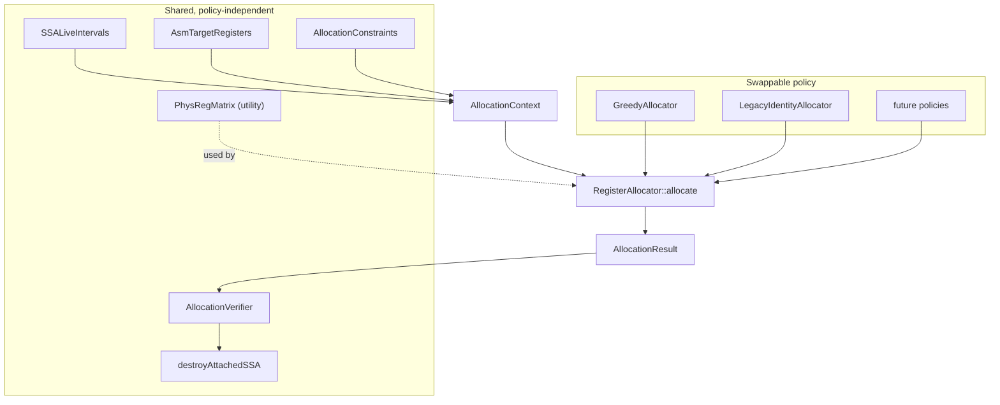

# Register allocation on attached SSA

How a colouring policy plugs into StinkyTofu, what it may read, and what it must not mutate.

SSA types, lifting, and destruction are specified elsewhere:

- [SSA representation](ssa-representation.md) — values, use-lists, block arguments, `AllocationResult`, `destroyAttachedSSA`
- [Lift Asm registers to SSA](lift-asm-registers-to-ssa-pass.md) — how physical `RegKey`s become those values

RAGreedy is the first policy, not the design.
The rollout plan, compatibility modes, and open questions live outside this document.

## 1. Scope

Take a function that already has attached SSA and produce an `AllocationResult`: each `StinkySSAValue` mapped to a physical `RegKey`.

`destroyAttachedSSA` is the only component that writes `srcRegs` / `destRegs`.
No allocator touches those fields, calls `setPhysicalBinding`, or rewrites use-lists.
A failed allocation leaves the function exactly as the lifter left it, the same contract as a rejected lift.

First target is gfx1250, VGPR then SGPR, no spilling.
A function the allocator cannot colour keeps TensileLite's original registers.
TensileLite keeps producing physical numbering; those numbers are variable names and `PhysicalBinding` hints, not the final assignment.

## 2. What allocation builds on

| Piece | Role | State |
|---|---|---|
| `LiftAsmRegistersToSSAPass` | physical operands to attached SSA | shipped |
| `StinkySSAValue` / `AttachedSSA` / block arguments | identity, uses, merges | shipped |
| `PhysicalBinding` | legacy location; the first candidate any policy tries | shipped |
| `liftedSSAUnits()` | how many DWORD slots one operand occupies | shipped |
| `AllocationResult` | colouring keyed by `valueId()`, stamped with arena shape | shipped |
| `createLegacyColoring()` | identity colouring from `PhysicalBinding` | shipped |
| `destroyAttachedSSA` | write a colouring into operands, then detach | shipped |
| `ReplayLegacyColoringPass` | `destroyAttachedSSA(f, createLegacyColoring(f))` | shipped |
| `StinkyUnreachableBlockElimPass` | erase CFG-unreachable blocks **before** lift | shipped |
| `SSASlotIndexes` / `SSALiveIntervals` | program points and live ranges over SSA values | shipped |
| `AsmTargetRegisters` / `PhysRegMatrix` | allocatable units and their occupancy | to build |
| `AllocationConstraints` | tuple runs, merge affinity, hints | to build |
| `RegisterAllocator` / `AllocatorRegistry` / `RegisterAllocationPass` | the policy seam and its driver | to build |
| `AllocationVerifier` | legality of any colouring | to build |

Lift followed by legacy colouring followed by destruction is an identity transform on the physical program.
That gate is about the lift machinery, not about allocation.

## 3. Framework

The colouring policy is one replaceable object.
Everything else is written once and shared, so a later linear-scan, occupancy-driven, or graph-colouring allocator is a new class plus a registration line.



### 3.1. The interface

```cpp
/// Everything an allocator may read. Const on purpose: no allocator mutates IR.
struct AllocationContext {
    const Function& function;
    const SSALiveIntervals& intervals;
    const AsmTargetRegisters& target;
    const AllocationConstraints& constraints;
    const std::vector<Loop>& loops;
};

/// What lowering must support for this allocator's output to be applicable.
struct AllocatorCapabilities {
    bool mayRecolourMerges = false;  // needs copy insertion on merge edges
    bool maySpill = false;           // needs scratch and waitcnt integration
};

class RegisterAllocator {
   public:
    virtual ~RegisterAllocator() = default;
    virtual const char* name() const = 0;
    virtual AllocatorCapabilities capabilities() const = 0;
    virtual Expected<AllocationResult> allocate(const AllocationContext&) = 0;
};
```

A policy decides two things only: which value to colour next, and which candidate to take when the first choice is occupied.
It does not derive legality from operands, does not verify, and does not apply.

### 3.2. Shared constraint view

`AllocationConstraints` is built once from `srcRegs` / `destRegs` with `liftedSSAUnits()`, and from `SSABlockArgument.incoming`:

- `classOf(id)` and `isAllocatable(id)`
- `hintFor(id)` from `PhysicalBinding`
- `tupleRuns()` — value IDs that must land on consecutive units, in operand order
- `affinitySets()` — a block argument plus its incoming values

This is the only place the operand walk lives, so tuple and merge rules cannot drift between allocators, for the same reason `liftedSSAUnits()` exists as one function.

### 3.3. Capability gate

The driver checks `capabilities()` against what lowering supports before it applies anything, and refuses early with a located reason.
Today `destroyAttachedSSA` rejects a merge whose inputs and result differ, and nothing implements spilling, so both capabilities must be false.
Without this gate a future allocator would silently produce a colouring destruction rejects.

### 3.4. Selection

`AllocatorRegistry` maps a name to a factory, mirroring `BackendRegistry` including its `registerAllAllocators()` guard against dead-stripping in static builds.
One pass, `RegisterAllocationPass`, serves every policy:

```cpp
struct RegisterAllocationOptions {
    std::string allocator = "greedy";  // registry name
    bool allocateSgpr = false;
    bool applyToOperands = false;      // false = shadow
    bool verify = true;
};

/// allocator == nullptr looks the policy up by name.
std::unique_ptr<Pass> createRegisterAllocationPass(
    RegisterAllocationOptions options = {},
    std::unique_ptr<RegisterAllocator> allocator = nullptr);
```

Injection at construction follows `createStinkyWmmaVgprReorderPass`, which already takes its liveness backend and its algorithm that way.
Comparing two policies over a corpus is then a config change, not a code change.

## 4. Decisions

Stay on attached SSA.
Do not PHI-eliminate into copies before colouring.
LLVM's RAGreedy runs after `PHIElimination` on virtregs; here each `StinkySSAValue` is already a single-def range, so that lowering is unnecessary and `destroyAttachedSSA` cannot emit the copies yet.

Do not build an interference graph.
Two values conflict when their live intervals overlap on the same physical unit.
That query is a physreg occupancy matrix, not a graph.

Do not add a register-pressure analysis.
Peak pressure per class is `max(overlapping intervals)`, which `SSALiveIntervals` already reports.

Do not allocate inside a `ScopeAdaptor` region.
Attached SSA does not survive splice-back; allocation is kernel-scope, whole `Function`.

Values are one DWORD.
A multi-DWORD operand is a consecutive-assignment constraint on several values, recovered from `srcRegs`/`destRegs` plus `liftedSSAUnits()`, not a wide virtreg.

Until copy insertion exists, a block argument and all of its incoming values share one colour.
`destroyAttachedSSA` already rejects any other merge.

## 5. Mapping onto attached SSA

Vocabulary, for a reader arriving from LLVM. Section 2 has the build state.

| LLVM RAGreedy | Here |
|---|---|
| virtreg | `StinkySSAValue` (`valueId()`) |
| `SlotIndex` | `SSASlotIndexes` |
| `LiveInterval` | `SSALiveIntervals`, keyed by `valueId` |
| `LiveRegMatrix` | `PhysRegMatrix`, occupancy of `(RegType, idx)` by an interval |
| `TargetRegisterInfo` | `AsmTargetRegisters` |
| `VirtRegMap` | `AllocationResult` |
| copy / preferred physreg | `PhysicalBinding` |
| `VirtRegRewriter` | `destroyAttachedSSA` |

```text
lift
  -> slot indexes
  -> live intervals
  -> allocator policy (hints, candidates, eviction)
  -> AllocationResult
  -> verifier
  -> destroyAttachedSSA          rewrite
     or compare to legacy        shadow
```

## 6. Analyses

### 6.1. Slot indexes

`computeSSASlotIndexes()` in `analysis/ssa/SSASlotIndexes.hpp` numbers the function in block-list order, which is emission order.
Each instruction gets **two** consecutive indexes, and each block a leading pair:

```text
blockStart(B)      a value live into B starts here
blockStart(B) + 1  B's arguments are defined here
useSlot(I)         I reads its operands
useSlot(I) + 1     I writes its results  == defSlot(I)
blockEnd(B)        one past B's last index
```

Blocks tile the index space with no gaps, so a block's indexes are contiguous and layout-adjacent blocks are numerically adjacent.
A block `B` holding two instructions, followed by a block `C` holding one:

```text
        block B                     block C
slot    0u  1d │ 2u  3d │ 4u  5d ││ 6u  7d │ 8u  9d
        args   │   I0   │   I1   ││ args   │   I2
```

#### Reading a slot in a dump

A dump tags every index with the half of the step it points at, `u` for the read point and `d` for the write point, so a reader does not have to work out parity.
LLVM does the same, tagging each `SlotIndex` with `B`, `e`, `r`, or `d` for its block, early-clobber, register, and dead slots; it has four sub-slots per instruction where this has two.

The letter is a **position**, not a statement about the value: `d` does not mean "this value is defined here".

Ranges are half-open, so a value is live at `start` and not live at `end`.
Two rules follow from that:

- a value defined by an instruction starts at that instruction's `d` point;
- a value whose last read is at instruction `I` ends at `I`'s `d` point, so it is still live at `I`'s `u` point where the read happens.

That is why a short-lived value prints two `d` endpoints. `[1d,3d)` is live at `1d` and `2u` and dead at `3d`, so its last live point is a read point even though neither endpoint is one.
A range can equally begin at a `u`, which is what a value arriving live at a block looks like.

Those same two rules are what make a read-modify-write operand shareable.
At `v40 = wmma(..., v40)` the old value ends at the instruction's `d` point and the new one starts there, so the two touch without overlapping and both can stay in `v40`.
Collapse the step to one index and they would overlap, no policy could share the register, and even `createLegacyColoring()` would fail verification.

No policy queries slot indexes directly.
They are the coordinate system live intervals are expressed in.

### 6.2. Live intervals

Lift's `RegKey` liveness only places merges.
`computeSSALiveIntervals()` in `analysis/ssa/SSALiveIntervals.hpp` produces intervals over `StinkySSAValue`, which is what decides whether two values may share a register.
A `LiveRange` is a sorted list of half-open `LiveSegment`s; the queries an allocator needs are `rangeOf(id)`, `overlap(a, b)`, `LiveRange::length()` for spill weight, and `peakPressure(regClass)`.

- `Kind::Register`: defined at `defSlot(defOp())`; each entry in `uses()` is a read at `useSlot(owner())`.
- `Kind::BlockArgument`: defined at `blockArgDef()` of its block.
  Incoming values are consumed on the predecessor **edge**: they stay live to the end of that predecessor and are not live inside the join, which is why a merge and its inputs can share one register.

Block dataflow, then per-block painting:

```text
liveOut[B] = union of liveIn[successors] + values used on B's outgoing edges
liveIn[B]  = uses in B whose def is elsewhere + (liveOut[B] - defs in B)
```

Loop-carried values close around back edges through this fixpoint.
Dense `valueId()` bitsets, not pointer sets.

A range is a set of half-open segments rather than one span, because a value can be dead across a region and live again after it.
The worked example below is that case.

#### A worked diamond

`DumpStinkyModulePass` prints the result when `ssaLiveOut` is set, so one pass emits the SSA form and the intervals for the same lift.
This is `tests/filecheck/lift_asm_registers_to_ssa_diamond.stir`, whose SSA form the [lift-pass document](lift-asm-registers-to-ssa-pass.md) section 9 walks through:

```text
^entry:  v9 = v_add_f32(v20, v21)      Successors: ^left, ^right
         SCC0 = v_cmp_eq_u32(v10, v11)
         s_cbranch_scc1(right, SCC0)
^left:   v5 = v_add_f32(v22, v23)      Successors: ^join
         s_branch(join)
^right:  v5 = v_add_f32(v24, v25)      Successors: ^join
^join:   v6 = v_add_f32(v5, v9)
```

Both arms write `v5`, so `^join` needs a merge for it.
That merge is `%9`, taking `%12` from `^left` and `%11` from `^right`.
`v9` is written only in `^entry`, which dominates the join, so it needs no merge.

Slots are handed out in layout order, two per block plus two per instruction:

| Block | start | argDef | instruction use/def | end |
|---|---|---|---|---|
| `^entry` | 0 | 1 | 2/3, 4/5, 6/7 | 8 |
| `^left` | 8 | 9 | 10/11, 12/13 | 14 |
| `^right` | 14 | 15 | 16/17 | 18 |
| `^join` | 18 | 19 | 20/21 | 22 |

```text
@lift_asm_registers_to_ssa_diamond
slots=22 values=13
%1:v [1d,5d)
%2:v [1d,5d)
%3:v [1d,3d)
%4:v [1d,3d)
%5:v [1d,11d)
%6:v [1d,11d)
%7:v [1d,8u) [14u,17d)
%8:v [1d,8u) [14u,17d)
%9:v [19d,21d)
%10:v [3d,21d)
%11:v [17d,18u)
%12:v [11d,14u)
%13:v [21d,22u)
peak v=8
```

`%1`–`%8` are the eight live-ins, sorted by register key: `v10`, `v11`, `v20`–`v25`.
So `%3:v [1d,3d)` is `v20`, born as an entry argument at 1 and killed by the add that reads it at 2.
`%10:v [3d,21d)` is `v9`, defined at 3 and not read until the join at 20, so it stays live across the whole diamond.

`%7` and `%8` are `v24` and `v25`, read only by `^right`.
On the CFG they flow `^entry` to `^right`, but in layout order `^left` sits between the two and occupies 8 through 14.
The hole is that gap: a single span `[1d,17d)` would hold two registers across `^left`, which needs neither.
This is the case that forces a range to be a list of segments rather than one span.

`%12` ends at `14u` and `%11` at `18u`, each at the end of its own arm, because an incoming value is consumed on the predecessor edge rather than inside the join.
The merge `%9` only starts at `19d`.
None of the three overlap, so one register holds all of them and destruction needs no copy on either edge.

`peak v=8` is measured at slot 1, where all eight live-ins are simultaneously live.

`SSALiveIntervalsAnalysis` caches the result and is deliberately absent from `preserveCFGAnalyses()`: reordering instructions or rewriting operands invalidates intervals even when the CFG is untouched.

### 6.3. Register pressure

Peak pressure per class comes off the same segments, so there is no separate pressure analysis.
The builder lays a delta array over the slot space, adds each value's width at every segment start and subtracts it at every segment end, then takes the running maximum.

Two things the number is not.
It is a lower bound on registers needed, because it ignores tuple fragmentation: a peak of 40 DWORDs can still fail if 4-DWORD operands do not fit the free runs.
And it is not occupancy, because `getWavesPerSimd()` takes the final allocated count; pressure only predicts the best case a policy could reach.

Point queries, per-block peaks, and precoloured versus freely allocatable pressure are all derivable from the same segments and not exposed yet.

### 6.4. Physreg matrix

For each allocatable unit `(RegType, idx)`, record which interval currently occupies it.
Interference is `matrix.overlaps(type, idx, interval)`, not a pair of values.

A 2-DWORD operand queries two consecutive units.
Reserved and ABI-fixed indices are holes: they never become candidates.

EXEC, VCC, SCC, M0, literals, and memtokens are not values and do not occupy VGPR/SGPR units.
VCC and EXEC are their own `RegType` in this IR, so SGPR colouring cannot alias them by index.

The matrix is a utility rather than part of the allocator interface: a linear-scan or graph-colouring policy may want a different occupancy structure.

### 6.5. Target registers

`AsmTargetRegisters` is deliberately small for v1, gfx1250 only:

- VGPR and SGPR counts and allocation granules
- reserved / ABI-fixed ranges
- allocatable classes matching lift (`RegType::V` and `RegType::S`)

Alignment, AGPR aliasing, VGPR-MSB, occupancy tiers, and call clobbers stay out until a colouring is legal without them.

## 7. Constraints the colourer reads

Recovered from IR, not copied onto the value.

| Constraint | Source | Rule |
|---|---|---|
| Consecutive range | operand + `liftedSSAUnits()` | the slots of one operand occupy consecutive phys units in operand order |
| Tied / RMW | overlapping `PhysicalBinding` on a src and a dest, plus `isReadWrite` | may share a phys unit |
| PHI / block argument | `SSABlockArgument.incoming` | result and every incoming value get the same colour |
| Hint | `PhysicalBinding` | first candidate, not identity |
| Ignored specials | not lifted | not in the matrix |
| Alignment | none yet | deferred |
| ABI precolour | inferred live-ins, no ABI metadata | ordinary values, or pinned to `PhysicalBinding` until ABI exists |

Partial redefinition is already separate values:

```text
v[20:27] = old
v[20:21] = ds_load_b64(...)
consume(v[20:27])
```

`%new20` and `%new21` are new; `%old22`…`%old27` keep their reaching values.
They constrain each other only when they appear together in one operand.

Inferred live-ins interfere from function entry.
That is conservative and correct; it is not a blocker.

## 8. The greedy policy

Worklist of unassigned `valueId`s.
Priority is `useCount × loopDepth / intervalLength`, with `valueId` as the tie break so runs are deterministic.

```text
while queue not empty:
  v = pop highest
  try PhysicalBinding, then first-fit in v's class
  if the candidate overlaps v's interval on the matrix:
      evict a lower-weight occupant, requeue it, retry
  if still none:
      fail the function (no spill, no split)
  result.assign(v, {type, idx, NONE})
  matrix.bind(type, idx, v.interval)
```

Eviction is what makes this RAGreedy rather than linear assignment.
Splitting and spilling are not v1.

How it satisfies the two constraints that span several values.

A tuple run, say `%c` at unit 0 of a 2-DWORD operand whose unit 1 is `%d`: if `%d` already has a colour, `%c` is forced to one below it, and failing that is an eviction or a failure like any other; if `%d` does not, take a run of two free units and hint `%d` at the second.

An affinity set, `{argument} ∪ incoming`: the first member assigned pins the rest, and evicting one member evicts the set.
That is what keeps `capabilities().mayRecolourMerges` false, and therefore what keeps destruction from ever needing a copy on a merge edge.

## 9. Verifier

Independent of the colourer, run on every `AllocationResult` including legacy:

- `result.shape()` matches the arena
- every value is assigned
- no two overlapping intervals share a physical unit
- every multi-DWORD operand's units are consecutive in operand order
- every block argument and its incoming values share a colour
- reserved units are unused

Failure is a diagnostic with `valueId`, class, interval, and the conflicting occupant.
Do not apply a colouring the verifier rejects.

Because the verifier runs on the legacy colouring too, live intervals are computed even for a policy that only copies `PhysicalBinding`.

## 10. Pipeline placement

Scheduling and every pass that creates temporaries or changes instruction order run **before** lift, on physical IR.

Kernel-scope slot, after `RegionClonePass` rebuilds the final CFG, before `InsertVgprMsbPass`:

```text
StinkyUnreachableBlockElimPass
  -> RemoveDefUseAnalysisPass
  -> LiftAsmRegistersToSSAPass
  -> RegisterAllocationPass          shadow: stop here
  -> destroyAttachedSSA
  -> InsertVgprMsbPass
  -> waitcnt / delay / hazard / emit
```

Lifting needs final order, so it follows the scheduler.
It needs a whole function, so it cannot sit in the region adaptor.
It must precede every consumer of physical numbers: `InsertVgprMsbPass`, `InsertWaitAluPass`, `InsertCoexecHazardPass`, `InsertDelayAluPass`, `SetMatrixReusePass`, `Gfx1250HazardPass`.

`StinkyWaitCntInsertionPass` currently runs at region scope, before this slot.
Recolouring after those waits is unsound: a value moved into a register an outstanding load will land in has no wait.
Rewrite mode therefore moves waitcnt insertion to kernel scope after destruction.
Shadow mode does not need that move, because it never rewrites.

`kernelHasCallSites()` keeps a call-connected kernel on the legacy path until a calling convention exists.
