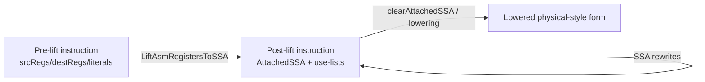
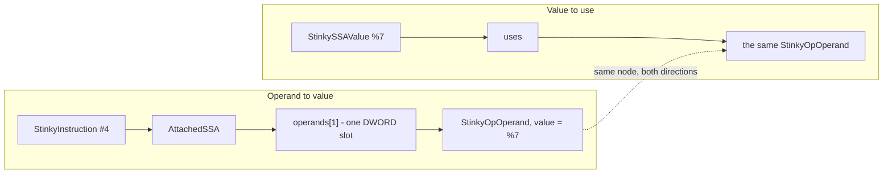
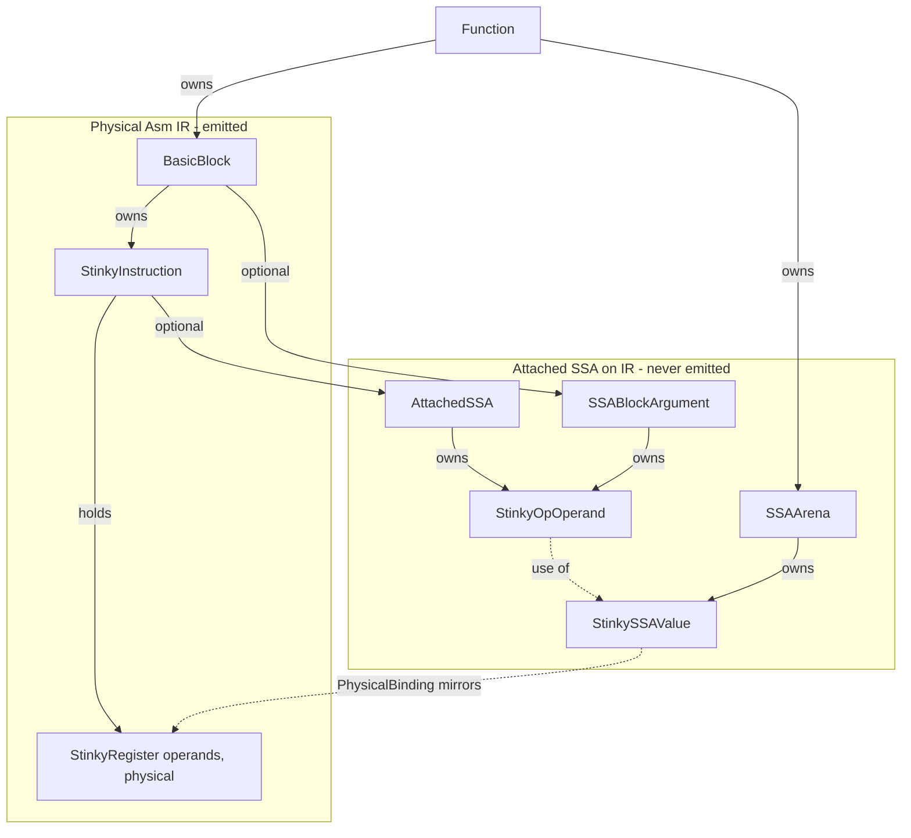
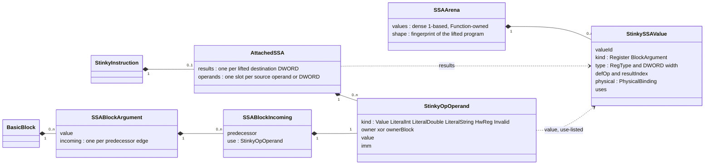
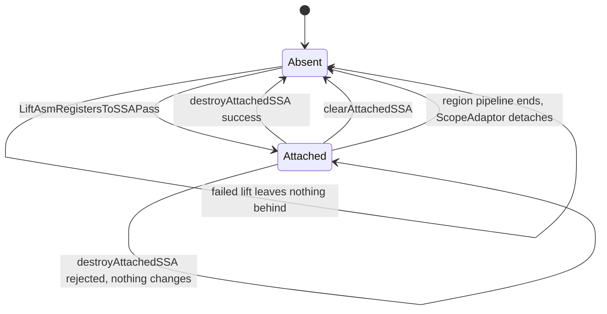

# Attached SSA on StinkyTofu Asm IR

How SSA is represented on asm IR, and the contract every pass that reads or writes it must hold to.

The types live under `ir/asm/ssa/`.
[`LiftAsmRegistersToSSAPass`](lift-asm-registers-to-ssa-pass.md) is the only thing that builds them; allocation and destruction consume them; and `AsmPrinterOptions::ssaForm` prints them (section 10.1).
A function with no attached SSA is the valid pre-lift state, so every invariant here is conditional on SSA being present.

## 1. Purpose

This guide defines how StinkyTofu represents SSA on top of existing asm IR without breaking current behavior:

- pre-lift IR remains the current physical-style asm IR;
- lifting attaches SSA identity to instructions;
- SSA rewrites operate on values and use-lists;
- allocation/lowering materializes final physical assignment.

`StinkyRegister` is **not** a `StinkySSAValue`.
They are parallel types with different jobs: copyable physical spelling vs arena-owned SSA identity.
Section 4.2 is the contract for that split.

This is a developer contract document, not an implementation plan.

## 2. Pipeline contract

The expected pipeline shape is:

1. start from non-SSA asm IR;
2. run legacy passes that read/write physical-style operands;
3. lift to SSA (attach SSA);
4. run SSA-based rewrites;
5. run register allocation and lowering.

Key boundary:

- Before lift: physical-style register API is authoritative.
- After lift: SSA value edges are authoritative for semantics.

How lift builds attached SSA is in [Lift Asm registers to SSA](lift-asm-registers-to-ssa-pass.md) section 8; how a colouring is written back out is in section 5.3 below.

## 3. IR state model

`StinkyInstruction` has two valid states.



Interpretation:

- Pre-lift state is always legal and fully supported.
- Post-lift state adds SSA metadata; `srcRegs` / `destRegs` may still hold `StinkyRegister` spellings for compatibility. Those spellings are not SSA values.
- Reordering instructions does not change SSA identity edges by itself.

## 4. Core model and API contracts

### 4.1. `StinkySSAValue`

`StinkySSAValue` is the SSA identity object.
It is allocated only in a Function-owned `SSAArena`, is not copyable, and is identified by pointer and `valueId()`.
`Kind` distinguishes instruction results from block arguments.
There is no subclass: both kinds are the same type and may carry a `PhysicalBinding`.

`Kind::Register` means "this SSA value is a register-class result." It does not mean the object is a `StinkyRegister`.

```cpp
class StinkySSAValue {
public:
    enum class Kind : uint8_t {
        Register,
        BlockArgument,
    };

    struct TypeInfo {
        RegType regType;
        uint16_t dwordWidth;
    };

    struct PhysicalBinding {
        RegType type;
        uint32_t idx;
        uint16_t num;
        int16_t offset;
        bool isVirtual;
        bool isMinus;
        bool isAbs;
    };

    StinkySSAValue(const StinkySSAValue&) = delete;
    StinkySSAValue& operator=(const StinkySSAValue&) = delete;

    Kind kind() const;
    const TypeInfo& type() const;
    uint32_t valueId() const;             // dense, 1-based, stable within one Function
    StinkyInstruction* defOp() const;     // null for block arguments
    uint16_t resultIndex() const;

    std::span<StinkyOpOperand* const> uses() const;
    bool hasOneUse() const;
    bool useEmpty() const;
    size_t useCount() const;

    void replaceAllUsesWith(StinkySSAValue* newValue);

    bool hasPhysicalBinding() const;
    const PhysicalBinding& physical() const;
    void setPhysicalBinding(const PhysicalBinding& b);
    void clearPhysicalBinding();

    const std::string& symbol() const;
    void setSymbol(std::string s);

private:
    friend class StinkyOpOperand;
    friend class StinkyInstruction;
    friend class SSAArena;
    void addUse(StinkyOpOperand* use);
    void removeUse(StinkyOpOperand* use);
};
```

Contract:

- `uses()` is source-of-truth use-list data, not derived by scanning instructions.
- `replaceAllUsesWith` must preserve use-list consistency by delegating per-use updates to operand setters.
- `replaceAllUsesWith` rejects null, self, and incompatible kind/type/width.
- Value identity is independent from physical binding.
- Physical binding is metadata/provenance until allocation decides final mapping.

### 4.2. `StinkyRegister` is not a `StinkySSAValue`

`StinkyRegister` is a copyable value type stored in `srcRegs` / `destRegs`.
It is a physical spelling (`v8`, a literal, `hwreg(...)`), not SSA identity.
It does **not** inherit `StinkySSAValue`, and a `StinkyRegister` is never used as a `StinkySSAValue*`.

They cannot be the same type:

| | `StinkyRegister` | `StinkySSAValue` |
|---|---|---|
| Job | Physical / literal operand spelling | SSA identity |
| Storage | `vector<StinkyRegister>` by value | Function `SSAArena`, stable pointer |
| Copy | Copied by `addSrcReg` / clone / peephole | Deleted; identity is the pointer |
| Contents | Register **or** literal / hwreg union | Register-class SSA value or block arg |
| Use-list | None | `uses()` / `replaceAllUsesWith` |

Existing `addSrcReg` / `getSrcRegs` APIs are unchanged and keep taking `StinkyRegister`.

Physical-style construction stays as today:

```cpp
inst->addDestReg(StinkyRegister("v", 4, 1));
```

That call does not create SSA.
Arena factories return `StinkySSAValue*`:

```cpp
StinkySSAValue* v = func.ssaArena().createRegister(RegType::V, 1);
v->setPhysicalBinding({RegType::V, 20, 1, 0, false, false, false});
```

`PhysicalBinding` on a `StinkySSAValue` is copied metadata (legacy `v8` / `s0` origin).
It is not a `StinkyRegister` and does not make the value one.

### 4.3. `StinkyOpOperand`

Operand slots may hold SSA values or non-value payloads.

```cpp
struct HwRegPayload {
    uint16_t id;
    uint16_t offset;
    uint16_t size;
};

using LegacyImmPayload =
    std::variant<std::monostate, int32_t, double, std::string, HwRegPayload>;

class StinkyOpOperand {
public:
    enum class Kind : uint8_t {
        Value,
        LiteralInt,
        LiteralDouble,
        LiteralString,
        HwReg,
        Invalid
    };

    StinkyOpOperand(const StinkyOpOperand&) = delete;
    StinkyOpOperand& operator=(const StinkyOpOperand&) = delete;

    StinkyInstruction* owner() const;     // null for block-argument uses
    BasicBlock* ownerBlock() const;       // set for PHI-edge uses (section 4.6)
    uint16_t operandIndex() const;
    Kind kind() const;

    StinkySSAValue* value() const;
    void setValue(StinkySSAValue* v);        // updates old/new use-lists

    const LegacyImmPayload& imm() const;  // for literal/hwreg kinds
    void setImm(LegacyImmPayload p);
};

std::unique_ptr<StinkyOpOperand> makeSSAValueOperand(StinkySSAValue* value);
std::unique_ptr<StinkyOpOperand> makeSSAImmOperand(LegacyImmPayload payload);
```

Contract:

- `value()` and `imm()` are mutually exclusive views of one slot.
- `setValue` is the only way to change value-typed edges safely.
- An operand is non-copyable and is owned through `unique_ptr`, because its address is the use-list node. Moving it would dangle the entry in `StinkySSAValue::uses()`.
- Exactly one of `owner()` / `ownerBlock()` is non-null.

### 4.4. `StinkyInstruction`

Existing register APIs remain unchanged.
SSA APIs are additive.

```cpp
class StinkyInstruction : public IRBase {
public:
    const HwInstDesc* getHwInstDesc() const;
    uint16_t getUnifiedOpcode() const;
    bool is(InstFlag) const;

    // Existing physical-style APIs (unchanged).
    void addSrcReg(const StinkyRegister& srcReg);
    void addDestReg(const StinkyRegister& destReg);
    const std::vector<StinkyRegister>& getSrcRegs() const;
    const std::vector<StinkyRegister>& getDestRegs() const;
    void setSrcReg(size_t idx, const StinkyRegister& srcReg);
    void setDestReg(size_t idx, const StinkyRegister& destReg);

    // SSA lifecycle.
    bool hasAttachedSSA() const;
    void attachSSA(AttachedSSA ssa);
    void clearAttachedSSA();

    // SSA APIs (valid only when attached SSA exists).
    size_t getNumSSAResults() const;
    StinkySSAValue* getSSAResult(size_t i) const;
    size_t getNumSSAOperands() const;
    StinkyOpOperand* getSSAOperand(size_t i);
    StinkySSAValue* getSSAOperandValue(size_t i) const;
    void setSSAOperandValue(size_t i, StinkySSAValue* v);

private:
    std::optional<AttachedSSA> attachedSSA_;
};
```

`AttachedSSA` is a separate struct:

```cpp
struct AttachedSSA {
    std::vector<StinkySSAValue*> results;
    std::vector<std::unique_ptr<StinkyOpOperand>> operands;
};
```

Contract:

- Pre-lift code may ignore SSA APIs entirely.
- Post-lift rewrites must prefer SSA APIs for semantic rewiring.
- `attachSSA` binds each result's `defOp` / `resultIndex` and each operand's owner instruction.
- `clone()` copies physical operands and modifiers only. A clone starts unattached, because use-lists cannot be duplicated.

Both vectors are flat and per DWORD, not per operand.
A lifted operand occupies one slot per DWORD; an operand that was not lifted occupies exactly one operand slot holding its immediate payload, and a destination that was not lifted occupies no result slot at all.

Recovering "which values does source operand 2 bind" therefore means walking `getSrcRegs()` and the slot list together, stepping by `liftedSSAUnits(reg, classes)` from `ir/asm/ssa/SSAOperandUnits.hpp`, where `classes` is the lift scope on the arena.
That helper is the single definition of the step size, because lifting, destruction, and the `ssaForm` printer all do this walk and disagreeing by one silently shifts every later operand onto the wrong value.

### 4.5. `SSAArena` and `Function`

Values are allocated only in the Function-owned arena.
Nothing else may create a `StinkySSAValue`; the constructor is private and `SSAArena` is its friend.

```cpp
class SSAArena {
public:
    Function* owner() const;

    StinkySSAValue* createRegister(RegType type, uint16_t dwordWidth = 1);
    StinkySSAValue* createBlockArgument(RegType type, uint16_t dwordWidth = 1);

    size_t valueCount() const;
    StinkySSAValue* get(uint32_t valueId) const;   // null for 0 / out of range
    std::span<StinkySSAValue* const> values() const;

    void clear();
};

class Function {
public:
    SSAArena& ssaArena();
    const SSAArena& ssaArena() const;

    bool hasAttachedSSA() const;   // any instruction or block carries SSA
    void clearAttachedSSA();       // physical operands are left unchanged
};
```

Contract:

- `valueId()` is dense and 1-based; `0` is the invalid id.
- `clearAttachedSSA()` unbinds instruction results, destroys operand use nodes, clears block arguments, then empties the arena, in that order.
- The arena member is declared before the block list on `Function`, so blocks and their SSA operands are destroyed before the values they point at.

### 4.6. `BasicBlock` block arguments

PHIs and live-ins are block arguments, not `GFX::PHI` instructions.

```cpp
struct SSABlockIncoming {
    const BasicBlock* predecessor = nullptr;
    std::unique_ptr<StinkyOpOperand> use;
};

struct SSABlockArgument {
    StinkySSAValue* value = nullptr;
    std::vector<SSABlockIncoming> incoming;
};

class BasicBlock {
public:
    const std::vector<SSABlockArgument>& ssaArguments() const;
    bool hasSSAArguments() const;

    SSABlockArgument& addSSAArgument(StinkySSAValue* value);
    void setSSAArgumentIncoming(size_t argIndex, const BasicBlock* predecessor,
                                StinkySSAValue* value);
    void clearSSAArguments();
};
```

Contract:

- A live-in has a block-argument value and an empty `incoming` list.
- A merge has one incoming use per CFG predecessor *edge*, so a block that is a predecessor twice gets two entries.
- `incoming` order is not predecessor order. Lift appends entries as its dominator walk reaches each predecessor, so look an edge up by predecessor rather than by position. The order is deterministic, but it is not a promise.
- Incoming uses are owned by the block, so their `ownerBlock()` is set and `owner()` is null.
- The argument value's `kind()` is `Kind::BlockArgument` and its `defOp()` is null.

### 4.7. The two directions of def-use

The same relationship is stored twice, from opposite ends, and keeping the two in agreement is most of what `verifyAttachedSSA` does.



The two directions share one object: the use-list holds pointers to the very operand nodes the instruction owns, so `setValue` updates both ends at once and they cannot drift apart by construction.
What the verifier checks is that nothing hand-built a use-list entry that no operand slot backs, or an operand whose value does not list it.

Exact use counts still work, because the nodes are per slot and never deduplicated: a value read through two operands of one instruction has two operand nodes and therefore two use-list entries.

### 4.8. Operand slots are flat

`AttachedSSA.operands` is indexed by value slot, not by instruction operand, so `operands[k]` is not source operand `k`.
Each source operand contributes `liftedSSAUnits(reg, classes)` slots, one per DWORD, and a source that is not lifted contributes exactly one slot carrying its immediate payload instead, whatever its width.
"Not lifted" covers a class the lifter cannot model, a literal or special register, and a class this lift deliberately left physical.
`results` works the same way for destinations, except that a destination which is not lifted contributes no slot at all: it defines no value, so there is nothing for a slot to hold.

For `v[4:5] = v_add_f64(v[10:11], 0x3ff0000000000000)`, two source operands produce three slots:

```text
srcRegs                        operands
  0  v[10:11]  -- 2 units -->    [0] value %a      (v10)
                                 [1] value %b      (v11)
  1  literal   -- 0 units -->    [2] imm 0x3ff0000000000000

destRegs                       results
  0  v[4:5]    -- 2 units -->    [0] %c            (v4)
                                 [1] %d            (v5)
```

`SCC0 = v_cmp_eq_u32(v10, v11)` is the destination case: `destRegs` holds one entry, and `results` is empty, because SCC is not an allocatable class.

Recovering "which values does source operand 1 bind" therefore means walking `srcRegs` and the slot list together, accumulating each operand's step.
`liftedSSAUnits(reg, classes)` in `ir/asm/ssa/SSAOperandUnits.hpp` is the single definition of that step size, so lifting, destruction, and the `ssaForm` printer cannot disagree about it; disagreeing by one silently shifts every later operand onto the wrong value.

`classes` is the lift scope and is required rather than defaulted, precisely so a defaulted call site cannot keep an older answer while the rest move on.
Read it from `SSAArena::liftedClasses()`, which records the classes the arena's SSA was built for.
It cannot be inferred from the shape fingerprint: that hashes the physical program, which is identical whichever classes were lifted.

Worked example for `v2 = v_add_f32 v0, v1` where `v0` and `v1` arrive as live-ins:

```text
arena
    %1  BlockArgument  physical v0   uses = [ #0 operand0 ]
    %2  BlockArgument  physical v1   uses = [ #0 operand1 ]
    %3  Register       physical v2   defOp #0, resultIndex 0

^entry block arguments
    arg0 = %1, no incoming    (a live-in arrives without an edge)
    arg1 = %2, no incoming

#0 AttachedSSA
    results  = [ %3 ]
    operands = [ value %1, value %2 ]
```

Which field answers which question:

```text
value.physical()       which physical register the value was lifted from
value.kind()           instruction result or block argument
value.defOp()          the instruction that produced a Register value
value.uses()           every operand slot that consumes the value
inst.getSSAResult(i)   value produced by result slot i
inst.getSSAOperand(i)  operand slot i, value or immediate
block.ssaArguments()   values arriving at the top of the block
arg.incoming[e]        value arriving on one predecessor edge
```

## 5. Ownership and lifetime

Two representations coexist after lift.
The physical one is still the emitted program, and attached SSA on IR nodes describes value dataflow.



Solid arrows are ownership, dashed are references.
Every dashed arrow crosses from a node the kernel keeps to a value the arena owns, which is why attached SSA cannot outlive its `Function` (section 5.1).

There is no inheritance edge from `StinkyRegister` to `StinkySSAValue`.
Instructions own physical spellings by value and point at SSA values through `AttachedSSA` / `StinkyOpOperand`.

The live types are declared in section 4.
How they relate:



Required ownership rule:

- `StinkySSAValue` instances are allocated in a Function-owned arena to keep stable pointers across rewrites, instruction motion, and vector reallocations.

Every cross-reference between these types is a raw pointer, which is safe because the arena owns its values in stable `unique_ptr` storage: they do not move when it grows, and `clear()` is the only thing that invalidates them.

One `Kind` field is the whole classification.
A live-in and a merge are both `BlockArgument`; what separates them is whether the argument has incoming edges.
There is no `Undef` kind, because lifting either finds a reaching definition or creates a live-in.

### 5.1. Lifecycle



A pass that mutates physical operands after lift must either keep attached SSA coherent or clear it.
Destruction refuses to lower when the arena shape no longer matches the function, and a rejected destroy changes neither the operands nor the SSA.

The arena is a `Function` member, so attached SSA can never outlive the function that produced it.
That matters where instructions move between functions: `ScopeAdaptor` extracts a region into a temporary `Function`, runs an inner pipeline, and splices the instructions back into the kernel before destroying the temporary.
Any SSA still attached at that point would leave the spliced-back instructions holding freed values, so `ScopeAdaptor` detaches once the inner pipeline finishes.
A region-scoped pipeline can therefore lift and inspect SSA, but cannot hand it onwards.

### 5.2. The shape fingerprint

Nothing tracks IR revisions, and mutation happens on `BasicBlock` and on instruction operands, neither of which notifies the `Function`.
A fingerprint of the program a lift was built from is therefore what tells a later consumer whether the SSA it is holding still describes the function in front of it.

`computeFunctionShape()`, in `analysis/asm/ssa/SSAFunctionShape.hpp`, hashes everything attached SSA depends on: block count, per-block edge counts, instruction count and order, opcodes, and every register operand.
Computing it walks the whole function, which is why it sits in the analysis layer, while the `kUnstampedShape` sentinel ships with the value type in `ir/asm/ssa/` because the arena itself has to store a shape.
The lifter stamps it into the `SSAArena`, and `AllocationResult` copies it from the arena it was computed against.

Two checks use it, and both reject rather than proceed.
SSA destruction refuses attached SSA whose stamp does not match the function it is about to rewrite, and refuses an allocation whose stamp does not match the arena.
Hand-built SSA, as the unit tests construct, carries `kUnstampedShape` and is exempt.

### 5.3. Leaving SSA

Destruction writes a colouring into the physical operands and then detaches.
`AllocationResult` is that colouring, mapping each value to a physical register; `createLegacyColoring()`, in `transforms/asm/ra/LegacyColoring.hpp`, fills it from each value's `PhysicalBinding`, which reproduces the registers the function was lifted from.
The colouring type lives in `ir/asm/ssa/AllocationResult.hpp`, beside the data model rather than with the allocators, because it is the SSA subsystem's exit interface and not anyone's policy.

```cpp
// transforms/asm/ssa/SSADestruction.hpp
SSADestructionResult destroyAttachedSSA(Function&, const AllocationResult&);
```

`destroyAttachedSSA` is the only component that writes a register operand. Pairing it with `createLegacyColoring()` puts every register back where it was lifted from, which is what `RegisterAllocationPass` does when asked for the `legacy` policy with `apply`.

Value IDs mean something only relative to one arena, so `AllocationResult` carries the arena shape it was computed against.
On success, destruction clears attached SSA after rewriting operands.
A function with no attached SSA is left alone.

The rewrite is atomic: every operand is validated before any is modified, so a rejected colouring leaves the function with its original registers, exactly like a rejected lift.

Five things are rejected rather than mis-lowered:

- attached SSA whose arena shape does not match the function, meaning the program changed after it was lifted;
- an allocation whose fingerprint does not match the arena, meaning it was computed against a different lift;
- a value with no assigned register;
- a range operand whose units are not consecutive in operand order, which no physical operand can encode;
- a block argument whose inputs and result do not all land on the same register. Lowering that needs a copy on the incoming edge, and copy insertion, parallel-copy sequencing, and critical-edge splitting are not implemented. The producer's colouring never reaches this case, since every version of a register colours back to that same register.

The first two run before anything else touches the IR, since stale SSA cannot be walked safely.

## 6. Range and partial-definition behaviour

SSA is built per DWORD:

```text
v[20:27] = old_value
v[20:21] = ds_load_b64(...)
consume(v[20:27])
```

becomes conceptually:

```text
(%new20, %new21) = ds_load_b64(...)
consume(%new20, %new21, %old22, %old23,
        %old24, %old25, %old26, %old27)
```

Only `v20` and `v21` receive new SSA values.
The other units retain their reaching values.

The same per-unit treatment covers overlapping source ranges, where the shared unit is one value read through two operands, and a destination range overlapping its own source, where the overlapping unit is read as the incoming value and written as a new one.

### 6.1. Where tuple constraints live

Per-DWORD SSA does not remove tuple constraints, but it does not need a new field to carry them either.
The physical operand is the grouping record: the slots `liftedSSAUnits(reg, classes)` covers are the units of that operand, in operand order, and each unit's `PhysicalBinding` is that operand's corresponding physical unit.
Allocation reads the slots together with the original instruction operand, so "these four values occupy four consecutive registers in this order" is fully represented.

Deliberately not added:

- A `requiresConsecutive` flag would restate `reg.num > 1`. Redundant state that can disagree with the operand is worse than none.
- Alignment is not recorded because no operand alignment metadata exists in the instruction descriptors yet. Inventing values would be worse than deferring; it belongs with target register information.
- A tied-operand field would restate what the bindings already show. A read-modify-write operand is visible as a source operand and a destination operand whose units share a `PhysicalBinding`, which is exactly what allocation needs to decide whether they may share a physical register. `OperandFieldDesc` additionally carries `isReadWrite`, so the instruction can confirm the tie without attached SSA duplicating it.

## 7. Invariants

These invariants must hold whenever `hasAttachedSSA() == true`.

1. Every `Kind::Value` operand has non-null `StinkySSAValue*`.
2. Every use appears exactly once in its value use-list.
3. Every result value has `defOp == owner instruction`.
4. `resultIndex` matches its slot in `AttachedSSA.results`.
5. `setSSAOperandValue` updates old and new use-lists atomically.
6. Reordering instructions alone does not mutate value edges.
7. Pre-lift instructions are allowed to have no attached SSA.
8. Block arguments have `Kind::BlockArgument` and a null `defOp`; a merge carries one incoming use per CFG predecessor edge, in unspecified order.
9. `clone()` yields an unattached instruction, so use-lists are never duplicated.
10. No value outlives its uses: operands are destroyed before the arena.

`verifyAttachedSSA` (section 10) is the executable form of this list.

## 8. Mutation semantics


The APIs below are the rewrite primitives.
How lift produces the SSA they rewrite is in [Lift Asm registers to SSA](lift-asm-registers-to-ssa-pass.md) section 8; how it is lowered afterwards is in section 5.3.

### 8.1. Operand rewiring

`setSSAOperandValue(i, newV)` performs:

1. validate attached SSA exists and index is in range;
2. fetch old value from operand slot;
3. remove use from old value;
4. write new value pointer;
5. add use to new value.

This is the primitive operation for SSA-safe rewrites.

### 8.2. Value-level RAUW

`replaceAllUsesWith(newValue)` is a utility over operand rewiring:

1. snapshot current uses;
2. for each use, call `setValue(newValue)`;
3. assert old value has zero uses.

### 8.3. Result changes

Do not provide a general result setter.

- SSA results are definitions, not mutable payload slots.
- Preferred pattern: create a new def value and rewrite uses (RAUW).

## 9. Developer usage patterns

### 9.1. Pre-lift pattern

Use existing APIs exactly as today:

```cpp
StinkyInstruction* inst = b.create(getMCIDByUOp(GFX::v_add_f32, arch));
inst->addDestReg(StinkyRegister("v", 4, 1));
inst->addSrcReg(StinkyRegister("v", 0, 1));
inst->addSrcReg(StinkyRegister("v", 1, 1));
```

No SSA assumptions are required.

### 9.2. Post-lift edge rewrite pattern

```cpp
assert(defA->hasAttachedSSA() && use->hasAttachedSSA());
StinkySSAValue* oldV = use->getSSAOperandValue(0);
StinkySSAValue* newV = defA->getSSAResult(0);
use->setSSAOperandValue(0, newV);
assert(oldV != newV);
```

The textual register spelling may stay unchanged while value identity changes.

### 9.3. Create new value then rewrite

```cpp
// Insert instruction (legacy fields allowed for compatibility).
StinkyInstruction* newDef = b.create(getMCIDByUOp(GFX::v_add_f32, arch));
newDef->addDestReg(StinkyRegister("v", 20, 1));
newDef->addSrcReg(StinkyRegister("v", 6, 1));
newDef->addSrcReg(StinkyRegister("v", 7, 1));

// Create SSA value in Function-owned arena.
StinkySSAValue* newVal = func.ssaArena().createRegister(RegType::V, 1);
newVal->setPhysicalBinding({RegType::V, 20, 1, 0, false, false, false});

// Attach SSA on newDef (helper naming illustrative).
newDef->attachSSA(buildAttachedSSA(
    /*results=*/{newVal},
    /*operands=*/{someSsaInput0, someSsaInput1}));

// Rewire one use.
use->setSSAOperandValue(0, newVal);
```

`addDestReg(StinkyRegister(...))` only writes physical spelling.
A `StinkySSAValue` becomes a definition only after arena allocation plus attachment as a result of an instruction.
The two objects stay distinct even when `PhysicalBinding` matches the `StinkyRegister` in `destRegs`.

## 10. Verification and diagnostics

`verifyAttachedSSA` is the in-memory checker.
It reports every violation it finds, in deterministic order, rather than asserting on the first one.

```cpp
struct AttachedSSAVerificationResult {
    std::vector<std::string> errors;
    bool ok() const;
    std::string toString() const;
};

AttachedSSAVerificationResult verifyAttachedSSA(const Function& function);
```

A function with no attached SSA and an empty arena is valid: that is the pre-lift state.
Instructions without `AttachedSSA` are skipped.
When any SSA is present, the arena's values are always checked for use-list symmetry.
Diagnostics are located as `@function #instruction resultN/operandN` or `@function ^block argN incomingN`, in function order.

Block arguments:

- each argument value is non-null and `Kind::BlockArgument`;
- a block argument has no defining instruction;
- each incoming predecessor is a CFG predecessor of the block;
- each incoming use is owned by that block and is non-null.

Instruction results and operands:

- each result is non-null; `defOp` and `resultIndex` match the owner;
- each operand node exists; `owner()` is the instruction;
- a `Kind::Value` operand is non-null.

Use-list symmetry:

- every use-list entry points back at that value and is an IR operand;
- no duplicate use-list entries;
- every observed value operand appears on its value's use-list.

The lifter runs this checker when its `verify` option is enabled.
Two things it deliberately does not do: shape-fingerprint rejection is a destruction and allocation gate (section 5.2), not a verifier check; and the dataflow properties lifting establishes by construction — dominance of uses, one value per allocatable source unit, sources read before destinations are defined, range unit order — are not re-derived here.
The verifier covers what a later rewrite could break.

### 10.1. Inspecting attached SSA


There is no separate SSA printer.
`AsmPrinterOptions::ssaForm` switches the existing `AsmPrinter` between the physical program and attached SSA:

```cpp
struct AsmPrinterOptions {
    int indent = 2;
    bool ssaForm = false;  // default: physical, byte-identical to before
};
```

The toggle is off by default, so attaching SSA changes nothing about what every existing consumer prints.

#### 10.1.1. The ssaForm text

An excerpt, with the branch arms elided; the [lift-pass document](lift-asm-registers-to-ssa-pass.md) section 9 has a complete worked function with its real dump.

```text
st.func @kernel() {
  ^entry(%1:v, %2:v):
    %3:v = "st.v_add_f32"(%1:v, %2:v) { issueCycles = 1, latencyCycles = 5 }
    SCC0 = "st.v_cmp_eq_u32"(%1:v, %2:v) { issueCycles = 1, latencyCycles = 5 }
    Successors: ^left, ^right
  ^join(%9:v):
    %9:v = phi(^left: %7:v, ^right: %8:v)
    [%10:v, %11:v] = "st.ds_load_b64"(%1:v) { issueCycles = 1, latencyCycles = 56 }
}
```

Reading it:

- a block header lists its arguments, MLIR style, so a merge is visible before the instructions that read it;
- an argument that merges edges also gets a `phi(...)` line naming the value on each predecessor edge; a live-in has no edges and so appears only in the header;
- a value prints as `%id:class`, where the class is the value's own `RegType`;
- a multi-DWORD operand is bracketed, which keeps `[%10:v, %11:v]` as one operand distinguishable from two;
- an operand that was never lifted keeps its physical spelling, as `SCC0` does above, because there is no value to name;
- an instruction with no attached SSA prints entirely physically, so a function that failed to lift dumps as the physical program rather than as an error.

This is diagnostic output.
The parser accepts the physical form, so an `ssaForm` dump does not round-trip, and nothing in the pipeline reads it back.

#### 10.1.2. Getting a dump

`DumpStinkyModulePass` carries the printer options, and its `stdout` mode puts the text where FileCheck can match it instead of in a file:

```text
--RemoveDefUseAnalysisPass
--LiftAsmRegistersToSSAPass[=strictLiveIns,noVerify]
--DumpStinkyModulePass=ssaForm,stdout
--RegisterAllocationPass=allocator=legacy,apply
```

Applying the legacy colouring clears attached SSA on success, so a dump placed after it shows the physical program again.
That is the point of the round-trip test: the same printer, asked for SSA, has nothing left to substitute.

The in-memory checker is `verifyAttachedSSA`.

#### 10.1.3. Construction diagnostics

Every construction failure carries a location and a reason.
The location is the function name, plus the instruction index and the operand role and index when the failure is attributable to an operand:

```text
@kernel: block ^body is unreachable from the entry; ...
@kernel #7: call sites need a calling convention to describe ...
@kernel #1 src0: register class 'a' is not lifted yet; ...
```

Instruction indices count `StinkyInstruction`s in function order, labels included, so `#1` in a diagnostic is the second instruction of the function even when the first is a label.
Block-level failures name the block label instead.
The reason is a sentence explaining what is missing, not a code, because the answer is almost always "this needs a model that does not exist yet" and the reader needs to know which one.

On success the pass emits a passed remark with the SSA value count and block argument count.
On failure it emits a missed-optimization remark carrying the located reason, and leaves attached SSA empty.
Nothing else is measured; there are no timing, memory, or rename-depth counters.

Recommended checks for SSA-stage passes:

1. attached SSA exists before SSA rewrite entry points;
2. operand/result indices are in bounds;
3. type/width compatibility before rewiring;
4. no dangling use-list entries after rewrites;
5. dominance/use legality for the final rewritten function.

Failure policy:

- fail loudly with value IDs, instruction context, and operand index;
- do not silently continue on partially-updated use-lists.

## 11. Compatibility contract

Behavior that must remain unchanged for legacy passes:

1. public register APIs on `StinkyInstruction` keep current signatures;
2. `StinkyRegister` remains a copyable spelling type, not a `StinkySSAValue`;
3. modifiers/opcode metadata behavior stays unchanged;
4. parser/printer/emitter behavior for pre-lift IR stays unchanged.

Compatibility rule for SSA-stage pipelines:

- if any pass between lift and lowering still consumes physical-style operands as semantic truth, stage ordering must keep that pass outside SSA rewrite window or provide explicit adaptation.
