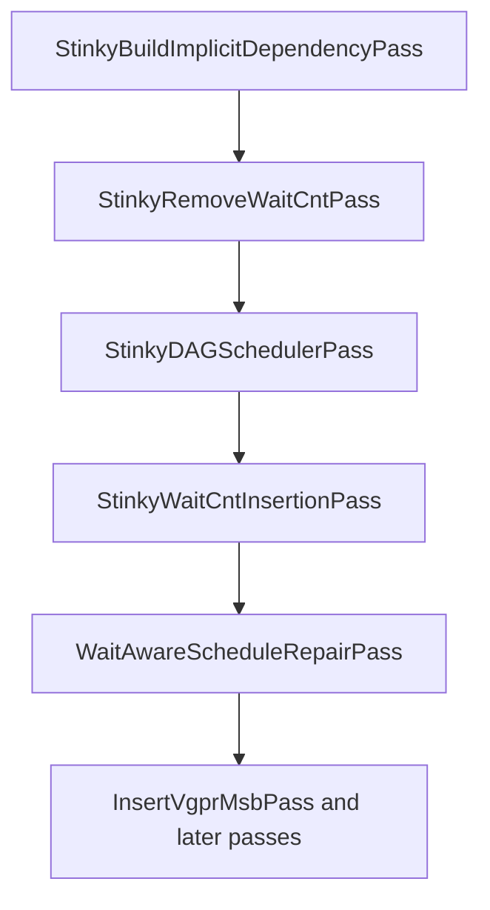
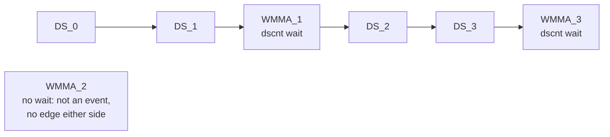
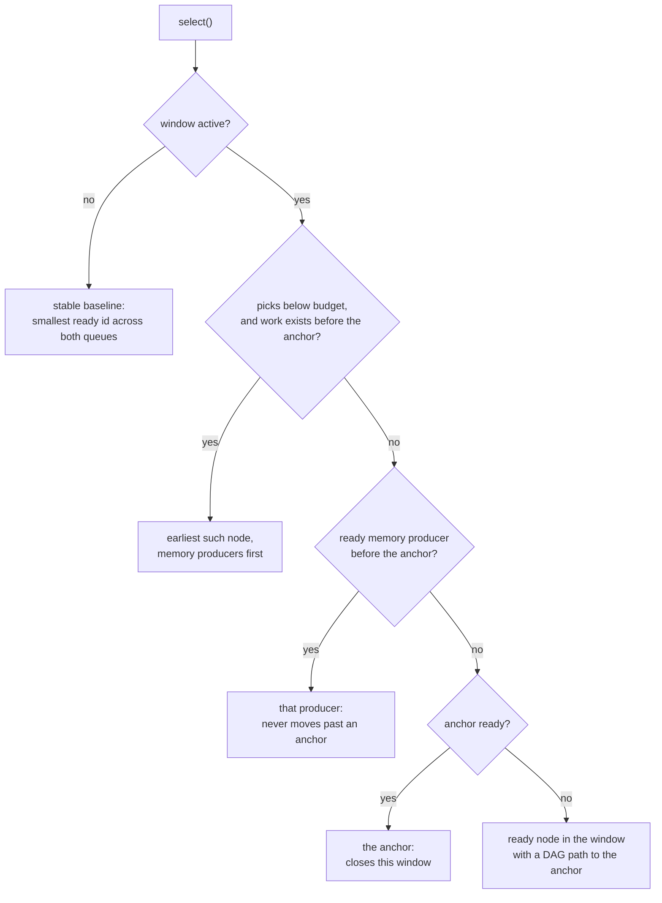
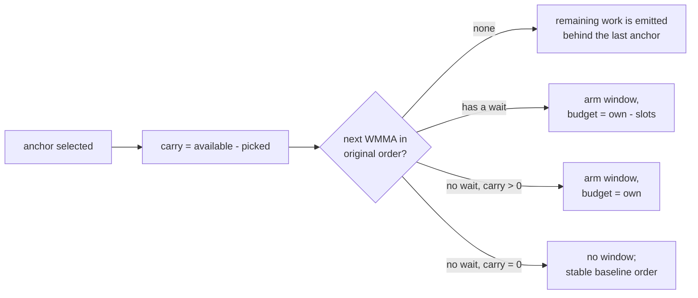

# Wait-Aware Schedule Repair Pass

## Status

This document describes the current implementation.

`WaitAwareScheduleRepairPass` runs after final wait-count insertion. It rebuilds
selected basic-block regions with a stable register DAG and shortens instruction
windows that end at a wait-anchored WMMA.

The implementation does not model WMMA latency, co-issue masks, or wait stall
cycles. Its only tuning rule is a count-based window budget.

## Goals

The pass:

- keeps each original wait instruction object and immediate unchanged;
- keeps each attached wait group immediately before its original WMMA anchor;
- preserves RAW, WAR, and WAW register dependencies;
- preserves DS, buffer, KM, and tensor counter-event order;
- never moves an asynchronous memory producer past an anchor;
- moves a configurable number of otherwise eligible non-WMMA instructions past a
  wait-anchored WMMA, and forwards that work through the anchors that follow;
- uses stable original DAG order whenever no wait-window policy applies.

It is a local repair pass, not a replacement for `StinkyDAGSchedulerPass`.

## Pipeline Position



The backend runs the repair only when:

- scheduling is enabled;
- wait-count insertion is enabled;
- the backend's local `waitRepairSlotsAfterAnchor` is positive.

No wait-count recomputation runs after repair, so the pass treats emitted waits
as fixed correctness constraints. This is the reason for most of the design: the
pass may reorder around a wait but may never change what that wait guarantees.

## What The Pass Does

`StinkyWaitCntInsertionPass` places each final wait immediately before the WMMA
that consumes the awaited loads. That leaves the WMMA with nothing behind it to
issue while it executes. The repair moves the wait and its anchor earlier so that
work lands after the anchor instead:

```text
  before repair              after repair, one slot moved
  -------------              ----------------------------
  WMMA_0                     WMMA_0
  DS_0                       DS_0
  DS_1                       DS_1
  CMP                        CMP
  MOV                        MOV
  CSELECT                    WAIT_DSCNT   <- wait and anchor move up together
  WAIT_DSCNT                 WMMA_1
  WMMA_1                     CSELECT      <- now fills WMMA_1's issue shadow
```

Nothing about the wait itself changes: the same wait object, with the same
immediate, still sits immediately before the same anchor.

### Window anatomy

The unit of work is a *window*: the interval between one selected WMMA and the
next WMMA in original order. Every term used later in this document maps onto it:

```text
  WMMA_0        <- window start, the previously selected anchor
  DS_0     \
  DS_1      |
  CMP       |   window interval, originalOtherCount = 5
  MOV       |
  CSELECT  /
  WAIT_DSCNT    <- attached wait group: metadata, never a DAG node
  WMMA_1        <- anchor: closes this window and starts the next
```

Instructions the window does not select before its anchor become *carry*: they
stay in the ready queue and are selected in a later window. `pendingCarry_` is
the count of such instructions in flight.

## Implementation Layout

```text
include/stinkytofu/transforms/asm/WaitAwareScheduleRepairPass.hpp
src/transforms/asm/WaitAwareScheduleRepairPass.cpp
src/transforms/asm/dag/RegionDAG.hpp
src/transforms/asm/dag/RegionDAG.cpp
src/transforms/asm/dag/ReadyQueue.hpp
src/transforms/asm/dag/WaitAnchoredReadyQueue.hpp
tools/visualize_dag.py
```

Responsibilities are separated as follows:

- `RegionDAG` builds shared register dependencies and owns DAG utilities.
- `WaitAwareScheduleRepairPass` discovers waits, forms segments, and rewrites IR.
- `WaitAnchoredReadyQueue` stores ready nodes and performs stable Kahn selection.
- `WaitAnchoredPickPolicy` owns all wait-window state and tuning decisions.

## Wait Anchors

### Metadata

Waits are metadata rather than schedulable DAG nodes:

```cpp
struct WaitAnchorInfo {
    StinkyInstruction* anchor = nullptr;
    std::vector<StinkyInstruction*> waits;
    waitcnt::WaitCountSpec spec;
};

using WaitAnchorMap =
    std::unordered_map<StinkyInstruction*, WaitAnchorInfo>;
```

`waits` stores the exact IR object pointers in original order. `spec` is a
combined counter view used only for dependency classification.

### Discovery

`discoverWaitAnchors()` walks the block one run of consecutive `StinkyTofu`
instructions at a time, restarting at every non-instruction IR node. Within a run:

1. Find a maximal consecutive group of `IF_WaitCnt` or `IF_WaitTensorCnt`
   instructions.
2. Inspect the immediately following instruction.
3. Attach the group only when that instruction is a matrix instruction.
4. Decode DS, buffer, KM, and tensor values into a combined `WaitCountSpec`.
5. Store the exact waits under the matrix anchor pointer.

The adjacency requirement is strict. A non-matrix wait or tail wait is not
attached and later becomes a segment boundary.

Runs are split exactly where `repairBlock()` splits segments. Without that,
discovery would see a wait and a WMMA as adjacent across an intervening asm
directive, bind them, and the rewrite would then re-emit the wait on the far side
of a boundary it is not allowed to cross.

If a block contains no wait-anchored WMMA, `repairBlock()` returns immediately
without constructing a DAG or rewriting the block.

## Repair Segments

Attached waits are omitted from the schedulable instruction vector. Their WMMA
anchors remain.

A segment ends at:

- non-instruction IR;
- labels;
- waits that are not attached to a matrix anchor;
- branches, calls, stores, barriers, or other instructions classified by
  `hasSideEffect()`;
- exec-mask groups.

The implementation never schedules across these boundaries or across basic
blocks.

Dense DAG IDs are assigned after attached waits are removed. Therefore a node
ID is also its original order among schedulable instructions in that segment.

### Exec-masked spans

Each block is bracketed the same way `StinkyDAGSchedulerPass` brackets its own
scheduling:

```text
collapseExecMaskedRegions(bb, builder, wavefrontSize)
  repairBlock(bb, ...)
expandExecMaskedGroups(bb)
```

Collapsing turns each narrow-exec-write through full-mask-reset span into a single
opaque `ExecMaskGroup`, which `isHardBoundary()` then treats as a segment
boundary. Without the bracket the span's instructions would reach the repair as
ordinary nodes, and the DAG does not model the exec mask: the window-shortening
budget could push the `exec` reset past the anchor and run the WMMA under a narrow
mask. Collapse and expand run per block whether or not any wait anchor is found,
so a group pseudo-instruction can never survive into the output.

## Region DAG

`buildRegisterDependencyDAG()` is shared by the primary scheduler and repair
pass. It creates:

```cpp
struct RegionDAG {
    DAGNodeList nodes;
    std::vector<std::unordered_set<unsigned>> graph;
    std::unordered_map<StinkyInstruction*, unsigned> instToId;
};
```

For each physical or pseudo register it adds:

- RAW edges from the latest writer to each reader;
- WAW edges from the latest writer to the next writer;
- WAR edges from outstanding readers to the next writer.

Pseudo registers participate exactly like physical registers. This preserves
memory-token ordering represented in the IR.

`RegionDAG` also owns `addEdgeById()` and deterministic node/edge dumping.

## Counter-Order Edges

Register dependencies do not preserve hardware counter positions. For example,
the immediate in `s_wait_dscnt 55` refers to a DS queue suffix, not a duration.

`addCounterOrderEdges()` builds one event chain for each tracked counter:

```text
event[0] -> event[1] -> ... -> event[n]
```

An event is:

- an asynchronous producer classified by `waitcnt::classifyMemOp()`; or
- a wait anchor whose combined `WaitCountSpec` names that counter.

Only two things join a chain, and the second is easy to overlook: a WMMA is an
event **only** if its own wait names that counter. A WMMA with no wait, or whose
wait names a different counter, is skipped over entirely:



Even when `WMMA_1` has no register dependency on `DS_0` or `DS_1`, it cannot
become ready until the chain reaches it. `WMMA_2` gets no such protection, which
is why the pick policy has to pin producers itself; see below.

The same construction is applied independently to DS, buffer, KM, and tensor
counters.

### Producer mobility

No asynchronous memory producer is moved past an anchor. Only work that issues
no memory operation fills the post-anchor slots.

Where the anchor's wait names the producer's counter this is enforced twice
over. The counter chain already puts a DAG edge from the last producer to the
anchor, so no slot budget can free it, and the restriction is mandatory while
immediates stay fixed: `s_wait_dscnt N` means "at most `N` DS operations still
outstanding", so its guarantee depends on how many were issued before it. With
`L1..L5` outstanding, `s_wait_dscnt 2` waits for `L1`, `L2`, and `L3`; moving
`L5` past the wait leaves four outstanding, so the same immediate now waits only
for `L1` and `L2` and the anchor may read `L3` before it lands.

Elsewhere no DAG edge applies — a DS producer is not an event in the chain of an
anchor whose wait names only `kmcnt`, nor of an anchor with no wait at all — so
the pick policy pins it instead, by treating every ready producer before the
anchor as mandatory once the slot budget is spent. Deferring a load past an
anchor would only delay issuing it, which loses latency hiding for no gain.

Lifting the wait-named case would mean rewriting the immediate to `N - M` when
`M` producers move past the anchor. That is exact, but it drops the
fixed-immediate invariant, and because the chain links only consecutive events it
also requires re-pointing the chain edge at the `(K - M)`-th producer rather than
dropping it — which fixes `M` before scheduling instead of leaving it to the pick
policy.

## Ready Queues

`WaitAnchoredReadyQueue` derives from `ReadyQueue` and stores ready nodes in two
ordered sets:

```cpp
OrderedReadyNodeSet wmmaQueue;
OrderedReadyNodeSet otherQueue;
```

Both sets use ascending `DAGNode::id`. The stable baseline is the smallest ID
across their two fronts:

```text
min(wmmaQueue.front.id, otherQueue.front.id)
```

Without an active wait-window override, this reconstructs original schedulable
instruction order.

The queue itself only:

- inserts a ready node into the correct set;
- asks `WaitAnchoredPickPolicy` for an override;
- falls back to stable baseline order;
- removes the selected node;
- reports the committed selection back to the policy.

## WaitAnchoredPickPolicy

All repair behavior is encapsulated in `WaitAnchoredPickPolicy`.

### Window state

Related state is grouped in one object:

```cpp
struct WindowState {
    DAGNode* anchor = nullptr;
    const WaitAnchorInfo* anchorInfo = nullptr;  // null when the anchor has no wait
    unsigned startId = 0;
    unsigned originalOtherCount = 0;             // nodes originally in the interval
    unsigned availableOtherCount = 0;            // own nodes + work carried in
    unsigned otherPickBudget = 0;
    unsigned otherPicks = 0;
};
```

The policy arms this state after selecting a WMMA, for the immediately following
WMMA in original DAG order, when either

- that WMMA is a wait anchor, or
- the preceding window deferred work into it (`pendingCarry_ > 0`).

The second case matters because deferred work must keep moving. Without it the
work stops at the first anchor that has no wait, piling up in front of that
anchor and leaving it with nothing after it. A window armed without a wait has
`anchorInfo == nullptr` and therefore no mandatory counter producers.

### Tuning parameter

`kSlotsToMovePastAnchor` is a pass argument defaulting to one. A value of zero or
less disables the pass. It is not a module option: `Gfx1250Backend` sets it from a
local `waitRepairSlotsAfterAnchor` at the call site, and `stinkytofu-opt` accepts
`--WaitAwareScheduleRepairPass=kSlotsToMovePastAnchor=<n>`.

`kPreferMemProducerFirst` is a build-time `constexpr bool` in
`WaitAnchoredReadyQueue.hpp`, currently true. It decides only the order in which
a window's budgeted slots are filled, not which side of the anchor an instruction
lands on: with it set, ready memory producers are taken before other work, so
loads issue as early as the window allows and carried work follows them. Setting
it to false fills the budget in strict original order.

The budget depends on whether the anchor carries a wait:

```text
originalOtherCount  = nodes originally in the interval
availableOtherCount = originalOtherCount + pendingCarry

wait anchor:      otherPickBudget = max(originalOtherCount - kSlotsToMovePastAnchor, 0)
wait-less anchor: otherPickBudget = originalOtherCount
```

Only a wait anchor is shortened, because only it has a wait whose window needs
protecting; with the current value of one it selects one fewer ordinary
instruction before the anchor.

A wait-less anchor has nothing to protect, so it keeps its own occupancy. Since
carried work is selected first (it has the lowest original IDs), spending a
budget of `originalOtherCount` forwards exactly as many instructions as the
window received and no more. The carry passes through such an anchor unchanged
rather than growing.

Both budgets count from the original interval size, not from occupancy, so
carried work consumes budget that would otherwise go to the window's own nodes.

This is a target, not a correctness limit. Mandatory memory producers or DAG
predecessors may force more selections before the anchor.

### Worked carry ledger

`tests/filecheck/wait_aware_schedule_repair_carry_test.stir` exercises both budget
rules in one segment. Its three windows account as follows, with
`kSlotsToMovePastAnchor = 1`:

| anchor | wait | own | carry in | available | budget | picked | carry out |
|--------|------|-----|----------|-----------|--------|--------|-----------|
| dagId 5  | yes | 4 | 0 | 4 | 3 | 3 | 1 |
| dagId 10 | yes | 4 | 1 | 5 | 3 | 3 | 2 |
| dagId 16 | no  | 5 | 2 | 7 | 5 | 5 | 2 |

The two wait anchors each give up one slot, so their carry grows. The wait-less
anchor spends a budget equal to its own count and therefore forwards exactly what
it received: two in, two out. Enable `--debug-pass WaitAwareScheduleRepairPass` to
print this ledger for any input.

### Selection order

While a window is active, `select()` applies this priority:

1. **Budgeted stable work**
   - While `otherPicks < otherPickBudget`, select the earliest ready non-WMMA
     node whose original ID is before the anchor.
   - This includes work carried over from the preceding window.
   - Under `kPreferMemProducerFirst` a ready memory producer is taken ahead of
     other work, so loads issue as early as the window allows.

2. **Mandatory memory producers**
   - Select the earliest ready node before the anchor that issues an
     asynchronous memory operation, whatever counter it belongs to.
   - These nodes are selected even after the ordinary budget is exhausted, so no
     load is ever moved past an anchor.

3. **Ready anchor**
   - If the active anchor is ready, select it immediately.

4. **Dependency-path work**
   - Otherwise select the earliest ready node inside the original interval that
     has a DAG path to the anchor.
   - This unlocks non-ready mandatory producers or other anchor dependencies.

If the policy has no active window or no policy-specific selection, the queue
uses stable baseline order.



Steps 2 and 4 are what make the budget a target rather than a limit: both can
select work after the budget is spent.

### State transitions

After a committed non-WMMA selection, the policy increments `otherPicks`.

After a committed WMMA selection:

1. If it is the active anchor, record `pendingCarry_` as everything the window had
   available but did not pick, then close and reset the window.
2. Find the next WMMA in original DAG order.
3. Arm a new window for it when it has attached waits, or when
   `pendingCarry_ > 0`.

Only the active anchor may close an active window.



## Scheduling

`scheduleWithWaitAnchoredReadyQueue()` performs ordinary Kahn scheduling:

1. Push every zero-in-degree DAG node.
2. Pick one node from `WaitAnchoredReadyQueue`.
3. Append its instruction to the output.
4. Decrement each successor's in-degree.
5. Push newly ready successors.
6. Repeat until both ready sets are empty.

The scheduled vector must contain every non-wait segment instruction exactly
once.

## Rewrite

The scheduled vector contains no attached waits. Reconstruction emits exact
wait objects immediately before their original anchors:

```cpp
for (StinkyInstruction* inst : scheduled) {
    if (auto it = anchors.find(inst); it != anchors.end()) {
        for (StinkyInstruction* wait : it->second.waits)
            output.push_back(wait);
    }
    output.push_back(inst);
}
```

The block is then rebuilt in the resulting order.

Required invariants:

- every original IR object appears exactly once;
- every attached wait remains immediately before its original anchor;
- wait objects, modifiers, immediates, and relative order are unchanged;
- non-target boundaries are not crossed;
- total IR object count is unchanged.

## Example

Input, with six schedulable instructions between the WMMAs:

```text
WMMA_0
DS_0
DS_1
DS_2
CMP
MOV
CSELECT
WAIT_DSCNT
WMMA_1
```

With `kSlotsToMovePastAnchor = 1`, the ordinary budget is five. The policy picks:

```text
DS_0, DS_1, DS_2, CMP, MOV
```

The DS producers are mandatory counter events. After five non-WMMA picks and
after the anchor becomes ready, the reconstructed output is:

```text
WMMA_0
DS_0
DS_1
DS_2
CMP
MOV
WAIT_DSCNT
WMMA_1
CSELECT
```

For the next window, `CSELECT` is carried work. It raises that window's occupancy
but not its budget, and it is selected before that window's own nodes, so it takes
a slot one of them would otherwise have had.

## Correctness

### Register dependencies

RAW, WAR, and WAW edges prevent register-conflicting instructions from being
reordered illegally.

### Wait placement

Waits are retained as exact metadata and emitted immediately before the same
anchor pointer.

### Counter meaning

Counter-event chains prevent an anchor from crossing producers on every counter
named by its final wait specification. Anchors outside those chains are covered
instead by the mandatory-producer rule in the pick policy, so no producer crosses
any anchor by either route.

### Boundaries

Repair scheduling never crosses unsupported waits, side effects, exec groups,
non-instruction IR, or basic-block boundaries.

### Stable fallback

The smallest ready original ID is selected whenever no policy override applies.

## DAG Inspection

`dumpDAGGraph()` emits deterministic node and edge sections:

```text
DAG nodes:
0: <instruction>
1: <instruction>
DAG edges:
0 -> 1
```

`tools/visualize_dag.py` converts this dump into a standalone HTML/SVG viewer.
Nodes are arranged by ascending DAG index and all dependency edges are routed
through lanes on the left.
